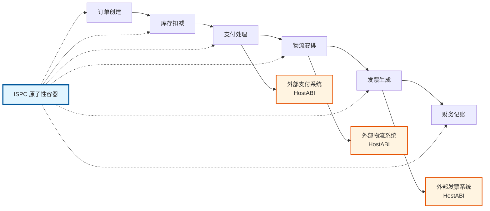
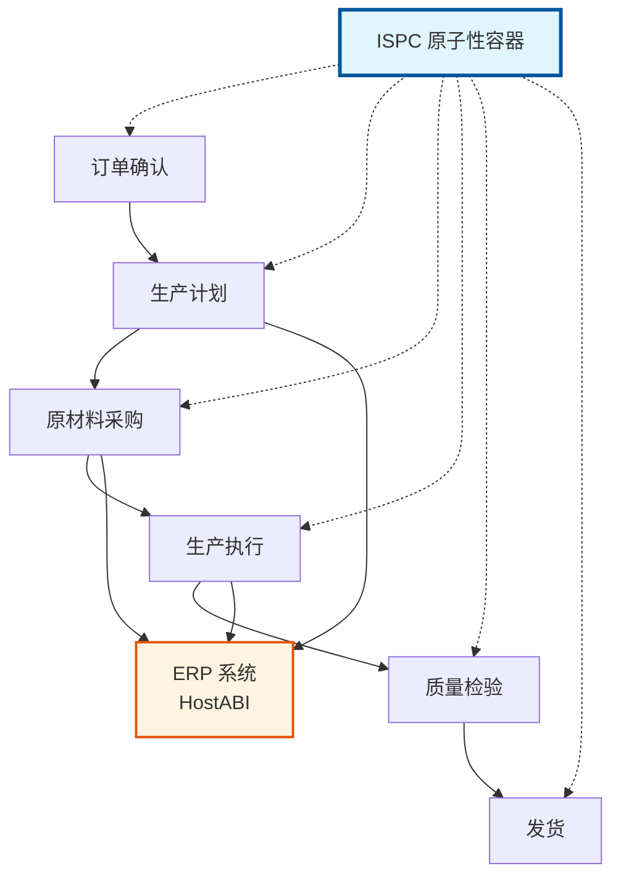
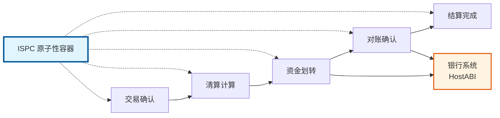

# 企业工作流场景实践

---

## 🎯 场景概览

本文档介绍如何在 WES 上实现企业级工作流，包括多步骤业务流程、外部系统集成、长事务处理等。

---

## 📋 场景说明

### 场景描述

**业务需求**：
- 多步骤业务流程原子性执行
- 外部系统集成
- 完整审计轨迹

**WES 方案**：
- 使用 ISPC（Intrinsic Self-Proving Computing，本征自证计算）原子性容器
- 通过 HostABI 集成外部系统（受控外部交互）
- 自动生成完整执行轨迹和 ZK 证明

---

## 🚀 典型场景

### 场景 1：电商订单处理

**业务流程**：

**WES 实现**：
- 使用 ISPC 原子性容器包装整个流程
- 通过 HostABI 调用外部系统（支付、物流、发票）
- 失败时自动回滚

### 场景 2：供应链管理

**业务流程**：

**WES 实现**：
- 使用 ISPC 原子性容器
- 通过 HostABI 集成 ERP 系统
- 完整追溯链

### 场景 3：跨机构清算

**业务流程**：

**WES 实现**：
- 使用 ISPC 原子性容器
- 通过 HostABI 集成银行系统
- 完整审计轨迹

---

## 💡 实现要点

### 原子性保证

**ISPC（本征自证计算）原子性容器**：
- 整个业务流程在一个原子边界内执行
- 失败时自动回滚
- 状态一致性保证
- 单次执行+多点验证：只有执行节点执行业务逻辑，其他节点通过验证 ZK 证明来确认

### 外部系统集成

**HostABI 受控外部交互**：
- 外部系统交互（HTTP、API、数据库等）被纳入执行轨迹
- 通过"声明+佐证+验证"机制实现可验证的外部交互
- 只有执行节点调用一次外部系统，其他节点通过验证 ZK 证明来确认，无需重复调用
- 端到端的可验证闭环

### 审计轨迹

**完整记录**：
- 所有操作都有链上记录
- 不可篡改的执行轨迹
- 完整的审计证据链

---

## 📚 相关文档

- [ISPC 能力视图](../../components/ispc.md) - 了解可验证计算能力
- [TX 能力视图](../../components/tx.md) - 了解交易能力
- [产品总览](../../overview.md) - 了解 WES 核心价值

---

**相关文档**：
- [产品总览](../../overview.md) - 了解 WES 是什么、核心价值、应用场景
- [ISPC 能力视图](../../components/ispc.md) - 了解可验证计算能力

