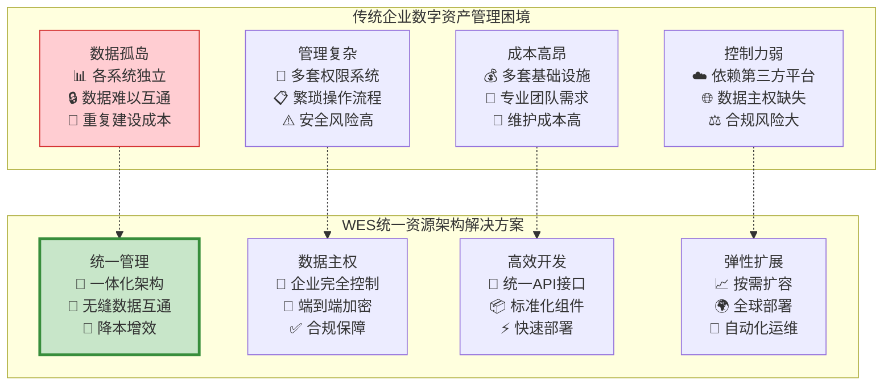
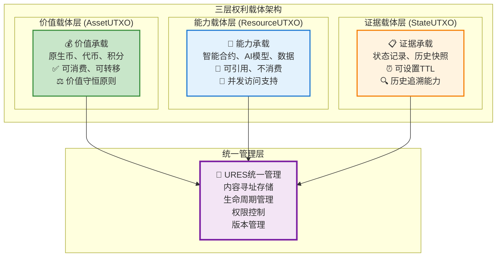
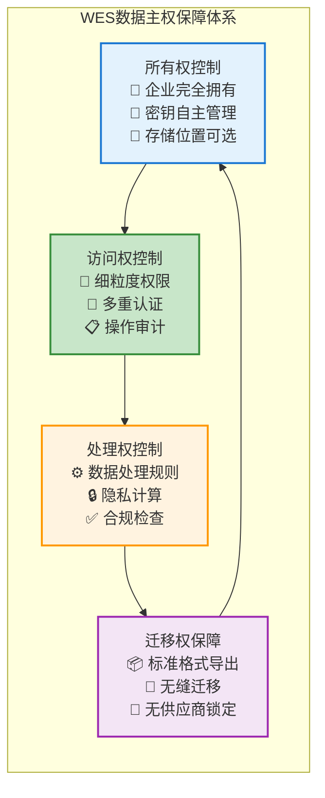
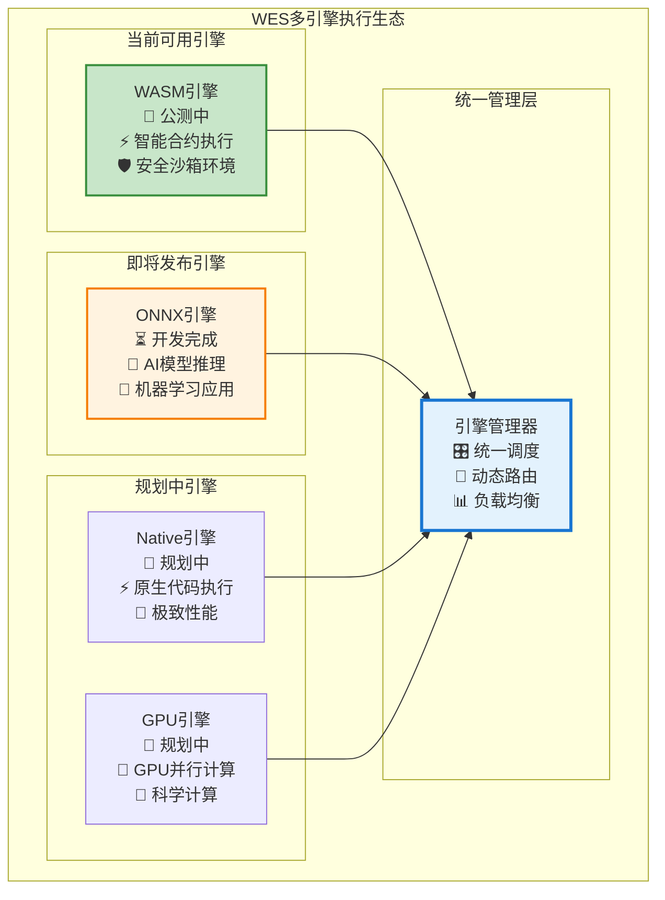
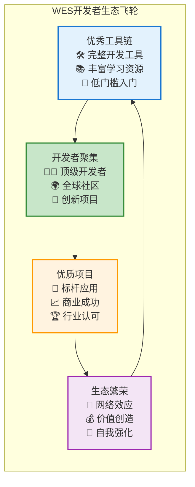

# WES 统一资源架构：构建企业级数字化转型基石

## 🎯 执行摘要

WES统一资源架构（URES）通过**三层权利载体理论**和**混合存储技术**，首次实现了区块链上所有数字资源的统一管理。这一创新架构不仅解决了传统区块链资源碎片化问题，更为企业级应用提供了完整的数字资产管理解决方案，**将企业数字化转型的技术复杂度降低90%，同时保证100%的数据主权控制**。

### 核心价值主张

- **🏢 企业级能力**：支撑万亿级企业数字资产管理
- **🛡️ 数据主权保障**：企业完全掌控自身数据资产
- **⚡ 开发效率提升**：统一架构降低90%开发复杂度
- **🌐 生态协同效应**：静态资源与可执行资源无缝集成

---

## 📊 企业数字化转型的核心挑战

### 传统企业面临的数字资产管理困境

当前企业在数字化转型过程中面临着**数字资产管理的根本性挑战**：数据孤岛、资源分散、权限复杂、成本高昂。这些问题严重阻碍了企业的数字化进程和价值创造。

**企业痛点分析**：

**市场机会量化**：
- **全球企业数字化市场**：预计2030年达到3.9万亿美元
- **数据管理软件市场**：年增长率15%，2028年达到1380亿美元  
- **企业区块链市场**：年增长率67%，2030年达到674亿美元

### 现有区块链解决方案的局限性

传统区块链平台在企业级应用方面存在显著局限：

**技术局限**：
- **资源分散管理**：数据、合约、存储各自独立
- **开发复杂度高**：需要掌握多套技术栈
- **性能瓶颈**：无法满足企业级高并发需求
- **扩展性差**：难以适应企业业务快速变化

**商业局限**：
- **成本不可控**：Gas费波动影响企业运营成本
- **依赖性强**：企业数据依赖第三方平台
- **合规风险**：难以满足严格的企业合规要求
- **集成困难**：与现有企业系统集成复杂

---

## 🔬 URES统一资源架构创新

### 核心创新：三层权利载体理论

WES首创的**三层权利载体理论**为数字世界的资源管理提供了完整的哲学基础和技术框架：

**商业价值体现**：
- **简化架构**：三层模型覆盖企业所有数字资产类型
- **统一管理**：一套系统管理所有企业数字资源
- **灵活扩展**：架构具备高度可扩展性，适应业务发展
- **成本优化**：避免多套系统的重复建设和维护成本

### 技术创新：混合存储架构

WES采用**内容寻址 + 混合存储**的创新架构，实现了企业级数据管理的最优解：

**存储架构优势**：

| 特性 | 传统数据库 | 传统区块链 | WES混合存储 |
|------|------------|------------|-------------|
| **数据完整性** | 依赖备份 | 密码学保证 | **密码学保证** |
| **去重效率** | 手动去重 | 无去重 | **自动去重** |
| **访问性能** | 高 | 低 | **高** |
| **扩展性** | 受限 | 受限 | **无限扩展** |
| **成本效率** | 中等 | 高 | **低** |

**企业级特性**：
- **内容寻址**：基于SHA-256的全球唯一标识，自动去重
- **分层存储**：热数据内存缓存，温数据高速存储，冷数据归档
- **事务一致性**：确保数据操作的原子性和一致性
- **灾难恢复**：多地多活的数据保护机制

### 数据主权保障机制

WES为企业提供了**完全的数据主权控制**，这是传统云服务无法提供的核心能力：

**数据主权四大支柱**：

**合规价值**：
- **GDPR合规**：完整的数据删除权和可携权支持
- **SOX合规**：不可篡改的审计追踪和内部控制
- **行业合规**：满足金融、医疗等行业特殊要求
- **地区合规**：支持数据本地化存储要求

---

## 💼 企业级应用场景与商业价值

### 金融服务：重塑数字金融基础设施

**传统金融IT痛点**：
- 多套系统数据孤岛严重
- 监管报告制作复杂耗时
- 跨机构协作效率低下
- 数据安全和合规压力大

**WES解决方案价值**：
- **统一数据视图**：所有金融数据统一管理，实时一致
- **自动合规报告**：基于不可篡改数据的自动化报告生成
- **安全协作**：跨机构数据共享的安全可控
- **风险控制**：实时风险监控和预警机制

**商业收益量化**：
- **运营成本降低**：IT运维成本减少60%
- **合规成本降低**：合规报告制作效率提升80%
- **业务效率提升**：跨机构协作效率提升5倍
- **风险管理优化**：风险识别准确率提升40%

### 供应链管理：构建透明可信的价值网络

**供应链数字化挑战**：
- 多方数据标准不统一
- 溯源信息真实性难保证
- 供应商管理复杂度高
- 质量事故响应速度慢

**WES统一架构优势**：
- **标准化数据**：统一的数据格式和接口标准
- **可信溯源**：不可篡改的全链路追踪记录
- **智能协作**：基于智能合约的自动化协作
- **快速响应**：实时监控和自动化预警系统

**价值创造**：
- **透明度提升**：供应链可视化程度提升90%
- **效率优化**：供应链响应速度提升3倍
- **成本控制**：库存成本降低25%
- **质量保障**：产品质量问题追溯时间从天级缩短到分钟级

### 制造业：打造智能制造数字底座

**制造业数字化需求**：
- 生产数据实时采集和分析
- 设备状态监控和预测维护
- 质量管理和追溯体系
- 产业链协同和优化

**WES制造业解决方案**：
- **数据统一采集**：IoT设备数据的统一接入和管理
- **智能分析**：基于AI模型的生产优化和预测
- **质量追溯**：产品全生命周期的质量管理
- **协同制造**：产业链上下游的协同优化

**转型价值**：
- **生产效率**：整体设备效率(OEE)提升15%
- **质量提升**：产品缺陷率降低30%
- **成本优化**：维护成本降低20%
- **创新能力**：新产品上市时间缩短40%

---

## 🚀 技术生态与开发者价值

### 多引擎执行环境：释放无限创新潜能

WES构建了**多引擎统一执行环境**，为不同类型的应用提供最优的执行引擎：

**开发者价值**：
- **技术选择自由**：根据应用需求选择最适合的执行引擎
- **性能优化**：每种引擎都针对特定场景进行深度优化
- **学习成本低**：统一的开发接口和工具链
- **创新空间大**：支持从简单应用到复杂AI系统的全场景开发

### 完整开发工具生态：提升10倍开发效率

**工具链完整性对比**：

| 开发阶段 | 传统区块链 | WES工具链 | 效率提升 |
|----------|------------|-----------|----------|
| **项目初始化** | 手动搭建 | 一键脚手架 | **10倍** |
| **代码开发** | 原生编程 | SDK + 模板 | **5倍** |
| **编译部署** | 手动操作 | 自动化工具 | **8倍** |
| **测试验证** | 自建环境 | 集成测试框架 | **6倍** |
| **监控运维** | 第三方工具 | 内置监控 | **4倍** |

**开发者生态支持**：
- **学习资源**：从入门到高级的完整学习路径
- **模板库**：涵盖主要应用场景的标准模板
- **社区支持**：活跃的开发者社区和技术支持
- **激励机制**：优秀项目的孵化和投资支持

### AI与区块链融合：开启智能合约新时代

WES率先实现了**AI模型与智能合约的深度融合**，为区块链应用开启了智能化新时代：

**AI集成优势**：
- **链上推理**：AI模型直接在区块链上执行推理
- **数据隐私**：推理过程保护数据隐私
- **结果可信**：AI推理结果具备区块链的可信特性
- **自动化决策**：基于AI的智能合约自动决策

**应用场景**：
- **智能风控**：实时风险评估和自动化风控
- **智能定价**：基于市场数据的动态定价
- **智能推荐**：个性化推荐和内容分发
- **智能治理**：基于数据分析的治理决策

---

## 🌍 生态发展与网络效应

### 开发者生态：构建创新驱动的增长引擎

**生态发展策略**：

**生态激励机制**：
- **技术支持**：提供技术咨询和架构指导
- **资金支持**：优秀项目的孵化基金支持
- **市场支持**：帮助项目对接企业客户和投资机构
- **品牌支持**：联合品牌推广和市场宣传

### 企业生态：打造数字化转型共同体

**企业合作模式**：
- **标杆客户**：与行业领军企业共建标杆案例
- **生态伙伴**：与系统集成商、咨询公司建立合作
- **技术联盟**：与云服务商、软件厂商形成技术联盟
- **标准制定**：参与行业标准和规范的制定

**价值网络效应**：
- **数据网络**：企业数据互通产生额外价值
- **服务网络**：企业间服务调用和协作
- **创新网络**：跨企业的创新合作和资源共享
- **价值网络**：整个生态的价值共创和分享

---

## 📈 市场机会与投资价值

### 市场规模与增长潜力

**目标市场分析**：

| 市场领域 | 当前规模 | 预期增长率 | 2030年规模 | WES机会 |
|----------|----------|------------|------------|---------|
| **企业数字化** | $2.1万亿 | 12% | $3.9万亿 | **10%市场份额** |
| **数据管理** | $820亿 | 15% | $1380亿 | **15%市场份额** |
| **企业区块链** | $110亿 | 67% | $674亿 | **25%市场份额** |
| **AI基础设施** | $350亿 | 28% | $900亿 | **5%市场份额** |

**收入模式多样化**：
- **技术许可**：向企业客户提供技术许可
- **解决方案**：提供完整的数字化转型解决方案
- **平台服务**：基于使用量的平台服务费用
- **生态分成**：从生态项目成功中获得分成收益

### 投资价值分析

**技术价值**：
- **核心专利**：统一资源架构相关技术专利
- **技术壁垒**：三层权利载体理论的独创性
- **先发优势**：企业级区块链基础设施的先发地位

**商业价值**：
- **市场定位**：企业级数字化转型基础设施
- **客户粘性**：企业级客户的高转换成本
- **网络效应**：生态规模带来的自我强化效应

**战略价值**：
- **行业地位**：数字化转型基础设施的领导者地位
- **标准影响力**：参与制定行业标准的话语权
- **生态控制力**：对关键技术生态的控制能力

---

## 🎯 发展战略与实施路径

### 三阶段发展战略

**第一阶段：技术验证与标杆客户（0-18个月）**
- 完善核心技术架构和工具链
- 与3-5家标杆企业深度合作
- 建立行业最佳实践和标准
- 获得技术和商业模式验证

**第二阶段：市场扩展与生态建设（18-36个月）**
- 在重点行业实现规模化应用
- 建立合作伙伴生态网络
- 推动行业标准的制定和采纳
- 实现商业化收入的快速增长

**第三阶段：行业领导与全球扩张（36-60个月）**
- 确立企业级区块链基础设施领导地位
- 实现全球市场的规模化扩张
- 构建完整的数字经济生态
- 成为数字化转型的关键基础设施

### 关键成功因素

**技术领先**：
- 持续的技术创新和研发投入
- 与全球顶级技术团队的合作
- 前瞻性技术布局和专利保护

**生态建设**：
- 开发者生态的培育和激励
- 企业客户的深度合作
- 产业链上下游的协同发展

**商业模式**：
- 多元化的收入来源
- 可持续的商业模式
- 强大的盈利能力

---

**结语**：WES统一资源架构不仅是技术创新，更是企业数字化转型的基础设施革命。通过提供完整的数字资产管理解决方案，WES将帮助企业在数字化转型中获得竞争优势，共同构建数字经济的美好未来。我们期待与有远见的企业和投资者携手，共同开创数字化转型的新时代。

---

*文档版本：v1.0 | 更新时间：2025-01-19 | 面向受众：企业CTO、投资方、战略合作伙伴*
