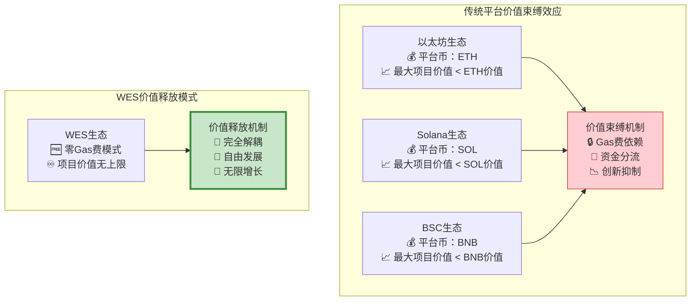
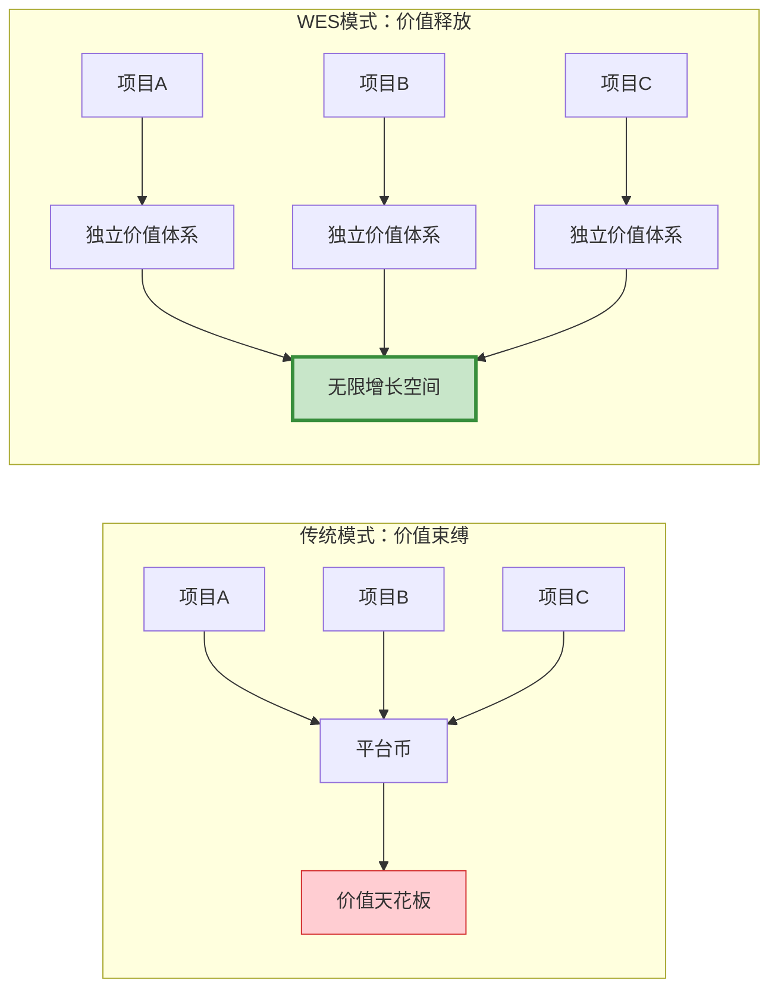
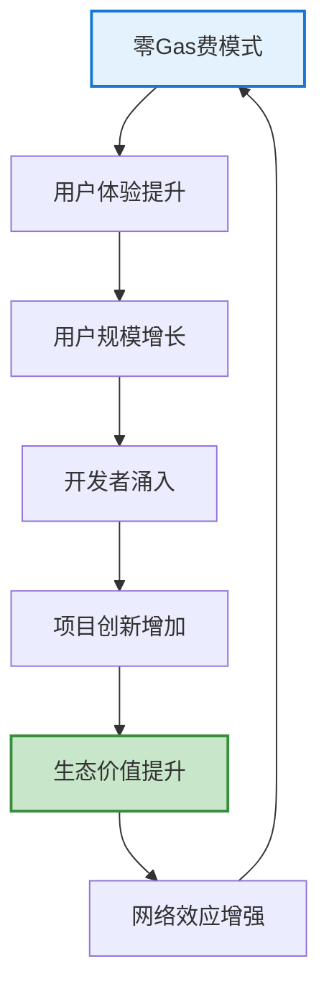

# WES 零Gas费经济模型：释放区块链生态无限价值潜能

## 🎯 执行摘要

WES通过**零Gas费 + 统一手续费**的革命性经济模型，彻底打破了传统区块链的"价值天花板"效应。通过零知识证明技术消除Gas费根源，建立透明可预测的手续费机制，**首次实现项目价值与平台币完全解耦**，为区块链生态释放了无限的价值增长空间。这一创新将推动区块链从"平台经济"向"基础设施经济"的根本性转变。

### 核心价值主张

- **🚀 价值解放**：项目价值无上限，不再受平台币价值束缚
- **💰 成本革命**：消除Gas费，降低99%的使用成本
- **🌍 生态繁荣**：支持万亿级项目自由发展
- **⚡ 体验升级**：用户无感支付，开发者专注创新

---

## 📊 传统区块链经济模型的根本缺陷

### "价值天花板"效应的商业危害

当前主流区块链平台都存在一个致命的经济模型缺陷：**所有项目的价值增长都被平台币价值所限制**。这种"价值天花板"效应严重阻碍了区块链生态的健康发展。

**现实案例分析**：

**商业影响量化分析**：
- **以太坊**：即使是最大的DeFi项目，市值也难以超越ETH
- **资金分流**：用户需要同时持有平台币和项目币，资金使用效率低下
- **创新抑制**：高昂Gas费让复杂创新应用无法商业化
- **生态局限**：整个生态的价值增长受到平台币市值限制

### Gas费机制的经济学谬误

传统Gas费机制基于一个根本性的经济学谬误：**让用户为全网重复计算买单**。这种模式不仅效率低下，更是对创新的严重束缚。

**Gas费问题的商业成本**：
- **用户流失**：复杂的Gas费预估让普通用户望而却步
- **开发束缚**：开发者需要花费大量精力优化Gas消耗而非业务创新
- **商业模式限制**：高Gas费让微支付、高频交易等商业模式无法实现
- **生态内卷**：项目间竞争演变为Gas费优化竞争，偏离价值创造本质

---

## 🔬 WES零Gas费经济模型创新

### 技术基础：零知识证明的经济学革命

WES通过零知识证明技术实现了计算模式的根本性变革：从"全网重复计算"转向"专业化分工验证"。这一技术创新为经济模型创新提供了坚实基础。

**计算模式对比**：

| 维度 | 传统模式 | WES模式 | 效率提升 |
|------|----------|---------|----------|
| 计算方式 | 全网重复计算 | 专业节点计算 + 全网验证 | **50倍** |
| 成本结构 | 用户承担全网计算成本 | 用户只承担验证成本 | **降低99%** |
| 扩展性 | 受全网计算能力限制 | 受验证能力限制（更高） | **无限扩展** |

### 经济模型创新：UTXO天然费用机制

WES采用基于UTXO的天然费用机制，实现了最简洁、最透明的经济模型设计：

**费用公式**：`手续费 = 交易输入总额 - 交易输出总额`

**模型优势**：
- **透明直观**：用户完全掌控费用支付
- **多代币支持**：天然支持任意代币支付手续费
- **无需预估**：费用完全由用户控制，无需复杂预估
- **防止意外**：不存在费用预估不足导致的交易失败

### 价值解耦机制：项目价值的完全独立

WES经济模型的核心创新在于**项目价值与平台价值的完全解耦**：

**商业价值体现**：
- **项目方**：可用自己的代币支付所有费用，形成完整经济闭环
- **用户**：只需持有项目代币，无需购买平台币
- **投资者**：项目投资回报不受平台币价值限制
- **生态**：每个项目都是独立的经济体，可以无限发展

---

## 💼 商业应用场景与价值创造

### 金融服务：重新定义DeFi生态

**传统DeFi痛点**：
- 高Gas费让小额交易无法盈利
- 复杂的Gas费预估影响用户体验
- 项目价值受ETH价格波动影响

**WES DeFi优势**：
- **微交易支持**：零Gas费支持任意小额交易
- **用户体验**：无感支付，专注业务逻辑
- **价值独立**：DeFi项目价值可以超越任何平台币

**商业案例**：
- **去中心化支付**：支持1分钱级别的微支付
- **高频交易**：支持毫秒级高频交易策略
- **普惠金融**：让全球任何人都能使用金融服务

### 游戏与元宇宙：释放数字经济潜能

**传统游戏区块链化困境**：
- 游戏内每次操作都需要支付Gas费
- 高频互动的游戏体验被Gas费破坏
- 游戏经济受平台币价格波动影响

**WES游戏生态优势**：
- **无缝体验**：玩家无需关心任何费用问题
- **经济独立**：游戏币价值完全由游戏价值决定
- **创新释放**：支持任意复杂的游戏经济设计

**市场机会**：
- **链游市场**：预计2030年达到650亿美元
- **虚拟资产**：NFT和虚拟土地市场快速增长
- **元宇宙经济**：万亿级虚拟经济基础设施

### 企业应用：构建数字化转型基础

**企业级应用需求**：
- 成本可控且可预测
- 不受外部代币价格波动影响
- 支持大规模高频业务操作

**WES企业解决方案**：
- **成本透明**：企业完全掌控使用成本
- **业务聚焦**：专注业务创新而非费用优化
- **价值保护**：企业数字资产价值不受平台影响

**应用场景**：
- **供应链管理**：实时数据同步，成本可控
- **数字身份**：大规模身份验证和管理
- **物联网**：海量设备微交易支持

---

## 🌟 生态价值与网络效应

### 开发者生态：专注创新的理想环境

**开发者痛点解决**：
- **费用顾虑消除**：不再需要考虑Gas费优化
- **功能限制解除**：可以实现任意复杂的功能
- **商业模式创新**：支持微支付、订阅等多样化模式

**生态激励机制**：
- **零门槛创业**：降低区块链创业门槛
- **创新奖励**：优秀项目获得生态支持
- **价值共享**：开发者与生态共同成长

### 用户体验：Web2级别的使用体验

**用户体验革命**：
- **无感支付**：用户无需关心复杂的费用机制
- **一键操作**：复杂操作可以一键完成
- **成本透明**：使用成本完全透明可控

**用户价值**：
- **资产保护**：数字资产价值不受平台币影响
- **使用便利**：Web2级别的使用体验
- **选择自由**：可以自由选择任何项目和服务

### 投资价值：重新定义区块链投资逻辑

**投资模式创新**：
- **价值发现**：项目价值不再被平台币限制
- **风险分散**：投资组合不受单一平台币影响
- **收益优化**：每个项目都有独立的价值增长空间

**机构投资机会**：
- **基础设施投资**：投资下一代区块链基础设施
- **生态投资**：投资具备无限增长潜力的生态项目
- **技术投资**：投资具备技术护城河的创新方案

---

## 📈 经济模型可持续性与增长潜力

### 可持续性保障机制

**收入多样化**：
- **手续费收入**：基于交易量的稳定收入
- **多代币收益**：矿工获得多种代币的分散收益
- **生态价值**：随生态发展获得长期价值增长

**风险控制**：
- **通胀管理**：灵活的代币供应调节机制
- **市场调节**：自由市场自动平衡供需关系
- **治理机制**：社区参与重大经济参数决策

### 增长潜力分析

**网络效应**：
- **用户增长**：零费用门槛吸引更多用户
- **开发者聚集**：优秀环境吸引顶级开发者
- **项目繁荣**：成功项目吸引更多项目入驻

**价值创造循环**：

**市场规模预测**：
- **短期（1-2年）**：吸引100万+活跃用户
- **中期（3-5年）**：支撑1000+优质项目
- **长期（5-10年）**：成为万亿级数字经济基础设施

---

## 🎯 战略定位与竞争优势

### 市场定位：基础设施而非平台

WES的战略定位是成为**数字经济的基础设施**而非传统意义的"平台"：

**定位差异**：
- **传统平台**：从生态中抽取价值，限制项目发展
- **WES基础设施**：为生态赋能，释放项目潜力
- **价值创造**：通过降低成本和提升效率创造价值

### 竞争优势：不可复制的先发优势

**技术护城河**：
- **零知识证明应用**：率先将ZK技术用于经济模型创新
- **UTXO费用机制**：简洁优雅的费用设计
- **多代币支持**：天然的多代币经济生态

**生态护城河**：
- **开发者粘性**：优秀的开发环境形成强大粘性
- **用户习惯**：零费用体验形成用户使用习惯
- **网络效应**：生态规模形成自我强化的网络效应

### 长期愿景：重新定义数字经济

**愿景目标**：
- 成为全球数字经济的基础设施
- 支撑万亿级数字资产和应用
- 推动人类社会的数字化转型

**社会价值**：
- **普惠金融**：让全球每个人都能享受金融服务
- **创新释放**：为全球创新者提供最佳平台
- **价值创造**：为人类社会创造更大价值

---

## 🤝 投资与合作机会

### 投资价值主张

**技术投资**：
- 投资下一代区块链基础设施
- 获得技术创新的长期回报
- 参与数字经济基础设施建设

**生态投资**：
- 投资具备无限增长潜力的生态
- 享受网络效应带来的价值增长
- 分享数字经济发展红利

### 战略合作机会

**技术合作**：
- 联合开发零知识证明应用
- 共建多代币经济标准
- 推动行业技术创新

**生态合作**：
- 共建开发者生态
- 联合孵化优质项目
- 构建产业联盟

**市场合作**：
- 共同开拓企业级市场
- 联合推广零Gas费理念
- 建立行业标准和规范

---

**结语**：WES零Gas费经济模型不仅是技术创新，更是商业模式的根本性变革。通过释放项目价值的无限增长空间，WES将推动区块链行业从"平台经济"向"基础设施经济"转变，开启数字经济发展的新时代。我们诚邀有远见的投资者和合作伙伴共同参与这一历史性变革，共享数字经济无限增长的红利。

---

*文档版本：v1.0 | 更新时间：2025-01-19 | 面向受众：投资方、企业决策层、生态合作伙伴*
