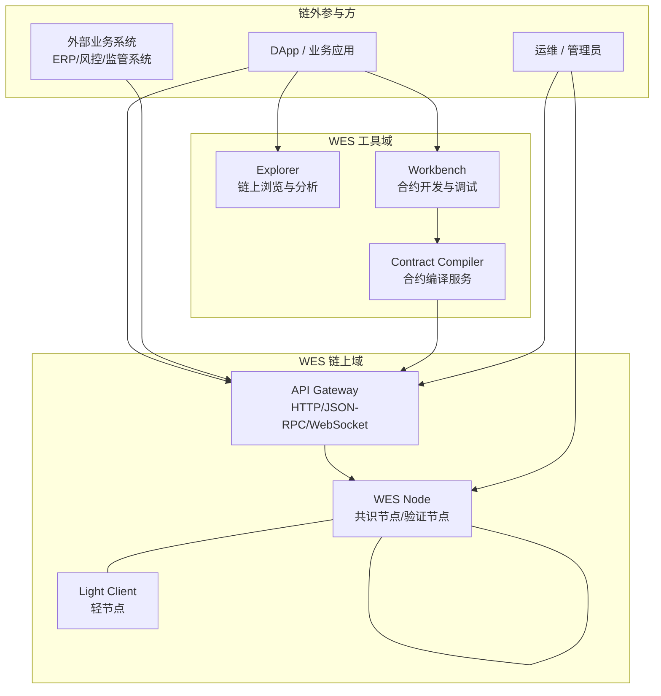
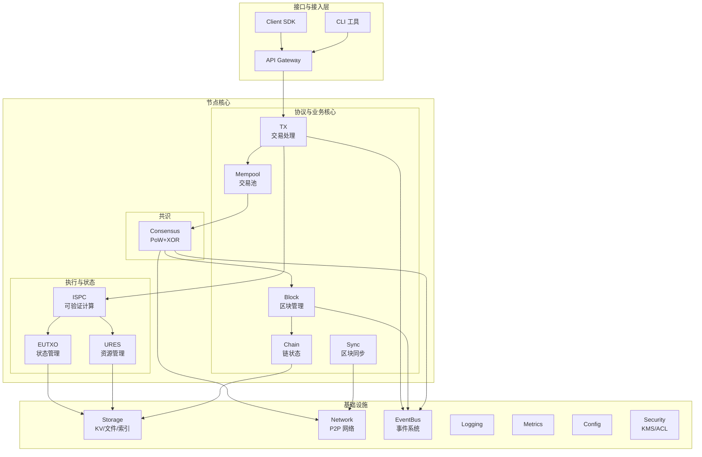
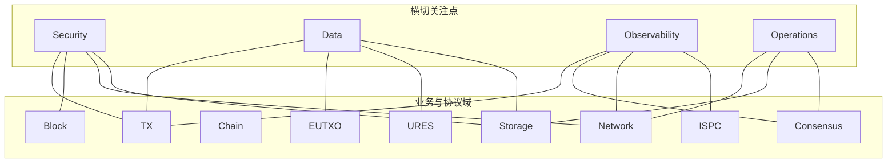

# 架构总览

---

## 系统定位

WES 是一个完整的区块链执行平台，通过 ISPC（本征自证计算）范式实现可验证计算，支持 AI 推理和企业级应用在链上运行。

本文档从系统架构视角，提供 WES 的全局蓝图，帮助你理解系统的整体设计和各组件之间的关系。

---

## 系统边界与参与方



**说明**：
- **系统边界**：以「WES Network + Gateway + Tools」为系统主体，对接链外应用与外部系统
- **工具域**：Explorer / Workbench / Compiler 使用公共 API 与节点交互
- **参与方**：用户、运维、外部系统在能力边界上均受安全策略约束

---

## 三层架构模型

WES 采用经典的三层架构模型：

```
交互层 → 计算层 → 账本层
```

### 第一层：交互层（Interaction Layer）

**职责**：定义操作的输入和输出

- **输入定义**：UTXO引用（消费型/引用型）、参数、资源引用
- **输出定义**：Asset/Resource/State 三种输出类型

**关键组件**：
- API Gateway：对外接口
- Client SDK：客户端开发包
- CLI 工具：命令行工具

### 第二层：计算层（Computation Layer）

**职责**：执行计算并生成可验证证明

**核心创新 - ISPC**：
- 执行即构建：执行过程同时构建证明
- 单次执行+多点验证：一个节点执行，其他节点验证
- 支持 WASM 合约和 ONNX 模型

**关键组件**：
- [ISPC](./ispc.md)：可验证计算核心
- WASM 引擎：合约执行引擎
- ONNX 引擎：AI 模型推理引擎

### 第三层：账本层（Ledger Layer）

**职责**：管理状态和资源

**关键组件**：
- [EUTXO](./eutxo.md)：扩展 UTXO 状态管理
- [URES](./ures.md)：统一资源管理
- Block/Chain：区块和链管理
- Persistence：持久化存储

---

## 子系统蓝图



**要点**：
- **节点核心**围绕 `TX / BLOCK / CHAIN / MEMPOOL / SYNC / CONSENSUS` 六大模块展开
- **执行与状态**由 `ISPC + EUTXO + URES` 三件套构成
- **基础设施**（存储 / 网络 / 日志 / 监控 / 配置 / 安全）对上提供统一服务

---

## 四大核心创新

### 1. ISPC 本征自证计算

**定位**：计算执行层核心创新

**核心能力**：
- 单次执行 + 多点验证
- WASM 合约执行
- ONNX 模型推理
- ZK 证明生成与验证

**详细说明**：[ISPC 技术详解](./ispc.md)

### 2. EUTXO 扩展模型

**定位**：状态层核心创新

**核心能力**：
- 三层输出架构（Asset/Resource/State）
- 引用不消费模式
- 状态查询和快照

**详细说明**：[EUTXO 模型](./eutxo.md)

### 3. URES 统一资源管理

**定位**：资源管理层核心创新

**核心能力**：
- 内容寻址存储
- 统一管理静态和可执行资源
- 资源关联和查询

**详细说明**：[URES 资源管理](./ures.md)

### 4. PoW+XOR 距离选择共识

**定位**：共识层核心创新

**核心能力**：
- 工作量证明（PoW）
- XOR 距离选择
- 微秒级确认

**详细说明**：[PoW+XOR 距离选择共识](./consensus-pow-xor.md)

---

## 横切关注点



### 安全与信任（Security）

- 威胁模型和信任边界
- 密钥管理（KMS）
- 访问控制（ACL/RBAC）

### 数据与存储（Data）

- 数据类型和物理布局
- 索引和缓存策略
- 快照和归档

### 可观测性（Observability）

- 日志收集
- 指标监控
- 分布式追踪

### 运维与部署（Operations）

- 部署模式
- 扩容策略
- 升级流程

---

## 模块依赖关系

```
API Gateway
    ↓
TX（交易处理）
    ↓
┌───────────────┐
│    ISPC       │ ← 可验证计算核心
└───────────────┘
    ↓
┌───────────────┬───────────────┐
│    EUTXO      │     URES      │ ← 状态和资源管理
└───────────────┴───────────────┘
    ↓
┌───────────────────────────────┐
│          Storage              │ ← 持久化存储
└───────────────────────────────┘
```

**依赖规则**：
- 上层依赖下层，下层不依赖上层
- 同层模块通过接口交互
- 基础设施为所有层提供服务

---

## 代码目录映射

| 概念模块 | 代码目录 | 说明 |
|---------|---------|------|
| ISPC | `internal/core/ispc/` | 可验证计算核心 |
| EUTXO | `internal/core/eutxo/` | UTXO 状态管理 |
| URES | `internal/core/ures/` | 资源管理 |
| Consensus | `internal/core/consensus/` | 共识机制 |
| TX | `internal/core/tx/` | 交易处理 |
| Block | `internal/core/block/` | 区块管理 |
| Chain | `internal/core/chain/` | 链状态管理 |
| Network | `internal/core/network/` | P2P 网络 |
| Persistence | `internal/core/persistence/` | 持久化存储 |
| Mempool | `internal/core/mempool/` | 交易池 |
| Compliance | `internal/core/compliance/` | 合规策略 |

---

## 下一步

### 深入了解核心创新

- [ISPC 技术详解](./ispc.md) - 可验证计算核心
- [EUTXO 模型](./eutxo.md) - 状态管理
- [URES 资源管理](./ures.md) - 资源管理
- [PoW+XOR 共识](./consensus-pow-xor.md) - 共识机制

### 了解核心链路

- [交易模型](./transaction.md) - 交易处理
- [区块模型](./block.md) - 区块管理
- [链模型](./chain.md) - 链状态管理

### 内部设计文档

如需了解更详细的架构设计，请参考：
- [`_dev/02-架构设计-architecture/`](../../../_dev/02-架构设计-architecture/) - 架构设计详细说明
- [`_dev/01-协议规范-specs/`](../../../_dev/01-协议规范-specs/) - 协议规范定义

