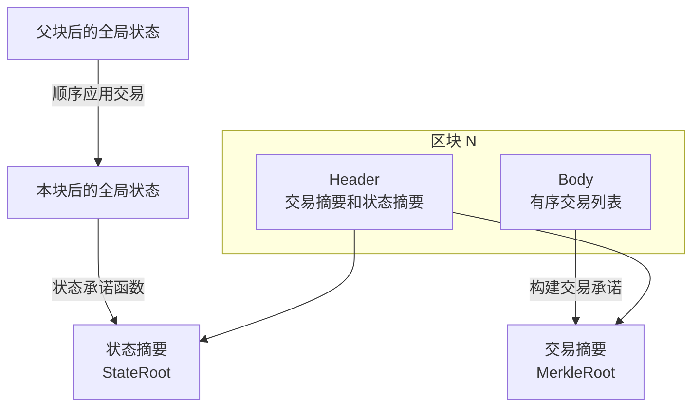
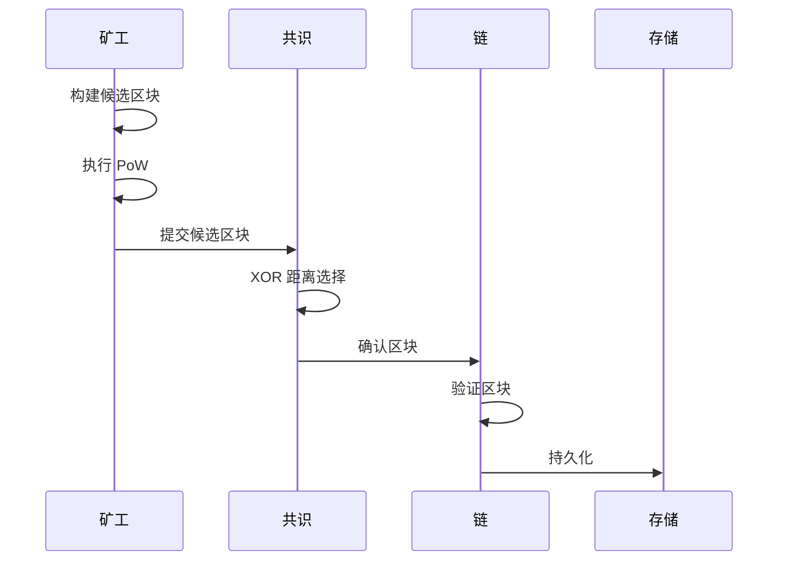

# 区块模型

---

## 概述

区块（Block）是 WES 系统中交易的容器，通过 Merkle 树组织交易，并包含共识相关信息。

**核心职责**：
- 组织和打包交易
- 提供交易存在性证明
- 维护链的连续性

---

## 区块结构

### 基本结构

```
Block
├── Header           # 区块头
│   ├── Version      # 版本号
│   ├── Height       # 区块高度
│   ├── PrevHash     # 前一区块哈希
│   ├── MerkleRoot   # Merkle 根
│   ├── StateRoot    # 状态根
│   ├── Timestamp    # 时间戳
│   ├── Difficulty   # 难度目标
│   └── Nonce        # PoW 随机数
└── Body             # 区块体
    └── Transactions # 交易列表
```

### 区块头

区块头包含区块的元信息，用于快速验证和链接。

**关键字段**：
- `PrevHash`：链接前一区块，形成区块链
- `MerkleRoot`：交易的 Merkle 根，用于验证交易存在性
- `StateRoot`：执行后的状态根，用于状态验证
- `Nonce`：PoW 计算的随机数

### 区块体

区块体包含实际的交易数据。

---

## Merkle 树

### 结构

```
        MerkleRoot
           /\
          /  \
         /    \
      H(AB)   H(CD)
       /\       /\
      /  \     /  \
    H(A) H(B) H(C) H(D)
      |    |    |    |
     TxA  TxB  TxC  TxD
```

### 用途

- **交易存在性证明**：证明某交易在区块中
- **轻客户端验证**：无需下载完整区块
- **数据完整性**：任何交易变更都会改变 MerkleRoot

### 轻客户端视角

**交易摘要承诺**：
- 区块头中的 `MerkleRoot` 是对区块体交易集合 `Txs = [T_0, …, T_{k-1}]` 的摘要承诺
- 给定交易及 Merkle 证明，可验证该交易是否属于本区块

**状态摘要承诺**：
- 区块头中的 `StateRoot` 是对执行后全局状态 `Σ_k` 的摘要承诺
- 从 `Σ_parent` 按 `Txs` 顺序得到 `Σ_k` 后，`StateRoot` 必须与 `commit(Σ_k)` 一致

**轻客户端验证能力**：
- 轻客户端可只依赖区块头与相关证明：
  - 验证某交易是否包含在某区块（通过 Merkle 证明）
  - 验证某状态是否属于某区块执行后的全局状态（通过状态证明）
- 无需下载完整区块体，即可验证交易存在性与状态正确性

**摘要承诺关系示意**：



> **协议层定义**：区块协议定义单个区块的结构与有效性条件，摘要承诺用于支持轻客户端验证。详见 [`_dev/01-协议规范-specs/03-区块与链协议-block-and-chain/BLOCK_PROTOCOL_SPEC.md`](../../../_dev/01-协议规范-specs/03-区块与链协议-block-and-chain/BLOCK_PROTOCOL_SPEC.md) §3.4、§5。

---

## 区块生命周期



### 状态转换

```
Created → Proposed → Validated → Confirmed → Finalized
    ↓         ↓          ↓
  Invalid   Orphan    Rejected
```

---

## 区块验证

### 头验证

- 版本号有效
- 前一区块存在
- 时间戳合理
- 难度目标正确
- PoW 有效

### 体验证

- 交易格式正确
- 交易验证通过
- MerkleRoot 正确
- StateRoot 正确

---

## 难度调整

WES 采用动态难度调整算法：

- **目标出块时间**：可配置（默认 10s）
- **调整周期**：每 N 个区块调整一次
- **调整范围**：限制单次调整幅度

---

## 配置说明

| 参数 | 类型 | 默认值 | 说明 |
|------|------|--------|------|
| `block_interval` | duration | 10s | 目标出块间隔 |
| `max_block_size` | int | 10MB | 最大区块大小 |
| `max_tx_per_block` | int | 10000 | 每区块最大交易数 |
| `difficulty_adjustment_interval` | int | 100 | 难度调整间隔 |

---

## 相关文档

- [交易模型](./transaction.md) - 交易结构
- [链模型](./chain.md) - 链管理
- [PoW+XOR 共识](./consensus-pow-xor.md) - 共识机制

### 内部设计文档

- [`_dev/01-协议规范-specs/03-区块与链协议-block-and-chain/`](../../../_dev/01-协议规范-specs/03-区块与链协议-block-and-chain/) - 区块协议规范

