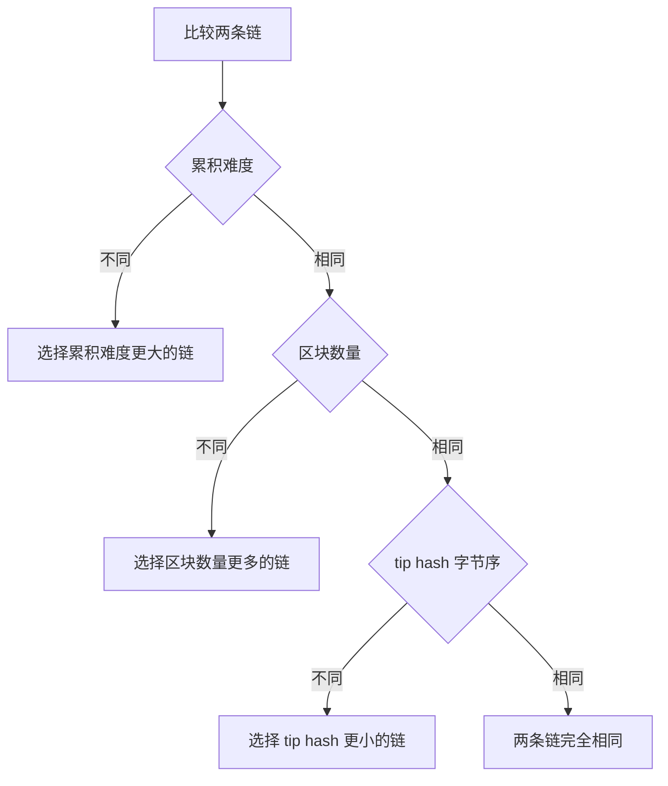
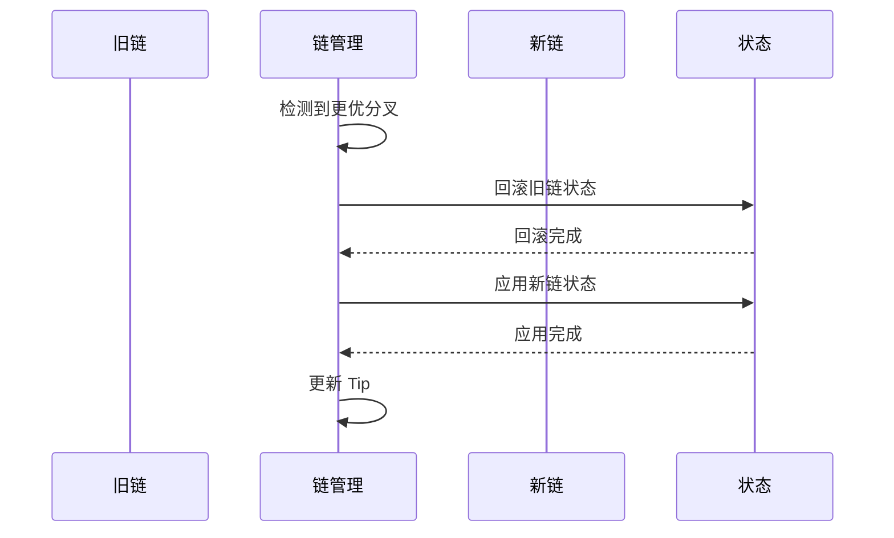
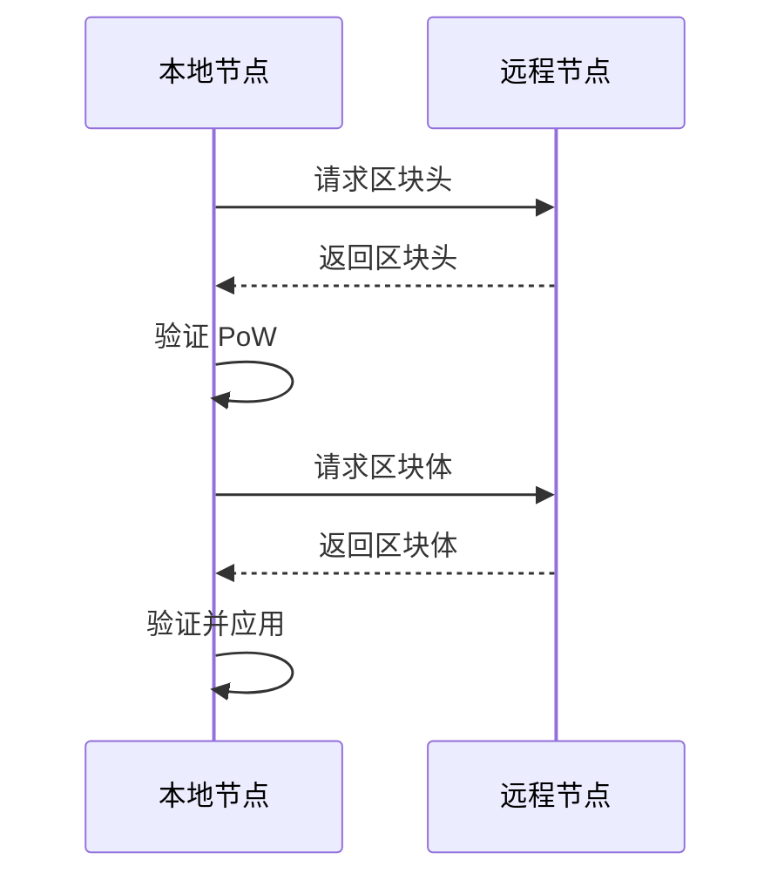

# 链模型

---

## 概述

链（Chain）是 WES 系统中区块的有序集合，负责管理链状态、处理分叉和重组。

**核心职责**：
- 维护区块的有序链接
- 管理链状态（最新高度、最优链）
- 处理分叉和重组

---

## 链结构

### 主链

主链是当前被认为是权威的区块序列：

```
Genesis → Block 1 → Block 2 → ... → Block N (Tip)
```

### 分叉

当多个区块指向同一个父区块时，产生分叉：

```
              → Block 2a → Block 3a
             /
Genesis → Block 1
             \
              → Block 2b
```

---

## 链状态管理

### 关键状态

- **Tip**：当前主链的最新区块
- **Height**：当前主链的高度
- **StateRoot**：当前状态根

### 状态查询

```go
// 获取当前高度
height := chain.GetHeight()

// 获取最新区块
tip := chain.GetTip()

// 按高度查询区块
block := chain.GetBlockByHeight(height)

// 按哈希查询区块
block := chain.GetBlockByHash(hash)
```

---

## 分叉处理

### 分叉检测

当收到的区块指向非 Tip 的区块时，检测到分叉。

### 分叉评估

评估分叉链的权重，选择最优链。链权重比较遵循以下规则（按优先级）：

**权重比较规则**：

1. **累积难度优先**：比较两条链的累积工作量（`Σ(每个区块的难度)`）
   - 累积难度更大的链优先

2. **区块数量次之**：如果累积难度相同，比较区块数量
   - 区块数量更多的链优先

3. **确定性 tie-break**：如果累积难度和区块数量都相同，使用 tip hash 字节序比较
   - tip hash **更小**（按字节序）的链优先
   - 这是确定性规则，确保所有节点在相同输入下选择一致

**权重比较示意**：



> **实现层定义**：链权重比较的完整规则见 [`internal/core/chain/fork/weight.go`](../../../internal/core/chain/fork/weight.go) 中的 `CompareChainWeight` 函数。该函数确保在累积难度和区块数量相同的情况下，使用 tip hash 的字节序作为确定性 tie-break，避免使用可被操纵的时间戳字段。

### 重组（Reorg）

当分叉链权重超过主链时，执行重组：

1. **回滚**：撤销主链区块的状态变更
2. **应用**：应用新链区块的状态变更
3. **更新**：更新链状态（Tip、Height）



---

## 区块同步

### 同步模式

1. **快速同步**：下载区块头，验证 PoW，快速追赶
2. **完整同步**：下载并验证所有区块和状态

### 同步流程



---

## 配置说明

| 参数 | 类型 | 默认值 | 说明 |
|------|------|--------|------|
| `max_reorg_depth` | int | 100 | 最大重组深度 |
| `sync_batch_size` | int | 100 | 同步批次大小 |
| `prune_blocks` | int | 10000 | 保留区块数（0=不裁剪） |

---

## 相关文档

- [区块模型](./block.md) - 区块结构
- [PoW+XOR 共识](./consensus-pow-xor.md) - 共识机制
- [数据持久化](./data-persistence.md) - 存储管理

### 内部设计文档

- [`_dev/01-协议规范-specs/03-区块与链协议-block-and-chain/`](../../../_dev/01-协议规范-specs/03-区块与链协议-block-and-chain/) - 链协议规范

