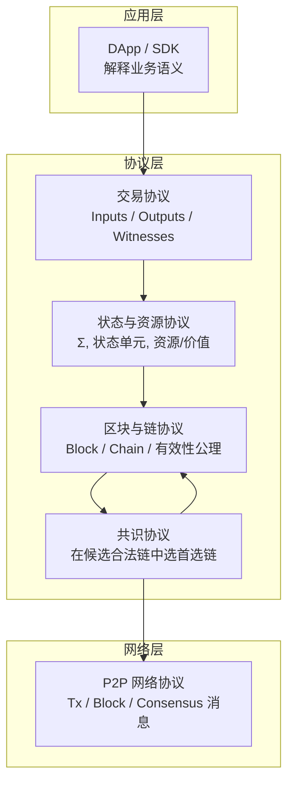
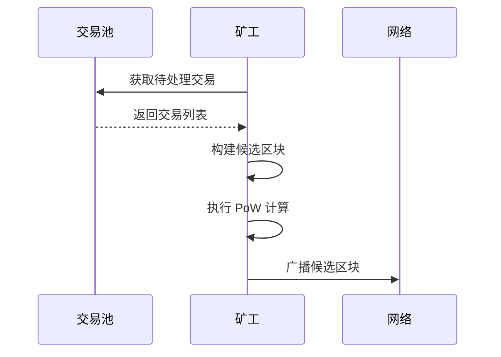
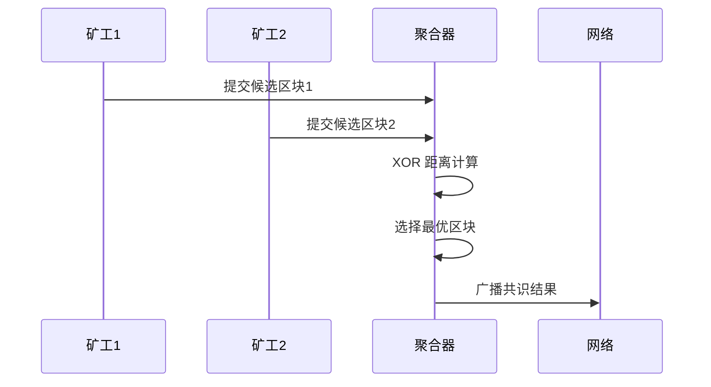

# PoW+XOR 距离选择共识

---

## 概述

WES 采用 PoW+XOR 混合共识机制，结合工作量证明（PoW）的安全性和 XOR 距离选择的高效性，实现微秒级确认的去中心化共识。

**在三层模型中的位置**：协调层（Coordination Layer）

**核心理念**：通过 PoW 保证出块安全，通过 XOR 距离选择实现快速确定性共识。

**在协议栈中的位置**：



> **协议层职责**：共识协议只在"合法区块与合法链候选"集合上工作，不改变状态、交易或区块的语义。详见 [`_dev/01-协议规范-specs/04-共识协议-consensus/CONSENSUS_PROTOCOL_SPEC.md`](../../../_dev/01-协议规范-specs/04-共识协议-consensus/CONSENSUS_PROTOCOL_SPEC.md)。

---

## 共识架构

### 两阶段共识

WES 共识分为两个阶段：

```
阶段 1：PoW 出块
    矿工竞争计算 PoW，产生候选区块
        ↓
阶段 2：XOR 距离选择
    聚合器基于 XOR 距离选择最优区块
```

### 关键角色

1. **矿工（Miner）**
   - 执行 PoW 计算
   - 产生候选区块
   - 广播候选区块

2. **聚合器（Aggregator）**
   - 收集候选区块
   - 执行 XOR 距离选择
   - 广播共识结果

---

## 核心能力

### 1. 矿工服务（Miner）

**能力描述**：
- PoW 工作量证明计算
- 候选区块模板创建
- 挖矿生命周期管理
- 高度门闸管理（防止重复挖矿）

**工作流程**：



**使用约束**：
- 挖矿需要有效的交易池
- 挖矿需要区块链服务支持
- 挖矿结果通过内部接口交给聚合器处理

---

### 2. 聚合器服务（Aggregator）

**能力描述**：
- 统一网络处理（区块发送、接收、路由决策）
- 动态角色决策（基于 K-bucket 距离判断是否为聚合节点）
- 距离选择引擎（基于 XOR 距离的确定性区块选择）
- 候选区块收集和去重
- 共识结果广播

**工作流程**：



**协议层约束**：
- 聚合器只在**合法候选区块集合**上运行链选择函数
- 选择结果必须满足共识协议的安全性、活性与一致性性质

---

### 3. XOR 距离选择

**原理**：
- 计算候选区块哈希与目标值的 XOR 距离
- 选择距离最小的区块
- 选择是确定性的，相同输入必产生唯一结果

**确定性保证**：
- 所有节点使用相同的距离计算算法
- 相同的候选区块集合产生相同的选择结果
- 无需额外的投票或通信

**选择延迟**：
- 选择计算 < 1ms
- 微秒级确认

### 4. 链选择规则（Fork-choice）

**最重链原则（Heaviest Chain）**：
- PoW+XOR 共识采用**最重链（最大累计工作量）**作为主规则
- 累计工作量 = `Σ (2^256 / target_i)`，其中 `target_i` 由区块难度推导
- **最长链（高度最大）**不是可靠主规则，只能视为观测指标

**确定性 Tie-break 规则**：
- 当累计工作量相同或难以区分时，**必须**使用确定性 tie-break 保证不同正确节点在相同输入下选择一致
- 推荐：以 tip hash（链头区块哈希）的字节序作为 tie-break（选择更小/更大的一端需在实现中固定且文档化）

**约束**：
- 交易数量、手续费等**不得**作为主规则，最多用于 tie-break 的补充信号
- 网络观测（peer 数量、连接质量等）**不得**作为区块有效性的硬条件

> **协议层定义**：链选择规则必须满足共识协议的安全性、活性与一致性性质。详见 [`_dev/01-协议规范-specs/04-共识协议-consensus/CONSENSUS_PROTOCOL_SPEC.md`](../../../_dev/01-协议规范-specs/04-共识协议-consensus/CONSENSUS_PROTOCOL_SPEC.md) §5。

---

### 5. 动态角色决策

**角色判断**：
- 基于 K-bucket 距离判断节点角色
- 距离最近的节点成为聚合节点
- 非聚合节点转发区块到更近的节点

**路由策略**：
- 候选区块路由到最近的聚合节点
- 聚合结果广播到全网

---

## 接口能力

### MinerService（矿工服务）

**能力**：
- `StartMining(ctx)` - 启动挖矿
- `StopMining(ctx)` - 停止挖矿
- `PauseMining(ctx)` - 暂停挖矿
- `ResumeMining(ctx)` - 恢复挖矿
- `GetMiningStatus()` - 获取挖矿状态
- `SetMiningParameters(params)` - 设置挖矿参数

### AggregatorService（聚合器服务）

**能力**：
- `StartAggregation(ctx)` - 启动聚合
- `StopAggregation(ctx)` - 停止聚合
- `GetAggregationStatus()` - 获取聚合状态
- `ProcessCandidateBlock(block)` - 处理候选区块
- `GetDecisionResult(height)` - 获取决策结果

---

## 配置说明

### 矿工配置

| 参数 | 类型 | 默认值 | 说明 |
|------|------|--------|------|
| `confirmation_timeout` | duration | 30s | 确认等待超时时间 |
| `block_interval` | duration | 10s | 目标出块间隔 |
| `mining_threads` | int | 4 | PoW 计算线程数 |
| `neighbor_fanout` | int | 2 | 首跳扇出数 |
| `max_retries` | int | 3 | 发送失败最大重试次数 |

### 聚合器配置

| 参数 | 类型 | 默认值 | 说明 |
|------|------|--------|------|
| `aggregation_interval` | duration | 5s | 聚合轮次间隔 |
| `min_candidates` | int | 1 | 最小候选区块数 |
| `max_candidates` | int | 100 | 最大候选区块数 |
| `selection_timeout` | duration | 0.01s | 距离选择超时 |
| `distance_algorithm` | string | "XOR" | 距离计算算法 |

---

## 共识协议性质

共识协议必须满足以下三个核心性质：

### 安全性（Safety）

**不可分叉的最终性**：
- 不存在两个不相容的区块（例如在状态或交易上彼此冲突），同时被多数正确节点视为"最终确认"
- 一旦某个区块达到协议定义的"最终性条件"，则在协议假设下，不应再发生将其从首选链中移除的重组

**前缀一致性**：
- 任意两个正确节点，在任意时刻，各自的首选链视图之间的差异仅限于"尾部少量区块"
- 已被双方视为"足够深"的区块前缀，在未来不会被替换为另一种不兼容序列

### 活性（Liveness）

在给定的网络与故障假设下，共识协议应保证：
- 只要存在新的合法交易被持续提交，系统最终会产生包含这些交易的新区块
- 这些新区块将进入某条首选链，而不是无限期停留在未决状态

换言之，在满足协议假设（例如网络足够稳定、作恶节点比例受限）的前提下，系统不会陷入永久停滞。

### 一致性（Consistency）

一致性性质要求：
- 任意两台正确节点，在足够长时间后，其首选链视图在某个高度之前是一致的
- 它们对"哪些区块已经最终确认"具有兼容的判断

该性质保证应用和用户可以在跨节点环境下获得统一的视图。

> **协议层定义**：任何声称兼容 WES 的共识算法必须在其系统模型假设内满足上述三个性质。详见 [`_dev/01-协议规范-specs/04-共识协议-consensus/CONSENSUS_PROTOCOL_SPEC.md`](../../../_dev/01-协议规范-specs/04-共识协议-consensus/CONSENSUS_PROTOCOL_SPEC.md) §3。

## 难度调节策略

### 策略概述

WES 在公有链、联盟链、私有链三种模式下，**统一采用 PoW+XOR 作为底层共识机制**，但难度调节策略不同：

- **公有链模式**：完全链上驱动，根据历史出块时间自动调节难度，维持目标出块间隔
- **联盟链模式**：保留自动调节，但参数可通过链上治理修改，支持紧急模式
- **私有链模式**：支持静态难度或缓慢调节模式，优先考虑性能与运维简化

### 关键约束

**确定性保证**：
- 难度计算**必须**是确定性的：所有正确节点在相同链状态下必须计算出相同的难度值
- **不得**依赖节点本地时间、随机数、网络延迟等非确定性因素

**时间戳规则（MTP）**：
- 公有链和联盟链模式**必须**使用中位时间戳（Median Time Past，MTP）约束
- MTP 为最近 11 个区块时间戳的中位数
- 区块时间戳必须满足：`MTP_{h-1} <= t_h <= now + 2小时`
- 不满足时间戳规则的区块视为无效

**难度调节公式（v2）**：
- 基于统计窗口计算实际平均出块时间 `T_actual`
- 计算调整比例：`ratio = T_target / T_actual`
- 将比例映射为难度增量（以 bit 为单位）：`Δbits = round(log2(ratio_clamped))`
- 每块最大步进限制：`Δbits ∈ [-1, +1]`（防止难度快速冲高导致长时间无块）

> **协议层定义**：难度策略的详细规范与三种链模式的参数配置，详见 [`_dev/01-协议规范-specs/04-共识协议-consensus/POWXOR_DIFFICULTY_POLICY_SPEC.md`](../../../_dev/01-协议规范-specs/04-共识协议-consensus/POWXOR_DIFFICULTY_POLICY_SPEC.md)。

## 安全性分析

### PoW 安全性

- **算力保护**：需要算力才能产生有效区块
- **成本攻击**：攻击需要大量算力成本
- **历史不可变**：修改历史需要重新计算 PoW

### XOR 选择安全性

- **确定性**：选择结果确定，无法操纵
- **公平性**：所有有效区块有相同的被选择机会
- **快速终结**：选择后立即达成共识

### 组合优势

- PoW 提供出块安全
- XOR 提供快速确认
- 两者结合实现安全+高效

---

## 典型使用场景

### 场景 1：启动挖矿

```go
minerService := consensus.NewMinerService()
err := minerService.StartMining(ctx)
if err != nil {
    return err
}
// 挖矿已启动，自动参与区块生产
```

### 场景 2：处理候选区块

```go
aggregatorService := consensus.NewAggregatorService()
err := aggregatorService.ProcessCandidateBlock(candidateBlock)
if err != nil {
    return err
}
// 候选区块已处理，等待距离选择决策
```

### 场景 3：获取共识结果

```go
aggregatorService := consensus.NewAggregatorService()
result, err := aggregatorService.GetDecisionResult(height)
if err != nil {
    return err
}
// 获取指定高度的共识结果
```

---

## 与其他组件的关系

### 依赖关系

```
Consensus
  ├── 依赖 Mempool（获取待处理交易）
  ├── 依赖 Block（区块构建）
  ├── 依赖 Network（区块广播）
  └── 被 Chain 依赖（链状态更新）
```

### 数据流

```
交易池
    ↓
矿工构建候选区块
    ↓
PoW 计算
    ↓
广播候选区块
    ↓
聚合器收集
    ↓
XOR 距离选择
    ↓
共识结果广播
    ↓
链状态更新
```

---

## 相关文档

- [架构总览](./architecture-overview.md) - 了解系统架构
- [区块模型](./block.md) - 了解区块处理
- [网络与拓扑](./network-and-topology.md) - 了解网络层

### 内部设计文档

- [`_dev/01-协议规范-specs/04-共识协议-consensus/`](../../../_dev/01-协议规范-specs/04-共识协议-consensus/) - 共识协议规范
- [`_dev/02-架构设计-architecture/05-共识架构-consensus/`](../../../_dev/02-架构设计-architecture/05-共识架构-consensus/) - 共识架构设计

