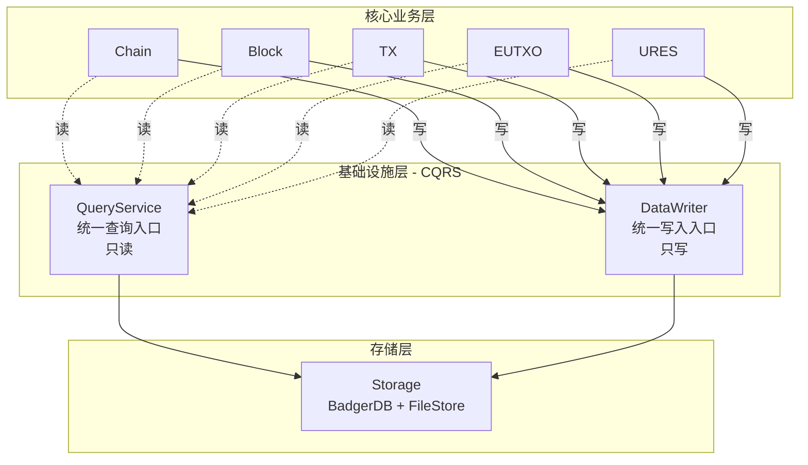
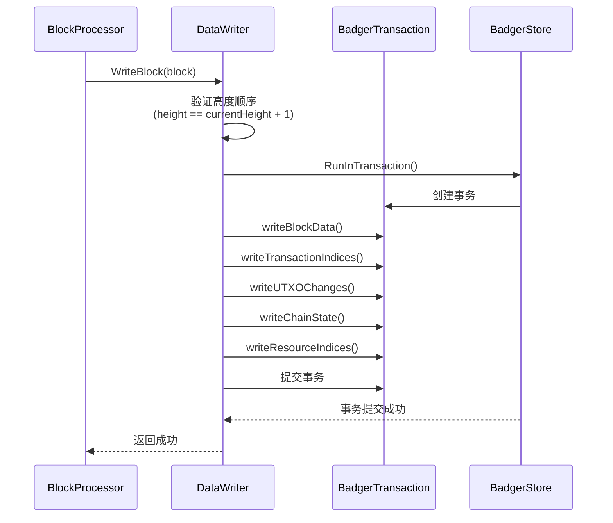

# 数据持久化

---

## 概述

WES 的数据持久化层负责存储区块、交易、状态、资源等数据，支持高效查询和数据完整性保证。

**核心职责**：
- 持久化存储各类数据
- 提供高效的查询接口
- 保证数据完整性和一致性

---

## 数据类型

### 区块数据

- **区块头**：区块元信息
- **区块体**：交易列表
- **区块索引**：高度、哈希索引

### 状态数据

- **UTXO 集合**：当前未消费的输出
- **状态根**：状态的 Merkle 根
- **快照**：历史状态快照

### 资源数据

- **资源内容**：WASM/ONNX/文件等
- **资源元信息**：类型、大小、哈希等
- **资源索引**：内容哈希索引

### 交易数据

- **交易内容**：完整交易数据
- **交易索引**：TxID、区块位置索引
- **交易收据**：执行结果

---

## 存储架构

### CQRS 架构

WES 的数据持久化层采用 **CQRS（Command Query Responsibility Segregation）架构**，实现读写分离：

**核心原则**：

- ✅ **被业务层调用**：业务层通过 QueryService 读取，通过 DataWriter 写入
- ❌ **不调用业务层**：persistence 只操作存储，不依赖业务组件
- ✅ **CQRS 架构**：QueryService（只读）+ DataWriter（只写）
- ✅ **统一入口**：所有读通过 QueryService，所有写通过 DataWriter
- ✅ **避免循环依赖**：通过统一查询服务解耦业务层

> **实现层定义**：CQRS 架构的详细设计见 [`internal/core/persistence/README.md`](../../../internal/core/persistence/README.md)。

### 统一写入入口

**DataWriter** 作为唯一写入入口，确保所有数据写入的原子性：

**有序写入原则**：
- 严格验证：只接受 `height == currentHeight + 1` 的区块
- 原子性保证：所有写操作在单一事务中完成
- 协调写入：统一协调区块数据、交易索引、UTXO变更、链状态、资源索引的写入

**写入流程**：

### 统一查询入口

**QueryService** 聚合所有领域查询服务，提供统一查询入口：

- **ChainQuery**：链状态查询
- **BlockQuery**：区块查询
- **TxQuery**：交易查询
- **UTXOQuery**：UTXO查询
- **ResourceQuery**：资源查询
- **AccountQuery**：账户查询

### 存储引擎

| 引擎 | 特点 | 适用场景 | 默认 |
|------|------|----------|------|
| **BadgerDB** | 纯 Go、SSD 优化、事务支持 | Go 原生部署、生产环境 | ✅ **默认** |
| RocksDB | 高性能、可调优 | 大规模部署 | 可选 |
| LevelDB | 轻量、稳定 | 小规模部署 | 可选 |

**说明**：WES 默认使用 BadgerDB 作为存储引擎，提供事务支持和原子性保证。

---

## 索引策略

### 主要索引

| 索引类型 | 键 | 值 | 用途 |
|----------|-----|-----|------|
| 区块高度索引 | height | blockHash | 按高度查询 |
| 区块哈希索引 | blockHash | block | 按哈希查询 |
| 交易索引 | txHash | (blockHash, index) | 交易定位 |
| UTXO 索引 | outpoint | utxo | UTXO 查询 |
| 地址索引 | address | []outpoint | 按地址查询 |

### 索引更新

索引随区块确认同步更新，保证一致性。

---

## 快照管理

### 快照类型

- **状态快照**：UTXO 集合的完整快照
- **增量快照**：只记录变更的快照

### 快照用途

- **状态恢复**：从快照恢复状态
- **历史查询**：查询历史状态
- **数据备份**：定期备份

---

## 数据修复

### 完整性检查

- 区块链连续性检查
- Merkle 根验证
- 状态根验证

### 修复策略

- **自动修复**：检测到问题自动修复
- **重建索引**：从原始数据重建索引
- **状态重放**：从创世块重放所有交易

---

## 配置说明

| 参数 | 类型 | 默认值 | 说明 |
|------|------|--------|------|
| `data_dir` | string | "./data" | 数据目录 |
| `db_engine` | string | "leveldb" | 存储引擎 |
| `cache_size` | int | 256MB | 缓存大小 |
| `snapshot_interval` | int | 1000 | 快照间隔（区块数） |

---

## 相关文档

- [架构总览](./architecture-overview.md) - 系统架构
- [EUTXO 模型](./eutxo.md) - 状态管理
- [URES 资源管理](./ures.md) - 资源存储

### 内部设计文档

- [`_dev/02-架构设计-architecture/10-数据与存储架构-data-and-storage/`](../../../_dev/02-架构设计-architecture/10-数据与存储架构-data-and-storage/) - 存储架构设计
- [`internal/core/persistence/README.md`](../../../internal/core/persistence/README.md) - 持久化层实现架构

