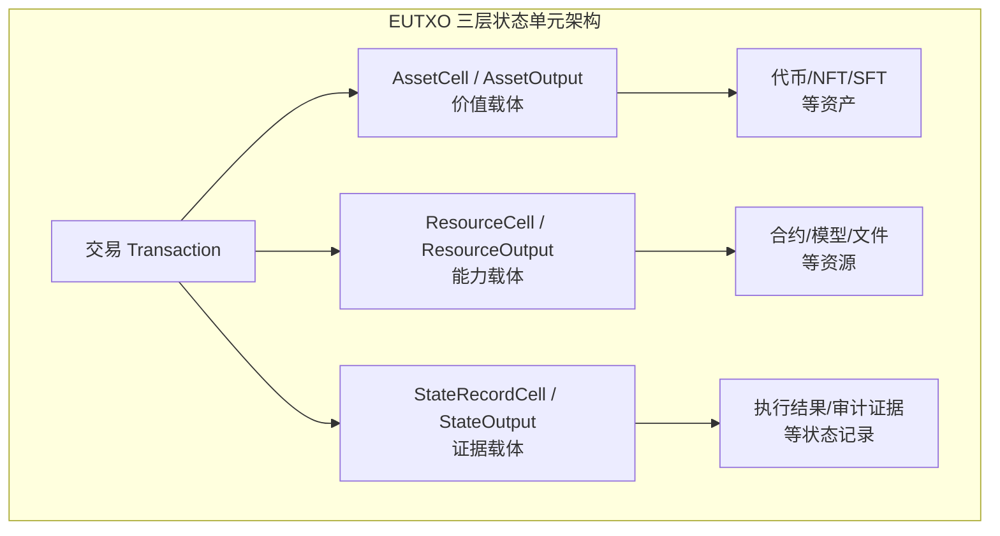
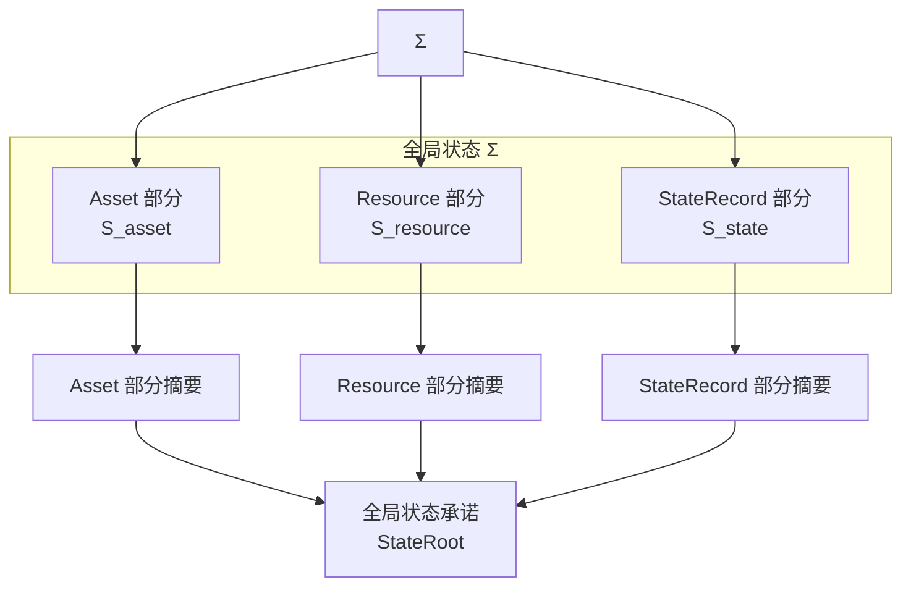
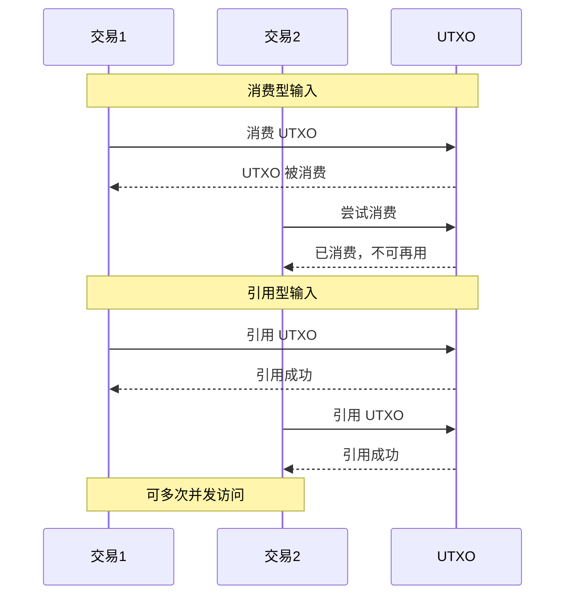

# EUTXO 扩展模型

---

## 概述

EUTXO（Extended UTXO）是 WES 系统的账本状态管理核心，在传统 UTXO 模型基础上扩展了三层输出架构和引用不消费模式。

**在三层模型中的位置**：账本层（Ledger Layer）

**核心理念**：通过 Asset/Resource/State 三层输出架构，实现价值、能力、状态的分离管理；通过引用不消费模式，支持程序与数据的分离和并发访问。

---

## 为什么需要 EUTXO？

### 传统 UTXO 的局限

传统 UTXO 模型（如比特币）只支持：
- 单一的资产类型（原生代币）
- 消费后即销毁的使用模式
- 简单的锁定/解锁逻辑

### 账户模型的问题

账户模型（如以太坊）虽然灵活，但存在：
- 全局状态共享，并发性差
- 状态膨胀问题
- 复杂的状态依赖

### EUTXO 的优势

EUTXO 结合了两者的优点：
- **并发性**：UTXO 天然支持并行处理
- **灵活性**：三层输出支持多种使用场景
- **可组合性**：引用不消费支持程序数据分离

---

## 核心能力

### 1. 三层状态单元架构

EUTXO 在协议层定义了三种类型的状态单元：

**协议层术语（`_dev` 规范）**：
- `AssetCell`：资产层状态单元，承载价值单元 `Value`
- `ResourceCell`：资源层状态单元，承载或引用资源对象
- `StateRecordCell`：状态记录层状态单元，记录执行结果、审计信息与证据

**实现层术语（交易输出）**：
- `AssetOutput`：资产输出，对应 `AssetCell` 的创建
- `ResourceOutput`：资源输出，对应 `ResourceCell` 的创建
- `StateOutput`：状态输出，对应 `StateRecordCell` 的创建

> **术语映射说明**：`Cell` 是协议层的抽象概念，表示"状态单元"；`Output` 是交易层的具体实现，表示"交易输出"。两者在语义上对应，但 `Cell` 强调状态单元的生命周期（创建、消费、引用），`Output` 强调交易的输出结构。详见 [`_dev/01-协议规范-specs/01-状态与资源模型协议-state-and-resource/STATE_MODEL_PROTOCOL_SPEC.md`](../../../_dev/01-协议规范-specs/01-状态与资源模型协议-state-and-resource/STATE_MODEL_PROTOCOL_SPEC.md)。

**三层架构示意**：



#### AssetCell / AssetOutput（价值载体）

**用途**：代表可转移的价值，如代币、NFT、SFT

**关键字段**：
- `address`：接收地址
- `amount`：金额
- `asset_type`：资产类型
- `lock`：锁定条件

**使用场景**：
- 代币转账
- NFT 发行和转移
- 资产质押

#### ResourceCell / ResourceOutput（能力载体）

**用途**：代表可引用的资源，如合约、模型、文件

**关键字段**：
- `resource_hash`：资源内容哈希
- `owner`：所有者（权利主体）
- `metadata`：元数据

**使用场景**：
- 合约部署
- AI 模型部署
- 文件存储

**协议层约束**：
- 资源层状态单元既可以作为"仅引用输入"多次被引用而不消费（例如公共可读资源定义）
- 也可以作为"消费型输入"参与资源升级或废弃（创建新的资源版本状态单元，并使旧版本不再可用）

#### StateRecordCell / StateOutput（证据载体）

**用途**：记录执行结果、审计信息与证据

**关键字段**：
- `state_data`：状态数据
- `proof`：相关证明
- `timestamp`：时间戳

**使用场景**：
- 执行结果记录
- 审计证据
- 合规与风控记录

**协议层约束**：
- 状态记录层状态单元通常作为"只追加"的记录，不被作为价值载体使用
- 一般不会被再次消费，而是形成随时间增长的审计轨迹

---

### 2. 全局状态视图与承诺

**全局状态 Σ**：
- 在任一时刻，系统的全局状态用集合 `Σ ⊆ S` 表示
- 对任意 `s ∈ Σ`，谓词 `usable(s) = true`（当前可用）

**状态演化**：
- 输入集合 `In ⊆ Σ`（消费型输入）
- 输出集合 `Out ⊆ S`（新创建状态单元）
- 引用集合 `Ref ⊆ S`（仅被读取、不改变可用性）

演化后的新全局状态：
```
Σ' = (Σ \ In) ∪ Out
```

**全局状态承诺（StateRoot）**：

为支持轻节点与状态证明，需要对全局状态 `Σ` 给出摘要承诺：



> **协议层定义**：状态承诺函数 `commit(Σ) → digest` 将当前全局状态映射为摘要，区块头中携带该摘要作为 `state_root`。详见 [`_dev/01-协议规范-specs/01-状态与资源模型协议-state-and-resource/STATE_MODEL_PROTOCOL_SPEC.md`](../../../_dev/01-协议规范-specs/01-状态与资源模型协议-state-and-resource/STATE_MODEL_PROTOCOL_SPEC.md) §2.3。

### 3. 引用不消费模式

EUTXO 支持两种输入模式：

#### 消费型输入（isReferenceOnly=false）

- 状态单元被消费后不可再使用
- 计入价值守恒计算
- 用于资产转移

**协议层约束**：
- 唯一消费约束：对任一状态单元 `s`，在整个链历史中至多被消费一次
- 可用性约束：仅在 `usable(s) = true` 时，`s` 才能作为输入被消费

#### 引用型输入（isReferenceOnly=true）

- 状态单元被引用但不消费
- 可多次并发访问
- 不计入价值守恒计算
- 用于读取共享数据

**协议层约束**：
- 可重复引用单元：可在多个演化步骤的 `Ref` 集合中出现
- 一次性引用单元：一旦作为关键输入参与规则判定即被消费
- 实现**必须**为每类状态单元显式指定引用策略



**典型应用**：
- **合约调用**：引用合约资源，不消费
- **数据读取**：引用数据资源，不消费
- **并发处理**：多个交易并发引用同一资源

**协议层约束（EUTXO 风格使用模式）**：

- **资产层状态单元 `AssetCell`**：
  - 只能以"消费型输入 + 新输出"的模式参与状态演化
  - 不支持长期仅引用模式
  - 必须遵守价值守恒公理

- **资源层状态单元 `ResourceCell`**：
  - 既可以作为"仅引用输入"多次被引用而不消费（例如公共可读资源定义）
  - 也可以作为"消费型输入"参与资源升级或废弃（创建新的资源版本状态单元，并使旧版本不再可用）

- **状态记录层状态单元 `StateRecordCell`**：
  - 通常作为"只追加"的记录，不被作为价值载体使用
  - 一般不会被再次消费，而是形成随时间增长的审计轨迹

> **协议层定义**：详见 [`_dev/01-协议规范-specs/01-状态与资源模型协议-state-and-resource/STATE_MODEL_PROTOCOL_SPEC.md`](../../../_dev/01-协议规范-specs/01-状态与资源模型协议-state-and-resource/STATE_MODEL_PROTOCOL_SPEC.md) §3.4。

### 4. 价值守恒公理

**价值守恒公理（资产层）**：

对于任一原子状态演化步骤 `e`：
- 输入资产集合：`In_asset ⊆ S_asset`
- 输出资产集合：`Out_asset ⊆ S_asset`
- `fee(e)`：本次演化中被系统消耗或销毁的价值（如手续费、惩罚）

要求：

```
Σ_{s ∈ In_asset} value(s) ≥ Σ_{s ∈ Out_asset} value(s) + fee(e)
```

**约束**：
- 除非引入明确建模的发行或销毁机制，否则系统总价值应保持不变
- 发行与销毁若存在，应形式化为特殊演化步骤，行为一致且可审计

> **协议层定义**：价值守恒公理是状态模型协议中的全局不变式，必须始终满足。详见 [`_dev/01-协议规范-specs/01-状态与资源模型协议-state-and-resource/STATE_MODEL_PROTOCOL_SPEC.md`](../../../_dev/01-协议规范-specs/01-状态与资源模型协议-state-and-resource/STATE_MODEL_PROTOCOL_SPEC.md) §4。

### 5. 状态可追溯公理

对任一当前可用状态单元 `s`，必须存在有限长因果链：

```
s_0 → s_1 → ... → s_n = s
```

其中：
- `s_0` 属于创世或某明确初始状态集合
- 每一步 `s_i → s_{i+1}` 可被解释为一次合法状态演化

**含义**：
- 不允许出现"凭空出现"的不可追溯状态
- 审计方可通过有限步遍历还原任一当前状态的完整演化历史

> **协议层定义**：状态可追溯公理确保所有状态单元都有明确的来源，详见 [`_dev/01-协议规范-specs/01-状态与资源模型协议-state-and-resource/STATE_MODEL_PROTOCOL_SPEC.md`](../../../_dev/01-协议规范-specs/01-状态与资源模型协议-state-and-resource/STATE_MODEL_PROTOCOL_SPEC.md) §5。

### 6. 状态查询

**查询能力**：
- 按地址查询 UTXO
- 按类别查询 UTXO
- 按 OutPoint 查询 UTXO
- 状态根查询

**约束**：
- 查询是只读操作
- 查询结果反映当前链状态
- 支持快照查询（历史状态）

---

### 7. 快照管理

**快照能力**：
- 创建状态快照
- 恢复状态快照
- 删除状态快照

**使用场景**：
- 状态回滚：恢复到历史快照
- 状态备份：定期创建快照
- 测试环境：使用快照重置状态

---

## 接口能力

### UTXOWriter（UTXO 写入器）

**能力**：
- `CreateUTXO()` - 创建 UTXO
- `SpendUTXO()` - 消费 UTXO
- `ReferenceUTXO()` - 引用 UTXO

### UTXOQuery（UTXO 查询器）

**能力**：
- `GetUTXO()` - 查询单个 UTXO
- `GetUTXOsByAddress()` - 按地址查询
- `GetUTXOsByCategory()` - 按类别查询
- `GetStateRoot()` - 查询状态根

---

## 配置说明

| 参数 | 类型 | 默认值 | 说明 |
|------|------|--------|------|
| `max_utxo_count` | int | 1000000 | 最大 UTXO 数量 |
| `snapshot_interval` | int | 1000 | 快照创建间隔（区块数） |
| `enable_reference_counting` | bool | true | 启用引用计数 |

---

## 使用约束

### UTXO 创建约束

1. **格式约束**：
   - OutPoint 必须有效
   - 输出类型必须明确
   - 地址格式必须正确

2. **状态约束**：
   - 不能创建重复的 OutPoint
   - 状态根必须更新

### UTXO 消费约束

1. **存在性约束**：
   - UTXO 必须存在
   - UTXO 必须未被消费

2. **权限约束**：
   - 必须提供有效的解锁证明
   - 解锁证明必须匹配锁定条件

### 引用计数约束

1. **引用计数管理**：
   - 引用型输入增加引用计数
   - 消费型输入不增加引用计数

2. **并发访问**：
   - 支持多个交易并发引用同一 UTXO
   - 引用计数线程安全

---

## 典型使用场景

### 场景 1：资产转账

```go
// 消费资产 UTXO，创建新的资产 UTXO
builder := tx.NewTxBuilder()
tx := builder.
    AddInput(assetUTXO, false).  // 消费型输入
    AddAssetOutput(toAddress, "100", nil, lock).
    Build()
```

### 场景 2：合约调用

```go
// 引用合约资源，不消费
builder := tx.NewTxBuilder()
tx := builder.
    AddInput(assetUTXO, false).  // 消费型输入（支付费用）
    AddResourceInput(contractHash, true).  // 引用型输入（引用合约）
    AddStateOutput(stateData, proof).
    Build()
```

### 场景 3：资源部署

```go
// 创建资源 UTXO
builder := tx.NewTxBuilder()
tx := builder.
    AddInput(assetUTXO, false).  // 消费型输入（支付费用）
    AddResourceOutput(resourceHash, owner).
    Build()
```

---

## 与其他组件的关系

### 依赖关系

```
EUTXO
  ├── 依赖 URES（资源内容存储）
  ├── 依赖 Storage（状态持久化）
  └── 被 TX 依赖（交易状态管理）
```

### 与 URES 的关系

- **EUTXO**：管理资源的所有权和引用关系
- **URES**：管理资源的实际内容

ResourceOutput 包含 `resource_hash`，指向 URES 中存储的实际内容。

---

## 相关文档

- [架构总览](./architecture-overview.md) - 了解系统架构
- [URES 资源管理](./ures.md) - 了解资源管理
- [交易模型](./transaction.md) - 了解交易处理

### 内部设计文档

- [`_dev/01-协议规范-specs/01-状态与资源模型协议-state-and-resource/`](../../../_dev/01-协议规范-specs/01-状态与资源模型协议-state-and-resource/) - EUTXO 协议规范
- [`_dev/02-架构设计-architecture/02-状态与资源架构-state-and-resource/`](../../../_dev/02-架构设计-architecture/02-状态与资源架构-state-and-resource/) - 状态架构设计

