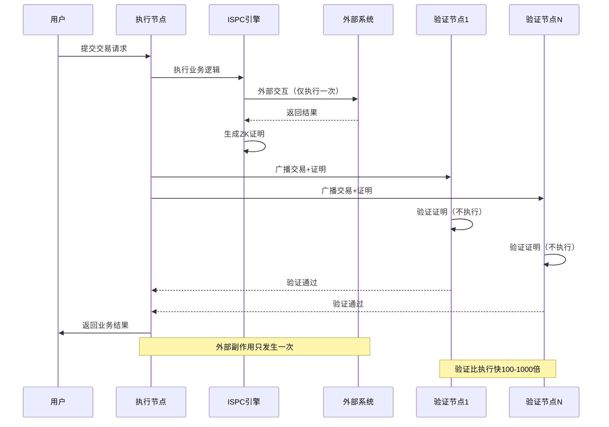

# ISPC 本征自证计算

---

## 概述

ISPC（Intrinsic Self-Proving Computing，本征自证计算）是 WES 系统的可验证计算核心，定义了区块链的可验证计算范式。

**在三层模型中的位置**：计算层（Computation Layer）

**核心理念**：执行即证明 — 计算执行的同时自动生成可验证的零知识证明，实现单次执行+多点验证。

---

## 为什么需要 ISPC？

### 传统区块链的困境

传统区块链采用**确定性共识**：

```
交易提交 → 所有节点执行 → 比较结果 → 达成共识
```

这带来三个根本性限制：

1. **确定性要求**：同一输入必须产生相同输出
   - AI 推理是非确定性的（浮点误差、随机性）
   - 无法支持非确定性计算

2. **重复执行**：所有节点都要执行相同计算
   - AI 模型太大、计算太昂贵
   - 成本随节点数线性增长

3. **外部副作用**：每个节点都会触发外部操作
   - 50个节点 = 50次数据库操作
   - 无法集成外部系统

### ISPC 的范式突破

ISPC 采用**可验证性共识**：

```
交易提交 → 单节点执行+生成证明 → 其他节点验证证明 → 达成共识
```

**核心突破**：

1. **可验证性替代确定性**
   - 不要求相同结果，只要求可验证
   - 支持 AI 等非确定性计算

2. **单次执行+多点验证**
   - 只有一个节点执行业务逻辑
   - 其他节点验证 ZK 证明
   - 验证比执行快 100-1000 倍

3. **可控外部交互**
   - 外部副作用只发生一次
   - 通过 HostABI 提供可验证的外部集成

---

## 执行协议抽象

### 调用模型

在协议层，一次执行调用可表示为抽象元组：

```
Call = (er, entry, args, context)
```

其中：
- `er`：目标可执行资源标识
- `entry`：要调用的入口
- `args`：调用参数的抽象值序列
- `context`：与本次执行相关的环境信息（例如调用方标识、当前区块高度等）

### 执行语义

给定当前全局状态 `Σ`、可执行资源 `er` 与调用 `Call`，执行引擎产生结果：

```
exec(Σ, Call) → (Σ', result, meter, evidence) 或 error
```

其中：
- `Σ'`：执行后的新全局状态（或相关局部变更）
- `result`：返回结果（可为空）
- `meter`：本次执行的消耗度量（用于计费）
- `evidence`：可选的执行证明或审计信息

**协议层约束**：
- 若返回 `error`，则对 `Σ` 的影响由错误语义决定
- 若返回 `(Σ', ...)`，则 `Σ'` **必须**仍满足状态与资源模型协议的全部公理
- 所有持久变更**必须**通过交易输出中的状态单元明示体现

### 错误类型与回滚语义

执行相关错误分为：

1. **前置错误**：在执行前发现的问题（参数错误、权限不足、资源不可用等）
   - 通常视为交易整体无效，不改变全局状态
   - 可允许网络费用部分或全部收取以惩罚无效交易

2. **执行时错误**：执行过程中发生的问题（算术异常、非法状态访问、推理失败等）
   - 子规范**必须**明确：在各自 `ExecutableKind` 下应如何回滚或记录错误
   - 不得在错误路径留下违反状态与交易公理的中间状态

3. **环境错误**：来自执行环境之外的问题（资源耗尽、引擎崩溃等）
   - 不应导致不一致状态落链
   - 应尽量表现为可识别失败模式供上层处理

**要求**：任何错误下，链上可见状态演化须保持自洽并满足状态与交易公理。

> **协议层定义**：可执行资源执行协议的核心抽象与约束，详见 [`_dev/01-协议规范-specs/06-可执行资源执行协议-executable-resource-execution/EXECUTION_PROTOCOL_CORE_SPEC.md`](../../../_dev/01-协议规范-specs/06-可执行资源执行协议-executable-resource-execution/EXECUTION_PROTOCOL_CORE_SPEC.md)。

---

## 核心能力

### 1. 单次执行 + 多点验证

**执行流程**：



**核心价值**：
- 彻底解决外部副作用问题：外部副作用只发生一次
- 传统业务系统零改造：无需考虑可重入性设计
- 验证效率提升：验证比执行快 100-1000 倍
- **CU 统一计量**：合约和 AI 模型使用统一的 CU（Compute Units，计算单位）计量算力

---

### 2. WASM 合约执行

**能力描述**：
- 支持 WebAssembly 合约执行
- 支持多语言合约开发（Rust/Go/JS/Python）
- 通过 HostABI 提供区块链能力

**HostABI 能力**：
- **UTXO 操作**：查询、添加输出
- **资源操作**：查询资源、添加资源输出
- **状态操作**：查询区块高度、时间戳等
- **事件操作**：发出事件

**使用约束**：
- 合约必须是有效的 WASM 格式
- 合约函数必须正确导出
- 执行必须是确定性的（在 ISPC 框架内）

---

### 3. ONNX 模型推理

**能力描述**：
- 支持 ONNX 格式的 AI 模型推理
- 支持 GPU 加速推理
- 推理过程完全可验证

**推理能力**：
- **模型加载**：从缓存或存储加载模型
- **张量转换**：输入输出张量格式转换
- **推理执行**：基于标准 ONNX 推理引擎执行推理

**使用约束**：
- 模型必须是有效的 ONNX 格式
- 输入张量格式必须正确
- 推理结果必须可验证

---

### 4. 受控外部交互

**能力描述**：
- 支持与外部系统的可信交互
- 外部调用只在执行节点发生一次
- 调用结果被记录并可验证

**交互类型**：
- **HTTP 调用**：调用外部 API
- **数据库操作**：执行数据库查询/更新
- **文件系统**：读取外部文件

**使用约束**：
- 外部交互必须通过 HostABI
- 交互结果被记录在证明中
- 验证节点不重复执行外部交互

---

### 5. ZK 证明

**能力描述**：
- 自动生成零知识证明
- 支持证明验证
- 证明可聚合和压缩

**证明内容**：
- 计算过程的正确性
- 输入输出的一致性
- 外部交互的结果

**使用约束**：
- 证明生成有计算开销
- 证明大小与计算复杂度相关
- 验证速度远快于执行

---

## 接口能力

### ISPCExecutor（ISPC 执行器）

**能力**：
- `ExecuteWASM()` - 执行 WASM 合约
- `ExecuteONNX()` - 执行 ONNX 模型推理
- `GenerateProof()` - 生成执行证明
- `VerifyProof()` - 验证执行证明

**约束**：
- 执行器是线程安全的
- 执行失败会返回详细错误
- 证明生成是自动的

### HostABI（宿主 ABI）

**能力**：
- `GetUTXO()` - 查询 UTXO
- `AddOutput()` - 添加输出
- `GetResource()` - 查询资源
- `EmitEvent()` - 发出事件
- `CallExternal()` - 外部调用

**约束**：
- 所有调用都被记录
- 外部调用只执行一次
- 调用结果被包含在证明中

---

## 配置说明

### ISPC 配置

| 参数 | 类型 | 默认值 | 说明 |
|------|------|--------|------|
| `max_execution_time` | duration | 30s | 最大执行时间 |
| `max_memory` | int | 256MB | 最大内存使用 |
| `enable_gpu` | bool | false | 启用 GPU 加速 |
| `proof_level` | string | "standard" | 证明级别 |

### WASM 引擎配置

| 参数 | 类型 | 默认值 | 说明 |
|------|------|--------|------|
| `stack_size` | int | 1MB | 栈大小 |
| `heap_size` | int | 64MB | 堆大小 |
| `enable_simd` | bool | true | 启用 SIMD |

### ONNX 引擎配置

| 参数 | 类型 | 默认值 | 说明 |
|------|------|--------|------|
| `model_cache_size` | int | 10 | 模型缓存数量 |
| `execution_provider` | string | "CPU" | 执行提供者 |
| `optimization_level` | int | 1 | 优化级别 |

---

## 典型使用场景

### 场景 1：智能合约执行

```go
// 执行 WASM 合约
executor := ispc.NewExecutor()
result, proof, err := executor.ExecuteWASM(
    contractHash,  // 合约哈希
    "transfer",    // 方法名
    params,        // 参数
    utxoInputs,    // UTXO 输入
)
if err != nil {
    return err
}
// result 包含执行结果
// proof 包含 ZK 证明
```

### 场景 2：AI 模型推理

```go
// 执行 ONNX 模型推理
executor := ispc.NewExecutor()
result, proof, err := executor.ExecuteONNX(
    modelHash,     // 模型哈希
    inputTensor,   // 输入张量
)
if err != nil {
    return err
}
// result 包含推理结果
// proof 包含 ZK 证明
```

### 场景 3：外部系统调用

```go
// 在合约中调用外部 API
func (c *Contract) ProcessOrder(orderID string) error {
    // 调用外部 ERP 系统（只执行一次）
    status, err := hostabi.CallExternal("http://erp/api/order", orderID)
    if err != nil {
        return err
    }
    // 更新链上状态
    hostabi.AddOutput(NewStateOutput(status))
    return nil
}
```

---

## 与其他组件的关系

### 依赖关系

```
ISPC
  ├── 依赖 URES（获取合约/模型资源）
  ├── 依赖 EUTXO（查询状态）
  └── 被 TX 依赖（交易执行）
```

### 数据流

```
交易输入
    ↓
ISPC 执行（WASM/ONNX）
    ↓
生成输出 + ZK 证明
    ↓
EUTXO 更新状态
```

---

## 相关文档

- [架构总览](./architecture-overview.md) - 了解系统架构
- [EUTXO 模型](./eutxo.md) - 了解状态管理
- [URES 资源管理](./ures.md) - 了解资源管理
- [隐私与证明](./privacy-and-proof.md) - 了解 ZK 证明体系

### 内部设计文档

- [`_dev/01-协议规范-specs/06-可执行资源执行协议-executable-resource-execution/`](../../../_dev/01-协议规范-specs/06-可执行资源执行协议-executable-resource-execution/) - ISPC 协议规范
- [`_dev/02-架构设计-architecture/06-执行与计算架构-execution-and-compute/`](../../../_dev/02-架构设计-architecture/06-执行与计算架构-execution-and-compute/) - 执行架构设计

