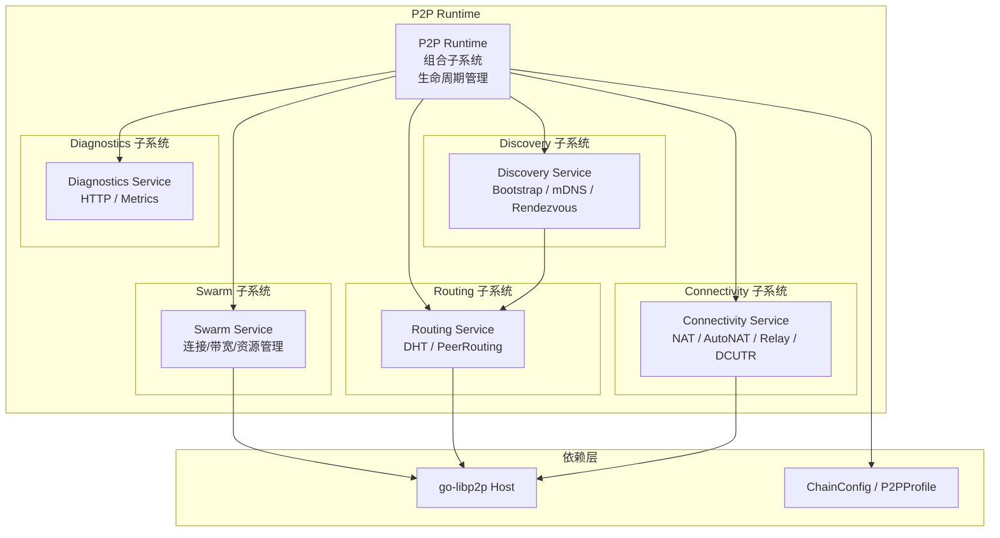

# 网络与拓扑

---

## 概述

WES 采用去中心化的 P2P 网络架构，支持节点发现、消息路由和数据同步。

**核心职责**：
- 节点发现和连接管理
- 消息广播和路由
- 数据同步

---

## 网络架构

### P2P 分层架构

WES 的 P2P 网络采用分层架构，基于 go-libp2p 实现，对标 IPFS Kubo 的网络子系统：



**核心子系统**：

1. **Swarm Service**：连接管理、带宽统计、资源管理
   - 维护所有活跃连接和流
   - 提供 Dial、Peer 与连接信息视图
   - 管理连接水位（HighWater/LowWater）和资源限制

2. **Routing Service**：基于 DHT 的 Peer 路由
   - 基于 `go-libp2p-kad-dht` 提供 PeerRouting 能力
   - 支持多种 DHT 模式（`server/client/auto/lan`）

3. **Discovery Service**：节点发现
   - 统一调度 Bootstrap / mDNS / Rendezvous 等发现插件
   - 当 Peers 数低于阈值时，主动触发发现

4. **Connectivity Service**：连通性增强
   - NAT PortMap、AutoNAT、Relay Client/Service、DCUTR 打洞
   - 维护 Reachability 状态（`Unknown/Public/Private`）

5. **Diagnostics Service**：诊断与指标
   - 暴露 `/debug/p2p/*` HTTP 端点
   - 向 Prometheus 导出 Swarm、Routing、Discovery、Connectivity 指标

> **实现层定义**：P2P 分层架构的详细设计见 [`internal/core/p2p/README.md`](../../../internal/core/p2p/README.md)。

### Profile 驱动配置

WES 的 P2P 行为通过 **Profile 驱动**，根据链类型（公有链/联盟链/私有链）自动配置：

**链类型与 Profile 映射**：

| 链类型 | Profile | DHT 模式 | PrivateNetwork | 连通性策略 |
|--------|---------|----------|----------------|-----------|
| **公有链（public）** | `server` | `server` | `false` | RelayClient + AutoNAT 开启 |
| **联盟链（consortium）** | `server` | `client` 或 `auto` | `true`（需要 PSK） | 更依赖静态 bootstrap |
| **私有链（private）** | `lan` | `lan` | `true` | 强 mDNS / LAN DHT，多数情况下不启 RelayService |

**DHT 模式说明**：

- **server**：完整 DHT 服务器，存储和提供路由信息
- **client**：DHT 客户端，查询但不存储路由信息
- **auto**：自动模式，根据网络情况选择
- **lan**：局域网模式，适用于私有网络环境

**配置单一来源原则**：

所有 P2P 配置项和默认值统一通过 `internal/config/p2p.Options` 管理，`internal/core/p2p` 层只读取配置，不定义默认值。

### P2P 网络基础

WES 使用基于 Kademlia 的 P2P 网络：

- **节点标识**：每个节点有唯一的 NodeID（基于 libp2p PeerID）
- **距离计算**：使用 XOR 距离
- **路由表**：K-bucket 组织近邻节点
- **底层实现**：基于 go-libp2p，包括 Host、Swarm、DHT、GossipSub

### 节点角色

| 角色 | 说明 | 职责 |
|------|------|------|
| **全节点** | 完整参与共识 | 验证、存储、广播 |
| **矿工节点** | 参与出块 | 全节点 + 挖矿 |
| **轻节点** | 轻量级参与 | 验证区块头 |

---

## 节点发现

### 引导节点

新节点通过引导节点加入网络：

```
新节点 → 引导节点 → 获取邻居列表 → 连接邻居
```

### Kademlia 发现

使用 Kademlia 协议发现更多节点：

1. 计算与目标的 XOR 距离
2. 查询最近的已知节点
3. 迭代查询直到找到目标

---

## 消息传播

### Gossip 协议

交易和区块通过 Gossip 协议传播：

```
节点 A → 邻居节点 → 更多节点 → 全网
```

**特点**：
- 去中心化：无需中心节点
- 容错：部分节点故障不影响传播
- 最终一致：消息最终到达所有节点

### 消息类型

| 消息类型 | 说明 |
|----------|------|
| `NewTx` | 新交易广播 |
| `NewBlock` | 新区块广播 |
| `GetBlocks` | 请求区块 |
| `GetHeaders` | 请求区块头 |
| `Ping/Pong` | 心跳检测 |

---

## 连接管理

### 连接限制

| 参数 | 默认值 | 说明 |
|------|--------|------|
| `max_peers` | 50 | 最大连接数 |
| `min_peers` | 8 | 最小连接数 |
| `max_inbound` | 30 | 最大入站连接 |
| `max_outbound` | 20 | 最大出站连接 |

### 连接维护

- **心跳检测**：定期 Ping/Pong
- **断线重连**：自动重连断开的节点
- **黑名单**：屏蔽恶意节点

### 连通性增强

**Connectivity Service** 提供多种连通性增强能力：

1. **NAT PortMap**：自动配置路由器端口映射
2. **AutoNAT**：自动检测 NAT 类型和可达性
3. **Relay**：中继服务，支持 Relay Client 和 Relay Service
   - Relay Client：通过中继节点连接其他节点
   - Relay Service：作为中继节点为其他节点提供服务
4. **DCUTR**：直接连接 UDP 传输中继（Direct Connection Upgrade Through Relay）
   - 通过中继建立连接后，尝试直接连接（打洞）

**Reachability 状态**：

- **Unknown**：未知状态，正在检测
- **Public**：公网可达，可直接连接
- **Private**：私有网络，需要通过中继连接

> **实现层定义**：连通性增强的详细实现见 [`internal/core/p2p/connectivity/`](../../../internal/core/p2p/connectivity/)。

---

## 配置说明

### 网络配置

| 参数 | 类型 | 默认值 | 说明 |
|------|------|--------|------|
| `listen_addr` | string | "0.0.0.0:30303" | 监听地址 |
| `bootstrap_nodes` | []string | [] | 引导节点列表 |
| `enable_upnp` | bool | true | 启用 UPnP |
| `nat_type` | string | "any" | NAT 类型 |

### P2P 配置

| 参数 | 类型 | 默认值 | 说明 |
|------|------|--------|------|
| `k_bucket_size` | int | 20 | K-bucket 大小 |
| `refresh_interval` | duration | 1h | 路由表刷新间隔 |
| `lookup_interval` | duration | 30m | 节点查找间隔 |

---

## 相关文档

- [架构总览](./architecture-overview.md) - 系统架构
- [PoW+XOR 共识](./consensus-pow-xor.md) - 共识消息传播
- [链模型](./chain.md) - 区块同步

### 内部设计文档

- [`_dev/01-协议规范-specs/05-网络协议-network/`](../../../_dev/01-协议规范-specs/05-网络协议-network/) - 网络协议规范
- [`_dev/02-架构设计-architecture/07-网络与拓扑架构-network-and-topology/`](../../../_dev/02-架构设计-architecture/07-网络与拓扑架构-network-and-topology/) - 网络架构设计

