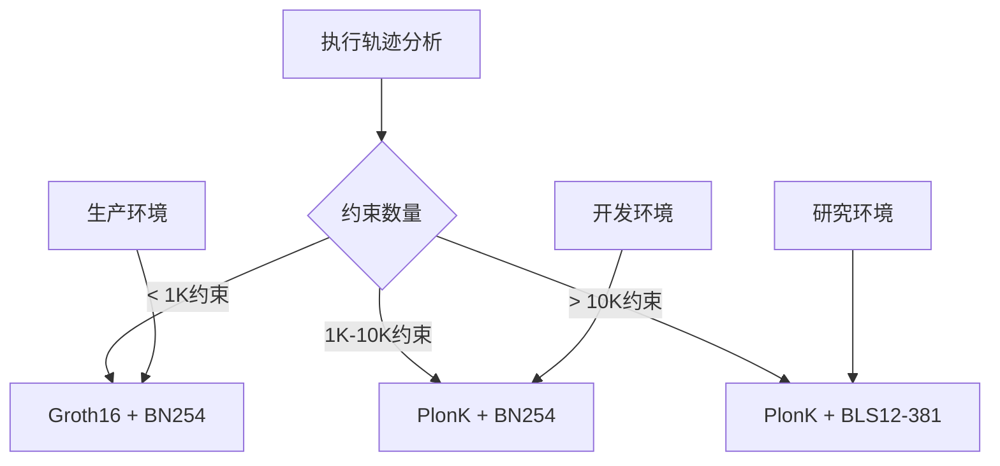
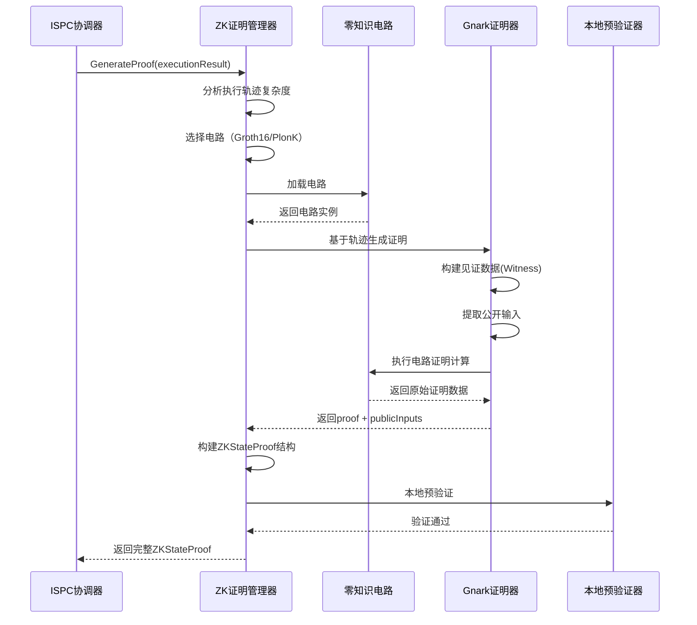
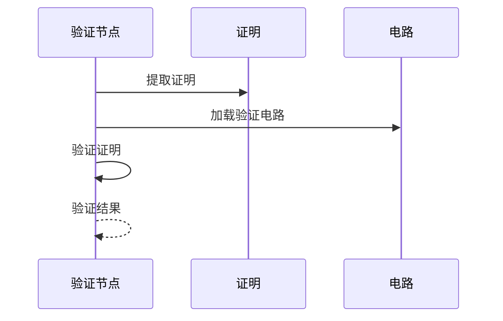

# 隐私与证明

---

## 概述

WES 通过零知识证明（ZK Proof）技术实现可验证计算，在保护隐私的同时保证计算的正确性。

**核心职责**：
- 生成计算正确性证明
- 验证证明的有效性
- 保护计算过程的隐私

---

## 零知识证明基础

### 什么是零知识证明？

零知识证明允许证明者向验证者证明某个陈述是真的，而不泄露任何额外信息。

**三个性质**：
- **完备性**：如果陈述为真，诚实的证明者可以说服验证者
- **可靠性**：如果陈述为假，欺骗的证明者无法说服验证者
- **零知识性**：验证者除了陈述为真外，不获得任何额外信息

### 在 WES 中的应用

在 ISPC 中，零知识证明用于：
- 证明计算过程正确执行
- 证明输入输出关系正确
- 验证节点无需重新执行即可验证

### 证明方案

WES 支持两种零知识证明方案：

**1. Groth16**
- **特点**：高效、证明小、验证快
- **适用场景**：约束数量 < 1K 的简单电路
- **性能**：生成时间 100-500ms，证明大小 ~256B，验证时间 < 5ms

**2. PlonK**
- **特点**：通用、灵活、支持更大规模电路
- **适用场景**：约束数量 1K-10K 的中等电路，或 > 10K 的复杂电路
- **性能**：
  - 中等（1K-10K 约束）：生成时间 1-5s，证明大小 ~512B，验证时间 < 20ms
  - 复杂（> 10K 约束）：生成时间 5-30s，证明大小 ~1KB，验证时间 < 50ms

**电路选择策略**：

> **实现层定义**：证明方案和电路选择的详细实现见 [`internal/core/ispc/zkproof/README.md`](../../../internal/core/ispc/zkproof/README.md)。

---

## 证明生成

### ZKStateProof 结构

ISPC 生成的证明映射到 `ZKStateProof` 结构，包含以下字段：

**核心字段**：
- `proof`：证明数据（Groth16 或 PlonK 格式）
- `public_inputs`：公开输入数组（状态哈希等）
- `proving_scheme`：证明方案（"groth16" 或 "plonk"）
- `curve`：椭圆曲线（"bn254" 或 "bls12-381"）
- `verification_key_hash`：验证密钥哈希

**电路信息**：
- `circuit_id`：电路标识（如 "contract_execution.v1"）
- `circuit_version`：电路版本
- `circuit_commitment`：电路承诺（可选）

**性能信息**：
- `constraint_count`：约束数量
- `proof_generation_time_ms`：证明生成时间（毫秒）

**业务扩展**：
- `custom_attributes`：自定义属性映射

### 生成流程

### Manager 职责边界

**ZK 证明管理器（Manager）职责**：
- ✅ 零知识证明生成：基于执行轨迹自动生成可验证的零知识证明
- ✅ ZKStateProof 构建：构建符合 transaction.proto 规范的 ZKStateProof 结构
- ✅ 电路管理：管理 Groth16、PlonK 等不同类型的零知识电路
- ✅ 本地预验证：生成后进行本地预验证，确保证明格式正确

**网络验证职责**（非 Manager 职责）：
- 验证节点验证：接收 StateOutput.zk_proof 并验证 ZKStateProof
- 网络共识验证：参与网络共识，确认计算正确性
- 区块确认验证：区块确认后的最终验证

> **实现层定义**：ZK 证明管理器的详细职责和边界见 [`internal/core/ispc/zkproof/README.md`](../../../internal/core/ispc/zkproof/README.md)。

---

## 证明验证

### 验证流程

### 验证效率

**性能指标**：

| 电路类型 | 约束数量 | 生成时间 | 证明大小 | 验证时间 |
|---------|---------|---------|---------|---------|
| **简单 Groth16** | < 1K | 100-500ms | ~256B | < 5ms |
| **中等 PlonK** | 1K-10K | 1-5s | ~512B | < 20ms |
| **复杂 PlonK** | > 10K | 5-30s | ~1KB | < 50ms |

**关键优势**：
- **验证时间**：毫秒级（远快于重新执行）
- **验证复杂度**：与证明大小相关，与计算复杂度无关
- **单次执行+多点验证**：业务逻辑仅在执行节点运行一次，验证节点仅需验证证明，比重复执行快 100-1000 倍

---

## 隐私保护

### 计算隐私

- 验证者不知道具体的计算过程
- 只能验证结果正确，无法获取中间状态

### 数据隐私

- 输入数据可以保持私密
- 只公开必要的输出

### 应用场景

- **隐私交易**：金额和参与方保密
- **隐私计算**：商业逻辑保密
- **隐私 AI**：模型参数和数据保密

---

## 配置说明

| 参数 | 类型 | 默认值 | 说明 |
|------|------|--------|------|
| `proof_level` | string | "standard" | 证明级别 |
| `proof_timeout` | duration | 30s | 证明生成超时 |
| `verify_timeout` | duration | 1s | 证明验证超时 |

---

## 相关文档

- [ISPC 本征自证计算](./ispc.md) - 可验证计算核心
- [交易模型](./transaction.md) - 证明在交易中的位置

### 内部设计文档

- [`_dev/01-协议规范-specs/07-隐私与证明协议-privacy-and-proof/`](../../../_dev/01-协议规范-specs/07-隐私与证明协议-privacy-and-proof/) - 隐私与证明协议规范
- [`internal/core/ispc/zkproof/README.md`](../../../internal/core/ispc/zkproof/README.md) - ZK 证明管理器实现架构

