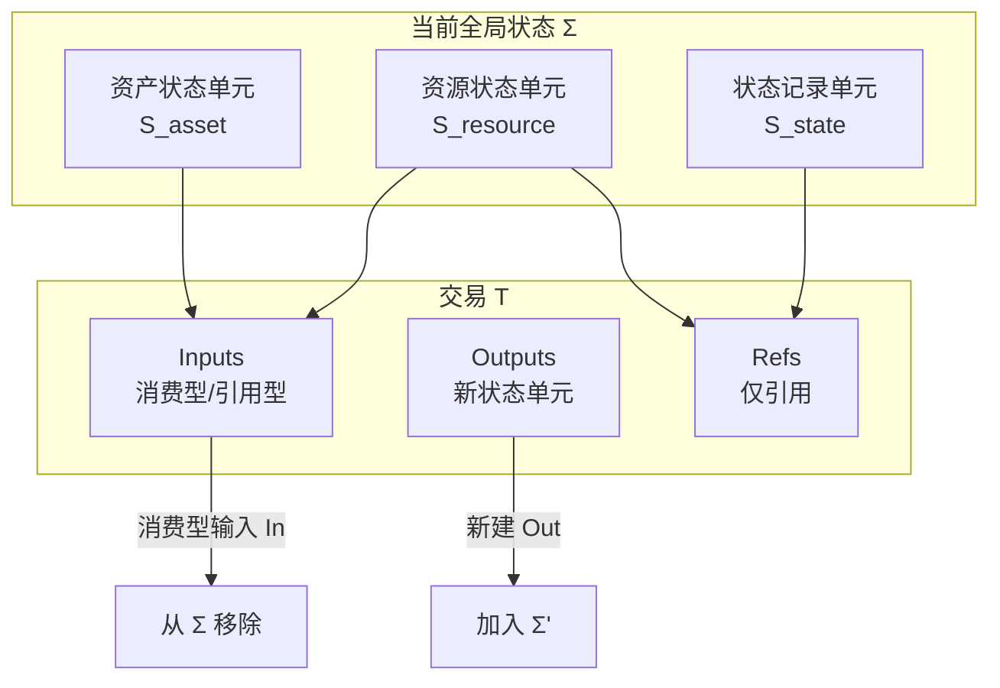
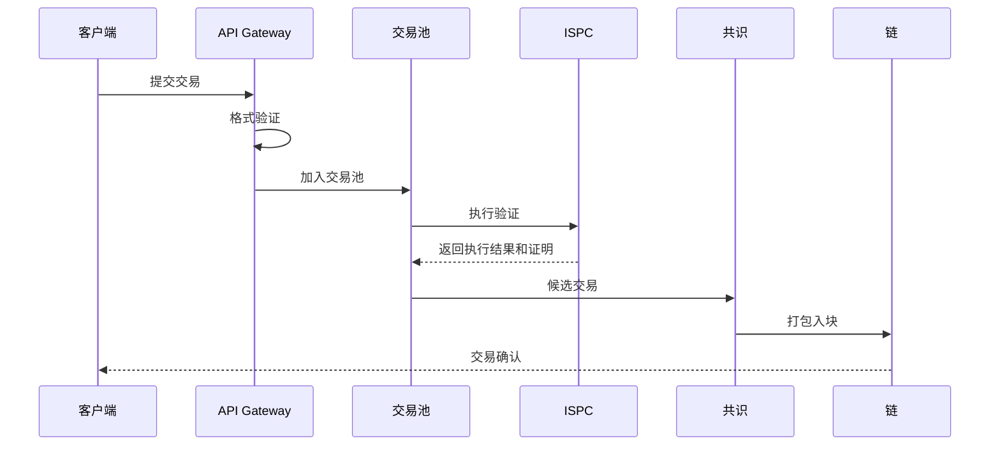

# 交易模型

---

## 概述

交易（Transaction）是 WES 系统中状态变更的基本单元，定义了输入、输出和执行逻辑。

**核心职责**：
- 定义状态变更的输入和输出
- 触发 ISPC 执行
- 记录不可篡改的操作历史

---

## 交易作为状态转换函数

### 协议层抽象

在协议层，一笔交易 `T` 可视为在给定全局状态 `Σ` 上的一次状态转换：

```
apply : (Σ, T) → Σ' 或 error
```

**交易对状态集合的作用**：

在抽象层面，一笔交易 `T` 的作用可以视为：

- 从当前全局状态 `Σ` 中选取有限集合 `In ⊆ Σ` 作为**输入**（消费型）
- 创建有限集合 `Out ⊆ S` 作为**输出**（新状态单元）
- 选取有限集合 `Ref ⊆ S` 作为**引用集**（仅读取，不改变可用性）

若交易被协议视为"有效并被执行"，则新的全局状态为：

```
Σ' = (Σ \ In) ∪ Out
```

**交易对状态三层的作用示意**：



> **协议层定义**：交易协议只关心状态是否足够、权限是否满足、价值与资源相关公理是否被满足、上下文是否匹配。本规范不为任何特定业务场景赋予独立语义。详见 [`_dev/01-协议规范-specs/02-交易协议-transaction/TRANSACTION_PROTOCOL_SPEC.md`](../../../_dev/01-协议规范-specs/02-交易协议-transaction/TRANSACTION_PROTOCOL_SPEC.md) §2。

## 交易结构

### 基本结构

```
Transaction
├── TxID          # 交易唯一标识
├── Version       # 版本号
├── Inputs        # 输入列表
│   ├── UTXORef   # UTXO 引用
│   ├── IsReference # 是否为引用型输入
│   └── UnlockProof # 解锁证明
├── Outputs       # 输出列表
│   ├── AssetOutput    # 资产输出
│   ├── ResourceOutput # 资源输出
│   └── StateOutput    # 状态输出
├── Execution     # 执行信息
│   ├── ContractRef    # 合约引用
│   ├── Method         # 方法名
│   └── Parameters     # 参数
├── Proof         # ZK 证明
└── Metadata      # 元数据
```

### 输入类型

#### 消费型输入（In）

- 状态单元被消费后不可再使用
- 计入价值守恒计算
- 用于资产转移

#### 引用型输入（Ref）

- 状态单元被引用但不消费
- 不计入价值守恒计算
- 用于读取共享数据（如合约、配置）

### 输出类型

详见 [EUTXO 模型](./eutxo.md) 中的三层输出架构。

---

## 交易生命周期（协议层抽象）

从协议层抽象描述，一笔交易的一生包括：

### 1. 构造阶段

- 交易发起方在本地根据当前已知的状态集合，构造交易草稿 `T_draft`
- 草稿可以在见证或部分字段上暂时不完整，但在广播前必须补齐所有必要信息

### 2. 本地验证

- 在任何交易被广播前，实现必须在本地执行协议级验证：
  - 结构完整性
  - 授权合法性
  - 价值守恒与资源约束
  - 无冲突消费（在本地已知交易集的前提下）
  - 上下文绑定正确性
- 未通过本地验证的交易不得被认为是"候选交易"，不应被广播

### 3. 广播与暂存

- 节点接收到外部交易后，应执行与本地发起相同的验证流程
- 对于暂时与其他未确认交易存在资源竞争或输入冲突的交易，实现可以根据策略做优先级排序或暂存

### 4. 打包与确认

- 共识与区块协议选择一组通过验证的交易，将其排序并打包到区块中
- 一旦某个区块及其包含的交易在某条链上达成足够的共识确认，其对全局状态的改变即被视为最终生效

> **协议层边界**：交易协议定义交易的有效性规则与状态转换语义。mempool、共识、链选择等属于实现层的流程与策略，不在交易协议规范中定义。详见 [`_dev/01-协议规范-specs/02-交易协议-transaction/TRANSACTION_PROTOCOL_SPEC.md`](../../../_dev/01-协议规范-specs/02-交易协议-transaction/TRANSACTION_PROTOCOL_SPEC.md) §6。

**实现层流程示意**（仅供参考，非协议要求）：



---

## 交易验证

### 格式验证

- 交易结构完整
- 字段格式正确
- 签名有效

### 状态验证

- 输入 UTXO 存在且未消费
- 输入 UTXO 可被解锁
- 价值守恒（消费型输入）

### 执行验证

- ISPC 执行成功
- ZK 证明有效
- 输出正确生成

---

## 交易构建

### 使用 TxBuilder

```go
builder := tx.NewTxBuilder()

// 添加输入
builder.AddInput(utxoRef, false)  // 消费型
builder.AddInput(contractRef, true)  // 引用型

// 设置执行
builder.SetExecution(contractHash, "transfer", params)

// 添加输出
builder.AddAssetOutput(toAddress, amount, lock)
builder.AddStateOutput(stateData)

// 构建交易
tx, err := builder.Build()
```

### 签名交易

```go
// 使用钱包签名
signedTx, err := wallet.SignTransaction(tx)

// 或手动签名
signature := crypto.Sign(privateKey, tx.Hash())
tx.SetSignature(signature)
```

---

## 配置说明

| 参数 | 类型 | 默认值 | 说明 |
|------|------|--------|------|
| `max_tx_size` | int | 1MB | 最大交易大小 |
| `max_inputs` | int | 100 | 最大输入数量 |
| `max_outputs` | int | 100 | 最大输出数量 |
| `tx_timeout` | duration | 1h | 交易超时时间 |

---

## 相关文档

- [EUTXO 模型](./eutxo.md) - 输入输出模型
- [ISPC 本征自证计算](./ispc.md) - 执行验证
- [区块模型](./block.md) - 交易打包

### 内部设计文档

- [`_dev/01-协议规范-specs/02-交易协议-transaction/`](../../../_dev/01-协议规范-specs/02-交易协议-transaction/) - 交易协议规范

