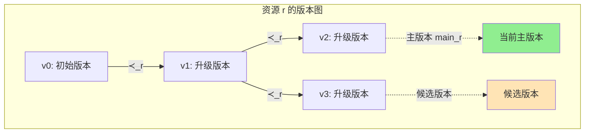
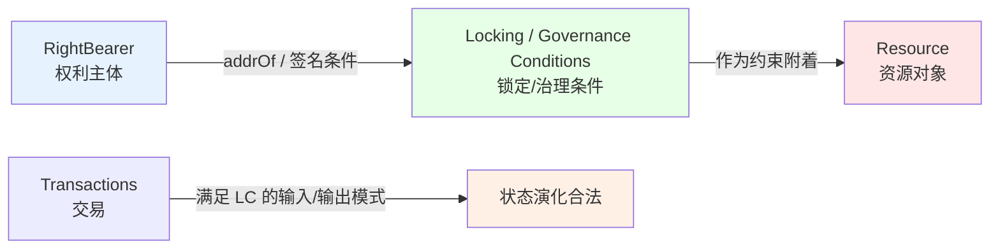
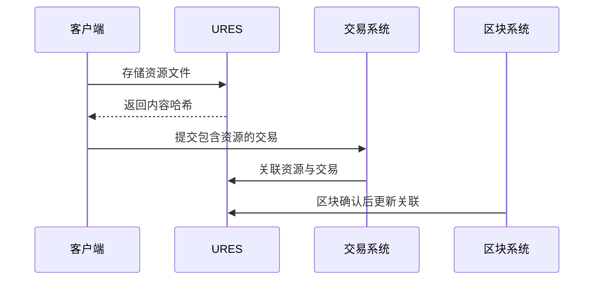

# URES 统一资源管理

---

## 概述

URES 是 WES 系统的资源管理核心，负责内容寻址存储，统一管理 WASM 合约、ONNX 模型、文件等资源。

**在三层模型中的位置**：账本层（Ledger Layer）

**核心理念**：基于内容寻址的统一资源管理，实现资源去重、环境无关性和高效分发，并通过权利主体与版本管理保障资源的安全使用与演化。

---

## 为什么需要 URES？

### 传统区块链的资源管理问题

1. **资源存储分散**
   - 合约、数据、文件存储方式不一致
   - 难以统一管理和查询

2. **重复存储**
   - 相同内容被多次存储
   - 存储空间浪费

3. **环境依赖**
   - 资源标识与环境相关
   - 跨节点同步复杂

### URES 的解决方案

1. **统一管理**
   - 所有资源使用相同的存储和查询接口
   - 统一的资源生命周期管理

2. **内容寻址**
   - 基于内容哈希的唯一标识
   - 自动去重，节省存储

3. **环境无关**
   - 相同内容在不同环境产生相同哈希
   - 简化跨节点同步

---

## 核心能力

### 1. 内容寻址存储

**原理**：
- 使用 SHA-256 计算资源内容的哈希值
- 哈希值作为资源的唯一标识
- 相同内容产生相同哈希

**优势**：
- **自动去重**：相同内容只存储一次
- **环境无关**：不依赖路径或名称
- **完整性验证**：哈希即校验和

```
资源内容 → SHA-256 → 内容哈希 → 存储/查询
```

---

### 2. 统一资源管理

URES 管理两类资源：

#### 静态资源（STATIC）

**特点**：
- 不可执行
- 用于存储数据

**类型**：
- 文件
- 图片
- 配置数据
- 任意二进制数据

#### 可执行资源（EXECUTABLE）

**特点**：
- 可被 ISPC 执行
- 需要特定的运行时

**类型**：
- `CONTRACT`：通用智能合约（WASM）
- `MODEL`：AI/ML 模型（ONNX）
- 其他可执行格式

> **协议层定义**：资源分类遵循 `ResourceCategory`（`EXECUTABLE` / `STATIC`）和 `ExecutableKind`（`CONTRACT` / `MODEL`）的层次结构。详见 [`_dev/01-协议规范-specs/01-状态与资源模型协议-state-and-resource/RESOURCE_MODEL_PROTOCOL_SPEC.md`](../../../_dev/01-协议规范-specs/01-状态与资源模型协议-state-and-resource/RESOURCE_MODEL_PROTOCOL_SPEC.md)。

---

### 3. 资源查询

**查询能力**：
- 按内容哈希查询资源
- 查询资源元信息
- 检查资源文件存在性

**元信息**：
- 资源类型
- 资源大小
- 创建时间
- 关联的交易/区块

---

### 4. 资源版本管理

资源对象在链上通过**版本图（Version Graph）**进行演化管理：

**版本图结构**：
- 每个资源对象 `r` 关联一组资源层状态单元 `S_r`
- 这些状态单元通过有向无环前序关系 `≺_r` 构成版本图
- `s1 ≺_r s2` 表示版本 `s2` 由版本 `s1` 直接演化而来

**主版本选择**：
- 在任意时刻，每个资源对象至多有一个**主版本**（`main_r(t)`）
- 主版本选择函数确保版本链的连贯性：任一版本必须能追溯到初始版本

**版本图示意**：



**版本管理约束**：
- **主版本唯一性**：任意时刻至多一个主版本
- **版本链连贯性**：所有版本必须能追溯到初始版本
- **标识稳定性**：同一资源的所有版本共享同一资源身份

> **协议层定义**：资源唯一性公理要求版本图必须是有向无环图（DAG），且主版本选择函数必须满足确定性。详见 [`_dev/01-协议规范-specs/01-状态与资源模型协议-state-and-resource/RESOURCE_MODEL_PROTOCOL_SPEC.md`](../../../_dev/01-协议规范-specs/01-状态与资源模型协议-state-and-resource/RESOURCE_MODEL_PROTOCOL_SPEC.md) §4。

### 5. 权利主体与资源绑定

**权利主体（RightBearer）**：
- 在协议视角下，对某些资源拥有特定权利的抽象"控制权载体"
- 通过可验证的链上条件（地址、脚本、签名条件）体现
- 不等同于现实世界的个人/组织，而是密码学控制关系的抽象

**三种基础权利类型**：

1. **所有权（Ownership）**：对资源对象具有最终处置权
2. **使用权（Usage）**：在给定条件下使用资源的权利
3. **管理权（Management）**：调整使用条件、分配使用权等的权利

**权利绑定关系**：



**权利约束**：
- 任一资源对象**必须**至少与一类权利主体集合关联
- 不允许出现相互冲突的所有权分配
- 所有权利关系**必须**以可验证条件的形式落地到状态与交易中
- 授权与收回必须可归因到特定权利主体，并符合权限约束

**引用安全公理**：
- 当某状态单元 `s` 引用资源对象 `r` 时，在 `s` 创建时必须存在与 `r` 关联且有效的资源层状态单元
- 对 `r` 的后续演化不会悄然改变 `s` 所指代的语义，除非 `s` 明确声明接受这种变化
- 若状态单元绑定到具体资源版本，则该绑定在其生命周期内不得被外部状态单方面改写

> **协议层定义**：权利主体与资源绑定遵循资源引用安全公理，确保资源引用的确定性与安全性。详见 [`_dev/01-协议规范-specs/01-状态与资源模型协议-state-and-resource/RESOURCE_MODEL_PROTOCOL_SPEC.md`](../../../_dev/01-协议规范-specs/01-状态与资源模型协议-state-and-resource/RESOURCE_MODEL_PROTOCOL_SPEC.md) §3、§5。

### 6. 资源关联

**关联流程**：



**关联信息**：
- 关联的交易哈希
- 关联的区块哈希（确认后）
- 部署者地址

---

## 接口能力

### ResourceWriter（资源写入器）

**能力**：
- `StoreResourceFile()` - 存储资源文件
- `LinkResourceToTransaction()` - 关联资源与交易

**约束**：
- 存储操作是原子的
- 自动去重检查
- 返回内容哈希

### ResourceQuery（资源查询器）

**能力**：
- `GetResourceFromBlockchain()` - 从区块链查询资源
- `GetResourceFile()` - 获取资源文件
- `CheckResourceFileExists()` - 检查资源文件存在性

**约束**：
- 查询是只读操作
- 文件可能需要从其他节点同步

---

## 配置说明

| 参数 | 类型 | 默认值 | 说明 |
|------|------|--------|------|
| `max_resource_size` | int | 100MB | 最大资源大小 |
| `enable_deduplication` | bool | true | 启用去重 |
| `storage_path` | string | "./storage" | 存储路径 |

---

## 使用约束

### 资源存储约束

1. **大小约束**：
   - 资源大小不能超过 `max_resource_size`
   - 大资源需要分块存储

2. **格式约束**：
   - 资源内容必须可验证
   - 资源哈希必须正确

3. **去重约束**：
   - 相同内容自动去重
   - 已存在的资源直接返回哈希

### 资源查询约束

1. **存在性约束**：
   - 资源必须存在
   - 资源元信息必须完整

2. **文件约束**：
   - 文件可能不在本地
   - 需要从其他节点同步

### 资源版本约束

1. **版本图约束**：
   - 版本图必须是有向无环图（DAG）
   - 所有版本必须能追溯到初始版本
   - 主版本选择必须满足唯一性

2. **引用安全约束**：
   - 资源引用必须在创建时存在有效的资源层状态单元
   - 资源版本演化不得单方面改变已存在的引用语义
   - 版本绑定关系必须显式且可审计

### 权利主体约束

1. **权利分配约束**：
   - 任一资源必须至少与一类权利主体集合关联
   - 不允许出现相互冲突的所有权分配
   - 权利关系必须以可验证条件形式落地

2. **授权约束**：
   - 授权与收回必须可归因到特定权利主体
   - 执行主体需具备足够的管理权或所有权
   - 新权利状态必须可追溯到旧状态

---

## 典型使用场景

### 场景 1：合约部署

```go
// 存储 WASM 合约文件
writer := ures.NewResourceWriter()
hash, err := writer.StoreResourceFile("contract.wasm")
if err != nil {
    return err
}
// 使用 hash 创建 ResourceOutput
builder := tx.NewTxBuilder()
tx := builder.
    AddInput(assetUTXO, false).
    AddResourceOutput(hash, owner).
    Build()
```

### 场景 2：模型部署

```go
// 存储 ONNX 模型文件
writer := ures.NewResourceWriter()
hash, err := writer.StoreResourceFile("model.onnx")
if err != nil {
    return err
}
// 使用 hash 创建 ResourceOutput
```

### 场景 3：资源查询

```go
// 查询资源信息
query := ures.NewResourceQuery()
resource, err := query.GetResourceFromBlockchain(contentHash)
if err != nil {
    return err
}
// 检查资源类型
if resource.Type == "wasm" {
    // 处理 WASM 合约
}
```

---

## 与其他组件的关系

### 依赖关系

```
URES
  ├── 依赖 Storage（文件存储）
  ├── 被 EUTXO 依赖（ResourceOutput）
  └── 被 ISPC 依赖（加载资源执行）
```

### 与 EUTXO 的关系

- **URES**：管理资源的实际内容
- **EUTXO**：管理资源的所有权和引用关系

```
ResourceOutput (EUTXO)
    ↓
resource_hash → 内容哈希
    ↓
Resource Content (URES)
```

### 与 ISPC 的关系

- **URES**：提供资源内容
- **ISPC**：加载资源并执行

```
ISPC 执行请求
    ↓
从 URES 加载资源
    ↓
执行（WASM/ONNX）
```

---

## 相关文档

- [架构总览](./architecture-overview.md) - 了解系统架构
- [EUTXO 模型](./eutxo.md) - 了解状态管理
- [ISPC 本征自证计算](./ispc.md) - 了解可验证计算

### 内部设计文档

- [`_dev/01-协议规范-specs/01-状态与资源模型协议-state-and-resource/`](../../../_dev/01-协议规范-specs/01-状态与资源模型协议-state-and-resource/) - URES 协议规范
- [`_dev/02-架构设计-architecture/02-状态与资源架构-state-and-resource/`](../../../_dev/02-架构设计-architecture/02-状态与资源架构-state-and-resource/) - 资源架构设计

