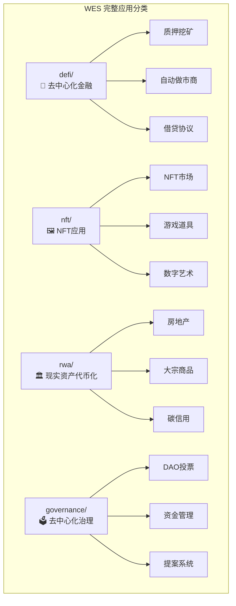

# 📱 完整应用示例（applications）

【模块定位】
　　**真实业务场景的完整应用** - 展示WES在实际业务中的应用方案。专注于提供生产级的完整应用示例，展示WES的实际价值和应用潜力。

【适用人群】
- 有一定WES基础的开发者
- 需要构建完整应用的项目团队
- 希望了解WES商业应用的决策者

【应用分类】

【应用目录】

| 分类 | 描述 | 复杂度 | 商业价值 |
|------|------|--------|----------|
| **[defi/](defi/)** | 去中心化金融应用集合 | 🔴 高 | ⭐⭐⭐⭐⭐ |
| **[nft/](nft/)** | NFT相关应用集合 | 🟡 中 | ⭐⭐⭐⭐ |
| **[rwa/](rwa/)** | 现实世界资产代币化 | 🔴 高 | ⭐⭐⭐⭐⭐ |
| **[governance/](governance/)** | 去中心化治理应用 | 🔴 高 | ⭐⭐⭐⭐ |

【应用特点】
- 🏢 **真实业务场景** - 基于实际商业需求设计
- 💼 **生产级质量** - 可直接用于生产环境
- 🔗 **完整集成** - 展示端到端的完整解决方案
- 📊 **性能优化** - 包含性能优化和最佳实践
- 🛡️ **安全考虑** - 内置安全机制和风险控制

【使用约束】
- ✅ **完整业务逻辑** - 包含完整的业务流程
- ✅ **生产级质量** - 代码质量达到生产标准
- ✅ **真实价值** - 解决实际商业问题
- ❌ **禁止简单示例** - 简单示例放在 basic/ 目录
- ❌ **禁止未完成项目** - 只包含完整可用的应用

---

**定位说明**: 本目录展示WES的商业应用价值，为企业级应用提供参考方案。
