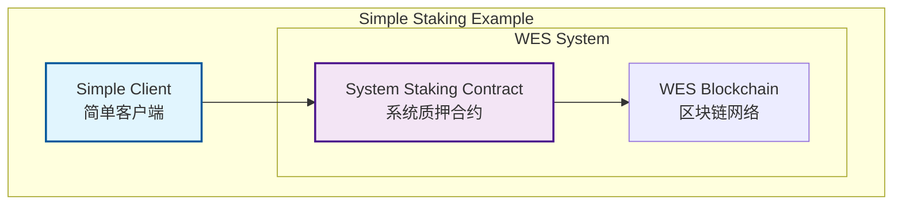

# 🏦 DeFi质押应用示例

【应用定位】
　　**简单的质押应用示例** - 展示如何与WES系统质押合约交互的基础示例。

【功能展示】



【示例内容】

| 文件 | 功能 | 说明 |
|------|------|------|
| **[staking_example.go](staking_example.go)** | 质押示例 | 展示基础质押操作 |
| **[scripts/demo.sh](scripts/demo.sh)** | 演示脚本 | 运行完整演示 |

【核心功能】

- 🔗 **质押代币** - 向系统质押合约质押代币
- 💰 **查询余额** - 查询质押余额和奖励
- 📤 **取消质押** - 从质押合约中取回代币
- 📊 **查询信息** - 获取质押状态和收益信息

【快速开始】

```bash
# 1. 运行演示
cd examples/applications/defi/staking
./scripts/demo.sh

# 2. 查看代码
cat staking_example.go
```

【代码特点】

- ✅ **架构正确** - 使用项目中真实的接口
- ✅ **简单易懂** - 不超过200行代码
- ✅ **功能完整** - 覆盖基础质押操作
- ✅ **注释详细** - 每个步骤都有清晰说明

---

**注意**: 本示例调用 `contracts/system/staking_contract.wasm` 系统质押合约，展示应用层如何与WES交互。