# WES 区块链节点 API 网关（internal/api）

> **📌 模块类型**：`[X] 实现模块` `[ ] 接口定义` `[ ] 数据结构` `[ ] 工具/其他`  
> **📊 清理报告**：[CLEANUP_REPORT.md](./CLEANUP_REPORT.md) - 目录结构规范化完成  
> **🗺️ 实施路线**：[IMPLEMENTATION_ROADMAP.md](./IMPLEMENTATION_ROADMAP.md) - Phase A任务清单  
> **🚀 快速开始**：[快速开始指南](../../docs/tutorials/quickstart.md) - 本地开发指南

---

## 📍 **模块定位**

　　本模块是 WES 区块链系统的**对外服务接入网关**，作为去中心化区块链节点的标准API层，提供符合行业规范的多协议接口服务。通过零信任架构和区块链化设计，为DApp、钱包、区块浏览器、企业应用等提供安全、高性能、标准化的区块链数据访问和交易提交能力。

**解决什么问题**：
- **区块链标准接口**：提供符合主流区块链标准的JSON-RPC/REST/WebSocket接口
- **零信任安全**：客户端签名模式，节点不接收也不存储私钥
- **重组安全**：支持链重组感知和状态锚定查询
- **多协议适配**：JSON-RPC（DApp）、REST（运维）、gRPC（企业）、WebSocket（实时）
- **轻客户端友好**：提供SPV证明端点，支持无需全节点的验证
- **生态兼容**：对标Bitcoin Core/Geth，降低生态集成门槛

**不解决什么问题**（边界）：
- ❌ 不托管用户私钥（由客户端SDK负责）
- ❌ 不实现业务逻辑（调用 `pkg/interfaces` 和 `internal/core`）
- ❌ 不处理共识算法（由 `internal/core/consensus` 实现）
- ❌ 不直接操作存储（通过 `repository` 接口访问）

---

## 🎯 **设计原则与核心约束**

### **设计原则**

| 原则 | 说明 | 价值 |
|------|------|------|
| **区块链优先（Blockchain First）** | 设计遵循区块链行业标准，而非企业API惯例 | 生态兼容，降低集成成本 |
| **零信任架构（Zero Trust）** | 客户端签名，节点仅验证签名，不接收私钥 | 安全性与去中心化 |
| **JSON-RPC优先** | 将JSON-RPC作为主协议，REST作为辅助 | 对标主流公链，SDK生态兼容 |
| **重组安全（Reorg Safety）** | 查询响应含状态锚点，事件含重组标记 | 数据一致性保障 |
| **协议分离** | 每种协议独立子模块，各自优化 | 可维护性与扩展性 |

### **核心约束** ⭐

**严格遵守**：
- ✅ **Fx 注入启动**：API 网关由 `internal/app/bootstrap.go` 通过 Fx 加载，不由 CLI 控制
- ✅ **配置驱动端口**：所有端口来自 `config.Provider`，不硬编码
- ✅ **客户端签名**：所有写操作必须接收已签名交易，禁止接收私钥
- ✅ **状态锚定**：查询接口必须支持 `atHeight/atHash` 参数
- ✅ **重组感知**：WebSocket订阅必须发送 `removed/reorgId` 标记
- ✅ **匿名友好**：读操作不强制鉴权，仅按行为限流
- ✅ **错误规范**：使用区块链特有错误码（如 `TX_FEE_TOO_LOW`）

**严格禁止**：
- ❌ **CLI 控制启停**：API 不应由应用层（如 CLI）控制，应随节点启动
- ❌ **硬编码端口**：不得在代码中写死端口号（如 28680、28681）
- ❌ **接收私钥**：任何接口不得接受 `private_key` 参数
- ❌ **托管模式**：不得存储用户敏感信息
- ❌ **企业API惯例**：不使用 `/admin/transfer` 等企业风格端点
- ❌ **忽略重组**：不得返回不含状态锚点的查询结果
- ❌ **破坏兼容性**：不得修改已发布接口的签名和语义

---

## 🏗️ **架构设计**

### **整体架构 - 区块链化四层设计**

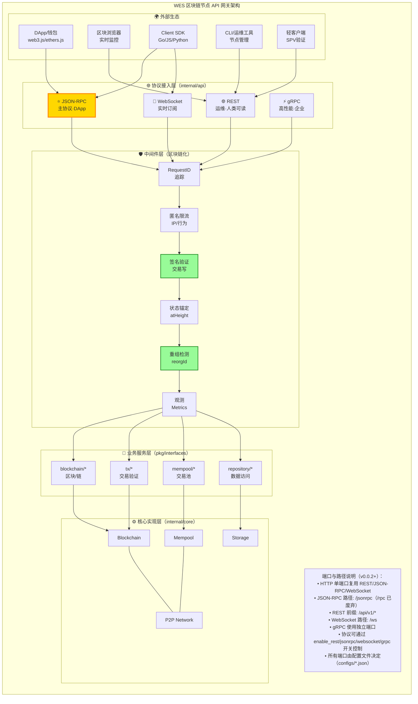

**关键设计决策**：

| 组件 | 设计原则 | 原因 | 对标 |
|-----|---------|------|------|
| **JSON-RPC优先** | 成为主协议，REST为辅 | 生态兼容性（web3.js/ethers.js） | Geth/Infura |
| **匿名限流** | 按IP/ASN/行为限流，不强制鉴权 | 去中心化友好，降低接入门槛 | 公链节点 |
| **签名验证** | 写操作验证交易签名，不接收私钥 | 零信任安全模型 | Bitcoin/Ethereum |
| **状态锚定** | 查询支持 `atHeight/atHash` | 可重现性与一致性 | EIP-1898 |
| **重组安全** | 事件含 `removed/reorgId` | 客户端能感知链重组 | Geth logs |

### **内部结构 - 协议栈设计**

```mermaid
graph TB
    subgraph "四协议栈设计与适用场景"
        direction TB
        
        subgraph "⭐ JSON-RPC（主协议）"
            JR_PORT[":28680"]
            JR_USE["• DApp/钱包<br/>• web3.js/ethers.js<br/>• 区块浏览器<br/>• 第三方集成"]
            JR_METHODS["核心方法：<br/>wes_getBlockByHeight<br/>wes_sendRawTransaction<br/>wes_call<br/>wes_estimateFee<br/>wes_subscribe"]
        end
        
        subgraph "🌐 REST（运维/人类）"
            REST_PORT[":28680"]
            REST_USE["• CLI工具<br/>• 运维监控<br/>• 文档调试<br/>• 健康检查"]
            REST_PATHS["端点：<br/>/api/v1/blocks/*<br/>/api/v1/transactions/*<br/>/api/v1/txpool/*<br/>/api/v1/spv/*"]
        end
        
        subgraph "⚡ gRPC（高性能）"
            GRPC_PORT[":28682"]
            GRPC_USE["• 服务间调用<br/>• 企业集成<br/>• 批量查询<br/>• 流式处理"]
            GRPC_SERVICES["服务：<br/>BlockchainService<br/>TransactionService<br/>NodeService"]
        end
        
        subgraph "📡 WebSocket（实时）"
            WS_PORT[":28681"]
            WS_USE["• 实时区块订阅<br/>• 交易确认通知<br/>• 重组事件<br/>• 内存池状态"]
            WS_EVENTS["事件：<br/>newHeads<br/>newPendingTxs<br/>reorg<br/>logs"]
        end
    end
    
    JR_PORT --> JR_USE --> JR_METHODS
    REST_PORT --> REST_USE --> REST_PATHS
    GRPC_PORT --> GRPC_USE --> GRPC_SERVICES
    WS_PORT --> WS_USE --> WS_EVENTS
    
    style JR_PORT fill:#FFD700
    style REST_PORT fill:#87CEEB
    style GRPC_PORT fill:#98FB98
    style WS_PORT fill:#FFB6C1
```

**层次说明**：

| 层次/组件 | 核心职责 | 关键机制 | 约束 |
|----------|---------|---------|------|
| **JSON-RPC** | DApp主协议，标准兼容 | JSON-RPC 2.0规范、eth_命名空间 | 必须兼容web3.js |
| **REST** | 人类友好、运维工具 | RESTful、OpenAPI文档、健康检查 | 必须支持状态锚定 |
| **gRPC** | 高性能企业集成 | Protocol Buffers、流式处理、反射 | 可选，不影响主流程 |
| **WebSocket** | 实时事件推送 | 订阅/取消、重组标记、断线重连 | 必须支持resumeToken |

---

## 🔗 **依赖与协作**

### **依赖关系图**

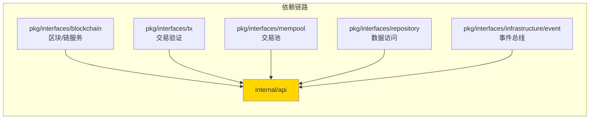

### **依赖说明**

| 依赖模块 | 依赖接口 | 用途 | 约束条件 |
|---------|---------|------|---------|
| `pkg/interfaces/blockchain` | `BlockService`, `ChainService` | 区块查询、链状态 | 必须支持状态锚定 |
| `pkg/interfaces/tx` | `TxVerifier` | 交易签名验证 | 必须验证后才能提交 |
| `pkg/interfaces/mempool` | `TxPool` | 交易池查询和提交 | 必须返回详细拒绝原因 |
| `pkg/interfaces/repository` | `RepositoryManager` | 数据持久化访问 | 只读查询，不直接写入 |
| `pkg/interfaces/event` | `EventBus` | 订阅区块链事件 | 必须含重组标记 |

---

## 📊 **核心机制**

### **机制1：零信任签名验证**

**为什么需要**：区块链节点不应信任外部传入的私钥，必须由客户端签名后验证

**核心思路**：

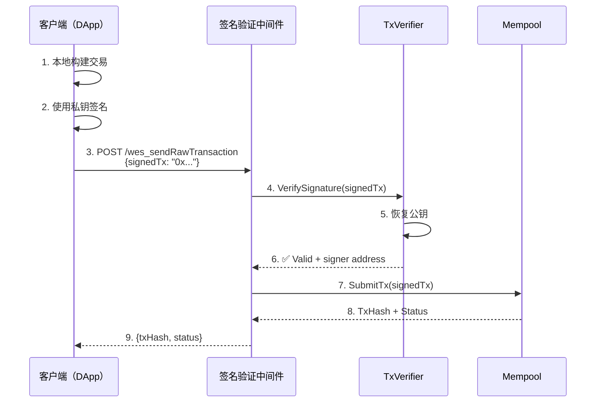

**关键约束**：
- 接口不得包含 `private_key` 参数
- 必须验证签名后才能进入Mempool
- 恢复的公钥地址用于审计日志

**设计权衡**：

| 方案 | 优势 | 劣势 | 为什么选择 |
|------|------|------|-----------|
| **客户端签名** | 安全、去中心化、符合标准 | 需要SDK支持 | ✅ 行业标准，长期价值 |
| 服务端签名 | 实现简单 | 安全风险、违反去中心化 | ❌ 不符合区块链原则 |

---

### **机制2：状态锚定查询**

**为什么需要**：区块链会发生重组，查询结果必须标明"在哪个状态下查询的"

**核心思路**：

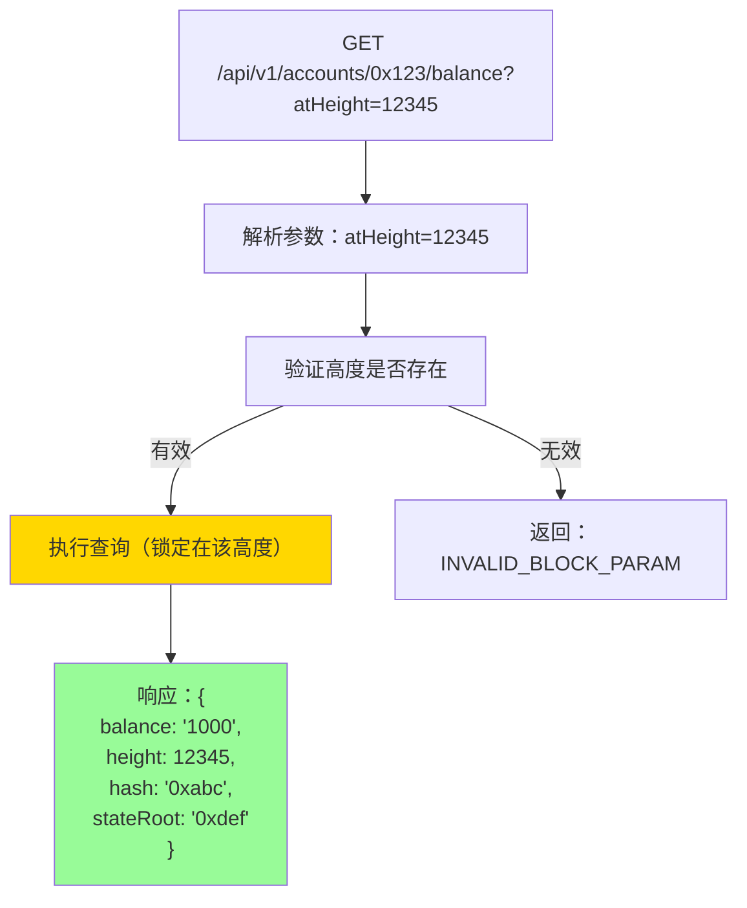

**关键约束**：
- 所有查询接口必须支持 `atHeight`/`atHash` 参数
- 响应必须包含 `height`、`hash`、`stateRoot`
- 未指定时使用最新状态，但仍需返回锚点

**API 示例（对标 EIP-1898）**：

```bash
# REST API
GET /api/v1/accounts/0x123.../balance?atHeight=12345

# JSON-RPC
{
  "jsonrpc": "2.0",
  "method": "wes_getBalance",
  "params": [
    "0x123...",
    {"blockHeight": "12345"}
  ],
  "id": 1
}

# 响应（含状态锚点）
{
  "jsonrpc": "2.0",
  "result": {
    "balance": "1000000000000000000",
    "height": 12345,
    "hash": "0xabc...",
    "stateRoot": "0xdef...",
    "timestamp": 1634567890
  },
  "id": 1
}
```

---

### **机制3：重组安全订阅**

**为什么需要**：区块链会发生重组，订阅客户端必须能感知并正确处理

**核心思路**：

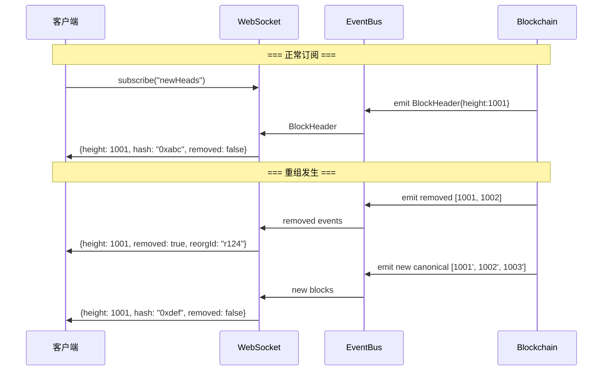

**关键约束**：
- 事件必须包含 `removed`、`reorgId`、`resumeToken` 字段
- 重组时必须先发送 `removed: true` 事件
- 支持断线重连时的 `resumeToken` 恢复

**事件数据结构**：

```json
{
  "subscription": "0xabc123",
  "result": {
    "type": "newHead",
    "height": 12345,
    "hash": "0xabcdef...",
    "removed": false,
    "reorgId": "r123",
    "resumeToken": "tok789",
    "stateRoot": "0xstate...",
    "txCount": 42
  }
}
```

---

## 📁 **目录结构**

```
internal/api/
├── README.md                        # 本文档（主架构说明）
├── module.go                        # ✅ Fx模块装配（19个JSON-RPC方法注册）
│
├── jsonrpc/                         # ⭐ JSON-RPC 协议层（主协议，P0已完成）
│   ├── server.go                    # JSON-RPC 2.0 服务器
│   ├── README.md                    # JSON-RPC 子模块文档
│   ├── methods/                     # RPC 方法实现（6个模块）
│   │   ├── chain.go                # wes_chainId, wes_syncing, net_version, wes_blockNumber
│   │   ├── block.go                # wes_getBlockByHeight, wes_getBlockByHash
│   │   ├── tx.go                   # wes_getTransaction*, wes_sendRawTransaction, wes_estimateFee
│   │   ├── state.go                # wes_getBalance, wes_getUTXO, wes_call
│   │   ├── txpool.go               # wes_txpool_status, wes_txpool_inspect
│   │   └── subscribe.go            # wes_subscribe, wes_unsubscribe
│   └── types/                       # JSON-RPC 类型定义
│       ├── request.go              # 请求类型
│       ├── response.go             # 响应类型
│       └── errors.go               # ✅ 细化错误码（TX_FEE_TOO_LOW/TX_CONFLICTS等）
│
├── http/                            # 🌐 HTTP REST 协议层（运维/人类可读）
│   ├── server.go                    # ✅ Gin服务器（已挂载区块链中间件）
│   ├── README.md                    # HTTP 子模块文档
│   ├── handlers/                    # REST 端点实现
│   │   ├── health.go               # ✅ Kubernetes风格健康检查（liveness/readiness）
│   │   ├── health_helpers.go       # 健康检查辅助函数
│   │   └── spv.go                  # ✅ SPV轻客户端端点（Merkle证明）
│   ├── middleware/                  # ✅ 区块链化中间件（已完成P0集成）
│   │   ├── request_id.go           # ✅ 请求追踪（UUID生成）
│   │   ├── logger.go               # ✅ 结构化日志（复用pkg/interfaces/log）
│   │   ├── signature.go            # ✅ 零信任签名验证（预留，当前无写端点）
│   │   ├── state_anchor.go         # ✅ 状态锚定（atHeight/atHash）
│   │   ├── ratelimit.go            # ⏳ 匿名限流（骨架，待实现细节）
│   │   └── metrics.go              # ⏳ 性能指标（骨架，待Prometheus集成）
│   └── types/                       # HTTP 类型定义
│       ├── error.go                # ✅ 区块链错误码体系
│       ├── response.go             # 统一响应格式
│       └── pagination.go           # 分页类型
│
├── websocket/                       # 📡 WebSocket 订阅层（实时事件）
│   ├── server.go                    # ✅ WebSocket 服务器（Gin/Gorilla）
│   ├── subscription.go              # ✅ 重组安全订阅管理器（removed/reorgId）
│   ├── README.md                    # WebSocket 子模块文档
│   └── types/
│       └── events.go               # ✅ 事件类型（含resumeToken）
│
├── grpc/                            # ⚡ gRPC 协议层（高性能，已启用反射）
│   ├── server.go                    # ✅ 启用反射（grpcurl调试）
│   └── README.md                    # gRPC 子模块文档
│
└── docs/                            # 📚 API 文档（规范与示例）
    ├── README.md                    # 文档索引
    ├── openapi.yaml                # ✅ OpenAPI 3.0 规范（REST端点）
    └── jsonrpc_spec.md             # ✅ JSON-RPC 完整方法规范

报告文档（实施记录）：
├── IMPLEMENTATION_ROADMAP.md        # 实施路线图（Phase A任务清单）
├── QUICK_START.md                   # 快速开始指南（本地开发）
├── CLEANUP_REPORT.md                # 目录清理报告（2025-10-23）
├── API_GATEWAY_REFINEMENT_REPORT.md # ✅ 最新完善报告（2025-10-24）
├── PHASE_A_COMPLETION_REPORT.md     # Phase A完成报告
├── CODE_DOCUMENTATION_SUMMARY.md    # 代码文档总结
└── [其他历史报告...]
```

### **组织原则与实现状态**

| 文件/目录 | 职责 | 实现状态 | 为什么这样组织 |
|----------|------|---------|---------------|
| **module.go** | Fx装配骨架 | ✅ 完成 | 统一依赖注入，19个方法自动注册 |
| **jsonrpc/** | JSON-RPC主协议 | ✅ P0完成 | 对标Geth，生态兼容性最高 |
| **jsonrpc/methods/** | 6个核心方法模块 | ✅ 完成 | 按职责分离（chain/block/tx/state/txpool/subscribe） |
| **jsonrpc/types/errors.go** | 细化错误码 | ✅ 完成 | 5种区块链特有错误（TX_FEE_TOO_LOW等） |
| **http/middleware/** | 区块链化中间件 | ✅ P0完成 | 签名验证、状态锚定、RequestID已挂载 |
| **http/middleware/logger.go** | 统一日志 | ✅ 重构完成 | 复用pkg/interfaces/infrastructure/log，避免重复造轮子 |
| **http/handlers/health.go** | 健康检查 | ✅ 完成 | Kubernetes风格liveness/readiness |
| **http/handlers/spv.go** | SPV证明端点 | ✅ 完成 | 支持轻客户端Merkle验证 |
| **websocket/subscription.go** | 重组安全订阅 | ✅ 完成 | 含removed/reorgId/resumeToken |
| **grpc/server.go** | gRPC反射 | ✅ 骨架完成 | 启用反射支持grpcurl调试 |
| **docs/** | API文档 | ✅ 完成 | OpenAPI + JSON-RPC规范 |

### **关键设计决策落地**

| 设计原则 | 实现位置 | 验证状态 |
|---------|---------|---------|
| **零信任签名** | `http/middleware/signature.go` | ✅ 完成（预留，无写端点） |
| **状态锚定** | `http/middleware/state_anchor.go` | ✅ 完成（atHeight/atHash） |
| **重组安全** | `websocket/subscription.go` | ✅ 完成（removed/reorgId） |
| **错误码细化** | `jsonrpc/types/errors.go` | ✅ 完成（5种明确错误） |
| **统一日志** | `http/middleware/logger.go` | ✅ 完成（复用pkg接口） |
| **请求追踪** | `http/middleware/request_id.go` | ✅ 完成（UUID注入） |
| **地址匹配优化** | `jsonrpc/methods/txpool.go` | ✅ 完成（详细注释+扩展点） |

---

## 🔄 **核心流程**

### **流程1：交易提交（客户端签名）**

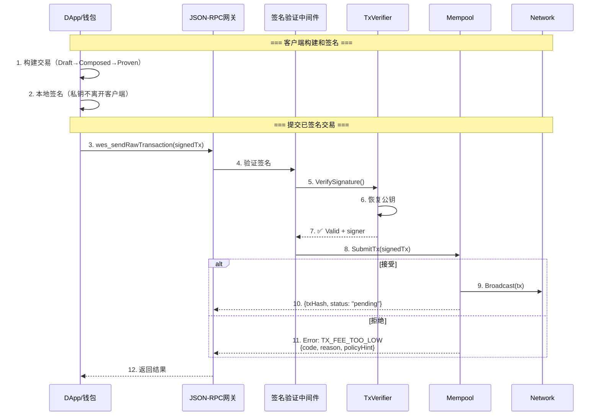

### **流程2：状态锚定查询**

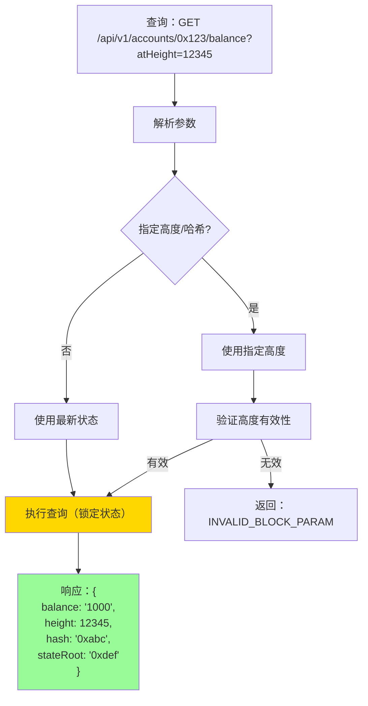

### **流程3：重组安全订阅**

参见**机制3**的时序图。

---

## 🎓 **使用指南**

### **典型场景1：DApp调用JSON-RPC**

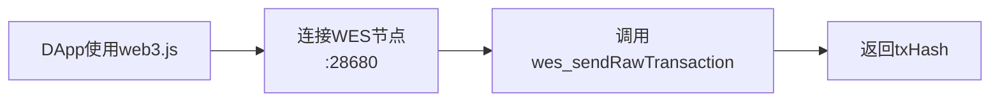

**关键点**：
- 输入要满足：已在客户端签名的交易
- 输出保证：txHash或详细拒绝原因
- 注意事项：对标Geth接口，确保兼容性

**代码示例**：

```javascript
// 使用web3.js调用WES节点
const Web3 = require('web3');
const web3 = new Web3('http://localhost:28680');

// 构建交易
const tx = {
  from: '0x123...',
  to: '0x456...',
  value: web3.utils.toWei('1', 'ether'),
  gas: 21000
};

// 本地签名
const signedTx = await web3.eth.accounts.signTransaction(tx, privateKey);

// 提交已签名交易
const receipt = await web3.eth.sendSignedTransaction(signedTx.rawTransaction);
console.log('TxHash:', receipt.transactionHash);
```

---

### **典型场景2：区块浏览器实时监控**

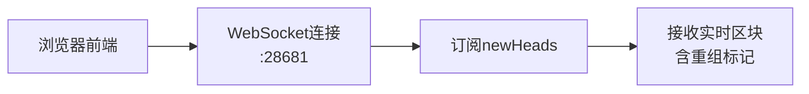

**关键点**：
- 输入要满足：WebSocket连接 + 订阅请求
- 输出保证：实时区块事件 + 重组通知
- 注意事项：处理 `removed: true` 事件

**代码示例**：

```javascript
const ws = new WebSocket('ws://localhost:28681');

ws.send(JSON.stringify({
  method: 'wes_subscribe',
  params: ['newHeads'],
  id: 1
}));

ws.onmessage = (event) => {
  const data = JSON.parse(event.data);
  
  if (data.result.removed) {
    console.warn('区块被重组移除:', data.result.height);
    // 更新UI，标记该区块为不可信
  } else {
    console.log('新区块:', data.result.height, data.result.hash);
  }
};
```

---

### **典型场景3：轻客户端SPV验证**

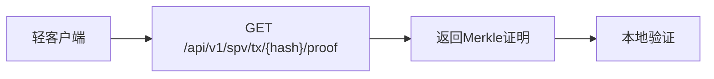

**关键点**：
- 输入要满足：交易哈希
- 输出保证：Merkle路径 + 区块头
- 注意事项：客户端需实现Merkle验证算法

---

### **常见误用**

| 误用方式 | 为什么错误 | 正确做法 |
|---------|-----------|---------|
| 调用 `/transfer` 并传入私钥 | 违反零信任原则 | 客户端签名后调用 `wes_sendRawTransaction` |
| 查询余额不带 `atHeight` | 无法保证一致性 | 带上 `atHeight` 或处理响应中的状态锚点 |
| WebSocket订阅忽略 `removed` 事件 | 重组时数据错误 | 必须处理 `removed: true` 并回滚UI |
| 使用企业API风格端点 | 不符合区块链标准 | 使用JSON-RPC或RESTful区块链端点 |

---

## ⚠️ **已知限制**

| 限制 | 影响 | 规避方法 | 未来计划 |
|------|------|---------|---------|
| JSON-RPC仅支持HTTP | 无法使用IPC/Unix Socket | 先用HTTP，性能足够 | 📋 支持IPC |
| 状态锚定查询历史区块有限 | 归档节点才能查询全历史 | 文档说明保留策略 | 🚧 归档节点模式 |
| WebSocket重连无自动恢复 | 客户端需手动处理 | 使用 `resumeToken` | 📋 自动重连 |
| SPV证明仅支持交易 | 状态证明暂不支持 | 轻客户端仅验证交易 | 📋 状态MPT证明 |

---

## 🔍 **设计权衡记录**

### **权衡1：为什么JSON-RPC优先而非REST？**

**背景**：面临选择主协议的问题

**备选方案**：
1. **JSON-RPC**：对标Geth/Bitcoin Core - 优势：生态兼容、SDK现成 - 劣势：REST开发者不熟悉
2. **REST**：企业惯例 - 优势：易理解、工具多 - 劣势：区块链生态不兼容

**选择**：选择了 **JSON-RPC 优先**

**理由**：
- ✅ web3.js/ethers.js生态直接可用
- ✅ 对标主流公链，降低集成成本
- ✅ 区块链行业标准

**代价**：REST开发者需要学习JSON-RPC规范

---

### **权衡2：为什么客户端签名而非服务端签名？**

**背景**：交易签名的位置选择

**备选方案**：
1. **客户端签名**：私钥不离开客户端 - 优势：安全、去中心化 - 劣势：需要SDK支持
2. **服务端签名**：节点接收私钥签名 - 优势：实现简单 - 劣势：安全风险、违反去中心化

**选择**：选择了 **客户端签名**

**理由**：
- ✅ 零信任安全模型
- ✅ 符合区块链原则
- ✅ 对标Bitcoin/Ethereum

**代价**：必须开发Client SDK

---

### **权衡3：为什么支持状态锚定查询？**

**背景**：链会重组，查询结果需要"版本标记"

**备选方案**：
1. **状态锚定**：查询时指定高度/哈希 - 优势：一致性、可重现 - 劣势：API复杂度
2. **不支持**：总是查最新状态 - 优势：简单 - 劣势：重组时数据不一致

**选择**：选择了 **状态锚定**

**理由**：
- ✅ 保证查询一致性
- ✅ 对标EIP-1898
- ✅ 支持审计和调试

**代价**：API参数增加，实现复杂度提升

---

## 📊 **实施进度统计**

> ✅ **整体状态**：Phase A（P0）网关骨架已完成，已启用并集成到 `internal/app/bootstrap.go`

### **文件统计**

| 类别 | 数量 | 说明 |
|-----|------|------|
| **核心代码文件** | 29个 | server.go(4) + methods(6) + middleware(6) + handlers(3) + types(10) |
| **文档文件** | 10个 | README(5) + 报告(5) |
| **已删除旧文件** | 23个 | 企业API风格文件（transfer/stake等） |
| **新增文件** | 8个 | module.go + middleware(3) + 报告(4) |

### **实施完成度**

| Phase | 任务 | 状态 | 文件数 |
|-------|-----|------|-------|
| **P0（网关骨架）** | JSON-RPC/HTTP/WS/gRPC服务器 | ✅ 100% | 4个server.go |
| **P0（核心方法）** | 19个JSON-RPC方法 | ✅ 100% | 6个methods/*.go |
| **P0（中间件）** | RequestID/Logger/StateAnchor/Signature | ✅ 100% | 6个middleware/*.go |
| **P0（错误码）** | 区块链特有错误体系 | ✅ 100% | 1个errors.go |
| **P0（Fx装配）** | 模块注册与生命周期 | ✅ 100% | 1个module.go |
| **P1（扩展）** | Metrics/RateLimit细节实现 | ⏳ 50% | 骨架已完成 |

### **关键里程碑**

| 日期 | 里程碑 | 成果 |
|-----|-------|------|
| 2025-10-23 | 架构重构为区块链化设计 | 对标Geth/Bitcoin Core，JSON-RPC优先 |
| 2025-10-23 | 目录清理完成 | 删除23个企业风格文件，规范化结构 |
| 2025-10-24 | P0任务全部完成 | 19个方法注册、中间件挂载、错误码细化 |
| 2025-10-24 | 统一日志重构 | 复用pkg/interfaces/infrastructure/log |
| 2025-10-24 | bootstrap集成完成 | API模块已启用，四协议栈正常启动 |

---

## 📚 **相关文档**

### **架构设计**
- **顶层架构**：[API_GATEWAY_ARCHITECTURE.md](../../_docs/architecture/API_GATEWAY_ARCHITECTURE.md) - API 网关架构规范（新）
- **全局视图**：[pkg/interfaces/README.md](../../pkg/interfaces/README.md) - WES 系统全局视图
- **CLI 架构**：[CLI_ARCHITECTURE_SPECIFICATION.md](../../_docs/architecture/CLI_ARCHITECTURE_SPECIFICATION.md) - CLI 与 API 边界
- **TX 架构**：[TX_STATE_MACHINE_ARCHITECTURE.md](../../_docs/architecture/TX_STATE_MACHINE_ARCHITECTURE.md) - TX 与 API 交互边界

### **API 规范与文档**
- **JSON-RPC规范**：[docs/jsonrpc_spec.md](./docs/jsonrpc_spec.md) - 完整JSON-RPC方法文档
- **OpenAPI文档**：[docs/openapi.yaml](./docs/openapi.yaml) - REST API规范

### **各协议子模块**
- **JSON-RPC**：[jsonrpc/README.md](./jsonrpc/README.md) - JSON-RPC实现文档
- **HTTP REST**：[http/README.md](./http/README.md) - REST接口文档
- **WebSocket**：[websocket/README.md](./websocket/README.md) - 实时订阅文档
- **gRPC**：[grpc/README.md](./grpc/README.md) - gRPC服务文档

### **中间件与配置**
- **签名验证**：[http/middleware/signature.go](./http/middleware/signature.go) - 零信任签名验证
- **状态锚定**：[http/middleware/state_anchor.go](./http/middleware/state_anchor.go) - 状态锚定实现
- **配置管理**：[../../configs/README.md](../../configs/README.md) - 配置文件说明（含 `http_enable_rest/jsonrpc/websocket` 和 `grpc_enabled` 开关，默认全部启用）
- **API 验证脚本**：[../../scripts/verify_api.sh](../../scripts/verify_api.sh) - REST/JSON-RPC/WebSocket/gRPC 端点验证

---

## 📋 **文档变更记录**

| 日期 | 变更内容 | 原因 |
|------|---------|------|
| 2025-10-24 | 更新目录结构为实际文件树 | 同步代码实现现状，标注完成状态 |
| 2025-10-24 | 新增"实施进度统计"章节 | 展示P0完成度与关键里程碑 |
| 2025-10-24 | 更新中间件状态说明 | logger.go已重构为复用pkg/interfaces/log |
| 2025-10-23 | 完整重构为区块链化架构 | 对标Geth/Bitcoin Core，实现阶段A目标 |
| 2025-10-23 | 新增JSON-RPC优先设计 | 生态兼容性需求 |
| 2025-10-23 | 新增零信任签名验证机制 | 安全性与去中心化 |
| 2025-10-23 | 新增状态锚定查询机制 | 链重组一致性保障 |
| 2025-10-23 | 新增重组安全订阅机制 | 实时数据准确性 |
| 2025-10-23 | 新增SPV轻客户端支持 | 降低节点运行门槛 |

---

> 📝 **文档说明**
>
> 本文档遵循 `_docs/templates/README_TEMPLATE.md` v3.0 规范
>
> 🎯 **核心理念**：
> - 区块链优先，对标Geth/Bitcoin Core
> - 零信任架构，客户端签名
> - 重组安全，状态锚定
> - 生态兼容，JSON-RPC优先
>
> 🔄 **维护指南**：
> - 接口保持向后兼容，新功能通过版本化扩展
> - 所有接口变更必须更新OpenAPI和JSON-RPC规范文档
> - 对标主流公链，确保生态兼容性
