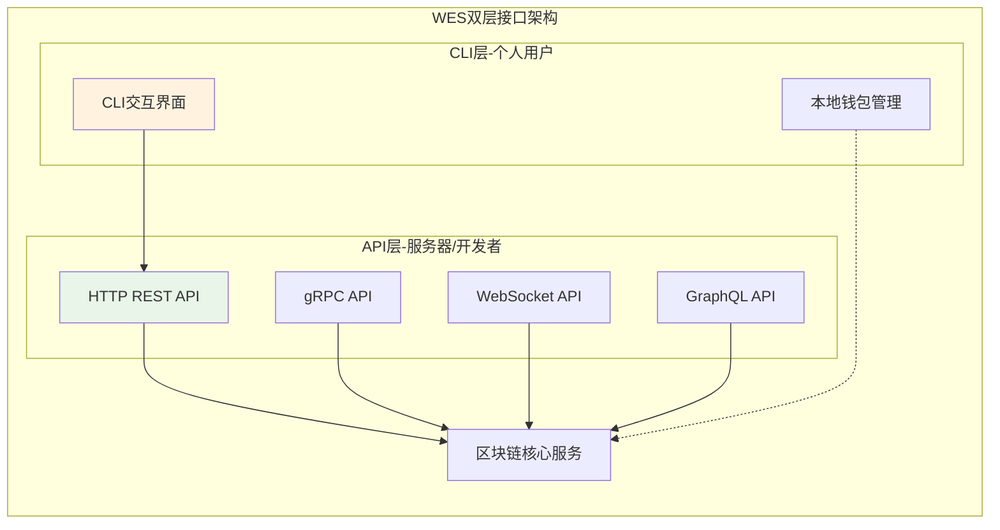
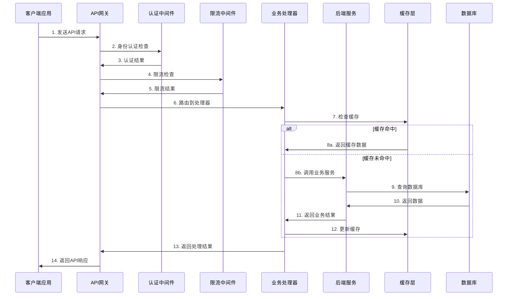
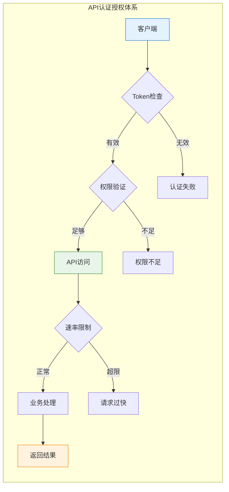
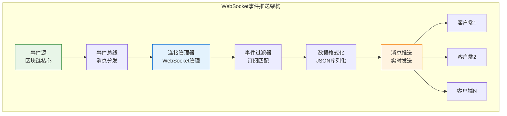
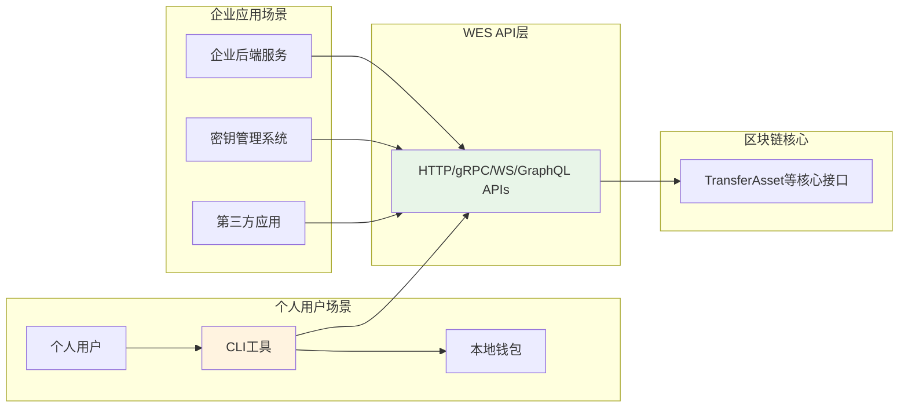
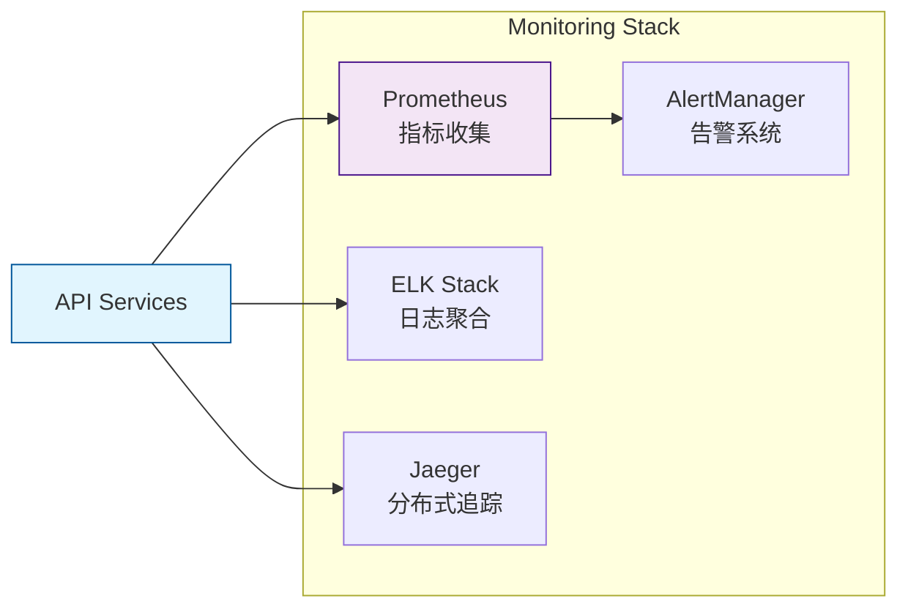
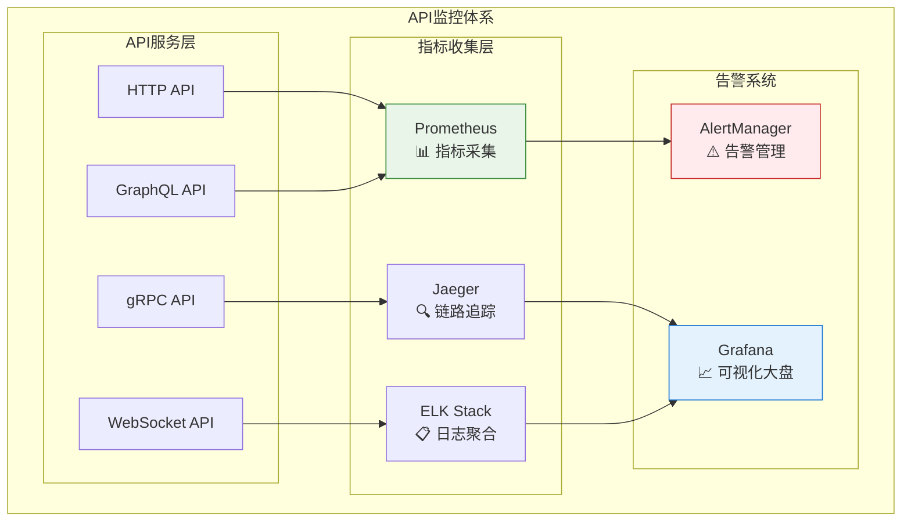
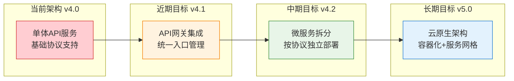

# API接口层（internal/api）

【模块定位】
　　本模块是WES系统中**面向服务器/开发者**的统一API接口层，负责提供多协议、多场景的区块链数据访问和操作接口。作为WES双层用户接口架构的核心组成部分，专注于为后端服务、企业应用、第三方集成提供高性能、无状态的区块链服务，确保接口的标准化、安全性和企业级可靠性。

【架构定位】


**设计理念**：
- **面向服务器/开发者**：专为后端集成和企业应用设计
- **私钥传入模式**：接收任何来源的私钥（托管的、代理的、临时传入的）
- **无状态设计**：不存储用户敏感信息，即用即消
- **协议多样化**：支持多种通信协议，满足不同技术栈需求

【设计原则】
- **协议多样化**：支持gRPC、HTTP、WebSocket、GraphQL等多种通信协议，满足不同应用场景和技术栈需求
- **接口标准化**：严格遵循RESTful设计规范和行业最佳实践，确保API的一致性和可预测性
- **性能优先**：采用高效的数据处理和缓存机制，确保低延迟和高吞吐量的接口响应
- **安全可靠**：实现完善的认证、授权、限流和防护机制，保障系统和数据安全
- **向后兼容**：通过版本化管理和渐进式升级策略，确保API版本间的兼容性和平滑迁移

【核心职责】
1. **多协议支持**：提供gRPC、HTTP、WebSocket、GraphQL等接口
2. **数据查询**：区块、交易、账户、合约等数据的查询服务
3. **交易处理**：交易提交、验证和状态跟踪
4. **实时推送**：区块链事件的实时通知服务
5. **认证授权**：API访问的安全控制和权限管理
6. **监控统计**：API使用情况的监控和分析

【实现架构】

　　采用**多协议网关**的四层分离架构，确保API服务的高性能、高可用和易扩展性。

```mermaid
graph TB
    subgraph "API多协议网关架构设计"
        subgraph "网关接入层"
            GATEWAY[\"API网关<br/>🌐 统一接入点"]
            LOAD_BALANCER[\"负载均衡器<br/>⚖️ 流量分发"]
        end
        
        subgraph "协议服务层"
            HTTP_SERVER[\"HTTP服务器<br/>🌐 RESTful API"]
            GRPC_SERVER[\"gRPC服务器<br/>⚡ 高性能RPC"]
            WS_SERVER[\"WebSocket服务器<br/>📡 实时通信"]
            GQL_SERVER[\"GraphQL服务器<br/>🔍 灵活查询"]
        end
        
        subgraph "处理器层"
            HTTP_HANDLERS[\"HTTP处理器<br/>📝 业务逻辑处理"]
            GRPC_HANDLERS[\"gRPC处理器<br/>🔧 服务接口实现"]
            WS_HANDLERS[\"WebSocket处理器<br/>📨 事件推送处理"]
            GQL_RESOLVERS[\"GraphQL解析器<br/>🔀 数据查询解析"]
        end
        
        subgraph "中间件层"
            AUTH[\"身份认证<br/>🔐 Authentication"]
            RATE_LIMIT[\"限流控制<br/>🚦 Rate Limiting"] 
            LOGGING[\"日志记录<br/>📋 Request Logging"]
            METRICS[\"指标监控<br/>📊 Performance Metrics"]
            CACHE[\"响应缓存<br/>💾 Response Cache"]
        end
        
        subgraph "业务服务层"
            BLOCKCHAIN[\"区块链服务<br/>⛓️ 链数据管理"]
            TX_SERVICE[\"交易服务<br/>💸 交易处理"]
            ACCOUNT[\"账户服务<br/>👤 账户管理"]
            CONTRACT[\"合约服务<br/>📋 智能合约"]
        end
    end
    
    GATEWAY --> LOAD_BALANCER
    LOAD_BALANCER --> HTTP_SERVER
    LOAD_BALANCER --> GRPC_SERVER  
    LOAD_BALANCER --> WS_SERVER
    LOAD_BALANCER --> GQL_SERVER
    
    HTTP_SERVER --> HTTP_HANDLERS
    GRPC_SERVER --> GRPC_HANDLERS
    WS_SERVER --> WS_HANDLERS  
    GQL_SERVER --> GQL_RESOLVERS
    
    HTTP_HANDLERS --> AUTH
    GRPC_HANDLERS --> RATE_LIMIT
    WS_HANDLERS --> LOGGING
    GQL_RESOLVERS --> METRICS
    
    AUTH --> CACHE
    RATE_LIMIT --> CACHE
    LOGGING --> CACHE
    METRICS --> CACHE
    
    CACHE --> BLOCKCHAIN
    CACHE --> TX_SERVICE
    CACHE --> ACCOUNT
    CACHE --> CONTRACT
    
    style GATEWAY fill:#e3f2fd,stroke:#1976d2,stroke-width:2px
    style AUTH fill:#f3e5f5,stroke:#7b1fa2,stroke-width:2px
    style BLOCKCHAIN fill:#e8f5e8,stroke:#388e3c,stroke-width:2px
```

【核心业务流程】

## ━━━━━━━━━━━━━━━━━━━━━━━━━━━━━━━━━━━━━━━━━━━━━━━━━━━━━━━━━━━━━━━━━━━━━━━━━━━━━━
## 🔄 API请求处理流程
## ━━━━━━━━━━━━━━━━━━━━━━━━━━━━━━━━━━━━━━━━━━━━━━━━━━━━━━━━━━━━━━━━━━━━━━━━━━━━━━



## ━━━━━━━━━━━━━━━━━━━━━━━━━━━━━━━━━━━━━━━━━━━━━━━━━━━━━━━━━━━━━━━━━━━━━━━━━━━━━━
## 🔐 认证授权流程  
## ━━━━━━━━━━━━━━━━━━━━━━━━━━━━━━━━━━━━━━━━━━━━━━━━━━━━━━━━━━━━━━━━━━━━━━━━━━━━━━



## ━━━━━━━━━━━━━━━━━━━━━━━━━━━━━━━━━━━━━━━━━━━━━━━━━━━━━━━━━━━━━━━━━━━━━━━━━━━━━━
## 📡 实时事件推送流程
## ━━━━━━━━━━━━━━━━━━━━━━━━━━━━━━━━━━━━━━━━━━━━━━━━━━━━━━━━━━━━━━━━━━━━━━━━━━━━━━



【模块组织】

　　采用**按协议分离**的清晰目录结构，每个协议子模块独立实现和维护：

```
internal/api/
├── docs/                    # API文档生成模块
│   ├── generator.go         # OpenAPI文档自动生成器  
│   └── README.md            # 文档生成工具说明
├── graphql/                 # GraphQL查询协议模块
│   ├── server.go            # GraphQL服务器实现
│   ├── schemas/             # GraphQL模式定义
│   ├── resolvers/           # 数据解析器实现
│   └── README.md            # GraphQL接口文档
├── grpc/                    # gRPC高性能协议模块  
│   ├── server.go            # gRPC服务器实现
│   ├── interceptors/        # gRPC拦截器(认证/日志)
│   ├── services/            # 业务服务实现  
│   └── README.md            # gRPC接口文档
├── http/                    # HTTP RESTful协议模块
│   ├── server.go            # HTTP服务器实现
│   ├── middleware.go        # HTTP中间件定义
│   ├── handlers/            # HTTP请求处理器
│   └── README.md            # HTTP接口文档  
├── websocket/               # WebSocket实时协议模块
│   ├── server.go            # WebSocket服务器实现
│   ├── connections/         # 连接管理
│   ├── events/              # 事件处理逻辑
│   └── README.md            # WebSocket接口文档
└── module.go                # fx依赖注入配置
```

**目录职责说明**：

| 子模块 | 核心职责 | 关键特性 | 适用场景 |
|--------|----------|----------|----------|
| **docs/** | 自动化文档生成 | OpenAPI规范、多格式导出 | API文档维护 |
| **http/** | RESTful Web服务 | 标准HTTP、JSON格式 | Web应用、第三方集成 |
| **grpc/** | 高性能RPC服务 | 二进制协议、类型安全 | 服务间通信、高频调用 |
| **websocket/** | 实时双向通信 | 事件推送、低延迟 | 实时监控、数据同步 |
| **graphql/** | 灵活数据查询 | 按需加载、单次请求 | 复杂查询、移动应用 |

## API协议支持

### 🚀 gRPC API - 高性能服务间通信
**适用场景**：服务间通信、后端集成、高频调用
- **Protocol Buffers**：强类型接口定义
- **高性能**：二进制协议，低延迟
- **流式处理**：支持双向流和长连接
- **代码生成**：自动生成多语言客户端

**核心服务**：
| 服务 | 功能描述 | 端口 |
|------|----------|------|
| `NodeService` | 节点管理和状态查询 | :9090 |
| `BlockchainService` | 区块链数据查询 | :9091 |
| `TransactionService` | 交易提交和跟踪 | :9092 |
| `ContractService` | 智能合约操作 | :9093 |

### 🌐 HTTP REST API - 标准Web接口
**适用场景**：Web应用、第三方集成、跨平台调用
- **RESTful设计**：标准HTTP方法和状态码
- **JSON格式**：通用数据交换格式
- **版本控制**：URL路径版本管理
- **OpenAPI文档**：自动生成接口文档

**核心端点**：
| 端点 | 方法 | 功能描述 |
|------|------|----------|
| `/v1/blocks` | GET | 查询区块信息 |
| `/v1/transactions` | GET,POST | 交易查询和提交 |
| `/v1/accounts` | GET | 账户状态查询 |
| `/v1/contracts` | GET,POST | 合约部署和调用 |
| `/v1/stats` | GET | 网络统计信息 |

### ⚡ WebSocket API - 实时事件推送
**适用场景**：实时监控、事件通知、数据同步
- **双向通信**：客户端和服务端实时交互
- **事件驱动**：基于订阅-发布模式
- **低延迟**：毫秒级事件推送
- **连接管理**：自动重连和心跳检测

**事件类型**：
| 事件 | 频率 | 数据内容 |
|------|------|----------|
| `newBlock` | ~3秒 | 新区块信息 |
| `newTransaction` | 实时 | 新交易详情 |
| `stateChange` | 按需 | 状态变更通知 |
| `contractEvent` | 实时 | 合约事件日志 |

### 🔍 GraphQL API - 灵活数据查询
**适用场景**：复杂查询、移动应用、带宽敏感场景
- **按需查询**：客户端精确指定数据结构
- **单次请求**：一次获取多种相关资源
- **类型安全**：强类型模式定义
- **自文档化**：内置模式探索和文档

## 安全和认证

### 认证机制
| 认证类型 | 适用场景 | 安全级别 |
|----------|----------|----------|
| **API Key** | 第三方服务集成 | 中等 |
| **JWT Token** | Web应用、移动应用 | 高 |
| **OAuth2** | 第三方应用授权 | 高 |
| **mTLS** | 服务间通信 | 最高 |

### 权限级别
```go
type APIPermission int

const (
    PublicAPI    APIPermission = iota  // 公开只读API
    UserAPI                            // 用户认证API
    AdminAPI                           // 管理员API
    NodeAPI                            // 节点间通信API
)
```

### 限流保护
- **速率限制**：100请求/分钟（用户），1000请求/分钟（认证用户）
- **并发限制**：10个并发连接/IP
- **请求大小**：最大10MB请求体
- **响应缓存**：常见查询缓存60秒

## 💡 **API层使用场景**

### **典型使用场景**

**场景1：企业后端集成**
```go
// 企业应用服务器集成WES
import "github.com/weisyn/v1/pkg/api/client"

func enterpriseTransfer(enterpriseKMS KeyManagementSystem) {
    // 从企业密钥管理系统获取私钥
    privateKey := enterpriseKMS.GetPrivateKey("treasury_account")
    
    // 直接调用API，传入私钥
    response, err := weisynClient.TransferAsset(ctx, 
        privateKey,              // 来自企业KMS
        "recipient_address",
        "10000.0",
        "",                      // 原生代币
        "salary_payment")
    
    if err != nil {
        log.Error("Transfer failed", err)
        return
    }
    
    // 记录企业审计日志
    auditLog.Record("TRANSFER", response.TransactionHash, "SUCCESS")
}
```

**场景2：第三方应用集成**
```go
// 第三方支付应用集成
func processPayment(userPrivateKey []byte, amount string) error {
    // 第三方应用代理用户执行交易
    // 私钥可能来自：
    // - 代理托管服务
    // - 用户临时授权
    // - 多重签名委托
    
    txHash, err := apiClient.TransferAsset(ctx,
        userPrivateKey,    // 任意来源的私钥
        merchantAddress,
        amount,
        "USDT",
        "e-commerce_payment")
    
    return handleResult(txHash, err)
}
```

**场景3：批量处理服务**
```go
// 企业批量工资发放
func batchSalaryPayment(employees []Employee) {
    companyPrivateKey := getCompanyPrivateKey()
    
    var transfers []types.TransferParams
    for _, emp := range employees {
        transfers = append(transfers, types.TransferParams{
            ToAddress: emp.WalletAddress,
            Amount:    emp.Salary,
            TokenID:   "COMPANY_TOKEN",
            Memo:      fmt.Sprintf("Salary_%s_%s", emp.ID, currentMonth),
        })
    }
    
    // 一次性批量转账，降低手续费
    result, err := apiClient.BatchTransfer(ctx, companyPrivateKey, transfers)
    if err != nil {
        handleBatchError(err)
    }
    
    recordPayrollTransaction(result.TransactionHash)
}
```

### **API层设计优势**

| **优势** | **说明** | **适用场景** |
|---------|---------|-------------|
| **灵活的私钥来源** | 不限制私钥来源，支持各种密钥管理方案 | 企业KMS、托管服务、代理应用 |
| **无状态设计** | 不存储用户敏感信息，安全性更高 | 金融服务、第三方集成 |
| **多协议支持** | HTTP、gRPC、WebSocket、GraphQL | 不同技术栈和性能需求 |
| **接口稳定** | 现有接口保持不变，向后兼容 | 企业级应用的稳定性要求 |
| **高性能** | 专为服务器端优化，支持高并发 | 大规模交易处理 |

### **与CLI层的协作关系**



**设计哲学**：
- **API层**："你有私钥，我帮你执行交易" - 专注于业务逻辑执行
- **CLI层**："我帮你管理私钥，然后调用API" - 专注于用户体验和私钥管理

## 使用示例

### HTTP API
```bash
# 查询最新区块
curl -X GET "https://api.weisyn.io/v1/blocks/latest" 
  -H "Accept: application/json"
  -H "Authorization: Bearer YOUR_TOKEN"

# 提交交易
curl -X POST "https://api.weisyn.io/v1/transactions" 
  -H "Content-Type: application/json" 
  -H "Authorization: Bearer YOUR_TOKEN" 
  -d '{
    "from": "0x123...",
    "to": "0x456...",
    "value": "1000000000000000000",
    "执行费用": "21000"
  }'
```

### gRPC调用
```go
// 连接gRPC服务
conn, err := grpc.Dial("api.weisyn.io:9090", 
    grpc.WithTransportCredentials(credentials.NewTLS(&tls.Config{})))
defer conn.Close()

client := pb.NewBlockchainServiceClient(conn)

// 查询区块
response, err := client.GetBlock(context.Background(), 
    &pb.GetBlockRequest{Height: 12345})
```

### WebSocket订阅
```javascript
const ws = new WebSocket('wss://api.weisyn.io/ws');

// 订阅新区块事件
ws.send(JSON.stringify({
  action: 'subscribe',
  channel: 'newBlocks',
  filters: { minTransactions: 1 }
}));

ws.onmessage = (event) => {
  const block = JSON.parse(event.data);
  console.log('New block:', block.height, block.hash);
};
```

### GraphQL查询
```graphql
query GetBlockWithTransactions($height: Int!) {
  block(height: $height) {
    hash
    timestamp
    transactionCount
    transactions(limit: 10) {
      hash
      from
      to
      value
      status
    }
  }
}
```

## 错误处理

### 统一错误格式
```json
{
  "error": {
    "code": "INVALID_ARGUMENT",
    "message": "Block height must be a positive integer",
    "details": {
      "field": "height",
      "provided": "-1",
      "expected": "positive integer"
    },
    "request_id": "req-123456789"
  }
}
```

### 常见错误码
| 错误码 | HTTP状态 | 描述 |
|--------|----------|------|
| `INVALID_ARGUMENT` | 400 | 请求参数无效 |
| `UNAUTHENTICATED` | 401 | 认证失败 |
| `PERMISSION_DENIED` | 403 | 权限不足 |
| `NOT_FOUND` | 404 | 资源不存在 |
| `RESOURCE_EXHAUSTED` | 429 | 请求频率过高 |
| `INTERNAL` | 500 | 内部服务错误 |

## 性能和监控

### 性能指标
- **响应时间**：P99 < 100ms（查询），P99 < 500ms（提交）
- **吞吐量**：10,000 QPS（读取），1,000 TPS（写入）
- **可用性**：99.9% SLA保证
- **并发支持**：10,000并发连接

### 监控体系


## 开发和部署

### 客户端SDK
| 语言 | 包名 | 状态 | 文档 |
|------|------|------|------|
| **Go** | `github.com/weisyn/go-sdk` | ✅ 稳定 | [查看文档] |
| **JavaScript** | `@weisyn/js-sdk` | ✅ 稳定 | [查看文档] |
| **Python** | `weisyn-python-sdk` | 🚧 开发中 | [查看文档] |
| **Java** | `io.weisyn:java-sdk` | 📋 计划中 | - |

### 部署配置
```yaml
# docker-compose.yml
version: '3.8'
services:
  api-gateway:
    image: weisyn/api-gateway:latest
    ports:
      - "8080:8080"  # HTTP
      - "9090:9090"  # gRPC
      - "8081:8081"  # WebSocket
    environment:
      - DATABASE_URL=postgres://...
      - REDIS_URL=redis://...
      - LOG_LEVEL=info
```

【公共接口映射】

　　本模块作为WES区块链的对外统一接口层，实现以下公共接口的标准映射关系：

```go
// pkg/interfaces/api → internal/api 接口映射关系

// HTTP RESTful接口映射
pkg/interfaces/api/http.HTTPServer
    └── internal/api/http/server.go:Server

// gRPC高性能接口映射  
pkg/interfaces/api/grpc.GRPCServer
    └── internal/api/grpc/server.go:Server
    
// WebSocket实时接口映射
pkg/interfaces/api/websocket.WebSocketServer
    └── internal/api/websocket/server.go:Server

// GraphQL查询接口映射
pkg/interfaces/api/graphql.GraphQLServer  
    └── internal/api/graphql/server.go:Server

// API文档生成接口映射
pkg/interfaces/api/docs.DocumentationGenerator
    └── internal/api/docs/generator.go:Generator
```

**接口实现说明**：

| 公共接口 | 实现位置 | 主要功能 | 依赖注入标识 |
|----------|----------|----------|-------------|
| `http.HTTPServer` | `internal/api/http/server.go` | RESTful Web服务 | `fx.As(new(http.HTTPServer))` |
| `grpc.GRPCServer` | `internal/api/grpc/server.go` | 高性能RPC服务 | `fx.As(new(grpc.GRPCServer))` |
| `websocket.WSServer` | `internal/api/websocket/server.go` | 实时通信服务 | `fx.As(new(websocket.WSServer))` |
| `graphql.GQLServer` | `internal/api/graphql/server.go` | 灵活查询服务 | `fx.As(new(graphql.GQLServer))` |
| `docs.DocGenerator` | `internal/api/docs/generator.go` | 文档生成工具 | `fx.As(new(docs.DocGenerator))` |

【性能与监控】

## ━━━━━━━━━━━━━━━━━━━━━━━━━━━━━━━━━━━━━━━━━━━━━━━━━━━━━━━━━━━━━━━━━━━━━━━━━━━━━━
## 📊 性能基准指标
## ━━━━━━━━━━━━━━━━━━━━━━━━━━━━━━━━━━━━━━━━━━━━━━━━━━━━━━━━━━━━━━━━━━━━━━━━━━━━━━

| 性能指标 | HTTP API | gRPC API | WebSocket | GraphQL | 备注 |
|----------|----------|----------|-----------|---------|------|
| **响应时间(P95)** | < 100ms | < 50ms | < 20ms | < 200ms | 数据查询类API |
| **响应时间(P99)** | < 500ms | < 200ms | < 50ms | < 800ms | 复杂查询类API |
| **吞吐量(QPS)** | 10,000 | 50,000 | 1,000连接 | 5,000 | 峰值处理能力 |
| **并发连接数** | 10,000 | 20,000 | 10,000 | 8,000 | 最大并发支持 |
| **内存使用** | 2GB | 1GB | 4GB | 3GB | 稳定运行内存 |
| **CPU使用率** | < 60% | < 40% | < 70% | < 80% | 正常负载下 |

## ━━━━━━━━━━━━━━━━━━━━━━━━━━━━━━━━━━━━━━━━━━━━━━━━━━━━━━━━━━━━━━━━━━━━━━━━━━━━━━
## 🔍 监控体系架构
## ━━━━━━━━━━━━━━━━━━━━━━━━━━━━━━━━━━━━━━━━━━━━━━━━━━━━━━━━━━━━━━━━━━━━━━━━━━━━━━



**监控指标说明**：

| 监控类别 | 关键指标 | 告警阈值 | 处理策略 |
|----------|----------|----------|----------|
| **可用性监控** | 服务存活率、健康检查 | < 99.9% | 自动重启、服务切换 |
| **性能监控** | 响应时间、吞吐量 | P95 > 500ms | 负载均衡、扩容 |
| **错误监控** | 错误率、异常统计 | > 1% | 降级保护、熔断 |
| **资源监控** | CPU、内存、网络IO | > 80% | 资源调度、报警 |

【未来扩展计划】

## ━━━━━━━━━━━━━━━━━━━━━━━━━━━━━━━━━━━━━━━━━━━━━━━━━━━━━━━━━━━━━━━━━━━━━━━━━━━━━━
## 🚀 技术演进路线
## ━━━━━━━━━━━━━━━━━━━━━━━━━━━━━━━━━━━━━━━━━━━━━━━━━━━━━━━━━━━━━━━━━━━━━━━━━━━━━━

| 优先级 | 扩展方向 | 具体计划 | 预期收益 | 完成时间 |
|--------|----------|----------|----------|----------|
| **P0** | API网关优化 | 引入Kong/Envoy网关 | 统一流量管理 | Q1 2024 |
| **P1** | 缓存体系升级 | Redis集群、分布式缓存 | 性能提升50% | Q2 2024 |
| **P1** | 认证系统增强 | OAuth2.0、SSO集成 | 安全性提升 | Q2 2024 |
| **P2** | 多语言SDK | Python、Java、PHP SDK | 生态建设 | Q3 2024 |
| **P2** | API版本管理 | 自动化版本控制 | 兼容性保障 | Q3 2024 |
| **P3** | 智能化运维 | AI异常检测、自动调优 | 运维效率提升 | Q4 2024 |

## ━━━━━━━━━━━━━━━━━━━━━━━━━━━━━━━━━━━━━━━━━━━━━━━━━━━━━━━━━━━━━━━━━━━━━━━━━━━━━━
## 🔧 架构优化计划
## ━━━━━━━━━━━━━━━━━━━━━━━━━━━━━━━━━━━━━━━━━━━━━━━━━━━━━━━━━━━━━━━━━━━━━━━━━━━━━━



【开发规范】

## ━━━━━━━━━━━━━━━━━━━━━━━━━━━━━━━━━━━━━━━━━━━━━━━━━━━━━━━━━━━━━━━━━━━━━━━━━━━━━━
## 📋 代码规范要求
## ━━━━━━━━━━━━━━━━━━━━━━━━━━━━━━━━━━━━━━━━━━━━━━━━━━━━━━━━━━━━━━━━━━━━━━━━━━━━━━

1. **接口设计规范**
   - 严格遵循RESTful设计原则
   - 统一的请求/响应数据格式
   - 完整的错误码和错误信息定义
   - 详细的接口文档和使用示例

2. **性能优化规范**
   - 实现请求响应缓存机制
   - 数据库查询优化和索引设计
   - 合理的分页和限流策略
   - 异步处理和并发控制

3. **安全防护规范**
   - 完善的身份认证和权限控制
   - 输入验证和SQL注入防护
   - HTTPS传输和数据加密
   - 审计日志和安全监控

4. **测试覆盖规范**
   - 单元测试覆盖率 ≥ 80%
   - 集成测试和端到端测试
   - 压力测试和性能基准测试
   - 自动化测试和持续集成

5. **文档维护规范**
   - 及时更新API文档和变更说明
   - 提供完整的SDK和使用示例
   - 维护版本兼容性说明
   - 定期review和优化文档内容

---

## 🔗 相关文档

- **HTTP API详细文档**：[`http/README.md`](./http/README.md) - RESTful接口完整说明
- **gRPC API详细文档**：[`grpc/README.md`](./grpc/README.md) - 高性能RPC服务文档  
- **WebSocket API详细文档**：[`websocket/README.md`](./websocket/README.md) - 实时通信接口文档
- **GraphQL API详细文档**：[`graphql/README.md`](./graphql/README.md) - 灵活查询接口文档
- **API文档生成工具**：[`docs/README.md`](./docs/README.md) - 自动化文档生成说明 