# API文档生成器（internal/api/docs）

【模块定位】
　　本模块是WES系统中API文档自动化生成的核心工具，负责从源代码和接口定义中自动生成多格式的API文档。通过代码驱动的文档生成机制，提供实时同步的高质量API文档，支撑开发者集成、第三方服务对接和API治理的业务需求，确保文档的准确性、完整性和一致性。

【设计原则】
- **自动化生成**：基于代码注释和类型定义实现零配置的文档自动生成，消除手动维护成本
- **多格式支持**：全面支持OpenAPI、gRPC、GraphQL等主流文档标准，满足不同技术栈需求
- **实时同步**：建立代码与文档的强绑定关系，确保文档与实现100%同步更新
- **交互体验**：集成Swagger UI、GraphQL Playground等交互式工具，提供在线测试能力
- **版本管理**：支持多版本API文档并行管理和灰度发布，保障向后兼容性

【核心职责】
1. **文档生成**：自动从代码生成API文档
2. **格式转换**：支持多种文档格式间的转换
3. **交互界面**：提供Swagger UI、GraphQL Playground等
4. **版本管理**：API文档的版本控制和发布
5. **质量检查**：文档完整性和一致性验证
6. **静态部署**：生成可部署的静态文档站点

【实现架构】

　　采用**管道式文档生成**的四层处理架构，实现从源代码到多格式文档的自动化转换流程。

```mermaid
graph TB
    subgraph "API文档生成器架构设计"
        subgraph "源码分析层"
            CODE_SCANNER["代码扫描器<br/>📁 Source Scanner"]
            ANNOTATION_PARSER["注释解析器<br/>📝 Annotation Parser"]
            TYPE_EXTRACTOR["类型提取器<br/>🔍 Type Extractor"]
            INTERFACE_ANALYZER["接口分析器<br/>⚙️ Interface Analyzer"]
        end
        
        subgraph "文档生成层"
            OPENAPI_GENERATOR["OpenAPI生成器<br/>🌐 OpenAPI Generator"]
            GRPC_DOC_GENERATOR["gRPC文档生成器<br/>⚡ gRPC Doc Generator"]
            GRAPHQL_DOC_GENERATOR["GraphQL文档生成器<br/>🔍 GraphQL Doc Generator"]
            WEBSOCKET_DOC_GENERATOR["WebSocket文档生成器<br/>📡 WebSocket Doc Generator"]
        end
        
        subgraph "交互界面层"
            SWAGGER_UI_BUILDER["Swagger UI构建器<br/>🎨 Swagger UI Builder"]
            GRPC_WEB_BUILDER["gRPC Web构建器<br/>🖥️ gRPC Web Builder"]
            GRAPHQL_PLAYGROUND_BUILDER["GraphQL Playground构建器<br/>🎮 GraphQL Playground Builder"]
            WEBSOCKET_TESTER_BUILDER["WebSocket测试器构建器<br/>🧪 WebSocket Tester Builder"]
        end
        
        subgraph "输出发布层"
            STATIC_SITE_GENERATOR["静态站点生成器<br/>🏗️ Static Site Generator"]
            VERSION_MANAGER["版本管理器<br/>📋 Version Manager"]
            DEPLOYMENT_ENGINE["部署引擎<br/>🚀 Deployment Engine"]
            QUALITY_CHECKER["质量检查器<br/>✅ Quality Checker"]
        end
    end
    
    CODE_SCANNER --> ANNOTATION_PARSER
    ANNOTATION_PARSER --> TYPE_EXTRACTOR
    TYPE_EXTRACTOR --> INTERFACE_ANALYZER
    
    INTERFACE_ANALYZER --> OPENAPI_GENERATOR
    INTERFACE_ANALYZER --> GRPC_DOC_GENERATOR  
    INTERFACE_ANALYZER --> GRAPHQL_DOC_GENERATOR
    INTERFACE_ANALYZER --> WEBSOCKET_DOC_GENERATOR
    
    OPENAPI_GENERATOR --> SWAGGER_UI_BUILDER
    GRPC_DOC_GENERATOR --> GRPC_WEB_BUILDER
    GRAPHQL_DOC_GENERATOR --> GRAPHQL_PLAYGROUND_BUILDER
    WEBSOCKET_DOC_GENERATOR --> WEBSOCKET_TESTER_BUILDER
    
    SWAGGER_UI_BUILDER --> STATIC_SITE_GENERATOR
    GRPC_WEB_BUILDER --> VERSION_MANAGER
    GRAPHQL_PLAYGROUND_BUILDER --> DEPLOYMENT_ENGINE
    WEBSOCKET_TESTER_BUILDER --> QUALITY_CHECKER
    
    STATIC_SITE_GENERATOR --> VERSION_MANAGER
    VERSION_MANAGER --> DEPLOYMENT_ENGINE
    DEPLOYMENT_ENGINE --> QUALITY_CHECKER
    
    style CODE_SCANNER fill:#e3f2fd,stroke:#1976d2,stroke-width:2px
    style SWAGGER_UI_BUILDER fill:#f3e5f5,stroke:#7b1fa2,stroke-width:2px
    style STATIC_SITE_GENERATOR fill:#e8f5e8,stroke:#388e3c,stroke-width:2px
```



## 支持的文档格式

### 📄 OpenAPI/Swagger文档
**用途**：HTTP REST API文档生成
**输出格式**：JSON/YAML规范文件 + Swagger UI
**特性**：
- 自动从Go代码注释生成
- 交互式API测试界面
- 请求/响应示例生成
- 认证配置集成

```yaml
# openapi.yaml 示例
openapi: 3.0.3
info:
  title: WES Blockchain API
  description: WES区块链RESTful API接口
  version: 1.0.0
  contact:
    name: WES Team
    url: https://weisyn.io
    email: api@weisyn.io

servers:
  - url: https://api.weisyn.io/v1
    description: 生产环境
  - url: https://testnet-api.weisyn.io/v1
    description: 测试网络

paths:
  /blocks/{height}:
    get:
      summary: 根据高度获取区块
      tags: [Blocks]
      parameters:
        - name: height
          in: path
          required: true
          schema:
            type: integer
            minimum: 0
      responses:
        '200':
          description: 区块信息
          content:
            application/json:
              schema:
                $ref: '#/components/schemas/Block'
```

### 🔧 gRPC文档
**用途**：gRPC服务文档生成
**输出格式**：HTML文档 + gRPC-Web界面
**特性**：
- 从Protocol Buffers自动生成
- 服务方法详细说明
- 消息类型定义
- 客户端代码示例

```protobuf
// blockchain.proto 示例
syntax = "proto3";

package blockchain.v1;

option go_package = "github.com/weisyn/v1/pb/blockchain";

// 区块链服务
service BlockchainService {
  // 获取区块信息
  rpc GetBlock(GetBlockRequest) returns (GetBlockResponse) {
    option (google.api.http) = {
      get: "/v1/blocks/{block_id}"
    };
  }
}

// 获取区块请求
message GetBlockRequest {
  oneof block_id {
    uint64 height = 1;  // 区块高度
    string hash = 2;    // 区块哈希
  }
}
```

### 🔍 GraphQL文档
**用途**：GraphQL API文档生成
**输出格式**：GraphQL Playground + 内省文档
**特性**：
- 模式自动导出
- 交互式查询界面
- 类型定义浏览
- 查询示例生成

## 文档生成工具

### generator.go - 主生成器
```go
package main

import (
    "flag"
    "log"
    "os"
    
    "github.com/weisyn/v1/internal/api/docs/generators"
)

type Config struct {
    OutputDir   string
    Format      string
    APIVersion  string
    BaseURL     string
    Title       string
    Description string
}

func main() {
    var config Config
    
    flag.StringVar(&config.OutputDir, "output", "./docs", "输出目录")
    flag.StringVar(&config.Format, "format", "all", "文档格式: openapi, grpc, graphql, all")
    flag.StringVar(&config.APIVersion, "version", "1.0.0", "API版本")
    flag.StringVar(&config.BaseURL, "base-url", "https://api.weisyn.io", "API基础URL")
    flag.StringVar(&config.Title, "title", "WES Blockchain API", "API标题")
    flag.StringVar(&config.Description, "description", "WES区块链API文档", "API描述")
    flag.Parse()
    
    // 创建输出目录
    if err := os.MkdirAll(config.OutputDir, 0755); err != nil {
        log.Fatal("创建输出目录失败:", err)
    }
    
    // 生成文档
    switch config.Format {
    case "openapi":
        generateOpenAPI(config)
    case "grpc":
        generateGRPCDocs(config)
    case "graphql":
        generateGraphQLDocs(config)
    case "all":
        generateAllDocs(config)
    default:
        log.Fatal("不支持的格式:", config.Format)
    }
    
    log.Println("文档生成完成:", config.OutputDir)
}

func generateOpenAPI(config Config) {
    generator := generators.NewOpenAPIGenerator(config)
    
    // 扫描HTTP处理器
    if err := generator.ScanHTTPHandlers("../http/handlers"); err != nil {
        log.Fatal("扫描HTTP处理器失败:", err)
    }
    
    // 生成OpenAPI规范
    if err := generator.GenerateSpec(); err != nil {
        log.Fatal("生成OpenAPI规范失败:", err)
    }
    
    // 生成Swagger UI
    if err := generator.GenerateSwaggerUI(); err != nil {
        log.Fatal("生成Swagger UI失败:", err)
    }
}

func generateGRPCDocs(config Config) {
    generator := generators.NewGRPCDocGenerator(config)
    
    // 扫描Protocol Buffers
    if err := generator.ScanProtoFiles("../../pb"); err != nil {
        log.Fatal("扫描Proto文件失败:", err)
    }
    
    // 生成HTML文档
    if err := generator.GenerateHTMLDocs(); err != nil {
        log.Fatal("生成gRPC文档失败:", err)
    }
}

func generateGraphQLDocs(config Config) {
    generator := generators.NewGraphQLDocGenerator(config)
    
    // 扫描GraphQL模式
    if err := generator.ScanSchema("../graphql/schema"); err != nil {
        log.Fatal("扫描GraphQL模式失败:", err)
    }
    
    // 生成Playground
    if err := generator.GeneratePlayground(); err != nil {
        log.Fatal("生成GraphQL Playground失败:", err)
    }
}
```

## 使用示例

### 生成所有API文档
```bash
# 生成完整API文档站点
go run generator.go \
  --format all \
  --output ./public \
  --version 1.0.0 \
  --base-url https://api.weisyn.io \
  --title "WES Blockchain API" \
  --description "WES区块链完整API文档"
```

### 生成特定格式文档
```bash
# 只生成OpenAPI文档
go run generator.go \
  --format openapi \
  --output ./openapi-docs

# 只生成gRPC文档
go run generator.go \
  --format grpc \
  --output ./grpc-docs

# 只生成GraphQL文档
go run generator.go \
  --format graphql \
  --output ./graphql-docs
```

### CI/CD集成
```yaml
# .github/workflows/docs.yml
name: Generate API Documentation

on:
  push:
    branches: [ main ]
    paths: 
      - 'api/**'
      - 'pb/**'

jobs:
  docs:
    runs-on: ubuntu-latest
    steps:
    - uses: actions/checkout@v3
    
    - name: Setup Go
      uses: actions/setup-go@v3
      with:
        go-version: 1.19
    
    - name: Generate Documentation
      run: |
        cd api/docs
        go run generator.go \
          --format all \
          --output ../../docs/api \
          --version ${{ github.sha }} \
          --base-url https://api.weisyn.io
    
    - name: Deploy to GitHub Pages
      uses: peaceiris/actions-gh-pages@v3
      with:
        github_token: ${{ secrets.GITHUB_TOKEN }}
        publish_dir: ./docs/api
        cname: docs.weisyn.io
```

## 文档质量检查

### 完整性验证
```go
type DocumentationValidator struct {
    openAPISpec   *openapi3.T
    grpcServices  []*descriptorpb.ServiceDescriptorProto
    graphqlSchema *ast.Schema
}

func (v *DocumentationValidator) ValidateCompleteness() error {
    // 检查所有HTTP端点是否有文档
    if err := v.validateHTTPEndpoints(); err != nil {
        return fmt.Errorf("HTTP端点文档不完整: %v", err)
    }
    
    // 检查所有gRPC方法是否有文档
    if err := v.validateGRPCMethods(); err != nil {
        return fmt.Errorf("gRPC方法文档不完整: %v", err)
    }
    
    // 检查GraphQL字段是否有文档
    if err := v.validateGraphQLFields(); err != nil {
        return fmt.Errorf("GraphQL字段文档不完整: %v", err)
    }
    
    return nil
}

func (v *DocumentationValidator) validateHTTPEndpoints() error {
    // 扫描代码中的HTTP端点
    endpoints := v.scanHTTPEndpoints()
    
    // 检查OpenAPI规范中是否包含所有端点
    for _, endpoint := range endpoints {
        if !v.hasOpenAPIDoc(endpoint) {
            return fmt.Errorf("缺少文档: %s %s", endpoint.Method, endpoint.Path)
        }
    }
    
    return nil
}
```

### 文档链接检查
```go
type LinkChecker struct {
    baseURL string
    client  *http.Client
}

func (c *LinkChecker) CheckAllLinks(docDir string) error {
    return filepath.Walk(docDir, func(path string, info os.FileInfo, err error) error {
        if err != nil {
            return err
        }
        
        if strings.HasSuffix(path, ".md") || strings.HasSuffix(path, ".html") {
            return c.checkLinksInFile(path)
        }
        
        return nil
    })
}

func (c *LinkChecker) checkLinksInFile(filePath string) error {
    content, err := ioutil.ReadFile(filePath)
    if err != nil {
        return err
    }
    
    // 提取所有链接
    links := c.extractLinks(string(content))
    
    // 检查每个链接
    for _, link := range links {
        if err := c.checkLink(link); err != nil {
            log.Printf("文件 %s 中的链接 %s 检查失败: %v", filePath, link, err)
        }
    }
    
    return nil
}
```

## 部署和发布

### 静态站点生成
```go
func generateStaticSite(config Config) error {
    site := &StaticSite{
        Title:       config.Title,
        Description: config.Description,
        Version:     config.APIVersion,
        BaseURL:     config.BaseURL,
    }
    
    // 生成主页
    if err := site.generateIndex(); err != nil {
        return err
    }
    
    // 生成各API文档页面
    if err := site.generateAPIPages(); err != nil {
        return err
    }
    
    // 复制静态资源
    if err := site.copyAssets(); err != nil {
        return err
    }
    
    return nil
}

type StaticSite struct {
    Title       string
    Description string
    Version     string
    BaseURL     string
    OutputDir   string
}

func (s *StaticSite) generateIndex() error {
    template := `
<!DOCTYPE html>
<html>
<head>
    <title>{{.Title}}</title>
    <meta charset="UTF-8">
    <meta name="viewport" content="width=device-width, initial-scale=1.0">
    <link rel="stylesheet" href="assets/styles.css">
</head>
<body>
    <header>
        <h1>{{.Title}}</h1>
        <p>{{.Description}}</p>
        <span class="version">Version: {{.Version}}</span>
    </header>
    
    <main>
        <div class="api-grid">
            <div class="api-card">
                <h3>REST API</h3>
                <p>HTTP RESTful API文档</p>
                <a href="rest/index.html" class="btn">查看文档</a>
            </div>
            
            <div class="api-card">
                <h3>gRPC API</h3>
                <p>高性能gRPC API文档</p>
                <a href="grpc/index.html" class="btn">查看文档</a>
            </div>
            
            <div class="api-card">
                <h3>GraphQL API</h3>
                <p>灵活的GraphQL API文档</p>
                <a href="graphql/index.html" class="btn">查看文档</a>
            </div>
            
            <div class="api-card">
                <h3>WebSocket API</h3>
                <p>实时WebSocket API文档</p>
                <a href="websocket/index.html" class="btn">查看文档</a>
            </div>
        </div>
    </main>
</body>
</html>
    `
    
    return s.renderTemplate("index.html", template, s)
}
```

---

## 🔗 相关文档

- **生成器实现**：`generator.go` - 主文档生成器
- **模板文件**：查看各种文档模板
- **CI/CD配置**：查看自动化部署配置
- **质量检查**：查看文档验证和测试工具
