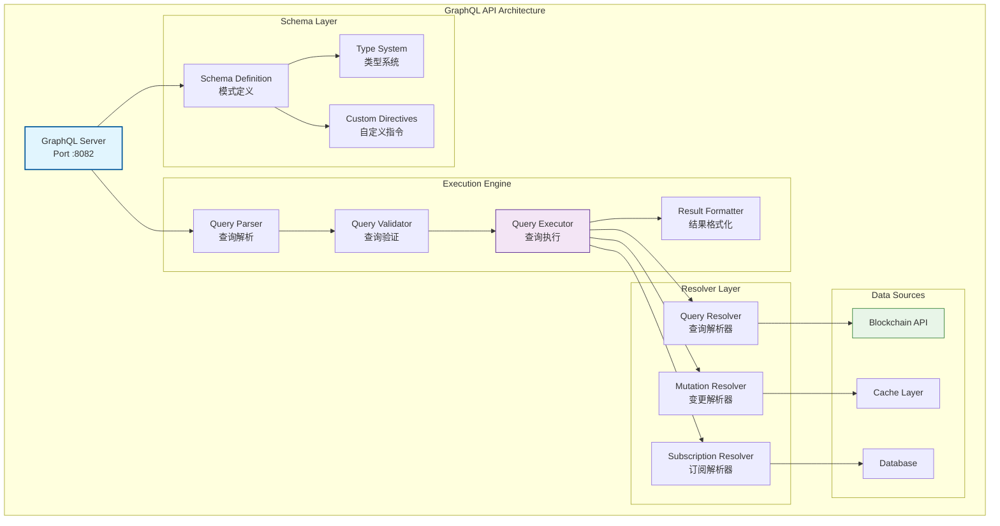

# GraphQL灵活查询API（internal/api/graphql）

【模块定位】
　　本模块是WES系统中GraphQL查询服务的核心实现，负责提供灵活、高效、类型安全的区块链数据查询接口。通过强类型模式定义和智能查询优化机制，提供精确的数据获取能力，支撑移动应用、复杂数据分析和第三方服务集成的业务需求，确保查询的高效性、灵活性和安全性。

【设计原则】
- **按需查询**：客户端精确控制返回数据的字段和结构，消除冗余数据传输和处理开销
- **单次请求**：通过关联查询机制实现一次请求获取多种相关资源，减少网络往返次数
- **类型安全**：基于强类型GraphQL模式定义实现编译时类型检查和运行时数据验证
- **自文档化**：内置模式内省和自动文档生成，提供零配置的API探索和开发体验
- **性能优化**：集成查询复杂度分析、深度限制和智能缓存机制，保障系统稳定性

【核心职责】
1. **灵活查询**：支持复杂的嵌套查询和关联数据获取
2. **类型系统**：强类型GraphQL模式定义和验证
3. **查询优化**：智能查询执行和结果缓存
4. **实时订阅**：基于GraphQL订阅的实时数据推送
5. **权限控制**：细粒度的字段级访问控制
6. **性能监控**：查询性能分析和优化建议

## GraphQL架构设计



## GraphQL模式定义

### 基础类型定义
```graphql
# 区块类型
type Block {
  height: Int!
  hash: String!
  parentHash: String!
  timestamp: Int!
  miner: String!
  执行费用Used: BigInt!
  执行费用Limit: BigInt!
  size: Int!
  transactions(first: Int, after: String): TransactionConnection!
  transactionCount: Int!
}

# 交易类型
type Transaction {
  hash: String!
  from: String!
  to: String
  value: BigInt!
  执行费用: BigInt!
  执行费用Price: BigInt!
  执行费用Used: BigInt
  nonce: Int!
  status: TransactionStatus!
  block: Block
  logs: [Log!]!
  timestamp: Int!
}

# 账户类型
type Account {
  address: String!
  balance: BigInt!
  nonce: Int!
  transactionCount: Int!
  transactions(first: Int, after: String): TransactionConnection!
  utxos: [UTXO!]!
}

# 智能合约类型
type Contract {
  address: String!
  creator: String!
  code: String!
  abi: String
  deployedAt: Block!
  transactions: [Transaction!]!
  events: [ContractEvent!]!
  calls: [ContractCall!]!
}
```

### 查询接口定义
```graphql
type Query {
  # 区块查询
  block(height: Int, hash: String): Block
  blocks(first: Int, after: String, orderBy: BlockOrderBy): BlockConnection!
  latestBlock: Block!
  
  # 交易查询
  transaction(hash: String!): Transaction
  transactions(first: Int, after: String, where: TransactionWhereInput): TransactionConnection!
  
  # 账户查询
  account(address: String!): Account
  accounts(first: Int, after: String): AccountConnection!
  
  # 合约查询
  contract(address: String!): Contract
  contracts(first: Int, after: String): ContractConnection!
  
  # 统计查询
  chainInfo: ChainInfo!
  networkStats: NetworkStats!
  miningStats: MiningStats!
}

type Mutation {
  # 交易提交
  submitTransaction(input: SubmitTransactionInput!): SubmitTransactionPayload!
  
  # 合约部署
  deployContract(input: DeployContractInput!): DeployContractPayload!
  
  # 合约调用
  callContract(input: CallContractInput!): CallContractPayload!
}

type Subscription {
  # 新区块订阅
  newBlocks: Block!
  
  # 新交易订阅
  newTransactions(where: TransactionWhereInput): Transaction!
  
  # 合约事件订阅
  contractEvents(contractAddress: String, eventName: String): ContractEvent!
  
  # 账户变更订阅
  accountUpdates(address: String!): Account!
}
```

### 输入类型定义
```graphql
# 交易提交输入
input SubmitTransactionInput {
  from: String!
  to: String
  value: BigInt!
  执行费用: BigInt!
  执行费用Price: BigInt!
  data: String
  nonce: Int
}

# 合约部署输入
input DeployContractInput {
  code: String!
  constructor: String
  执行费用: BigInt!
  执行费用Price: BigInt!
  value: BigInt
}

# 合约调用输入
input CallContractInput {
  contractAddress: String!
  method: String!
  args: [String!]!
  执行费用: BigInt!
  执行费用Price: BigInt!
  value: BigInt
}

# 交易过滤条件
input TransactionWhereInput {
  from: String
  to: String
  valueGte: BigInt
  valueLte: BigInt
  timestampGte: Int
  timestampLte: Int
  status: TransactionStatus
}
```

## 查询示例

### 基本查询
```graphql
# 查询最新区块基本信息
query LatestBlock {
  latestBlock {
    height
    hash
    timestamp
    transactionCount
  }
}

# 查询特定区块详细信息
query BlockDetails($height: Int!) {
  block(height: $height) {
    height
    hash
    parentHash
    timestamp
    miner
    执行费用Used
    执行费用Limit
    transactions(first: 10) {
      edges {
        node {
          hash
          from
          to
          value
          status
        }
      }
    }
  }
}
```

### 复杂嵌套查询
```graphql
# 查询账户信息及其相关交易
query AccountWithTransactions($address: String!) {
  account(address: $address) {
    address
    balance
    nonce
    transactionCount
    transactions(first: 20, orderBy: TIMESTAMP_DESC) {
      edges {
        node {
          hash
          from
          to
          value
          status
          timestamp
          block {
            height
            timestamp
          }
        }
      }
      pageInfo {
        hasNextPage
        endCursor
      }
    }
  }
}

# 查询合约信息及其事件
query ContractWithEvents($address: String!) {
  contract(address: $address) {
    address
    creator
    deployedAt {
      height
      timestamp
    }
    events(first: 50) {
      eventName
      parameters
      transactionHash
      blockHeight
      timestamp
    }
    calls(first: 20) {
      method
      parameters
      result
      执行费用Used
      timestamp
    }
  }
}
```

### 聚合和统计查询
```graphql
# 查询链上统计信息
query ChainStatistics {
  chainInfo {
    currentHeight
    totalBlocks
    totalTransactions
    averageBlockTime
    hashRate
  }
  
  networkStats {
    connectedPeers
    pendingTransactions
    memPoolSize
    syncProgress
  }
  
  miningStats {
    difficulty
    hashRate
    blocksMinedToday
    averageReward
  }
}
```

### 实时订阅
```graphql
# 订阅新区块
subscription NewBlocks {
  newBlocks {
    height
    hash
    timestamp
    transactionCount
    miner
  }
}

# 订阅特定地址的交易
subscription TransactionsByAddress($address: String!) {
  newTransactions(where: { from: $address }) {
    hash
    from
    to
    value
    status
    timestamp
  }
}

# 订阅合约事件
subscription ContractEvents($contractAddress: String!) {
  contractEvents(contractAddress: $contractAddress) {
    eventName
    parameters
    transactionHash
    blockHeight
    timestamp
  }
}
```

## 客户端实现

### JavaScript/TypeScript客户端
```typescript
import { ApolloClient, InMemoryCache, gql } from '@apollo/client';
import { WebSocketLink } from '@apollo/client/link/ws';
import { split, HttpLink } from '@apollo/client';
import { getMainDefinition } from '@apollo/client/utilities';

// HTTP链接用于查询和变更
const httpLink = new HttpLink({
  uri: 'https://api.weisyn.io/graphql'
});

// WebSocket链接用于订阅
const wsLink = new WebSocketLink({
  uri: 'wss://api.weisyn.io/graphql',
  options: {
    reconnect: true
  }
});

// 根据操作类型选择链接
const splitLink = split(
  ({ query }) => {
    const definition = getMainDefinition(query);
    return (
      definition.kind === 'OperationDefinition' &&
      definition.operation === 'subscription'
    );
  },
  wsLink,
  httpLink,
);

// 创建Apollo客户端
const client = new ApolloClient({
  link: splitLink,
  cache: new InMemoryCache()
});

// 查询示例
const GET_LATEST_BLOCK = gql`
  query GetLatestBlock {
    latestBlock {
      height
      hash
      timestamp
      transactionCount
    }
  }
`;

// 执行查询
client.query({ query: GET_LATEST_BLOCK })
  .then(result => {
    console.log('最新区块:', result.data.latestBlock);
  })
  .catch(error => {
    console.error('查询错误:', error);
  });

// 订阅示例
const NEW_BLOCKS_SUBSCRIPTION = gql`
  subscription NewBlocks {
    newBlocks {
      height
      hash
      timestamp
      transactionCount
    }
  }
`;

// 执行订阅
const subscription = client.subscribe({ query: NEW_BLOCKS_SUBSCRIPTION })
  .subscribe({
    next: (result) => {
      console.log('新区块:', result.data.newBlocks);
    },
    error: (error) => {
      console.error('订阅错误:', error);
    }
  });
```

### React Hook示例
```tsx
import { useQuery, useSubscription, useMutation } from '@apollo/client';

// 查询Hook
function useLatestBlock() {
  const { data, loading, error } = useQuery(GET_LATEST_BLOCK, {
    pollInterval: 5000 // 每5秒轮询一次
  });
  
  return {
    block: data?.latestBlock,
    loading,
    error
  };
}

// 订阅Hook
function useNewBlocks() {
  const { data, loading } = useSubscription(NEW_BLOCKS_SUBSCRIPTION);
  
  return {
    newBlock: data?.newBlocks,
    loading
  };
}

// 变更Hook
function useSubmitTransaction() {
  const [submitTransaction, { data, loading, error }] = useMutation(SUBMIT_TRANSACTION);
  
  return {
    submitTransaction,
    result: data?.submitTransaction,
    loading,
    error
  };
}

// React组件示例
function BlockExplorer() {
  const { block, loading } = useLatestBlock();
  const { newBlock } = useNewBlocks();
  
  if (loading) return <div>加载中...</div>;
  
  return (
    <div>
      <h2>最新区块</h2>
      <p>高度: {block?.height}</p>
      <p>哈希: {block?.hash}</p>
      <p>时间: {new Date(block?.timestamp * 1000).toLocaleString()}</p>
      <p>交易数: {block?.transactionCount}</p>
      
      {newBlock && (
        <div className="notification">
          新区块产生: #{newBlock.height}
        </div>
      )}
    </div>
  );
}
```

## 性能优化

### 查询复杂度控制
```go
// 查询复杂度分析
type ComplexityAnalyzer struct {
    maxDepth      int
    maxComplexity int
}

func (a *ComplexityAnalyzer) AnalyzeQuery(query *ast.Document) error {
    depth := a.calculateDepth(query)
    if depth > a.maxDepth {
        return fmt.Errorf("查询深度超限: %d > %d", depth, a.maxDepth)
    }
    
    complexity := a.calculateComplexity(query)
    if complexity > a.maxComplexity {
        return fmt.Errorf("查询复杂度超限: %d > %d", complexity, a.maxComplexity)
    }
    
    return nil
}
```

### 数据加载优化
```go
// DataLoader模式实现
type BlockLoader struct {
    loader *dataloader.Loader
}

func NewBlockLoader(blockService BlockService) *BlockLoader {
    return &BlockLoader{
        loader: dataloader.NewBatchedLoader(func(ctx context.Context, keys dataloader.Keys) []*dataloader.Result {
            heights := make([]int64, len(keys))
            for i, key := range keys {
                heights[i] = key.Int()
            }
            
            blocks, errs := blockService.GetBlocksBatch(ctx, heights)
            
            results := make([]*dataloader.Result, len(keys))
            for i := range keys {
                if errs[i] != nil {
                    results[i] = &dataloader.Result{Error: errs[i]}
                } else {
                    results[i] = &dataloader.Result{Data: blocks[i]}
                }
            }
            
            return results
        }),
    }
}

func (l *BlockLoader) Load(ctx context.Context, height int64) (*Block, error) {
    result, err := l.loader.Load(ctx, dataloader.IntKey(height))()
    if err != nil {
        return nil, err
    }
    
    return result.(*Block), nil
}
```

### 缓存策略
```go
// 查询结果缓存
type QueryCache struct {
    cache *cache.Cache
    ttl   time.Duration
}

func (c *QueryCache) Get(ctx context.Context, query string, variables map[string]interface{}) (interface{}, bool) {
    key := c.generateKey(query, variables)
    return c.cache.Get(key)
}

func (c *QueryCache) Set(ctx context.Context, query string, variables map[string]interface{}, result interface{}) {
    key := c.generateKey(query, variables)
    c.cache.Set(key, result, c.ttl)
}

func (c *QueryCache) generateKey(query string, variables map[string]interface{}) string {
    h := sha256.New()
    h.Write([]byte(query))
    h.Write([]byte(fmt.Sprintf("%v", variables)))
    return hex.EncodeToString(h.Sum(nil))
}
```

## 监控和调试

### 查询性能监控
```go
type QueryMetrics struct {
    ExecutionTime time.Duration
    Complexity    int
    Depth         int
    FieldCount    int
    ErrorCount    int
}

func (m *QueryMetrics) Record() {
    // 记录到监控系统
    prometheus.QueryDurationHistogram.Observe(m.ExecutionTime.Seconds())
    prometheus.QueryComplexityHistogram.Observe(float64(m.Complexity))
    prometheus.QueryDepthHistogram.Observe(float64(m.Depth))
}
```

### GraphQL Playground
```yaml
# 开发环境配置
server:
  graphql:
    playground: true
    introspection: true
    debug: true
    
# 生产环境配置
server:
  graphql:
    playground: false
    introspection: false
    debug: false
```

---

## 🔗 相关文档

- **模式定义**：查看完整的GraphQL模式文件
- **解析器实现**：查看各种类型的解析器实现
- **服务器配置**：`server.go` - GraphQL服务器配置
- **性能优化**：查看缓存和查询优化策略
