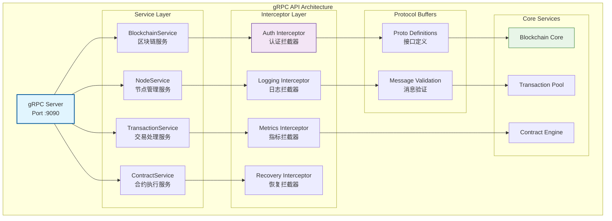

# gRPC高性能API（internal/api/grpc）

【模块定位】
　　本模块是WES系统中gRPC高性能API服务的核心实现，负责基于Protocol Buffers协议提供强类型、高效率的远程过程调用接口。通过二进制序列化和HTTP/2传输协议，提供毫秒级响应的高性能通信能力，支撑微服务架构、服务间通信和高频API调用的业务需求，确保通信的高效性、类型安全性和可扩展性。

【设计原则】
- **高性能优先**：采用二进制序列化和HTTP/2传输协议，实现低延迟、高吞吐的通信性能
- **强类型安全**：基于Protocol Buffers的严格接口定义，提供编译时类型检查和运行时验证
- **流式支持**：全面支持单向流、双向流和长连接，满足大数据量实时传输需求
- **多语言支持**：自动生成多语言客户端SDK，支持异构系统的无缝集成
- **安全传输**：内置mTLS加密、身份认证和权限控制，保障通信安全和数据隐私

【核心职责】
1. **高性能通信**：提供毫秒级响应的RPC调用
2. **类型安全**：强类型接口定义和验证
3. **流式处理**：支持大数据量的流式传输
4. **服务集成**：微服务间的高效通信
5. **负载均衡**：分布式环境下的负载分配
6. **监控追踪**：详细的调用链追踪和监控

## gRPC架构设计



## 服务接口定义

### 🔗 BlockchainService - 区块链核心服务
```protobuf
service BlockchainService {
  // 获取区块信息
  rpc GetBlock(GetBlockRequest) returns (GetBlockResponse);
  
  // 获取链信息
  rpc GetChainInfo(GetChainInfoRequest) returns (GetChainInfoResponse);
  
  // 订阅新区块（流式）
  rpc SubscribeBlocks(SubscribeBlocksRequest) returns (stream BlockEvent);
  
  // 批量获取区块
  rpc GetBlocks(GetBlocksRequest) returns (stream Block);
}
```

### 🌐 NodeService - 节点管理服务
```protobuf
service NodeService {
  // 获取节点信息
  rpc GetNodeInfo(GetNodeInfoRequest) returns (GetNodeInfoResponse);
  
  // 获取连接的节点
  rpc GetPeers(GetPeersRequest) returns (GetPeersResponse);
  
  // 添加节点
  rpc AddPeer(AddPeerRequest) returns (AddPeerResponse);
  
  // 节点健康检查
  rpc HealthCheck(HealthCheckRequest) returns (HealthCheckResponse);
}
```

### 💸 TransactionService - 交易处理服务
```protobuf
service TransactionService {
  // 提交交易
  rpc SubmitTransaction(SubmitTransactionRequest) returns (SubmitTransactionResponse);
  
  // 获取交易信息
  rpc GetTransaction(GetTransactionRequest) returns (GetTransactionResponse);
  
  // 订阅交易事件（流式）
  rpc SubscribeTransactions(SubscribeTransactionsRequest) returns (stream TransactionEvent);
  
  // 估算交易费用
  rpc Estimate执行费用(Estimate执行费用Request) returns (Estimate执行费用Response);
}
```

### 📄 ContractService - 智能合约服务
```protobuf
service ContractService {
  // 部署合约
  rpc DeployContract(DeployContractRequest) returns (DeployContractResponse);
  
  // 调用合约
  rpc CallContract(CallContractRequest) returns (CallContractResponse);
  
  // 查询合约状态
  rpc QueryContract(QueryContractRequest) returns (QueryContractResponse);
  
  // 订阅合约事件（流式）
  rpc SubscribeContractEvents(SubscribeContractEventsRequest) returns (stream ContractEvent);
}
```

## 使用示例

### Go客户端示例
```go
package main

import (
    "context"
    "crypto/tls"
    "log"
    
    "google.golang.org/grpc"
    "google.golang.org/grpc/credentials"
    pb "github.com/weisyn/v1/pb/api"
)

func main() {
    // 建立安全连接
    creds := credentials.NewTLS(&tls.Config{
        ServerName: "api.weisyn.io",
    })
    
    conn, err := grpc.Dial("api.weisyn.io:9090", grpc.WithTransportCredentials(creds))
    if err != nil {
        log.Fatal("连接失败:", err)
    }
    defer conn.Close()

    // 创建客户端
    client := pb.NewBlockchainServiceClient(conn)
    
    // 获取最新区块
    response, err := client.GetBlock(context.Background(), &pb.GetBlockRequest{
        BlockId: &pb.GetBlockRequest_Height{Height: 0}, // 最新区块
    })
    if err != nil {
        log.Fatal("调用失败:", err)
    }
    
    log.Printf("区块高度: %d", response.Block.Header.Height)
    log.Printf("区块哈希: %x", response.Block.Header.Hash)
}
```

### 流式订阅示例
```go
func subscribeBlocks() {
    client := pb.NewBlockchainServiceClient(conn)
    
    // 订阅新区块
    stream, err := client.SubscribeBlocks(context.Background(), &pb.SubscribeBlocksRequest{
        StartHeight: 0, // 从最新区块开始
    })
    if err != nil {
        log.Fatal("订阅失败:", err)
    }
    
    for {
        event, err := stream.Recv()
        if err != nil {
            log.Fatal("接收失败:", err)
        }
        
        log.Printf("新区块: 高度=%d, 哈希=%x", 
            event.Block.Header.Height, 
            event.Block.Header.Hash)
    }
}
```

### 交易提交示例
```go
func submitTransaction() {
    client := pb.NewTransactionServiceClient(conn)
    
    // 构建交易
    tx := &pb.Transaction{
        From:   "0x1111111111111111111111111111111111111111",
        To:     "0x2222222222222222222222222222222222222222",
        Value:  1000000000, // 1 WES
        执行费用:    21000,
        Nonce:  1,
    }
    
    // 提交交易
    response, err := client.SubmitTransaction(context.Background(), &pb.SubmitTransactionRequest{
        Transaction: tx,
    })
    if err != nil {
        log.Fatal("提交失败:", err)
    }
    
    log.Printf("交易哈希: %x", response.TxHash)
}
```

### JavaScript客户端示例
```javascript
const grpc = require('@grpc/grpc-js');
const protoLoader = require('@grpc/proto-loader');

// 加载Proto定义
const packageDefinition = protoLoader.loadSync('./blockchain.proto', {
    keepCase: true,
    longs: String,
    enums: String,
    defaults: true,
    oneofs: true
});

const blockchain = grpc.loadPackageDefinition(packageDefinition).blockchain;

// 创建客户端
const client = new blockchain.BlockchainService('api.weisyn.io:9090', 
    grpc.credentials.createSsl());

// 获取区块
client.getBlock({ height: 100 }, (error, response) => {
    if (error) {
        console.error('错误:', error);
        return;
    }
    
    console.log('区块高度:', response.block.header.height);
    console.log('区块哈希:', response.block.header.hash);
});

// 订阅新区块
const stream = client.subscribeBlocks({ startHeight: 0 });

stream.on('data', (event) => {
    console.log('新区块:', event.block.header.height);
});

stream.on('error', (error) => {
    console.error('流错误:', error);
});
```

## 认证和安全

### mTLS双向认证
```go
// 服务端配置
func createServerCredentials() credentials.TransportCredentials {
    cert, err := tls.LoadX509KeyPair("server.crt", "server.key")
    if err != nil {
        log.Fatal("加载证书失败:", err)
    }
    
    // 加载CA证书
    caCert, err := ioutil.ReadFile("ca.crt")
    if err != nil {
        log.Fatal("加载CA证书失败:", err)
    }
    
    caPool := x509.NewCertPool()
    caPool.AppendCertsFromPEM(caCert)
    
    // 配置TLS
    config := &tls.Config{
        Certificates: []tls.Certificate{cert},
        ClientAuth:   tls.RequireAndVerifyClientCert,
        ClientCAs:    caPool,
    }
    
    return credentials.NewTLS(config)
}

// 客户端配置
func createClientCredentials() credentials.TransportCredentials {
    cert, err := tls.LoadX509KeyPair("client.crt", "client.key")
    if err != nil {
        log.Fatal("加载客户端证书失败:", err)
    }
    
    config := &tls.Config{
        Certificates: []tls.Certificate{cert},
        ServerName:   "api.weisyn.io",
    }
    
    return credentials.NewTLS(config)
}
```

### API密钥认证
```go
// 认证拦截器
func authInterceptor(ctx context.Context, req interface{}, info *grpc.UnaryServerInfo, handler grpc.UnaryHandler) (interface{}, error) {
    // 从元数据中获取API密钥
    md, ok := metadata.FromIncomingContext(ctx)
    if !ok {
        return nil, status.Errorf(codes.Unauthenticated, "缺少元数据")
    }
    
    apiKeys := md["api-key"]
    if len(apiKeys) == 0 {
        return nil, status.Errorf(codes.Unauthenticated, "缺少API密钥")
    }
    
    // 验证API密钥
    if !isValidAPIKey(apiKeys[0]) {
        return nil, status.Errorf(codes.Unauthenticated, "无效的API密钥")
    }
    
    return handler(ctx, req)
}
```

## 性能优化

### 连接池配置
```go
// 客户端连接池
func createConnectionPool() *grpc.ClientConn {
    conn, err := grpc.Dial("api.weisyn.io:9090",
        grpc.WithTransportCredentials(creds),
        grpc.WithKeepaliveParams(keepalive.ClientParameters{
            Time:                10 * time.Second,
            Timeout:             3 * time.Second,
            PermitWithoutStream: true,
        }),
        grpc.WithMaxMsgSize(4*1024*1024), // 4MB
    )
    if err != nil {
        log.Fatal("连接失败:", err)
    }
    return conn
}
```

### 服务端优化
```go
// 服务器配置
func createServer() *grpc.Server {
    opts := []grpc.ServerOption{
        grpc.Creds(createServerCredentials()),
        grpc.MaxRecvMsgSize(4 * 1024 * 1024), // 4MB
        grpc.MaxSendMsgSize(4 * 1024 * 1024), // 4MB
        grpc.KeepaliveParams(keepalive.ServerParameters{
            MaxConnectionIdle: 15 * time.Second,
            MaxConnectionAge:  30 * time.Second,
            Time:              5 * time.Second,
            Timeout:           1 * time.Second,
        }),
        grpc.KeepaliveEnforcementPolicy(keepalive.EnforcementPolicy{
            MinTime:             5 * time.Second,
            PermitWithoutStream: true,
        }),
    }
    
    return grpc.NewServer(opts...)
}
```

## 监控和追踪

### 指标收集
```go
// 自定义指标
var (
    requestCounter = prometheus.NewCounterVec(
        prometheus.CounterOpts{
            Name: "grpc_requests_total",
            Help: "总请求数",
        },
        []string{"method", "status"},
    )
    
    requestDuration = prometheus.NewHistogramVec(
        prometheus.HistogramOpts{
            Name: "grpc_request_duration_seconds",
            Help: "请求持续时间",
        },
        []string{"method"},
    )
)

// 指标拦截器
func metricsInterceptor(ctx context.Context, req interface{}, info *grpc.UnaryServerInfo, handler grpc.UnaryHandler) (interface{}, error) {
    start := time.Now()
    
    resp, err := handler(ctx, req)
    
    status := "success"
    if err != nil {
        status = "error"
    }
    
    requestCounter.WithLabelValues(info.FullMethod, status).Inc()
    requestDuration.WithLabelValues(info.FullMethod).Observe(time.Since(start).Seconds())
    
    return resp, err
}
```

### 分布式追踪
```go
// OpenTelemetry集成
func tracingInterceptor(ctx context.Context, req interface{}, info *grpc.UnaryServerInfo, handler grpc.UnaryHandler) (interface{}, error) {
    tracer := otel.Tracer("weisyn-grpc")
    
    ctx, span := tracer.Start(ctx, info.FullMethod)
    defer span.End()
    
    // 添加请求信息
    span.SetAttributes(
        attribute.String("grpc.method", info.FullMethod),
        attribute.String("grpc.service", "weisyn-api"),
    )
    
    resp, err := handler(ctx, req)
    
    if err != nil {
        span.RecordError(err)
        span.SetStatus(codes.Error, err.Error())
    }
    
    return resp, err
}
```

## 错误处理

### 标准错误码
```go
import "google.golang.org/grpc/codes"

// 常见错误处理
func handleBlockNotFound(height uint64) error {
    return status.Errorf(codes.NotFound, 
        "区块不存在: 高度 %d", height)
}

func handleInvalidParameter(param string, value interface{}) error {
    return status.Errorf(codes.InvalidArgument, 
        "无效参数 %s: %v", param, value)
}

func handleInternalError(err error) error {
    return status.Errorf(codes.Internal, 
        "内部错误: %v", err)
}
```

### 错误重试机制
```go
// 客户端重试配置
func withRetry() grpc.DialOption {
    return grpc.WithUnaryInterceptor(func(ctx context.Context, method string, req, reply interface{}, cc *grpc.ClientConn, invoker grpc.UnaryInvoker, opts ...grpc.CallOption) error {
        var err error
        for i := 0; i < 3; i++ {
            err = invoker(ctx, method, req, reply, cc, opts...)
            if err == nil {
                return nil
            }
            
            // 检查是否可重试
            if status.Code(err) == codes.Internal {
                time.Sleep(time.Duration(i+1) * time.Second)
                continue
            }
            
            break
        }
        return err
    })
}
```

---

## 🔗 相关文档

- **Protocol Buffers**：查看 `pb/` 目录中的Proto定义文件
- **中间件配置**：`middleware.go` - gRPC中间件实现
- **服务器配置**：`server.go` - gRPC服务器配置
- **认证机制**：查看安全配置和证书管理
