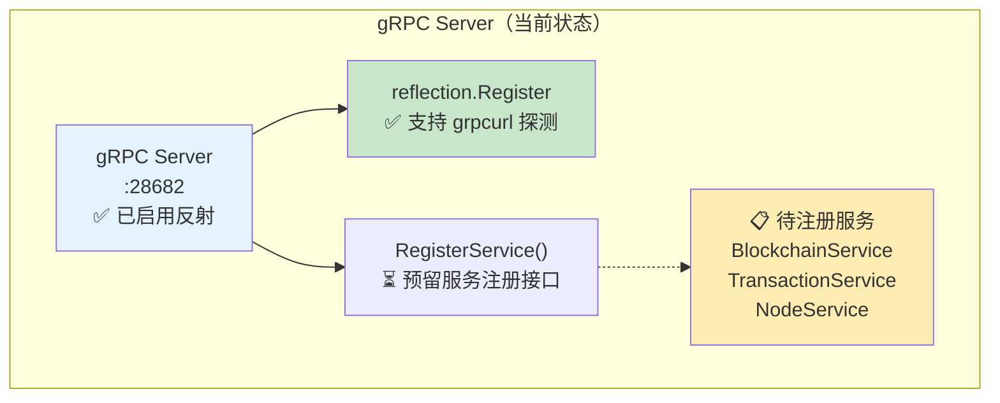
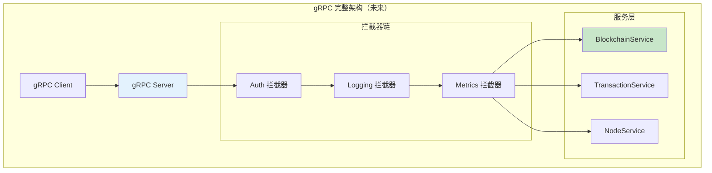

# gRPC 协议层（internal/api/grpc）

> **📌 模块类型**：`[X] 实现模块` `[ ] 接口定义` `[ ] 数据结构` `[ ] 工具/其他`  
> **⚠️ 实现状态**：🚧 骨架阶段（已启用反射，待注册服务）

---

## 📍 **模块定位**

　　本模块是 WES 区块链节点的**gRPC 高性能协议层**，当前为骨架实现，已启用反射支持 `grpcurl` 调试，为未来的企业集成和高性能服务间通信预留接口。

**解决什么问题**：
- **高性能通信**：HTTP/2 + Protocol Buffers，低延迟高吞吐
- **类型安全**：强类型接口定义，编译时检查
- **流式处理**：支持单向流、双向流
- **早期调试**：反射支持，可用 `grpcurl` 动态探测

**不解决什么问题**（边界）：
- ❌ 不实现 JSON-RPC 方法（由 `../jsonrpc/` 负责）
- ❌ 不处理 HTTP REST（由 `../http/` 负责）
- ❌ 不定义 Protobuf（由 `pb/` 目录负责）

---

## 🎯 **设计原则与核心约束**

### **设计原则**

| 原则 | 说明 | 价值 |
|------|------|------|
| **反射优先** | 启用反射支持早期调试 | 可用 grpcurl 探测 |
| **延迟实现** | 先骨架后实现，按需添加服务 | 避免过度设计 |
| **标准拦截器** | 使用 gRPC 标准中间件模式 | 易集成、可组合 |

### **核心约束** ⭐

**当前阶段（骨架）**：
- ✅ 已启用反射（`reflection.Register`）
- ✅ 已实现生命周期管理（Start/Stop）
- ✅ 提供 `RegisterService` 方法预留扩展点
- ⏳ 待注册具体服务（BlockchainService/TransactionService等）

**严格禁止**：
- ❌ **破坏反射**：不得移除反射注册
- ❌ **硬编码端口**：端口必须从配置读取

---

## 🏗️ **架构设计**

### **当前架构（骨架阶段）**



### **目标架构（完整实现后）**



---

## 📁 **目录结构**

```
grpc/
├── server.go               # ✅ gRPC 服务器（骨架+反射）
└── README.md               # 本文档
```

**待添加**（Phase P2）：
```
grpc/
├── services/               # 📋 gRPC 服务实现
│   ├── blockchain.go
│   ├── transaction.go
│   └── node.go
└── interceptors/           # 📋 拦截器
    ├── auth.go
    ├── logging.go
    └── metrics.go
```

---

## 📊 **核心机制**

### **机制1：反射支持（已实现）**

**为什么需要**：早期阶段无服务实现，反射允许动态探测

**实现代码**：
```go
package grpc

import (
    "google.golang.org/grpc"
    "google.golang.org/grpc/reflection"
)

func NewServer(logger *zap.Logger, cfg config.Provider) *Server {
    grpcServer := grpc.NewServer()
    
    // ✅ 启用反射
    reflection.Register(grpcServer)
    
    return &Server{
        logger:     logger,
        config:     cfg,
        grpcServer: grpcServer,
    }
}
```

**使用方式**：
```bash
# 列出所有服务
grpcurl -plaintext localhost:28682 list

# 查看服务方法（待注册服务后）
grpcurl -plaintext localhost:28682 list weisyn.BlockchainService

# 查看方法签名
grpcurl -plaintext localhost:28682 describe weisyn.BlockchainService.GetBlock
```

---

### **机制2：RegisterService 扩展点（已实现）**

**为什么需要**：预留服务注册接口，便于后续扩展

**实现代码**：
```go
// RegisterService 注册 gRPC 服务
//
// 使用示例：
//
//	server.RegisterService(func(s *grpc.Server) {
//	    pb.RegisterBlockchainServiceServer(s, blockchainSvc)
//	})
func (s *Server) RegisterService(register func(*grpc.Server)) {
    register(s.grpcServer)
}
```

**使用示例**：
```go
// 未来实现时的用法
blockchainSvc := services.NewBlockchainService(chainService, repo)

grpcServer.RegisterService(func(s *grpc.Server) {
    pb.RegisterBlockchainServiceServer(s, blockchainSvc)
})
```

---

## 🎓 **使用指南**

### **典型场景1：grpcurl 调试**

```bash
# 1. 检查服务器是否启动
grpcurl -plaintext localhost:28682 list

# 当前输出（无服务注册）：
# grpc.reflection.v1alpha.ServerReflection

# 2. 未来注册服务后：
# grpc.reflection.v1alpha.ServerReflection
# weisyn.BlockchainService
# weisyn.TransactionService
# weisyn.NodeService
```

---

### **典型场景2：注册新服务（P2阶段）**

```go
// 1. 定义 Protobuf（pb/blockchain.proto）
service BlockchainService {
    rpc GetBlock(GetBlockRequest) returns (GetBlockResponse);
}

// 2. 生成代码
// protoc --go_out=. --go-grpc_out=. blockchain.proto

// 3. 实现服务
type BlockchainServiceImpl struct {
    pb.UnimplementedBlockchainServiceServer
    chainService blockchain.ChainService
}

func (s *BlockchainServiceImpl) GetBlock(ctx context.Context, req *pb.GetBlockRequest) (*pb.GetBlockResponse, error) {
    // 实现逻辑...
}

// 4. 注册服务
grpcServer.RegisterService(func(s *grpc.Server) {
    pb.RegisterBlockchainServiceServer(s, blockchainSvc)
})
```

---

### **常见误用**

| 误用方式 | 为什么错误 | 正确做法 |
|---------|-----------|---------|
| 期望有可用服务 | 当前为骨架阶段 | 使用 JSON-RPC 或 REST |
| 移除反射 | 无法调试 | 保留反射，至少在开发环境 |
| 硬编码端口 | 环境不灵活 | 从配置读取端口 |

---

## ⚠️ **已知限制**

| 限制 | 影响 | 规避方法 | 未来计划 |
|------|------|---------|---------|
| 无服务实现 | 无法调用任何方法 | 使用 JSON-RPC/REST | 📋 P2 实现 BlockchainService |
| 无拦截器 | 无认证/日志/指标 | 依赖外部网关 | 📋 P2 实现拦截器 |
| 无 TLS | 明文传输 | 使用 VPN/内网 | 📋 P3 配置 mTLS |

---

## 🔍 **设计权衡记录**

### **权衡1：为什么先骨架后实现？**

**背景**：可以先完整实现所有服务再发布

**备选方案**：
1. **骨架优先**：先启用反射，按需添加服务 - 优势：快速迭代、避免过度设计 - 劣势：初期无可用服务
2. **完整实现**：一次性实现所有服务 - 优势：功能完整 - 劣势：开发周期长、可能浪费

**选择**：选择了 **骨架优先**

**理由**：
- ✅ JSON-RPC 已满足当前需求
- ✅ gRPC 主要面向企业集成（需求不紧急）
- ✅ 反射支持早期调试和测试

**代价**：初期无可用 gRPC 服务

---

## 📚 **相关文档**

- **Protobuf 定义**：`pb/` 目录（待创建）
- **gRPC Go 文档**：https://grpc.io/docs/languages/go/
- **grpcurl 工具**：https://github.com/fullstorydev/grpcurl

---

## 📋 **文档变更记录**

| 日期 | 变更内容 | 原因 |
|------|---------|------|
| 2025-10-24 | 重构为模板 v3.0 | 反映骨架现状，添加 grpcurl 指南 |
| 2025-10-24 | 标注为骨架阶段 | 真实反映实现进度 |
| 2025-10-24 | 补充 RegisterService 用法 | 为后续扩展提供指导 |

---

> 📝 **文档说明**  
> 本文档遵循 `_docs/templates/README_TEMPLATE.md` v3.0 规范  
> 🎯 **核心理念**：骨架优先、反射调试、按需扩展  
> ⚠️ **当前状态**：P0 骨架完成，P2 待实现服务
