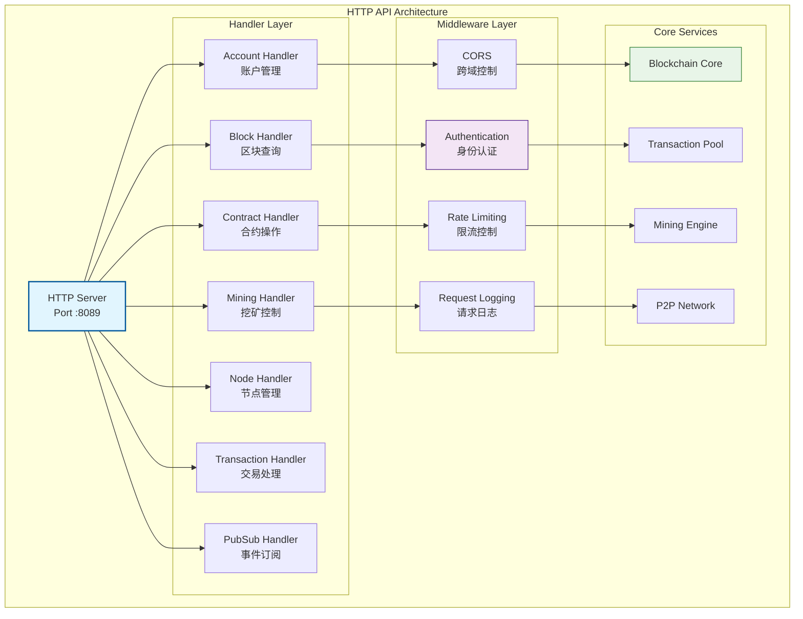

# HTTP RESTful API（internal/api/http）

【模块定位】
　　本模块是WES系统中HTTP RESTful API服务的核心实现，负责提供标准化的Web接口供前端应用、第三方服务和开发工具调用。通过严格遵循REST架构原则和HTTP标准，提供直观易用的JSON格式API，支撑Web应用开发、第三方系统集成和跨平台访问的业务需求，确保接口的标准性、易用性和兼容性。

【设计原则】
- **RESTful设计**：严格遵循REST架构原则和HTTP语义，提供直观、一致的API设计模式
- **资源导向**：采用以资源为中心的URL设计，建立清晰的资源层次结构和操作映射
- **状态无关**：确保每个请求包含完整操作信息，支持水平扩展和负载均衡
- **统一接口**：标准化HTTP方法和状态码使用，提供一致的错误处理和响应格式
- **版本控制**：实现API版本管理和向后兼容策略，保障系统平滑升级和迁移

【核心职责】
1. **区块链查询**：区块、交易、账户状态查询接口
2. **交易处理**：交易提交、验证和状态跟踪
3. **资产管理**：数字资产转账、余额查询等操作
4. **合约服务**：智能合约部署、调用和管理
5. **节点管理**：节点状态、网络信息和挖矿控制
6. **文件服务**：文件上传、下载和分布式存储

## HTTP API架构



## API服务配置

### 基本配置
- **服务端口**：8089
- **基础URL**：`http://localhost:8089`
- **API前缀**：`/api/v1`
- **启动命令**：`go run cmd/node/main.go`

### 功能模块状态
| 模块 | 状态 | 描述 | 主要端点 |
|------|------|------|----------|
| 🏥 **健康检查** | ✅ 稳定 | 服务状态监控 | `/health` |
| 📊 **区块查询** | ✅ 稳定 | 区块链数据查询 | `/blocks/*` |
| ⛏️ **挖矿控制** | ✅ 稳定 | 挖矿操作管理 | `/mining/*` |
| 💰 **资产管理** | ✅ 稳定 | 数字资产操作 | `/accounts/*` |
| 📝 **交易处理** | ✅ 稳定 | 交易提交查询 | `/transactions/*` |
| 📄 **合约服务** | 🚧 开发中 | 智能合约操作 | `/contracts/*` |
| 🌐 **节点管理** | ✅ 稳定 | 节点状态信息 | `/node/*` |
| 📢 **事件订阅** | ✅ 稳定 | 实时事件推送 | `/pubsub/*` |

## 核心API端点

### 🏥 健康检查
```http
GET /health
```
**功能**：检查节点服务状态  
**响应**：服务健康状态信息

### 📊 区块链查询
```http
GET /api/v1/blockchain/info          # 获取链信息
GET /api/v1/blocks/latest            # 获取最新区块
GET /api/v1/blocks/{height}          # 根据高度查询区块
GET /api/v1/blocks/hash/{hash}       # 根据哈希查询区块
```

### 💰 账户和资产
```http
GET /api/v1/accounts/{address}/balance    # 查询账户余额
POST /api/v1/accounts/transfer           # 发起转账交易
GET /api/v1/accounts/{address}/utxos     # 查询账户UTXO
```

### ⛏️ 挖矿控制
```http
POST /api/v1/mining/start         # 启动挖矿
POST /api/v1/mining/stop          # 停止挖矿
POST /api/v1/mining/mine-once     # 单次挖矿
GET /api/v1/mining/status         # 获取挖矿状态
```

### 📄 智能合约
```http
POST /api/v1/contracts/deploy     # 部署合约
POST /api/v1/contracts/call       # 调用合约
GET /api/v1/contracts/{address}   # 查询合约信息
GET /api/v1/contracts             # 获取合约列表
```

### 🌐 节点管理
```http
GET /api/v1/node/info             # 获取节点信息
GET /api/v1/node/peers            # 获取连接的节点
GET /api/v1/node/network          # 获取网络状态
```

## 使用示例

### 查询区块信息
```bash
# 获取最新区块
curl -X GET "http://localhost:8089/api/v1/blocks/latest"

# 根据高度查询区块
curl -X GET "http://localhost:8089/api/v1/blocks/100"

# 根据哈希查询区块
curl -X GET "http://localhost:8089/api/v1/blocks/hash/0x123...abc"
```

### 账户转账
```bash
# 发起转账
curl -X POST "http://localhost:8089/api/v1/accounts/transfer" 
  -H "Content-Type: application/json" 
  -d '{
    "from": "1A1zP1eP5QGefi2DMPTfTL5SLmv7DivfNa",
    "to": "1BvBMSEYstWetqTFn5Au4m4GFg7xJaNVN2", 
    "amount": 1000000000
  }'

# 查询账户余额
curl -X GET "http://localhost:8089/api/v1/accounts/1A1zP1eP5QGefi2DMPTfTL5SLmv7DivfNa/balance"
```

### 智能合约操作
```bash
# 部署合约
curl -X POST "http://localhost:8089/api/v1/contracts/deploy" 
  -H "Content-Type: application/json" 
  -d '{
    "code": "base64_encoded_wasm_code",
    "执行费用_limit": 1000000,
    "constructor_args": []
  }'

# 调用合约
curl -X POST "http://localhost:8089/api/v1/contracts/call" 
  -H "Content-Type: application/json" 
  -d '{
    "contract_address": "0x123...abc",
    "method": "transfer",
    "args": ["0x456...def", "1000"],
    "执行费用_limit": 100000
  }'
```

### 挖矿操作
```bash
# 启动挖矿
curl -X POST "http://localhost:8089/api/v1/mining/start"

# 查看挖矿状态
curl -X GET "http://localhost:8089/api/v1/mining/status"

# 停止挖矿
curl -X POST "http://localhost:8089/api/v1/mining/stop"
```

## 错误处理

### 标准错误格式
```json
{
  "error": {
    "code": "INVALID_PARAMETER",
    "message": "Invalid block height: must be a positive integer",
    "details": {
      "parameter": "height",
      "provided": "-1",
      "expected": "positive integer"
    }
  }
}
```

### 常见HTTP状态码
| 状态码 | 含义 | 示例场景 |
|--------|------|----------|
| 200 | 成功 | 查询操作成功 |
| 201 | 创建成功 | 交易提交成功 |
| 400 | 请求参数错误 | 无效的区块高度 |
| 404 | 资源不存在 | 区块不存在 |
| 429 | 请求频率过高 | 超过限流阈值 |
| 500 | 服务器内部错误 | 节点异常 |

## 中间件和安全

### CORS支持
API支持跨域请求，默认配置：
```go
AllowOrigins: []string{"*"}
AllowMethods: []string{"GET", "POST", "PUT", "DELETE", "OPTIONS"}
AllowHeaders: []string{"*"}
```

### 限流控制
- **默认限制**：100请求/分钟/IP
- **认证用户**：1000请求/分钟
- **管理操作**：10请求/分钟

### 请求日志
所有API请求都会记录：
- 请求时间和延迟
- 客户端IP和User-Agent
- 请求方法和路径
- 响应状态码和大小

---

## 🔗 相关文档

- **API处理器**：`handlers/README.md` - 具体处理器实现
- **中间件**：查看中间件配置和使用
- **服务器配置**：`server.go` - HTTP服务器配置
- **路由配置**：查看路由定义和映射

