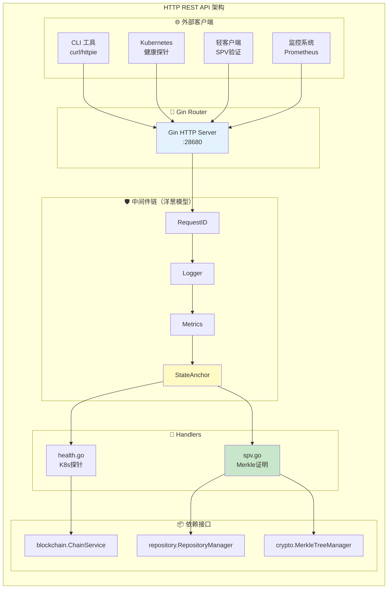
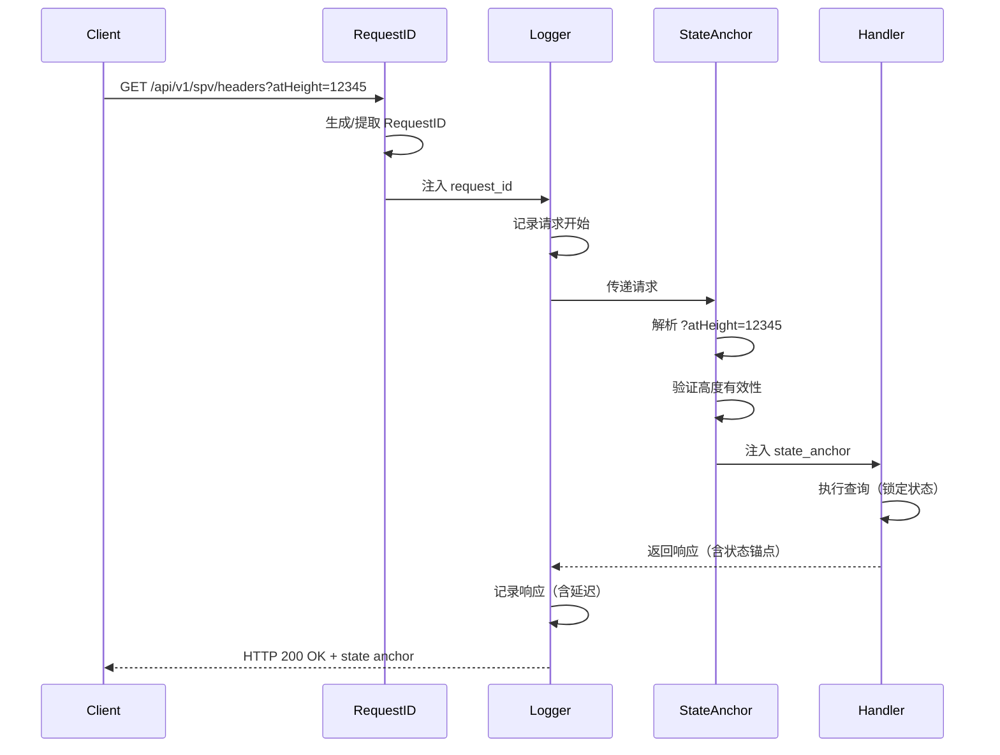
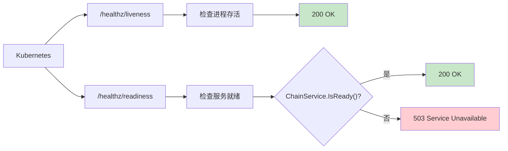
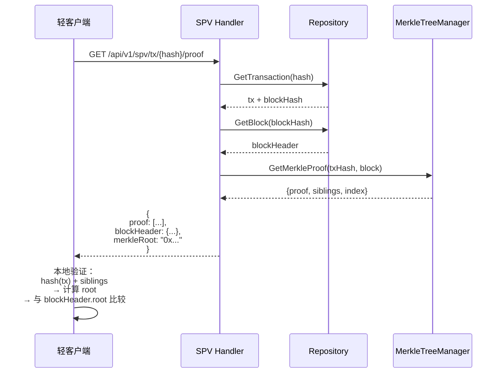
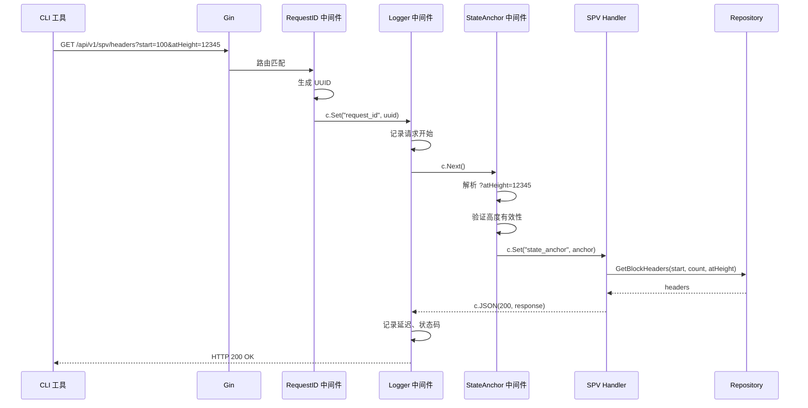

# HTTP REST API 层（internal/api/http）

> **📌 模块类型**：`[X] 实现模块` `[ ] 接口定义` `[ ] 数据结构` `[ ] 工具/其他`

---

## 📍 **模块定位**

　　本模块是 WES 区块链节点的**HTTP REST API 层**，提供人类可读的 RESTful 接口，为运维工具、监控系统、轻客户端提供 HTTP 访问能力，与 JSON-RPC 协议互补。

**解决什么问题**：
- **运维友好**：人类可读的 JSON 响应，便于 CLI 工具和调试
- **监控集成**：Kubernetes 风格的健康检查探针
- **轻客户端支持**：SPV Merkle 证明端点，无需全节点验证
- **状态锚定**：支持 `?atHeight=` 参数锁定查询状态

**不解决什么问题**（边界）：
- ❌ 不实现 JSON-RPC 方法（由 `../jsonrpc/` 负责）
- ❌ 不处理 WebSocket 订阅（由 `../websocket/` 负责）
- ❌ 不实现业务逻辑（调用 `pkg/interfaces/*`）

---

## 🎯 **设计原则与核心约束**

### **设计原则**

| 原则 | 说明 | 价值 |
|------|------|------|
| **RESTful 风格** | 资源导向，标准 HTTP 方法 | 易理解、工具多 |
| **最小化端点** | 仅保留必需的 REST 端点 | 避免与 JSON-RPC 重复 |
| **状态锚定** | 查询支持 `?atHeight=` 参数 | 数据一致性 |
| **中间件驱动** | 核心功能通过中间件实现 | 代码复用、职责分离 |

### **核心约束** ⭐

**严格遵守**：
- ✅ **JSON-RPC 优先**：REST 仅作为 JSON-RPC 的补充，不重复实现相同功能
- ✅ **状态锚定**：所有查询端点必须支持 `?atHeight=` 或 `?atHash=`
- ✅ **中间件完整**：RequestID、Logger、StateAnchor 必须启用
- ✅ **无写端点**：当前无 REST 写操作（使用 JSON-RPC `wes_sendRawTransaction`）

**严格禁止**：
- ❌ **重复 JSON-RPC 功能**：不得实现已有 JSON-RPC 方法的 REST 版本
- ❌ **接收私钥**：任何端点不得接受私钥参数
- ❌ **忽略状态锚定**：查询端点必须处理并返回状态锚点

---

## 🏗️ **架构设计**

### **整体架构**



### **中间件链路**



---

## 📁 **目录结构**

```
http/
├── server.go                   # ✅ Gin HTTP 服务器
├── README.md                   # 本文档
├── handlers/                   # ✅ REST 处理器
│   ├── health.go              # Kubernetes 健康检查
│   ├── health_helpers.go      # 健康检查辅助函数
│   ├── spv.go                 # SPV Merkle 证明端点
│   └── README.md
├── middleware/                 # ✅ 区块链化中间件
│   ├── request_id.go          # RequestID 追踪
│   ├── logger.go              # 统一日志（复用 pkg）
│   ├── state_anchor.go        # 状态锚定
│   ├── signature.go           # 签名验证（预留）
│   ├── metrics.go             # Prometheus 指标（骨架）
│   ├── ratelimit.go           # 匿名限流（骨架）
│   └── README.md
└── types/                      # ✅ HTTP 类型
    ├── error.go               # 错误码定义
    ├── response.go            # 响应结构
    ├── pagination.go          # 分页类型
    └── README.md
```

### **组织原则**

| 文件/目录 | 职责 | 实现状态 | 为什么这样组织 |
|----------|------|---------|---------------|
| **server.go** | Gin 服务器 + 路由注册 | ✅ 完成 | 中心化路由配置 |
| **handlers/** | REST 端点实现 | ✅ 部分完成 | 按功能域分组（health/spv） |
| **middleware/** | 中间件链 | ✅ 核心完成 | 洋葱模型，职责分离 |
| **types/** | 响应/错误类型 | ✅ 完成 | 统一数据格式 |

---

## 📊 **核心机制**

### **机制1：Kubernetes 健康检查**

**为什么需要**：容器编排系统需要探测服务是否健康

**核心思路**：


**关键约束**：
- **Liveness**：简单检查（进程是否运行）
- **Readiness**：复杂检查（是否可处理请求）
- 失败次数达阈值，K8s 自动重启/摘流量

**端点定义**：
```
GET /healthz/liveness   → 200 OK / 500 Error
GET /healthz/readiness  → 200 OK / 503 Service Unavailable
```

---

### **机制2：SPV Merkle 证明**

**为什么需要**：轻客户端无需下载全部区块即可验证交易

**核心思路**：


**关键约束**：
- 必须返回完整 Merkle 路径（siblings + index）
- 必须包含区块头（用于验证 root）
- 证明必须可本地验证（不信任节点）

**端点定义**：
```
GET /api/v1/spv/headers?start={height}&count={n}
GET /api/v1/spv/tx/{hash}/proof
```

---

### **机制3：状态锚定查询**

**为什么需要**：区块链会重组，查询必须锁定在特定状态

**实现方式**：
- 通过 `state_anchor.go` 中间件统一处理
- 支持 `?atHeight=12345` 或 `?atHash=0xabc...`
- 响应中包含实际使用的状态锚点

**示例**：
```bash
# 查询指定高度的区块头
curl "http://localhost:28680/api/v1/spv/headers?start=12345&count=10&atHeight=12345"

# 响应包含状态锚点
{
  "data": {
    "headers": [...],
    "start": 12345,
    "count": 10
  },
  "meta": {
    "height": 12345,
    "hash": "0xabc...",
    "stateRoot": "0xdef..."
  }
}
```

---

## 🔄 **核心流程**

### **完整请求流程**



---

## 🎓 **使用指南**

### **典型场景1：Kubernetes 健康检查**

```yaml
# Deployment 配置
apiVersion: apps/v1
kind: Deployment
metadata:
  name: wes-node
spec:
  template:
    spec:
      containers:
      - name: wes
        image: wes:latest
        ports:
        - containerPort: 28680
        livenessProbe:
          httpGet:
            path: /healthz/liveness
            port: 28680
          initialDelaySeconds: 10
          periodSeconds: 5
          failureThreshold: 3
        readinessProbe:
          httpGet:
            path: /healthz/readiness
            port: 28680
          initialDelaySeconds: 5
          periodSeconds: 3
          failureThreshold: 2
```

---

### **典型场景2：轻客户端验证交易**

```bash
# 1. 获取交易 Merkle 证明
curl -X GET "http://localhost:28680/api/v1/spv/tx/0xabc123.../proof"

# 响应
{
  "data": {
    "txHash": "0xabc123...",
    "blockHeight": 12345,
    "blockHash": "0xdef456...",
    "merkleRoot": "0x789abc...",
    "proof": {
      "index": 5,
      "siblings": [
        "0x111222...",
        "0x333444...",
        "0x555666..."
      ]
    }
  }
}

# 2. 客户端本地验证（伪代码）
function verifySPVProof(tx, proof, blockHeader) {
    let hash = sha256(tx);
    for (let sibling of proof.siblings) {
        hash = sha256(hash + sibling);
    }
    return hash === blockHeader.merkleRoot;
}
```

---

### **典型场景3：curl 调试**

```bash
# 健康检查
curl http://localhost:28680/healthz/liveness

# SPV 区块头列表（带状态锚定）
curl "http://localhost:28680/api/v1/spv/headers?start=100&count=10&atHeight=12345"

# 查看响应头中的 Request-ID
curl -v http://localhost:28680/healthz/liveness 2>&1 | grep X-Request-ID
```

---

### **常见误用**

| 误用方式 | 为什么错误 | 正确做法 |
|---------|-----------|---------|
| 使用 REST 提交交易 | REST 无写端点 | 使用 JSON-RPC `wes_sendRawTransaction` |
| 查询时不带 `atHeight` | 无法保证一致性 | 带上 `?atHeight=` 参数 |
| 依赖 HTML 响应 | REST 仅返回 JSON | 解析 JSON 响应 |
| 绕过中间件直接访问 handler | 丢失 RequestID、日志 | 通过 Gin router 访问 |

---

## ⚠️ **已知限制**

| 限制 | 影响 | 规避方法 | 未来计划 |
|------|------|---------|---------|
| 无 REST 写端点 | 无法通过 REST 提交交易 | 使用 JSON-RPC | 📋 考虑添加 POST /transactions |
| Readiness 检查简化 | 未检查所有依赖 | 查看日志 | 📋 完善检查项（P2P、存储等） |
| 无 OpenAPI 自动生成 | 文档需手动维护 | 参考 docs/openapi.yaml | 📋 集成 Swagger UI |
| Metrics 中间件为骨架 | 无 Prometheus 指标 | 查看日志 | 📋 完整实现 Metrics |

---

## 🔍 **设计权衡记录**

### **权衡1：为什么 REST 不实现交易提交？**

**背景**：可以同时提供 REST 和 JSON-RPC 两种方式提交交易

**备选方案**：
1. **仅 JSON-RPC**：写操作只用 JSON-RPC - 优势：避免重复、生态兼容 - 劣势：REST 不完整
2. **两者都实现**：REST + JSON-RPC - 优势：灵活性 - 劣势：代码重复、维护成本

**选择**：选择了 **仅 JSON-RPC**

**理由**：
- ✅ JSON-RPC 是主协议，生态兼容性最高
- ✅ 避免代码重复和维护负担
- ✅ REST 聚焦运维和监控场景

**代价**：REST 客户端需切换到 JSON-RPC 提交交易

---

### **权衡2：为什么启用 StateAnchor 中间件而非 handler 自行处理？**

**背景**：状态锚定可以在每个 handler 中单独处理

**备选方案**：
1. **中间件统一处理**：state_anchor.go - 优势：代码复用、一致性 - 劣势：增加中间件复杂度
2. **Handler 自行处理**：每个 handler 解析参数 - 优势：灵活 - 劣势：代码重复、易遗漏

**选择**：选择了 **中间件统一处理**

**理由**：
- ✅ 确保所有查询端点一致处理状态锚定
- ✅ 代码复用，减少重复
- ✅ 中间件链模式符合 Gin 最佳实践

**代价**：中间件复杂度略微增加

---

## 📚 **相关文档**

### **内部文档**
- **Handlers**：[handlers/README.md](./handlers/README.md) - 处理器实现
- **Middleware**：[middleware/README.md](./middleware/README.md) - 中间件详细说明
- **Types**：[types/README.md](./types/README.md) - 类型定义
- **Server**：[server.go](./server.go) - 路由配置

### **外部规范**
- **OpenAPI 规范**：[../docs/openapi.yaml](../docs/openapi.yaml) - REST API 规范
- **RESTful 最佳实践**：https://restfulapi.net/

---

## 📋 **文档变更记录**

| 日期 | 变更内容 | 原因 |
|------|---------|------|
| 2025-10-24 | 重构为模板 v3.0 | 对齐实际实现，删除旧内容 |
| 2025-10-24 | 删除挖矿/合约相关段落 | 这些端点不存在 |
| 2025-10-24 | 强调 JSON-RPC 优先原则 | 避免重复实现 |
| 2025-10-24 | 补充中间件链路图 | 清晰展示请求流程 |

---

> 📝 **文档说明**
>
> 本文档遵循 `_docs/templates/README_TEMPLATE.md` v3.0 规范
>
> 🎯 **核心理念**：
> - REST 作为 JSON-RPC 的补充，不重复实现
> - 聚焦运维、监控、轻客户端场景
> - 中间件驱动，统一处理状态锚定、日志、追踪
> - 真实反映当前实现状态
>
> 🔄 **维护指南**：
> - 新增 REST 端点前，确认 JSON-RPC 未实现
> - 所有查询端点必须支持状态锚定
> - 更新端点后同步更新 OpenAPI 规范
> - 保持中间件链的洋葱模型顺序
