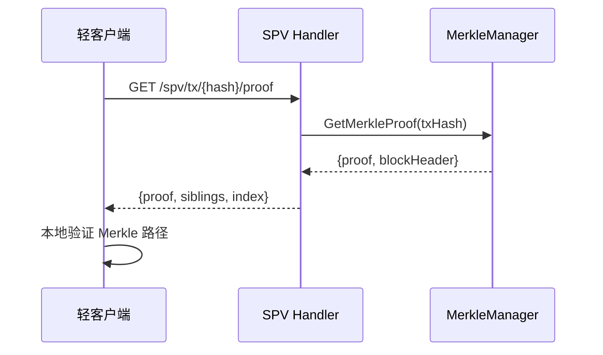

# HTTP 处理器层（internal/api/http/handlers）

> **📌 模块类型**：`[X] 实现模块` `[ ] 接口定义` `[ ] 数据结构` `[ ] 工具/其他`

---

## 📍 **模块定位**

　　本模块实现 WES 区块链节点 HTTP REST API 的**处理器层**，提供健康检查、SPV 证明端点，为运维工具、轻客户端和监控系统提供人类可读的 REST 接口。

**解决什么问题**：
- **健康检查**：Kubernetes 风格的 liveness/readiness 探针
- **SPV 支持**：为轻客户端提供 Merkle 证明
- **运维友好**：人类可读的 JSON 响应

**不解决什么问题**（边界）：
- ❌ 不实现 JSON-RPC 方法（由 `../../jsonrpc/methods/` 负责）
- ❌ 不处理WebSocket订阅（由 `../../websocket/` 负责）
- ❌ 不实现业务逻辑（调用 `pkg/interfaces/*`）

---

## 🎯 **核心约束**

**严格遵守**：
- ✅ **RESTful 风格**：使用标准 HTTP 方法和状态码
- ✅ **状态锚定**：查询端点支持 `?atHeight=` 参数
- ✅ **Kubernetes兼容**：健康检查遵循K8s规范

**严格禁止**：
- ❌ **破坏REST语义**：不得滥用 HTTP 方法
- ❌ **返回 HTML**：仅返回 JSON（除错误页面）
- ❌ **接收私钥**：任何端点不得接受私钥

---

## 📁 **目录结构**

```
handlers/
├── health.go               # ✅ Kubernetes健康检查
├── health_helpers.go       # ✅ 健康检查辅助函数
├── spv.go                  # ✅ SPV Merkle证明端点
└── README.md               # 本文档
```

### **端点列表**

| 文件 | 端点 | 方法 | 用途 |
|------|-----|------|------|
| **health.go** | `/healthz/liveness` | GET | 存活探针（进程是否运行） |
| **health.go** | `/healthz/readiness` | GET | 就绪探针（是否可处理请求） |
| **spv.go** | `/api/v1/spv/headers` | GET | 获取区块头列表 |
| **spv.go** | `/api/v1/spv/tx/{hash}/proof` | GET | 获取交易Merkle证明 |

---

## 📊 **核心机制**

### **机制1：Kubernetes 健康检查**

**为什么需要**：容器编排系统需要探测服务健康状态

**关键约束**：
- **Liveness**：检查进程是否存活（失败则重启容器）
- **Readiness**：检查是否可处理请求（失败则摘除流量）

**实现示例**：
```go
// Liveness：简单检查进程是否运行
func (h *HealthHandler) Liveness(c *gin.Context) {
    c.JSON(http.StatusOK, gin.H{"status": "ok"})
}

// Readiness：检查依赖服务是否就绪
func (h *HealthHandler) Readiness(c *gin.Context) {
    if !h.chainService.IsReady() {
        c.JSON(http.StatusServiceUnavailable, gin.H{"status": "not_ready"})
        return
    }
    c.JSON(http.StatusOK, gin.H{"status": "ready"})
}
```

---

### **机制2：SPV Merkle 证明**

**为什么需要**：轻客户端无需下载全部区块即可验证交易

**核心思路**：


**关键约束**：
- 必须返回完整 Merkle 路径（siblings + index）
- 必须包含区块头（用于验证 Merkle root）
- 证明必须可本地验证（无需信任节点）

---

## 🎓 **使用指南**

### **典型场景1：Kubernetes 健康检查**

```yaml
# Kubernetes Deployment
apiVersion: v1
kind: Pod
spec:
  containers:
  - name: wes-node
    livenessProbe:
      httpGet:
        path: /healthz/liveness
        port: 28680
      initialDelaySeconds: 10
      periodSeconds: 5
    readinessProbe:
      httpGet:
        path: /healthz/readiness
        port: 28680
      initialDelaySeconds: 5
      periodSeconds: 3
```

---

### **典型场景2：轻客户端验证交易**

```bash
# 1. 获取交易 Merkle 证明
curl "http://localhost:28680/api/v1/spv/tx/0xabc.../proof"

# 响应
{
  "txHash": "0xabc...",
  "blockHeight": 12345,
  "blockHash": "0xdef...",
  "merkleRoot": "0x123...",
  "proof": {
    "index": 5,
    "siblings": ["0x111...", "0x222...", "0x333..."]
  }
}

# 2. 客户端本地验证
# - 使用 siblings 计算 Merkle root
# - 与 blockHeader.merkleRoot 比较
```

---

## ⚠️ **已知限制**

| 限制 | 影响 | 规避方法 | 未来计划 |
|------|------|---------|---------|
| Readiness 检查简化 | 未检查所有依赖 | 手动检查日志 | 📋 完善检查项 |
| SPV 仅支持交易证明 | 无状态证明 | 使用完整节点 | 📋 支持状态 MPT 证明 |

---

## 📚 **相关文档**

- **HTTP Server**：[../server.go](../server.go) - 路由注册
- **中间件**：[../middleware/README.md](../middleware/README.md) - 中间件链

---

## 📋 **文档变更记录**

| 日期 | 变更内容 | 原因 |
|------|---------|------|
| 2025-10-24 | 创建本文档 | 补全子目录 README，符合模板 v3.0 |

---

> 📝 **文档说明**  
> 本文档遵循 `_docs/templates/README_TEMPLATE.md` v3.0 规范

