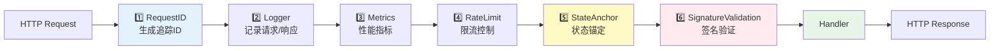
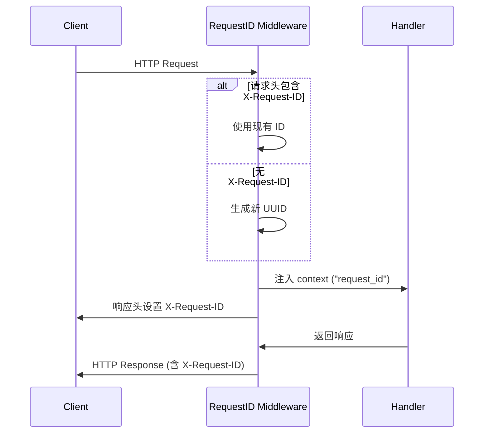
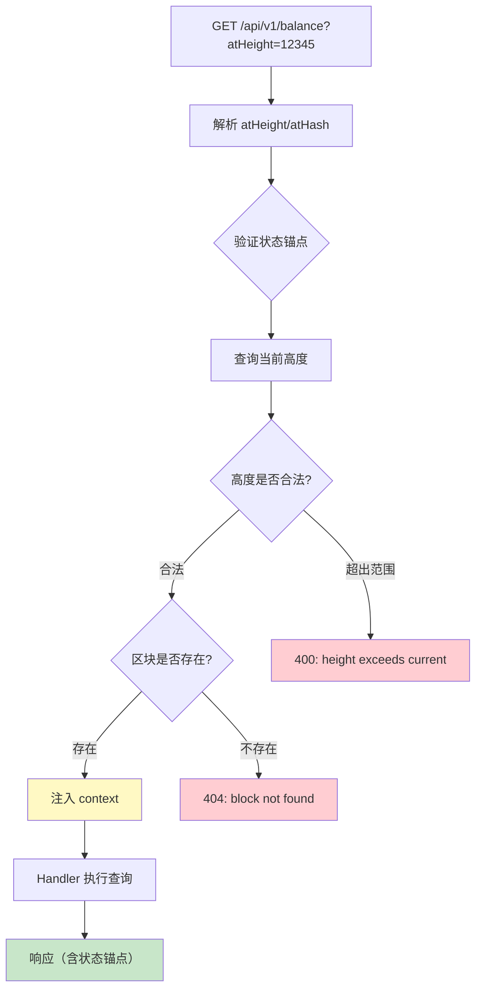
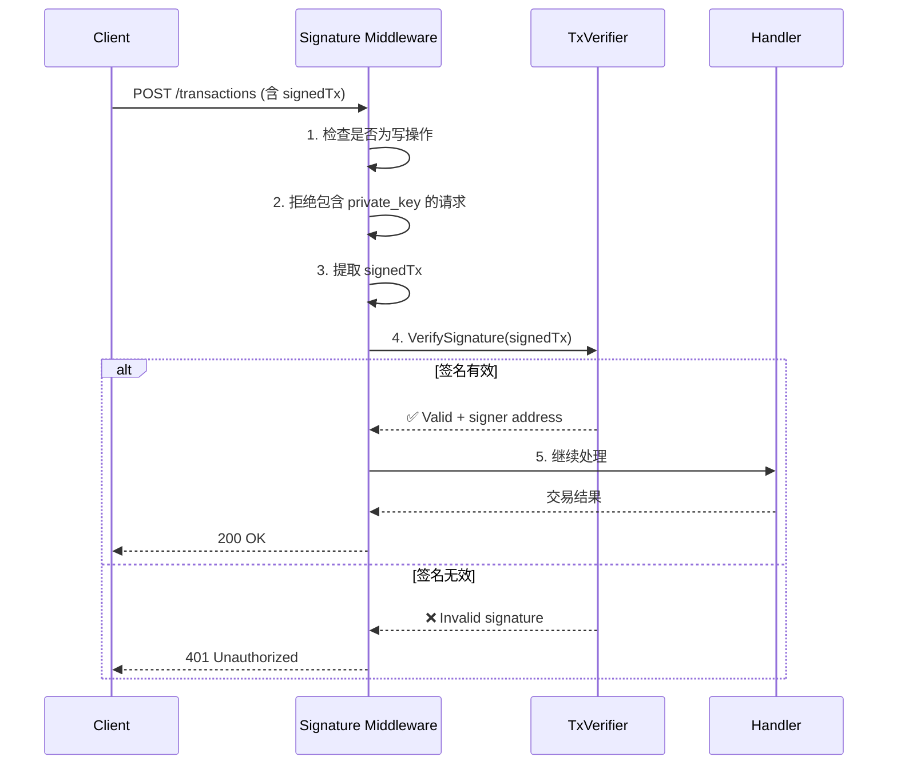
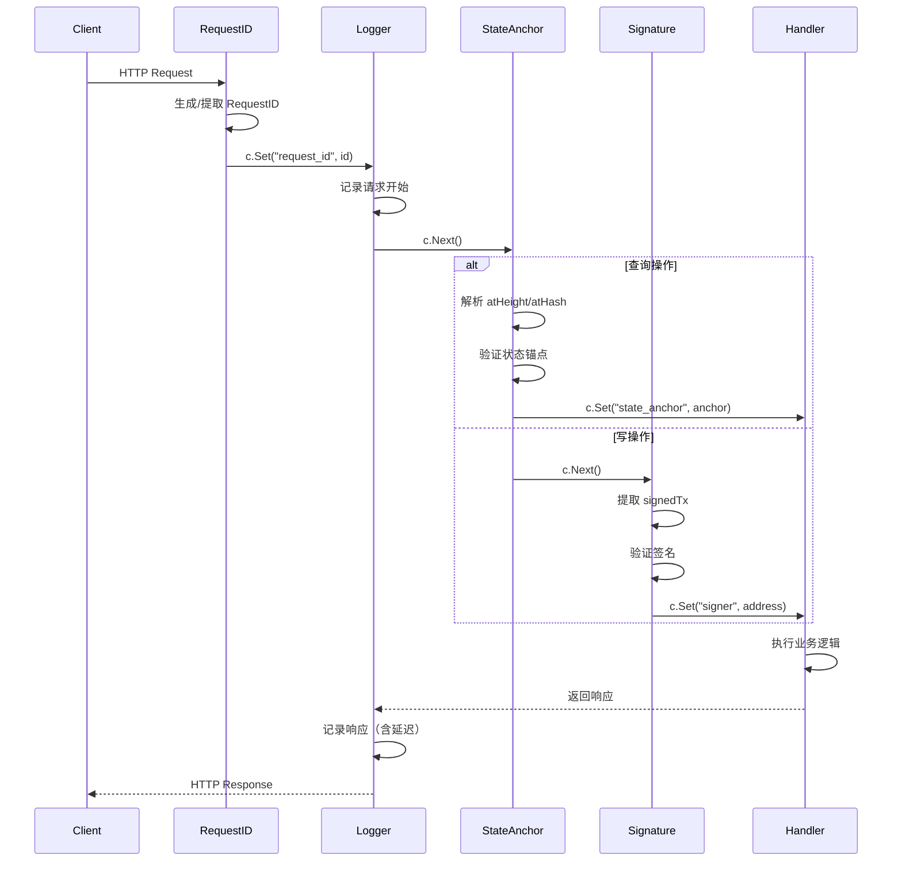

# HTTP 中间件层（internal/api/http/middleware）

> **📌 模块类型**：`[X] 实现模块` `[ ] 接口定义` `[ ] 数据结构` `[ ] 工具/其他`

---

## 📍 **模块定位**

　　本模块是 WES 区块链节点 HTTP API 的**区块链化中间件层**，实现请求追踪、签名验证、状态锚定、限流控制等核心机制，确保 API 的安全性、一致性和可观测性。

**解决什么问题**：
- **零信任安全**：验证已签名交易，拒绝私钥传输
- **状态一致性**：支持 `atHeight`/`atHash` 参数锁定查询状态
- **可观测性**：RequestID 追踪、结构化日志、性能指标
- **防护能力**：匿名限流、重组检测、错误恢复

**不解决什么问题**（边界）：
- ❌ 不实现业务逻辑（由 handler 负责）
- ❌ 不处理路由匹配（由 Gin 框架负责）
- ❌ 不验证交易细节（由 TxVerifier 负责）

---

## 🎯 **设计原则与核心约束**

### **设计原则**

| 原则 | 说明 | 价值 |
|------|------|------|
| **洋葱模型（Onion Model）** | 中间件按顺序包裹，形成处理链 | 清晰的职责分离与组合 |
| **单一职责** | 每个中间件只做一件事 | 易测试、易维护、易扩展 |
| **复用基础接口** | 依赖 `pkg/interfaces/infrastructure/*` | 避免重复造轮子 |
| **快速失败** | 在中间件层提前拦截无效请求 | 减少下游负载 |

### **核心约束** ⭐

**严格遵守**：
- ✅ **执行顺序固定**：RequestID → Logger → (Metrics) → (RateLimit) → StateAnchor → (SignatureValidation)
- ✅ **依赖接口而非实现**：使用 `log.Logger`、`crypto.SignatureVerifier` 等接口
- ✅ **幂等性**：同一请求多次通过中间件，结果一致
- ✅ **透明传递**：中间件应透明传递 context，不阻塞正常流程

**严格禁止**：
- ❌ **破坏顺序**：不得随意调整中间件执行顺序
- ❌ **直接依赖具体实现**：不得直接 `import "go.uber.org/zap"`
- ❌ **阻塞请求**：不得在中间件中执行长时间阻塞操作
- ❌ **修改业务数据**：中间件只能注入元数据，不能修改业务 payload

---

## 🏗️ **架构设计**

### **中间件执行顺序（洋葱模型）**



**为什么这个顺序**：
1. **RequestID 最先**：生成追踪 ID，供后续中间件和 handler 使用
2. **Logger 第二**：记录完整请求生命周期（包括后续中间件的日志）
3. **Metrics 第三**：统计所有请求（包括被限流的）
4. **RateLimit 第四**：提前拦截超限请求，减少下游负载
5. **StateAnchor 第五**：验证查询锚点有效性（仅查询操作）
6. **SignatureValidation 最后**：验证写操作签名（最昂贵的操作）

---

## 📁 **目录结构**

```
middleware/
├── request_id.go           # ✅ RequestID 中间件（追踪）
├── logger.go               # ✅ Logger 中间件（复用 pkg/interfaces/log）
├── metrics.go              # ⏳ Metrics 中间件（Prometheus 骨架）
├── ratelimit.go            # ⏳ RateLimit 中间件（匿名限流骨架）
├── state_anchor.go         # ✅ StateAnchor 中间件（atHeight/atHash）
├── signature.go            # ✅ SignatureValidation 中间件（零信任）
└── README.md               # 本文档
```

### **组织原则**

| 文件 | 职责 | 实现状态 | 为什么这样组织 |
|------|------|---------|---------------|
| **request_id.go** | 生成/提取 RequestID | ✅ 完成 | 独立文件，包含 `GetRequestID` 工具函数 |
| **logger.go** | 结构化日志记录 | ✅ 完成 | 复用 `pkg/interfaces/infrastructure/log.Logger` |
| **state_anchor.go** | 状态锚定验证 | ✅ 完成 | 区块链特有，支持 EIP-1898 风格查询 |
| **signature.go** | 交易签名验证 | ✅ 完成 | 零信任核心，预留给写端点 |
| **metrics.go** | Prometheus 指标 | ⏳ 骨架 | 后续集成 Prometheus/Grafana |
| **ratelimit.go** | 匿名限流 | ⏳ 骨架 | 后续实现 IP/ASN 限流策略 |

---

## 📊 **核心机制**

### **机制1：RequestID 追踪**

**为什么需要**：分布式系统中追踪单个请求的完整生命周期

**核心思路**：


**关键约束**：
- 优先使用客户端提供的 RequestID（支持跨服务追踪）
- 必须在响应头中返回 RequestID
- RequestID 必须注入到 context 供下游使用

---

### **机制2：状态锚定（State Anchor）**

**为什么需要**：区块链会发生重组，查询必须锁定在特定状态

**核心思路**：


**关键约束**：
- 仅对查询操作启用（`isQueryOperation` 判断）
- 必须验证高度不超过当前链高度
- 必须验证区块哈希存在
- 响应中必须包含实际使用的状态锚点

---

### **机制3：签名验证（Zero-Trust）**

**为什么需要**：节点不应信任客户端，必须验证交易签名

**核心思路**：


**关键约束**：
- 仅对写操作启用
- 必须拒绝包含 `private_key` 字段的请求
- 必须恢复签名者地址并注入 context
- 签名验证失败必须立即返回 401

**设计权衡**：

| 方案 | 优势 | 劣势 | 为什么选择 |
|------|------|------|-----------|
| **中间件验证** | 统一验证、代码复用 | 增加中间件复杂度 | ✅ 符合零信任原则，所有写操作统一防护 |
| Handler 自行验证 | 灵活性高 | 代码重复、易遗漏 | ❌ 不安全，容易遗漏验证 |

---

### **机制4：统一日志（Logger）**

**为什么需要**：复用系统统一日志接口，避免重复造轮子

**核心思路**：
```go
// ✅ 正确：依赖接口
import infralog "github.com/weisyn/v1/pkg/interfaces/infrastructure/log"

type Logger struct {
    logger infralog.Logger  // 接口
}

func (m *Logger) Middleware() gin.HandlerFunc {
    return func(c *gin.Context) {
        // 优先使用底层 zap（结构化日志）
        zl := m.logger.GetZapLogger()
        if zl != nil {
            zl.Info("HTTP request", zap.String("path", c.Request.URL.Path))
            return
        }
        
        // 回退：文本日志
        m.logger.Info(fmt.Sprintf("HTTP request: %s", c.Request.URL.Path))
    }
}
```

**关键约束**：
- 必须依赖 `pkg/interfaces/infrastructure/log.Logger` 接口
- 通过 `GetZapLogger()` 获取底层实现用于结构化日志
- 提供文本日志回退机制

---

## 🔄 **核心流程**

### **完整请求流程**



---

## 🎓 **使用指南**

### **典型场景1：查询区块（含状态锚定）**

```bash
# 查询指定高度的区块
curl "http://localhost:28680/api/v1/blocks/latest?atHeight=12345" \
  -H "X-Request-ID: test-req-001"

# 响应包含状态锚点
{
  "block": {...},
  "height": 12345,
  "hash": "0xabc...",
  "stateRoot": "0xdef..."
}
```

**关键点**：
- 输入要满足：高度不超过当前链高度
- 输出保证：响应含实际查询状态
- 注意事项：重组后相同高度可能返回不同区块

---

### **典型场景2：提交已签名交易**

```bash
# 提交交易（客户端已签名）
curl -X POST "http://localhost:28680/api/v1/transactions" \
  -H "Content-Type: application/json" \
  -d '{
    "signedTx": "0x123abc...",
    "txHash": "0xdef456..."
  }'

# ❌ 错误：包含私钥会被拒绝
curl -X POST "http://localhost:28680/api/v1/transactions" \
  -d '{
    "private_key": "0x...",  // ❌ 签名中间件拒绝
    "to": "0x456...",
    "value": "1000"
  }'
```

**关键点**：
- 输入要满足：已在客户端签名
- 输出保证：签名有效 or 401 拒绝
- 注意事项：任何包含私钥的请求都会被拒绝

---

### **常见误用**

| 误用方式 | 为什么错误 | 正确做法 |
|---------|-----------|---------|
| 在 handler 中验证签名 | 中间件已统一验证 | 使用中间件注入的 `signer` |
| 直接 `import "go.uber.org/zap"` | 绕过统一日志接口 | 使用 `pkg/interfaces/infrastructure/log.Logger` |
| 调整中间件顺序 | 破坏洋葱模型 | 严格按文档顺序 |
| 查询时不处理状态锚点 | 无法保证一致性 | 从 context 获取 `state_anchor` |

---

## ⚠️ **已知限制**

| 限制 | 影响 | 规避方法 | 未来计划 |
|------|------|---------|---------|
| Metrics 仅骨架 | 无性能监控数据 | 手动查看日志 | 📋 集成 Prometheus |
| RateLimit 仅骨架 | 无 DoS 防护 | 依赖网关/CDN | 📋 实现 IP/ASN 限流 |
| SignatureValidation 未启用 | 当前无写端点 | 暂不影响 | 📋 开放写端点时启用 |
| StateAnchor 不支持 finalized | 仅支持 latest/specific height | 使用确认数判断 | 📋 支持 finalized 标签 |

---

## 🔍 **设计权衡记录**

### **权衡1：为什么 Logger 复用 pkg 接口而非直接用 zap？**

**背景**：需要记录结构化日志

**备选方案**：
1. **复用接口**：依赖 `pkg/interfaces/infrastructure/log.Logger` - 优势：统一管理、易测试 - 劣势：多一层抽象
2. **直接用 zap**：`import "go.uber.org/zap"` - 优势：直接、简单 - 劣势：重复造轮子、难以替换

**选择**：选择了 **复用接口**

**理由**：
- ✅ 符合架构规范（internal 依赖 pkg）
- ✅ 易于 mock 测试
- ✅ 可替换日志实现（logrus/zerolog）

**代价**：多一层 `GetZapLogger()` 调用

---

### **权衡2：为什么 StateAnchor 放在 SignatureValidation 之前？**

**背景**：两个中间件都可能拒绝请求

**备选方案**：
1. **StateAnchor 先**：验证状态锚点 → 验证签名 - 优势：快速失败（状态验证更快） - 劣势：无
2. **Signature 先**：验证签名 → 验证状态锚点 - 优势：无 - 劣势：签名验证昂贵，浪费资源

**选择**：选择了 **StateAnchor 先**

**理由**：
- ✅ 状态锚点验证更快（仅查询链高度）
- ✅ 快速拒绝无效查询，减少签名验证负载
- ✅ 查询操作比写操作频繁，优化查询路径

**代价**：无

---

## 📚 **相关文档**

- **架构设计**：[../README.md](../README.md) - API 网关整体架构
- **日志接口**：[../../../../pkg/interfaces/infrastructure/log/log.go](../../../../pkg/interfaces/infrastructure/log/log.go)
- **签名验证接口**：[../../../../pkg/interfaces/infrastructure/crypto/signature.go](../../../../pkg/interfaces/infrastructure/crypto/signature.go)
- **HTTP Server**：[../server.go](../server.go) - 中间件装配

---

## 📋 **文档变更记录**

| 日期 | 变更内容 | 原因 |
|------|---------|------|
| 2025-10-24 | 创建本文档 | 补全子目录 README，符合模板 v3.0 |
| 2025-10-24 | 记录 Logger 重构为复用 pkg 接口 | 消除重复造轮子 |
| 2025-10-24 | 标注 Metrics/RateLimit 为骨架状态 | 真实反映实现现状 |

---

> 📝 **文档说明**
>
> 本文档遵循 `_docs/templates/README_TEMPLATE.md` v3.0 规范
>
> 🎯 **核心理念**：
> - 洋葱模型：清晰的执行顺序
> - 复用基础接口：避免重复造轮子
> - 快速失败：在中间件层提前拦截
> - 真实状态：诚实标注实现进度
>
> 🔄 **维护指南**：
> - 新增中间件时，明确其在洋葱模型中的位置
> - 更新实现状态标记（✅ 完成 / ⏳ 骨架）
> - 记录设计权衡，尤其是执行顺序相关决策

