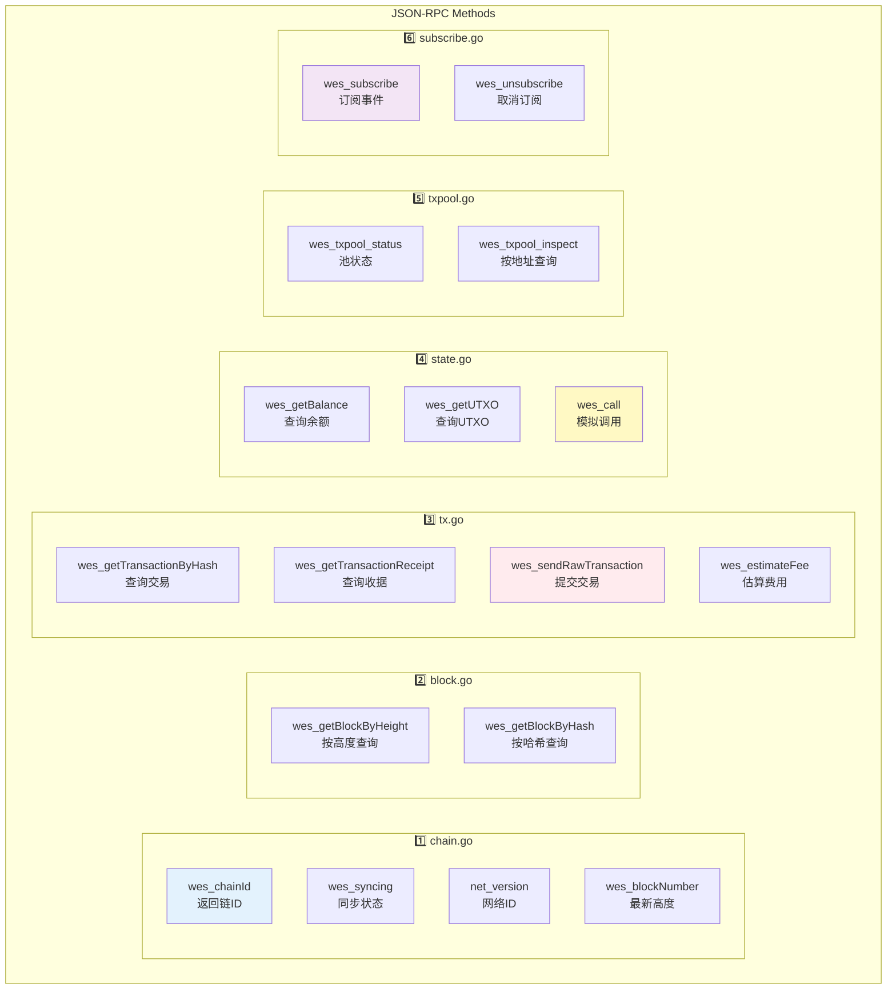
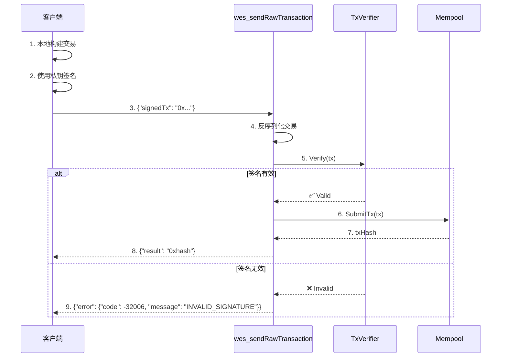
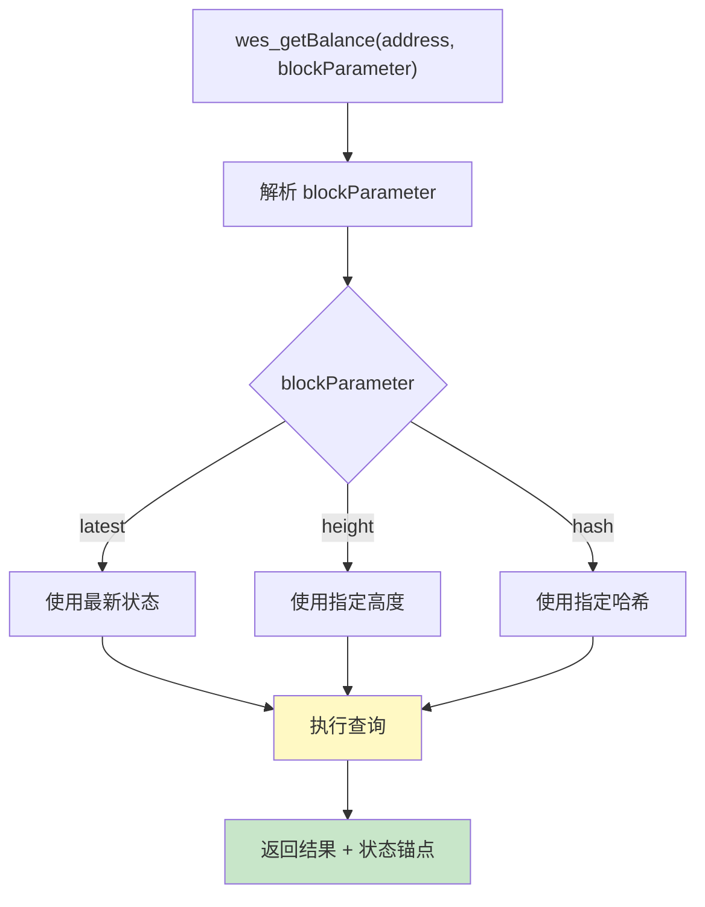
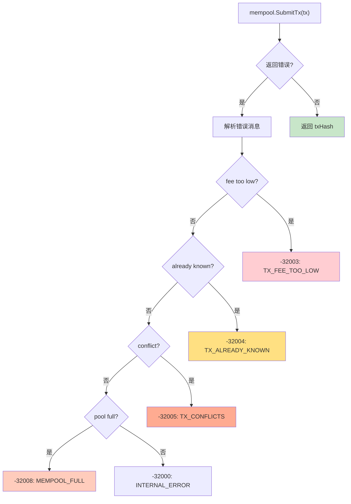

# JSON-RPC 方法实现层（internal/api/jsonrpc/methods）

> **📌 模块类型**：`[X] 实现模块` `[ ] 接口定义` `[ ] 数据结构` `[ ] 工具/其他`

---

## 📍 **模块定位**

　　本模块是 WES 区块链节点 JSON-RPC 协议的**方法实现层**，按职责分组实现 19 个核心 RPC 方法，为 DApp、钱包、区块浏览器提供符合 JSON-RPC 2.0 规范的标准接口。

**解决什么问题**：
- **生态兼容**：实现与 Ethereum RPC 兼容的方法，支持 web3.js/ethers.js 直接使用
- **职责分离**：按功能域分组（chain/block/tx/state/txpool/subscribe），清晰的代码组织
- **零信任实现**：所有写操作接收已签名交易，不处理私钥

**不解决什么问题**（边界）：
- ❌ 不实现业务逻辑（调用 `pkg/interfaces/*`）
- ❌ 不处理协议编解码（由 `../types/` 负责）
- ❌ 不管理WebSocket连接（由 `../../websocket/` 负责）

---

## 🎯 **设计原则与核心约束**

### **设计原则**

| 原则 | 说明 | 价值 |
|------|------|------|
| **按职责分组** | 链信息、区块、交易、状态、交易池、订阅独立文件 | 易查找、易维护 |
| **薄接口层** | 仅做参数校验、调用接口、返回结果 | 职责单一、易测试 |
| **错误码标准化** | 使用 `types/errors.go` 定义的标准错误 | 客户端易处理 |
| **状态锚定支持** | 查询方法支持 `atHeight`/`atHash` 参数 | 数据一致性 |

### **核心约束** ⭐

**严格遵守**：
- ✅ **JSON-RPC 2.0 规范**：方法签名、错误格式必须符合规范
- ✅ **WES 方法前缀**：所有方法使用 `wes_` 前缀（如 `wes_getBlockByHeight`）
- ✅ **零信任**：写操作仅接受 `signedTx`，不接受私钥
- ✅ **状态锚定**：查询方法必须支持 `blockParameter`（height/hash/latest）

**严格禁止**：
- ❌ **接收私钥**：任何方法不得接受 `private_key` 参数
- ❌ **直接操作存储**：必须通过 `repository` 接口访问数据
- ❌ **实现业务逻辑**：不得在方法中实现转账/质押等业务逻辑
- ❌ **同步订阅**：订阅方法仅注册订阅，不推送数据（WebSocket 负责）

---

## 🏗️ **架构设计**

### **方法分组架构**



**为什么这样分组**：
1. **chain.go**：链全局信息，不涉及具体数据查询
2. **block.go**：区块查询，独立于交易和状态
3. **tx.go**：交易相关，包括查询和提交
4. **state.go**：状态查询（余额、UTXO、模拟调用）
5. **txpool.go**：内存池专用，与已确认交易分离
6. **subscribe.go**：订阅管理，与查询逻辑分离

---

## 📁 **目录结构**

```
methods/
├── chain.go            # ✅ 链信息方法（4个）
├── block.go            # ✅ 区块查询方法（2个）
├── tx.go               # ✅ 交易方法（4个）
├── state.go            # ✅ 状态查询方法（3个）
├── txpool.go           # ✅ 交易池方法（2个）
├── subscribe.go        # ✅ 订阅方法（2个）
└── README.md           # 本文档
```

### **组织原则**

| 文件 | 方法数 | 核心职责 | 为什么这样组织 |
|------|-------|---------|---------------|
| **chain.go** | 4 | 链全局信息 | 不涉及具体数据，独立性强 |
| **block.go** | 2 | 区块查询 | 区块是基础数据单元 |
| **tx.go** | 4 | 交易查询+提交 | 交易是核心操作，方法最多 |
| **state.go** | 3 | 账户状态查询 | 状态查询逻辑复杂，独立文件 |
| **txpool.go** | 2 | 内存池查询 | 内存池是独立组件 |
| **subscribe.go** | 2 | 订阅管理 | 仅注册订阅，实际推送由 WS 负责 |

---

## 📊 **核心机制**

### **机制1：零信任交易提交**

**为什么需要**：节点不应信任客户端，必须验证交易签名

**核心思路**：


**关键约束**：
- 客户端必须本地签名，私钥不离开客户端
- 节点仅验证签名，不生成或存储私钥
- 验证失败返回标准错误码 `-32006`

**实现示例**（`tx.go`）：
```go
func (m *TxMethods) SendRawTransaction(ctx context.Context, params json.RawMessage) (interface{}, error) {
    // 1. 解析参数
    var args []string
    if err := json.Unmarshal(params, &args); err != nil {
        return nil, types.ErrInvalidParams(err.Error())
    }
    
    // 2. 反序列化交易
    txBytes, _ := hex.DecodeString(strings.TrimPrefix(args[0], "0x"))
    txObj := &txpb.Transaction{}
    proto.Unmarshal(txBytes, txObj)
    
    // 3. 验证签名（零信任）
    if err := m.txVerifier.Verify(ctx, txObj); err != nil {
        return nil, types.ErrInvalidSignature(err.Error())
    }
    
    // 4. 提交到内存池
    _, err := m.mempool.SubmitTx(txObj)
    if err != nil {
        return nil, mapMempoolError(err)  // 细化错误码
    }
    
    return "0x" + hex.EncodeToString(txHash), nil
}
```

---

### **机制2：状态锚定查询**

**为什么需要**：区块链会重组，查询必须锁定在特定状态

**核心思路**：


**关键约束**：
- 所有查询方法必须支持 `blockParameter`（可选参数，默认 `latest`）
- 响应必须包含实际使用的状态锚点（`height`、`hash`、`stateRoot`）
- 重组后相同高度可能返回不同结果

**实现示例**（`state.go`）：
```go
func (m *StateMethods) GetBalance(ctx context.Context, params json.RawMessage) (interface{}, error) {
    var args []interface{}
    json.Unmarshal(params, &args)
    
    address := args[0].(string)
    blockParam := "latest"
    if len(args) > 1 {
        blockParam = args[1].(string)
    }
    
    // 解析状态锚点
    height, hash, err := parseBlockParameter(blockParam)
    
    // 查询余额（锁定状态）
    balance, err := m.accountService.GetBalance(ctx, address, height)
    
    // 返回结果（含状态锚点）
    return map[string]interface{}{
        "balance":   balance,
        "height":    height,
        "hash":      hash,
        "stateRoot": stateRoot,
    }, nil
}
```

---

### **机制3：内存池错误细化**

**为什么需要**：客户端需要详细错误信息来重试或调整参数

**核心思路**：


**关键约束**：
- 必须将内存池错误映射为标准 JSON-RPC 错误码
- 提供 `hint` 字段指导用户（如 "Use wes_estimateFee"）
- 包含详细错误上下文（如冲突的 UTXO）

**实现示例**（`tx.go`）：
```go
func mapMempoolError(err error) *types.RPCError {
    errMsg := err.Error()
    
    if strings.Contains(errMsg, "fee too low") {
        return types.ErrTxFeeTooLow(map[string]interface{}{
            "error": errMsg,
            "hint":  "Use wes_estimateFee to get recommended fee rate",
        })
    }
    
    if strings.Contains(errMsg, "already known") {
        return types.ErrTxAlreadyKnown(txHash)
    }
    
    if strings.Contains(errMsg, "conflict") {
        return types.ErrTxConflicts(map[string]interface{}{
            "error": errMsg,
            "hint":  "One or more inputs are already spent",
        })
    }
    
    if strings.Contains(errMsg, "pool is full") {
        return types.ErrMempoolFull()
    }
    
    return types.ErrInternalError(errMsg)
}
```

---

## 🎓 **使用指南**

### **典型场景1：web3.js 查询区块**

```javascript
const Web3 = require('web3');
const web3 = new Web3('http://localhost:28680');

// 查询最新区块
const block = await web3.eth.getBlock('latest');
console.log('Block:', block.number, block.hash);

// 查询指定高度区块（状态锚定）
const historicalBlock = await web3.eth.getBlock(12345);
console.log('Historical:', historicalBlock.number);
```

**映射关系**：
- `web3.eth.getBlock('latest')` → `wes_getBlockByHeight([], "latest")`
- `web3.eth.getBlock(12345)` → `wes_getBlockByHeight([12345])`

---

### **典型场景2：提交已签名交易**

```javascript
// 1. 客户端签名
const signedTx = await web3.eth.accounts.signTransaction({
    from: '0x123...',
    to: '0x456...',
    value: web3.utils.toWei('1', 'ether'),
    gas: 21000
}, privateKey);

// 2. 提交到节点
const receipt = await web3.eth.sendSignedTransaction(signedTx.rawTransaction);
console.log('TxHash:', receipt.transactionHash);
```

**映射关系**：
- `web3.eth.sendSignedTransaction(rawTx)` → `wes_sendRawTransaction([rawTx])`

**错误处理**：
```javascript
try {
    await web3.eth.sendSignedTransaction(rawTx);
} catch (error) {
    if (error.code === -32003) {
        console.error('Fee too low:', error.message);
        // 使用 wes_estimateFee 重新估算
    } else if (error.code === -32004) {
        console.warn('Tx already known:', error.message);
        // 交易已存在，无需重试
    }
}
```

---

### **常见误用**

| 误用方式 | 为什么错误 | 正确做法 |
|---------|-----------|---------|
| 传递私钥到 `wes_sendRawTransaction` | 违反零信任原则 | 客户端签名后传递 `signedTx` |
| 查询时不处理状态锚点 | 重组后数据不一致 | 使用 `blockParameter` 锁定状态 |
| 忽略 `wes_txpool_inspect` 的地址匹配限制 | 当前为简化实现 | 参考注释中的优化方向 |
| 在 HTTP 上使用 `wes_subscribe` | 订阅仅支持 WebSocket | 使用 WebSocket 连接 |

---

## ⚠️ **已知限制**

| 限制 | 影响 | 规避方法 | 未来计划 |
|------|------|---------|---------|
| `wes_txpool_inspect` 地址匹配简化 | 仅匹配单密钥证明 | 使用完整 UTXO 查询 | 📋 规范化 sender 推导 |
| `wes_call` 未实现完整模拟 | 无法模拟复杂合约调用 | 使用本地 WASM 引擎 | 📋 集成 WASM 引擎 |
| `wes_subscribe` 仅注册订阅 | 不推送实时数据 | 必须使用 WebSocket | ✅ WebSocket 已实现 |
| 状态锚定不支持 `finalized` | 仅支持 `latest`/具体高度 | 使用确认数判断 | 📋 支持 finalized 标签 |

---

## 🔍 **设计权衡记录**

### **权衡1：为什么按功能分组而非按协议版本？**

**背景**：可以按 `v1.go`、`v2.go` 组织

**备选方案**：
1. **按功能分组**：chain/block/tx/state/txpool/subscribe - 优势：职责清晰、易查找 - 劣势：版本升级需改多个文件
2. **按版本分组**：v1/v2/v3 - 优势：版本隔离 - 劣势：功能分散、难维护

**选择**：选择了 **按功能分组**

**理由**：
- ✅ JSON-RPC 方法向后兼容，极少破坏性变更
- ✅ 功能域内聚性强，修改集中
- ✅ 易于新人快速定位方法实现

**代价**：版本升级时需同步修改多个文件

---

### **权衡2：为什么订阅方法仅注册订阅，不推送数据？**

**背景**：订阅可以在 methods 层直接推送

**备选方案**：
1. **仅注册**：methods 注册订阅，websocket 负责推送 - 优势：职责分离、易测试 - 劣势：需要两个模块协作
2. **直接推送**：methods 直接操作 WebSocket 连接 - 优势：代码集中 - 劣势：职责混乱、难测试

**选择**：选择了 **仅注册**

**理由**：
- ✅ methods 层不应关心传输协议（HTTP/WebSocket）
- ✅ WebSocket 管理连接生命周期更合理
- ✅ 易于 mock 测试（无需 WebSocket 环境）

**代价**：需要 methods 和 websocket 模块协作

---

## 📚 **相关文档**

- **JSON-RPC Server**：[../server.go](../server.go) - 方法注册
- **错误码定义**：[../types/errors.go](../types/errors.go) - 标准错误码
- **接口定义**：[../../../../pkg/interfaces/](../../../../pkg/interfaces/) - 依赖的接口
- **JSON-RPC 规范**：[../../docs/jsonrpc_spec.md](../../docs/jsonrpc_spec.md) - 完整方法文档

---

## 📋 **文档变更记录**

| 日期 | 变更内容 | 原因 |
|------|---------|------|
| 2025-10-24 | 创建本文档 | 补全子目录 README，符合模板 v3.0 |
| 2025-10-24 | 记录错误码细化机制 | TX_FEE_TOO_LOW/TX_CONFLICTS 等已实现 |
| 2025-10-24 | 标注 txpool.inspect 地址匹配限制 | 真实反映简化实现现状 |

---

> 📝 **文档说明**
>
> 本文档遵循 `_docs/templates/README_TEMPLATE.md` v3.0 规范
>
> 🎯 **核心理念**：
> - 按功能分组：清晰的职责划分
> - 零信任实现：所有写操作验证签名
> - 错误码细化：客户端友好的错误处理
> - 状态锚定：保证数据一致性
>
> 🔄 **维护指南**：
> - 新增方法时，选择合适的分组文件
> - 所有查询方法必须支持 `blockParameter`
> - 写操作必须验证签名并细化错误码
> - 更新方法列表到 `../server.go` 和 `../../docs/jsonrpc_spec.md`

