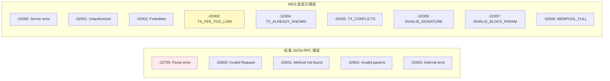
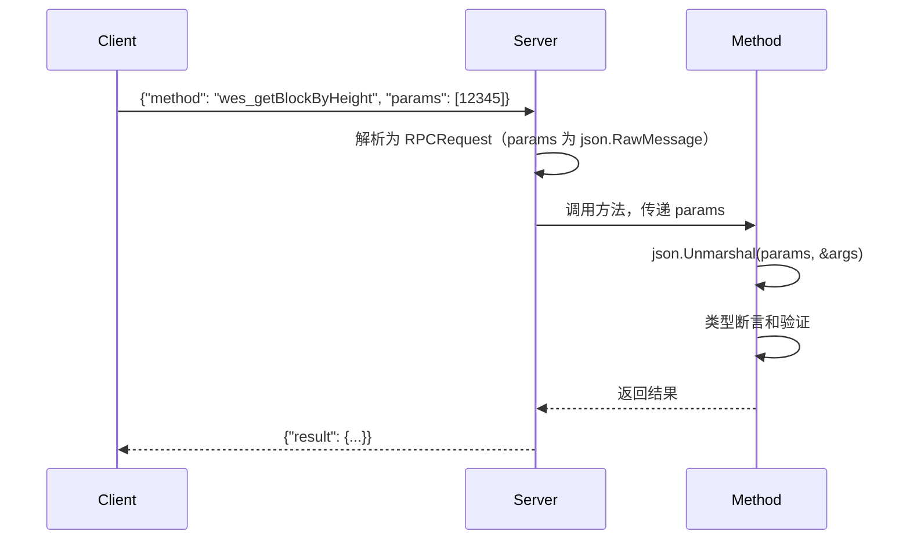

# JSON-RPC 类型定义（internal/api/jsonrpc/types）

> **📌 模块类型**：`[ ] 实现模块` `[ ] 接口定义` `[X] 数据结构` `[ ] 工具/其他`

---

## 📍 **模块定位**

　　本模块定义 JSON-RPC 2.0 协议的**请求、响应和错误类型**，确保与规范严格一致，为方法实现提供类型安全的基础。

**解决什么问题**：
- **协议合规**：严格符合 JSON-RPC 2.0 规范的类型定义
- **错误标准化**：统一的错误码体系（标准 + WES 自定义）
- **类型安全**：编译时类型检查，减少运行时错误

**不解决什么问题**（边界）：
- ❌ 不实现业务逻辑（由 `../methods/` 负责）
- ❌ 不处理序列化（由 `encoding/json` 负责）
- ❌ 不管理WebSocket连接（由 `../../websocket/` 负责）

---

## 🎯 **设计原则与核心约束**

### **设计原则**

| 原则 | 说明 | 价值 |
|------|------|------|
| **规范至上** | 严格遵循 JSON-RPC 2.0 规范 | 生态兼容 |
| **错误分级** | 标准错误 + WES 自定义错误 | 清晰的错误语义 |
| **类型明确** | 使用强类型，避免 `interface{}` | 编译时检查 |

### **核心约束** ⭐

**严格遵守**：
- ✅ **JSON-RPC 2.0 规范**：`jsonrpc: "2.0"`、`id`、`method`、`params` 结构
- ✅ **错误码范围**：`-32768` 至 `-32000` 为标准，`-32000` 至 `-32099` 为自定义
- ✅ **ID 类型**：支持 `string`、`number`、`null`
- ✅ **批量请求**：支持数组形式的批量调用

**严格禁止**：
- ❌ **破坏规范**：不得添加非规范字段到顶层
- ❌ **错误码冲突**：不得使用保留错误码范围
- ❌ **修改标准字段**：`jsonrpc`/`id`/`method` 不可变

---

## 📦 **类型体系**

### **类型全景**

```mermaid
classDiagram
    class RPCRequest {
        +string Jsonrpc
        +interface{} ID
        +string Method
        +json.RawMessage Params
    }
    
    class RPCResponse {
        +string Jsonrpc
        +interface{} ID
        +interface{} Result
        +*RPCError Error
    }
    
    class RPCError {
        +int Code
        +string Message
        +interface{} Data
    }
    
    RPCResponse --> RPCError : contains
```

### **类型说明**

| 类型 | 用途 | 设计考虑 | 不变性约束 |
|------|------|---------|-----------|
| **RPCRequest** | 请求封装 | `Params` 使用 `json.RawMessage` 延迟解析 | `Jsonrpc` 必须为 `"2.0"` |
| **RPCResponse** | 响应封装 | `Result` 和 `Error` 互斥（仅一个非空） | `ID` 必须与请求匹配 |
| **RPCError** | 错误封装 | `Data` 可选，提供额外错误上下文 | `Code` 必须在规范范围内 |

---

## 📁 **目录结构**

```
types/
├── request.go          # ✅ 请求类型定义
├── response.go         # ✅ 响应类型定义
├── errors.go           # ✅ 错误码定义
└── README.md           # 本文档
```

### **组织原则**

| 文件 | 职责 | 为什么这样组织 |
|------|------|---------------|
| **request.go** | 请求结构定义 | 单独文件，便于扩展批量请求 |
| **response.go** | 响应结构定义 | 与 request 对应，职责对称 |
| **errors.go** | 错误码与构造函数 | 集中管理所有错误码 |

---

## 📊 **核心机制**

### **机制1：错误码分级**

**为什么需要**：区分标准协议错误和 WES 业务错误

**错误码范围**：



**关键约束**：
- 标准错误用于协议层问题（解析、方法不存在等）
- 自定义错误用于业务层问题（交易验证、状态查询等）
- 自定义错误码必须在 `-32000` 至 `-32099` 范围

**实现示例**（`errors.go`）：
```go
// 标准 JSON-RPC 错误码
const (
    CodeParseError     = -32700
    CodeInvalidRequest = -32600
    CodeMethodNotFound = -32601
    CodeInvalidParams  = -32602
    CodeInternalError  = -32603
)

// WES 自定义错误码
const (
    CodeServerError         = -32000
    CodeUnauthorized        = -32001
    CodeForbidden           = -32002
    CodeTxFeeTooLow        = -32003
    CodeTxAlreadyKnown     = -32004
    CodeTxConflicts        = -32005
    CodeInvalidSignature   = -32006
    CodeInvalidBlockParam  = -32007
    CodeMempoolFull        = -32008
)

// 错误构造函数
func ErrTxFeeTooLow(details interface{}) *RPCError {
    return NewRPCError(CodeTxFeeTooLow, "Transaction fee too low", details)
}

func ErrInvalidSignature(details string) *RPCError {
    return NewRPCError(CodeInvalidSignature, "Invalid signature", details)
}
```

---

### **机制2：延迟参数解析**

**为什么需要**：不同方法的参数结构不同，需要灵活解析

**核心思路**：


**关键约束**：
- `RPCRequest.Params` 类型为 `json.RawMessage`（延迟解析）
- 每个方法自行解析参数（类型安全）
- 参数解析失败返回 `-32602: Invalid params`

**实现示例**：
```go
type RPCRequest struct {
    Jsonrpc string          `json:"jsonrpc"`
    ID      interface{}     `json:"id"`
    Method  string          `json:"method"`
    Params  json.RawMessage `json:"params"`  // 延迟解析
}

// 方法中解析参数
func (m *BlockMethods) GetBlockByHeight(ctx context.Context, params json.RawMessage) (interface{}, error) {
    var args []interface{}
    if err := json.Unmarshal(params, &args); err != nil {
        return nil, ErrInvalidParams(err.Error())
    }
    
    // 类型断言
    height, ok := args[0].(float64)
    if !ok {
        return nil, ErrInvalidParams("height must be a number")
    }
    
    // 业务逻辑...
}
```

---

## 🎓 **使用指南**

### **典型场景1：构造成功响应**

```go
// 方法返回结果
result := map[string]interface{}{
    "height": 12345,
    "hash": "0xabc...",
}

// Server 自动包装为 RPCResponse
response := RPCResponse{
    Jsonrpc: "2.0",
    ID:      request.ID,
    Result:  result,
    Error:   nil,
}
```

---

### **典型场景2：返回错误**

```go
// 方法返回错误
if err := validateTx(tx); err != nil {
    return nil, ErrInvalidSignature(err.Error())
}

// Server 包装为 RPCResponse
response := RPCResponse{
    Jsonrpc: "2.0",
    ID:      request.ID,
    Result:  nil,
    Error: &RPCError{
        Code:    -32006,
        Message: "Invalid signature",
        Data:    "ECDSA verification failed",
    },
}
```

---

### **常见误用**

| 误用方式 | 为什么错误 | 正确做法 |
|---------|-----------|---------|
| 使用非规范错误码 | 破坏生态兼容性 | 使用 `-32000` 至 `-32099` 范围 |
| `Result` 和 `Error` 同时非空 | 违反规范 | 两者互斥，仅一个有值 |
| 修改 `Jsonrpc` 字段 | 客户端识别失败 | 始终为 `"2.0"` |
| 参数解析失败不返回错误 | 客户端无法调试 | 返回 `-32602` 错误 |

---

## ⚠️ **已知限制**

| 限制 | 影响 | 规避方法 | 未来计划 |
|------|------|---------|---------|
| 批量请求未完全实现 | 无法批量调用 | 单次调用 | 📋 支持批量请求 |
| 错误码未本地化 | 仅英文错误消息 | 客户端自行翻译 | 📋 支持 i18n |
| 通知类型未实现 | 无法发送无 ID 请求 | 使用普通请求 | 📋 支持通知 |

---

## 🔍 **设计权衡记录**

### **权衡1：为什么 `Params` 使用 `json.RawMessage`？**

**背景**：参数可以是数组或对象

**备选方案**：
1. **`json.RawMessage`**：延迟解析 - 优势：灵活、类型安全 - 劣势：每个方法需自行解析
2. **`interface{}`**：立即解析 - 优势：方便 - 劣势：丢失类型信息

**选择**：选择了 **`json.RawMessage`**

**理由**：
- ✅ 每个方法参数结构不同，需要灵活解析
- ✅ 类型断言更安全（编译时检查）
- ✅ 符合 JSON-RPC 2.0 最佳实践

**代价**：每个方法需自行解析参数

---

## 📚 **相关文档**

- **JSON-RPC 2.0 规范**：https://www.jsonrpc.org/specification
- **方法实现**：[../methods/](../methods/) - 使用这些类型的方法
- **Server**：[../server.go](../server.go) - 类型的序列化和反序列化

---

## 📋 **文档变更记录**

| 日期 | 变更内容 | 原因 |
|------|---------|------|
| 2025-10-24 | 创建本文档 | 补全子目录 README，符合模板 v3.0 |
| 2025-10-24 | 记录 WES 自定义错误码 | TX_FEE_TOO_LOW/TX_CONFLICTS 等已实现 |

---

> 📝 **文档说明**
>
> 本文档遵循 `_docs/templates/README_TEMPLATE.md` v3.0 规范
>
> 🎯 **核心理念**：
> - 规范至上：严格符合 JSON-RPC 2.0
> - 错误分级：标准 + WES 自定义
> - 类型安全：编译时检查

