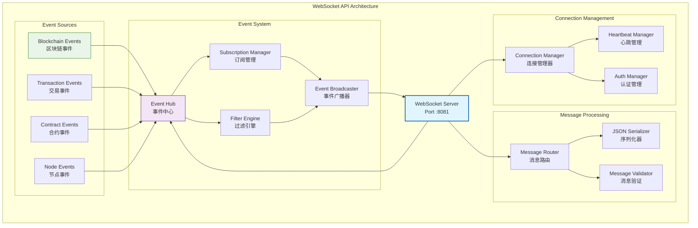

# WebSocket实时通信API（internal/api/websocket）

【模块定位】
　　本模块是WES系统中WebSocket实时通信API的核心实现，负责提供双向、低延迟的实时事件推送和数据同步服务。通过事件驱动的发布-订阅机制，提供毫秒级的实时通信能力，支撑实时监控应用、数据同步系统和即时通知服务的业务需求，确保通信的实时性、可靠性和高可用性。

【设计原则】
- **实时性优先**：基于WebSocket协议提供毫秒级事件推送，保障数据传输的即时性和时效性
- **双向通信**：支持客户端与服务端的全双工通信，实现真正的实时交互体验
- **事件驱动**：采用发布-订阅模式的事件分发机制，提供灵活的事件路由和处理能力
- **连接管理**：集成自动重连、心跳检测和连接池管理，确保连接的稳定性和可靠性
- **智能过滤**：支持基于条件的精确事件订阅和过滤，减少无效数据传输和客户端负载

【核心职责】
1. **实时事件推送**：区块、交易、合约事件的实时通知
2. **双向通信**：客户端与服务端的实时数据交互
3. **连接管理**：WebSocket连接的生命周期管理
4. **事件过滤**：基于条件的智能事件筛选
5. **负载均衡**：多连接的负载分配和管理
6. **监控统计**：连接状态和事件流量的实时监控

## WebSocket架构设计



## 支持的事件类型

### 📦 区块链事件
| 事件名称 | 触发条件 | 数据内容 | 频率 |
|----------|----------|----------|------|
| `newBlock` | 新区块产生 | 区块头信息、交易数量 | ~3秒 |
| `blockConfirmed` | 区块确认 | 区块哈希、确认数 | 按确认数 |
| `chainReorg` | 链重组 | 旧链、新链信息 | 偶发 |
| `blockFinalized` | 区块最终确认 | 区块高度、哈希 | 延迟 |

### 💸 交易事件
| 事件名称 | 触发条件 | 数据内容 | 频率 |
|----------|----------|----------|------|
| `newTransaction` | 新交易进入mempool | 交易哈希、基本信息 | 实时 |
| `transactionConfirmed` | 交易被打包 | 交易详情、区块信息 | 实时 |
| `transactionFailed` | 交易执行失败 | 错误信息、执行费用消耗 | 实时 |
| `pendingTransactions` | mempool状态更新 | 待处理交易列表 | 1秒 |

### 📄 智能合约事件
| 事件名称 | 触发条件 | 数据内容 | 频率 |
|----------|----------|----------|------|
| `contractDeployed` | 合约部署成功 | 合约地址、部署者 | 实时 |
| `contractEvent` | 合约事件触发 | 事件名称、参数 | 实时 |
| `contractCall` | 合约函数调用 | 函数名、参数、结果 | 实时 |
| `contractError` | 合约执行错误 | 错误类型、错误信息 | 实时 |

### 🌐 节点网络事件
| 事件名称 | 触发条件 | 数据内容 | 频率 |
|----------|----------|----------|------|
| `peerConnected` | 新节点连接 | 节点ID、地址 | 实时 |
| `peerDisconnected` | 节点断开连接 | 节点ID、原因 | 实时 |
| `networkStatus` | 网络状态变化 | 连接数、同步状态 | 5秒 |
| `syncProgress` | 同步进度更新 | 当前高度、目标高度 | 1秒 |

## 消息协议

### 连接建立
```javascript
// 连接WebSocket
const ws = new WebSocket('wss://api.weisyn.io:8081/ws');

ws.onopen = function(event) {
    console.log('WebSocket连接已建立');
    
    // 发送认证消息（可选）
    ws.send(JSON.stringify({
        type: 'auth',
        token: 'your_auth_token'
    }));
};
```

### 订阅事件
```javascript
// 订阅新区块事件
ws.send(JSON.stringify({
    type: 'subscribe',
    channel: 'newBlock',
    filters: {
        minTransactions: 1    // 只订阅包含交易的区块
    }
}));

// 订阅特定地址的交易
ws.send(JSON.stringify({
    type: 'subscribe',
    channel: 'newTransaction',
    filters: {
        from: '0x1111111111111111111111111111111111111111',
        to: '0x2222222222222222222222222222222222222222'
    }
}));

// 订阅合约事件
ws.send(JSON.stringify({
    type: 'subscribe',
    channel: 'contractEvent',
    filters: {
        contractAddress: '0x3333333333333333333333333333333333333333',
        eventName: 'Transfer'
    }
}));
```

### 取消订阅
```javascript
// 取消特定订阅
ws.send(JSON.stringify({
    type: 'unsubscribe',
    channel: 'newBlock',
    subscriptionId: 'sub_12345'
}));

// 取消所有订阅
ws.send(JSON.stringify({
    type: 'unsubscribeAll'
}));
```

## 事件消息格式

### 新区块事件
```json
{
    "type": "event",
    "channel": "newBlock",
    "timestamp": 1704067200,
    "data": {
        "block": {
            "height": 12345,
            "hash": "0x1234567890abcdef...",
            "parentHash": "0xabcdef1234567890...",
            "timestamp": 1704067200,
            "miner": "0x5555555555555555555555555555555555555555",
            "transactionCount": 25,
            "执行费用Used": 1500000,
            "执行费用Limit": 2000000,
            "size": 4096
        }
    }
}
```

### 新交易事件
```json
{
    "type": "event",
    "channel": "newTransaction",
    "timestamp": 1704067201,
    "data": {
        "transaction": {
            "hash": "0xabcdef1234567890...",
            "from": "0x1111111111111111111111111111111111111111",
            "to": "0x2222222222222222222222222222222222222222",
            "value": "1000000000000000000",
            "执行费用": 21000,
            "执行费用Price": "20000000000",
            "nonce": 42,
            "status": "pending"
        }
    }
}
```

### 合约事件
```json
{
    "type": "event",
    "channel": "contractEvent",
    "timestamp": 1704067202,
    "data": {
        "contractAddress": "0x3333333333333333333333333333333333333333",
        "eventName": "Transfer",
        "parameters": {
            "from": "0x1111111111111111111111111111111111111111",
            "to": "0x2222222222222222222222222222222222222222",
            "value": "1000000000000000000"
        },
        "blockHeight": 12345,
        "transactionHash": "0xdef1234567890abc..."
    }
}
```

## 客户端实现示例

### JavaScript客户端
```javascript
class WESWebSocketClient {
    constructor(url) {
        this.url = url;
        this.ws = null;
        this.subscriptions = new Map();
        this.reconnectAttempts = 0;
        this.maxReconnectAttempts = 5;
    }
    
    connect() {
        this.ws = new WebSocket(this.url);
        
        this.ws.onopen = (event) => {
            console.log('已连接到WES WebSocket');
            this.reconnectAttempts = 0;
            this.resubscribeAll();
        };
        
        this.ws.onmessage = (event) => {
            const message = JSON.parse(event.data);
            this.handleMessage(message);
        };
        
        this.ws.onclose = (event) => {
            console.log('WebSocket连接已关闭');
            this.attemptReconnect();
        };
        
        this.ws.onerror = (error) => {
            console.error('WebSocket错误:', error);
        };
    }
    
    subscribe(channel, filters = {}, callback) {
        const subscriptionId = this.generateId();
        
        this.subscriptions.set(subscriptionId, {
            channel,
            filters,
            callback
        });
        
        this.send({
            type: 'subscribe',
            channel,
            filters,
            subscriptionId
        });
        
        return subscriptionId;
    }
    
    unsubscribe(subscriptionId) {
        this.subscriptions.delete(subscriptionId);
        
        this.send({
            type: 'unsubscribe',
            subscriptionId
        });
    }
    
    send(message) {
        if (this.ws && this.ws.readyState === WebSocket.OPEN) {
            this.ws.send(JSON.stringify(message));
        }
    }
    
    handleMessage(message) {
        if (message.type === 'event') {
            this.subscriptions.forEach((subscription, id) => {
                if (subscription.channel === message.channel) {
                    subscription.callback(message.data);
                }
            });
        }
    }
    
    attemptReconnect() {
        if (this.reconnectAttempts < this.maxReconnectAttempts) {
            this.reconnectAttempts++;
            const delay = Math.pow(2, this.reconnectAttempts) * 1000;
            
            setTimeout(() => {
                console.log(`尝试重连 (${this.reconnectAttempts}/${this.maxReconnectAttempts})`);
                this.connect();
            }, delay);
        }
    }
    
    resubscribeAll() {
        this.subscriptions.forEach((subscription, id) => {
            this.send({
                type: 'subscribe',
                channel: subscription.channel,
                filters: subscription.filters,
                subscriptionId: id
            });
        });
    }
    
    generateId() {
        return 'sub_' + Math.random().toString(36).substr(2, 9);
    }
}

// 使用示例
const client = new WESWebSocketClient('wss://api.weisyn.io:8081/ws');
client.connect();

// 订阅新区块
const blockSubscription = client.subscribe('newBlock', {}, (block) => {
    console.log('新区块:', block.height, block.hash);
});

// 订阅特定地址的交易
const txSubscription = client.subscribe('newTransaction', {
    from: '0x1111111111111111111111111111111111111111'
}, (transaction) => {
    console.log('新交易:', transaction.hash, transaction.value);
});
```

### Go客户端
```go
package main

import (
    "encoding/json"
    "log"
    "net/url"
    "time"
    
    "github.com/gorilla/websocket"
)

type WESWebSocketClient struct {
    conn          *websocket.Conn
    url           string
    subscriptions map[string]*Subscription
    eventChan     chan Event
}

type Subscription struct {
    Channel   string                 `json:"channel"`
    Filters   map[string]interface{} `json:"filters"`
    Callback  func(interface{})
}

type Event struct {
    Type      string      `json:"type"`
    Channel   string      `json:"channel"`
    Timestamp int64       `json:"timestamp"`
    Data      interface{} `json:"data"`
}

func NewWESWebSocketClient(url string) *WESWebSocketClient {
    return &WESWebSocketClient{
        url:           url,
        subscriptions: make(map[string]*Subscription),
        eventChan:     make(chan Event, 100),
    }
}

func (c *WESWebSocketClient) Connect() error {
    u, err := url.Parse(c.url)
    if err != nil {
        return err
    }
    
    conn, _, err := websocket.DefaultDialer.Dial(u.String(), nil)
    if err != nil {
        return err
    }
    
    c.conn = conn
    
    // 启动消息处理协程
    go c.readMessages()
    go c.handleEvents()
    
    return nil
}

func (c *WESWebSocketClient) Subscribe(channel string, filters map[string]interface{}, callback func(interface{})) string {
    subscriptionId := generateID()
    
    c.subscriptions[subscriptionId] = &Subscription{
        Channel:  channel,
        Filters:  filters,
        Callback: callback,
    }
    
    message := map[string]interface{}{
        "type":           "subscribe",
        "channel":        channel,
        "filters":        filters,
        "subscriptionId": subscriptionId,
    }
    
    c.sendMessage(message)
    return subscriptionId
}

func (c *WESWebSocketClient) readMessages() {
    defer c.conn.Close()
    
    for {
        _, message, err := c.conn.ReadMessage()
        if err != nil {
            log.Printf("读取消息错误: %v", err)
            break
        }
        
        var event Event
        if err := json.Unmarshal(message, &event); err != nil {
            log.Printf("解析消息错误: %v", err)
            continue
        }
        
        c.eventChan <- event
    }
}

func (c *WESWebSocketClient) handleEvents() {
    for event := range c.eventChan {
        if event.Type == "event" {
            for _, subscription := range c.subscriptions {
                if subscription.Channel == event.Channel {
                    go subscription.Callback(event.Data)
                }
            }
        }
    }
}

func main() {
    client := NewWESWebSocketClient("wss://api.weisyn.io:8081/ws")
    
    err := client.Connect()
    if err != nil {
        log.Fatal("连接失败:", err)
    }
    
    // 订阅新区块
    client.Subscribe("newBlock", map[string]interface{}{}, func(data interface{}) {
        log.Printf("新区块事件: %+v", data)
    })
    
    // 订阅交易事件
    client.Subscribe("newTransaction", map[string]interface{}{
        "from": "0x1111111111111111111111111111111111111111",
    }, func(data interface{}) {
        log.Printf("新交易事件: %+v", data)
    })
    
    // 保持连接
    select {}
}
```

## 性能和扩展

### 连接管理
```go
// WebSocket连接池
type ConnectionPool struct {
    connections map[string]*websocket.Conn
    maxConns    int
    mu          sync.RWMutex
}

func (p *ConnectionPool) AddConnection(id string, conn *websocket.Conn) error {
    p.mu.Lock()
    defer p.mu.Unlock()
    
    if len(p.connections) >= p.maxConns {
        return errors.New("连接池已满")
    }
    
    p.connections[id] = conn
    return nil
}

func (p *ConnectionPool) RemoveConnection(id string) {
    p.mu.Lock()
    defer p.mu.Unlock()
    
    if conn, exists := p.connections[id]; exists {
        conn.Close()
        delete(p.connections, id)
    }
}

func (p *ConnectionPool) Broadcast(message []byte) {
    p.mu.RLock()
    defer p.mu.RUnlock()
    
    for id, conn := range p.connections {
        if err := conn.WriteMessage(websocket.TextMessage, message); err != nil {
            log.Printf("广播失败 %s: %v", id, err)
            go p.RemoveConnection(id)
        }
    }
}
```

### 负载均衡
```go
// 事件分发器
type EventDistributor struct {
    workers   []*Worker
    workQueue chan Event
}

func (d *EventDistributor) Start() {
    for i := 0; i < len(d.workers); i++ {
        go d.workers[i].Start(d.workQueue)
    }
}

func (d *EventDistributor) Distribute(event Event) {
    select {
    case d.workQueue <- event:
    default:
        log.Printf("工作队列已满，丢弃事件: %s", event.Channel)
    }
}

type Worker struct {
    id   int
    pool *ConnectionPool
}

func (w *Worker) Start(workQueue <-chan Event) {
    for event := range workQueue {
        w.processEvent(event)
    }
}

func (w *Worker) processEvent(event Event) {
    message, _ := json.Marshal(event)
    w.pool.Broadcast(message)
}
```

## 监控和调试

### 连接状态监控
```go
type ConnectionMetrics struct {
    TotalConnections    int64 `json:"total_connections"`
    ActiveConnections   int64 `json:"active_connections"`
    MessagesPerSecond   int64 `json:"messages_per_second"`
    BytesPerSecond     int64 `json:"bytes_per_second"`
    ErrorRate          float64 `json:"error_rate"`
}

func (m *ConnectionMetrics) Update() {
    // 更新指标
    m.ActiveConnections = getCurrentConnections()
    m.MessagesPerSecond = getMessagesPerSecond()
    m.BytesPerSecond = getBytesPerSecond()
    m.ErrorRate = getErrorRate()
}
```

### 调试工具
```javascript
// WebSocket调试控制台
class WebSocketDebugger {
    constructor(client) {
        this.client = client;
        this.messageLog = [];
    }
    
    logMessage(type, message) {
        const entry = {
            timestamp: Date.now(),
            type: type,
            message: message
        };
        
        this.messageLog.push(entry);
        console.log(`[${type}] ${JSON.stringify(message)}`);
    }
    
    getStats() {
        return {
            totalMessages: this.messageLog.length,
            activeSubscriptions: this.client.subscriptions.size,
            connectionState: this.client.ws.readyState
        };
    }
    
    exportLog() {
        return JSON.stringify(this.messageLog, null, 2);
    }
}
```

---

## 🔗 相关文档

- **服务器实现**：`server.go` - WebSocket服务器配置
- **事件系统**：查看事件发布和订阅机制
- **连接管理**：查看连接池和负载均衡实现
- **安全配置**：查看认证和授权机制
