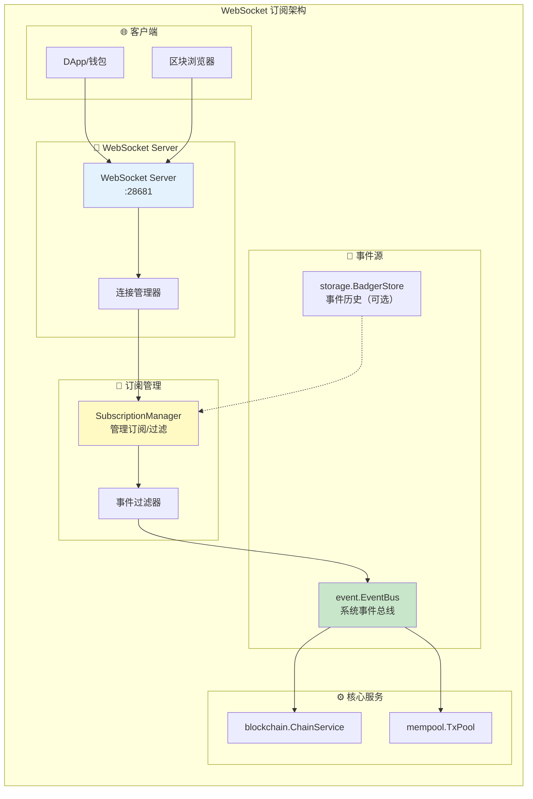
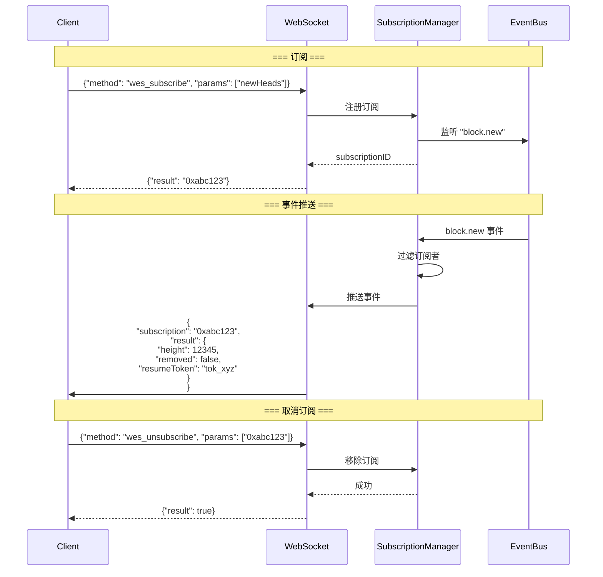
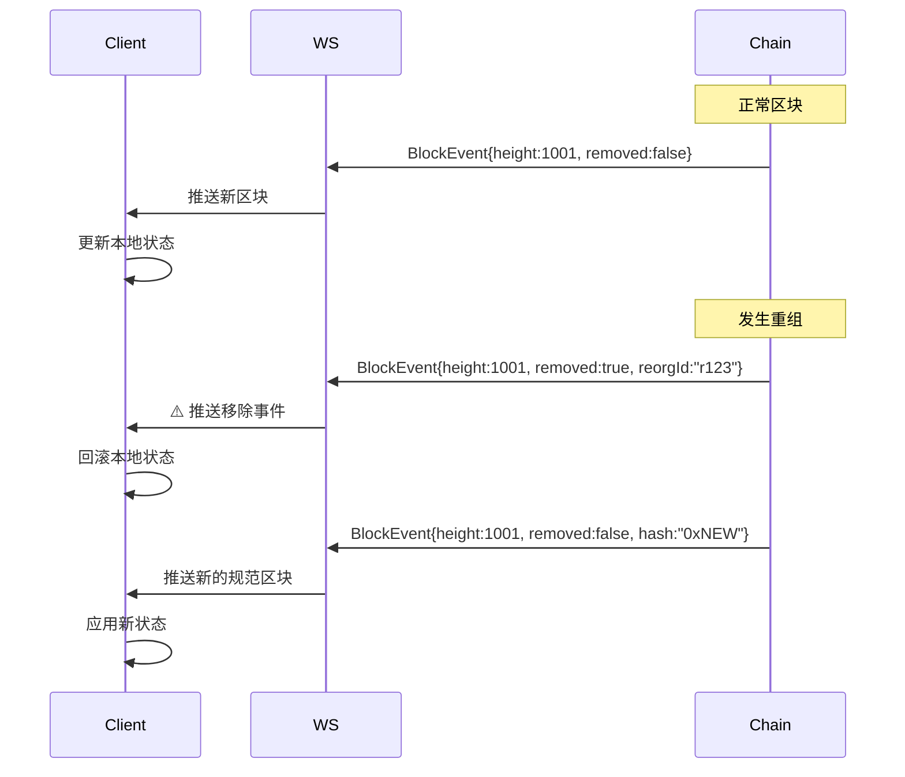
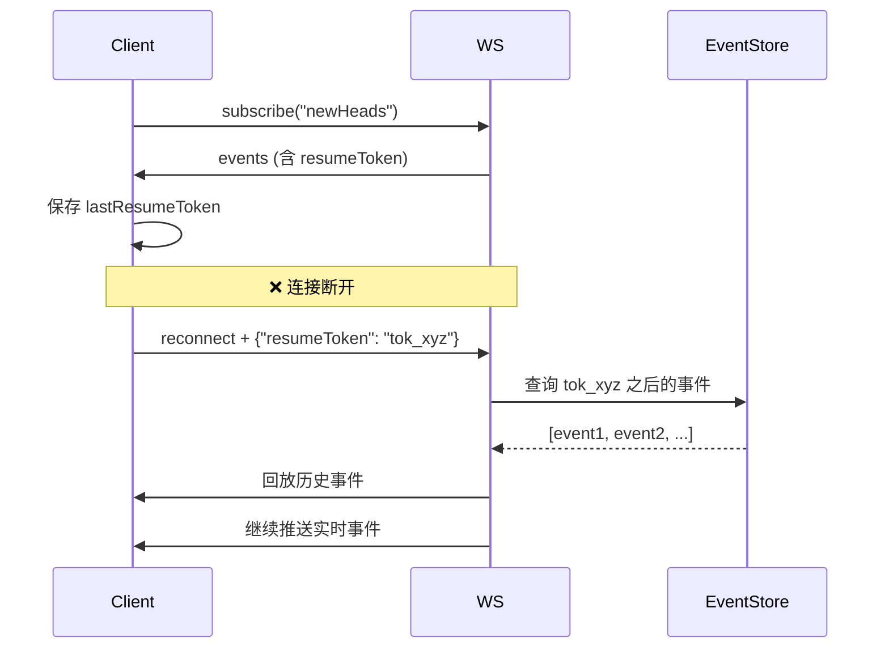

# WebSocket 订阅层（internal/api/websocket）

> **📌 模块类型**：`[X] 实现模块` `[ ] 接口定义` `[ ] 数据结构` `[ ] 工具/其他`

---

## 📍 **模块定位**

　　本模块是 WES 区块链节点的**WebSocket 实时订阅层**，实现 JSON-RPC 2.0 订阅协议，提供重组安全的实时事件推送，为 DApp、区块浏览器提供可靠的实时数据流。

**解决什么问题**：
- **实时事件推送**：毫秒级区块/交易事件通知
- **重组安全**：事件包含 `removed`、`reorgId` 标记
- **断线重连**：支持 `resumeToken` 恢复订阅
- **JSON-RPC 兼容**：符合 JSON-RPC 2.0 订阅规范

**不解决什么问题**（边界）：
- ❌ 不实现 JSON-RPC 方法（由 `../jsonrpc/methods/` 负责）
- ❌ 不处理 HTTP 请求（由 `../http/` 负责）
- ❌ 不生成事件（监听 `event.EventBus`）

---

## 🎯 **设计原则与核心约束**

### **设计原则**

| 原则 | 说明 | 价值 |
|------|------|------|
| **JSON-RPC 2.0 订阅** | 使用 `wes_subscribe`/`wes_unsubscribe` 方法 | 生态兼容 |
| **重组安全** | 所有事件包含 `removed`/`reorgId` | 数据一致性 |
| **断线恢复** | 支持 `resumeToken` 机制 | 可靠性 |
| **事件驱动** | 监听 EventBus，被动推送 | 职责分离 |

### **核心约束** ⭐

**严格遵守**：
- ✅ **JSON-RPC 2.0 格式**：订阅响应必须包含 `subscription` ID
- ✅ **重组标记必需**：所有区块/交易事件必须包含 `removed` 字段
- ✅ **resumeToken 必需**：每个事件包含 `resumeToken` 用于断线重连
- ✅ **先删除后添加**：重组时先推送 `removed: true` 事件，再推送新事件

**严格禁止**：
- ❌ **HTTP 订阅**：订阅必须使用 WebSocket，不能用 HTTP
- ❌ **省略重组标记**：可能导致客户端数据不一致
- ❌ **修改事件顺序**：重组事件必须按时序推送

---

## 🏗️ **架构设计**

### **整体架构**



### **订阅流程**



---

## 📁 **目录结构**

```
websocket/
├── server.go               # ✅ WebSocket 服务器
├── subscription.go         # ✅ 订阅管理器（重组安全）
├── README.md               # 本文档
└── types/
    ├── events.go          # ✅ 事件类型定义
    └── README.md
```

### **组织原则**

| 文件 | 职责 | 实现状态 | 为什么这样组织 |
|------|------|---------|---------------|
| **server.go** | WebSocket 连接管理 | ✅ 完成 | 负责 HTTP 升级、连接池 |
| **subscription.go** | 订阅/过滤/推送 | ✅ 完成 | 核心业务逻辑，支持重组安全 |
| **types/events.go** | 事件结构定义 | ✅ 完成 | removed/reorgId/resumeToken 字段 |

---

## 📊 **核心机制**

### **机制1：重组安全推送**

**为什么需要**：区块链会发生重组，客户端必须感知并回滚

**核心思路**：


**关键约束**：
- 重组时必须先推送 `removed: true` 事件
- 事件必须包含 `reorgId` 用于关联
- 客户端必须处理 `removed` 事件并回滚

**事件结构**：
```json
{
  "subscription": "0xabc123",
  "result": {
    "type": "newHead",
    "height": 12345,
    "hash": "0xdef...",
    "removed": true,          // ✅ 重组标记
    "reorgId": "r123",        // ✅ 重组ID
    "resumeToken": "tok_xyz", // ✅ 恢复点
    "timestamp": 1704067200
  }
}
```

---

### **机制2：断线重连恢复**

**为什么需要**：WebSocket 连接可能断开，客户端需要恢复订阅

**核心思路**：


**关键约束**：
- 每个事件必须包含单调递增的 `resumeToken`
- EventStore 保留一定时间的历史事件
- 长时间断线可能无法恢复（超出保留时间）

---

## 🎓 **使用指南**

### **典型场景1：订阅新区块**

```javascript
const ws = new WebSocket('ws://localhost:28681');

ws.onopen = () => {
    // 订阅新区块
    ws.send(JSON.stringify({
        jsonrpc: '2.0',
        method: 'wes_subscribe',
        params: ['newHeads'],
        id: 1
    }));
};

ws.onmessage = (event) => {
    const data = JSON.parse(event.data);
    
    if (data.result && !data.subscription) {
        // 订阅响应
        console.log('Subscribed:', data.result);
        subscriptionId = data.result;
    } else if (data.params) {
        // 事件推送
        const blockEvent = data.params.result;
        
        if (blockEvent.removed) {
            // ⚠️ 重组：回滚
            console.warn('Block removed:', blockEvent.height);
            rollbackBlock(blockEvent.height);
        } else {
            // ✅ 新区块
            console.log('New block:', blockEvent.height);
            addBlock(blockEvent);
        }
        
        // 保存 resumeToken
        localStorage.setItem('lastToken', blockEvent.resumeToken);
    }
};
```

---

### **典型场景2：断线重连**

```javascript
function reconnectWithResume() {
    const lastToken = localStorage.getItem('lastToken');
    const ws = new WebSocket('ws://localhost:28681');
    
    ws.onopen = () => {
        ws.send(JSON.stringify({
            jsonrpc: '2.0',
            method: 'wes_subscribe',
            params: ['newHeads', {resumeToken: lastToken}],
            id: 1
        }));
    };
}
```

---

### **常见误用**

| 误用方式 | 为什么错误 | 正确做法 |
|---------|-----------|---------|
| 使用 HTTP 订阅 | 订阅必须用 WebSocket | 使用 `ws://` 协议 |
| 忽略 `removed` 事件 | 重组时数据不一致 | 必须处理并回滚 |
| 不保存 `resumeToken` | 无法断线重连 | 每次事件保存 token |
| 在 `wes_subscribe` 前调用其他方法 | 订阅未建立 | 先订阅，再调用其他方法 |

---

## ⚠️ **已知限制**

| 限制 | 影响 | 规避方法 | 未来计划 |
|------|------|---------|---------|
| resumeToken 保留时间有限 | 长时间断线无法恢复 | 尽快重连 | 📋 配置化保留时间 |
| 事件回放可能重复 | 客户端需去重 | 使用事件 ID 去重 | 📋 exactly-once 保证 |
| 无连接认证 | 匿名订阅 | 依赖限流 | 📋 支持 token 认证 |

---

## 🔍 **设计权衡记录**

### **权衡1：为什么使用 JSON-RPC 2.0 而非自定义协议？**

**背景**：WebSocket 可以使用任意协议

**备选方案**：
1. **JSON-RPC 2.0**：标准订阅协议 - 优势：生态兼容、有现成库 - 劣势：相对冗余
2. **自定义协议**：精简的二进制协议 - 优势：高效 - 劣势：需自己实现客户端

**选择**：选择了 **JSON-RPC 2.0**

**理由**：
- ✅ 对标 Geth，web3.js 直接可用
- ✅ 有成熟的 JSON-RPC 2.0 WebSocket 库
- ✅ 易调试（文本协议）

**代价**：JSON 序列化略有性能损失

---

## 📚 **相关文档**

- **Types**：[types/README.md](./types/README.md) - 事件结构定义
- **JSON-RPC Methods**：[../jsonrpc/methods/subscribe.go](../jsonrpc/methods/subscribe.go) - 订阅方法实现
- **JSON-RPC 规范**：https://www.jsonrpc.org/specification

---

## 📋 **文档变更记录**

| 日期 | 变更内容 | 原因 |
|------|---------|------|
| 2025-10-24 | 重构为模板 v3.0 | 改为 JSON-RPC 订阅语义 |
| 2025-10-24 | 强调重组安全机制 | removed/reorgId/resumeToken |
| 2025-10-24 | 删除通用 WS 内容 | 聚焦 JSON-RPC 订阅 |

---

> 📝 **文档说明**  
> 本文档遵循 `_docs/templates/README_TEMPLATE.md` v3.0 规范  
> 🎯 **核心理念**：JSON-RPC 订阅、重组安全、断线恢复
