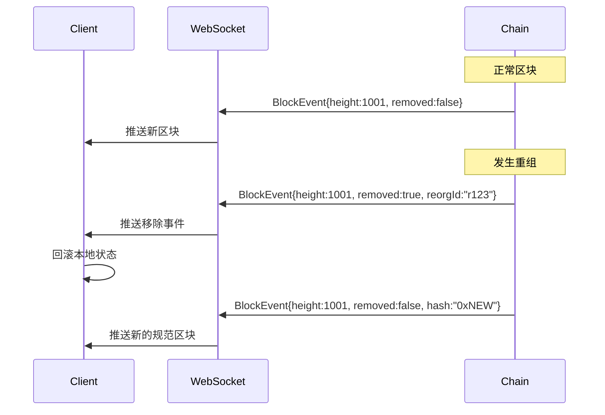
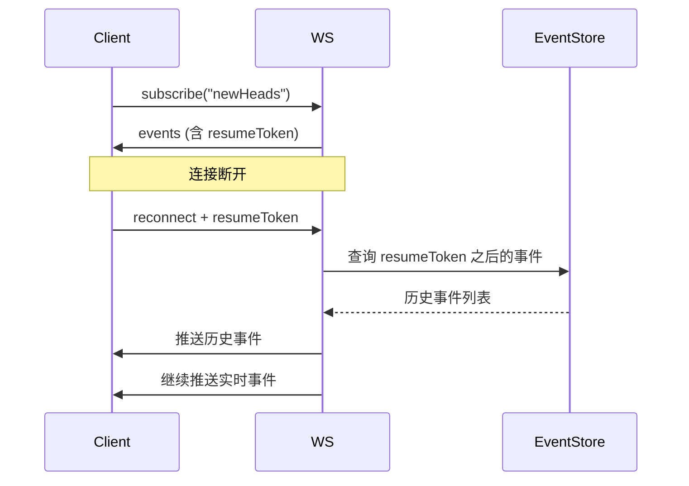

# WebSocket 事件类型（internal/api/websocket/types）

> **📌 模块类型**：`[ ] 实现模块` `[ ] 接口定义` `[X] 数据结构` `[ ] 工具/其他`

---

## 📍 **模块定位**

　　本模块定义 WebSocket 实时订阅的**事件消息结构**，支持重组安全的事件推送，为 DApp 和区块浏览器提供可靠的实时数据流。

**解决什么问题**：
- **重组安全**：事件包含 `removed`、`reorgId` 标记
- **断线重连**：支持 `resumeToken` 恢复订阅
- **类型安全**：强类型事件定义

**不解决什么问题**（边界）：
- ❌ 不管理 WebSocket 连接（由 `../server.go` 负责）
- ❌ 不实现事件过滤（由 `../subscription.go` 负责）

---

## 🎯 **核心约束**

**严格遵守**：
- ✅ **重组标记**：所有区块/交易事件必须包含 `removed` 字段
- ✅ **resumeToken**：支持断线重连恢复
- ✅ **JSON-RPC格式**：符合 JSON-RPC 2.0 通知规范

**严格禁止**：
- ❌ **省略重组标记**：可能导致客户端数据不一致
- ❌ **修改核心字段**：`removed`/`reorgId`/`resumeToken` 不可变

---

## 📦 **类型体系**

### **类型全景**

```mermaid
classDiagram
    class BlockEvent {
        +string Type
        +uint64 Height
        +string Hash
        +bool Removed
        +string ReorgId
        +string ResumeToken
        +int64 Timestamp
    }
    
    class TransactionEvent {
        +string Type
        +string TxHash
        +string BlockHash
        +bool Removed
        +string ReorgId
        +string ResumeToken
    }
    
    class SubscriptionEvent {
        +string Subscription
        +interface{} Result
    }
    
    SubscriptionEvent --> BlockEvent : contains
    SubscriptionEvent --> TransactionEvent : contains
```

### **关键字段说明**

| 字段 | 类型 | 用途 | 是否必需 |
|-----|------|------|---------|
| **removed** | bool | 标记事件是否因重组被移除 | ✅ 必需 |
| **reorgId** | string | 重组事件的唯一标识 | ⭕ 重组时必需 |
| **resumeToken** | string | 断线重连时的恢复点 | ✅ 必需 |
| **timestamp** | int64 | 事件时间戳 | ✅ 必需 |

---

## 📁 **目录结构**

```
types/
├── events.go           # ✅ 事件类型定义
└── README.md           # 本文档
```

---

## 📊 **核心机制**

### **机制1：重组安全事件**

**为什么需要**：区块链会发生重组，客户端必须感知并回滚

**核心思路**：


**实现示例**：
```go
type BlockEvent struct {
    Type        string `json:"type"`        // "newHead"
    Height      uint64 `json:"height"`
    Hash        string `json:"hash"`
    Removed     bool   `json:"removed"`     // ✅ 重组标记
    ReorgId     string `json:"reorgId,omitempty"`
    ResumeToken string `json:"resumeToken"` // ✅ 恢复点
    Timestamp   int64  `json:"timestamp"`
}
```

---

### **机制2：断线重连恢复**

**为什么需要**：WebSocket 连接可能断开，客户端需要恢复订阅

**核心思路**：


**关键约束**：
- 每个事件必须包含 `resumeToken`
- resumeToken 必须单调递增（可用时间戳或序列号）
- 断线重连时，从 resumeToken 开始回放

---

## 🎓 **使用指南**

### **典型场景：处理重组事件**

```javascript
ws.onmessage = (event) => {
    const data = JSON.parse(event.data);
    const blockEvent = data.result;
    
    if (blockEvent.removed) {
        // 重组：回滚本地状态
        console.warn('Block removed due to reorg:', blockEvent.height);
        rollbackBlock(blockEvent.height);
    } else {
        // 新区块：更新本地状态
        console.log('New block:', blockEvent.height, blockEvent.hash);
        addBlock(blockEvent);
    }
    
    // 保存 resumeToken 用于断线重连
    localStorage.setItem('lastResumeToken', blockEvent.resumeToken);
};
```

---

### **典型场景：断线重连**

```javascript
function reconnect() {
    const lastToken = localStorage.getItem('lastResumeToken');
    
    ws.send(JSON.stringify({
        method: 'wes_subscribe',
        params: ['newHeads', {resumeToken: lastToken}],
        id: 1
    }));
}
```

---

## ⚠️ **已知限制**

| 限制 | 影响 | 规避方法 | 未来计划 |
|------|------|---------|---------|
| resumeToken 保留时间有限 | 长时间断线无法恢复 | 尽快重连 | 📋 配置化保留时间 |
| 事件回放可能重复 | 客户端需去重 | 使用事件 ID 去重 | 📋 保证 exactly-once |

---

## 📚 **相关文档**

- **WebSocket Server**：[../server.go](../server.go) - 事件推送
- **Subscription Manager**：[../subscription.go](../subscription.go) - 订阅管理

---

## 📋 **文档变更记录**

| 日期 | 变更内容 | 原因 |
|------|---------|------|
| 2025-10-24 | 创建本文档 | 补全子目录 README，符合模板 v3.0 |

---

> 📝 **文档说明**  
> 本文档遵循 `_docs/templates/README_TEMPLATE.md` v3.0 规范  
> 🎯 **核心理念**：重组安全、断线恢复、类型安全

