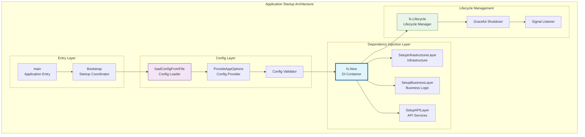

# 应用启动层（internal/app）

【模块定位】
　　本模块作为WES区块链系统的应用启动层，负责整个系统的依赖注入装配、生命周期管理和优雅启停。通过fx依赖注入框架，统一管理所有模块的初始化顺序、配置加载和资源清理，为系统提供可靠的启动和运行环境。

【设计原则】
- 统一装配：通过fx框架统一管理所有模块的依赖注入
- 配置驱动：支持多种配置源的灵活加载和热更新
- 优雅启停：提供完整的生命周期管理和资源清理
- 错误恢复：完善的启动失败处理和降级机制
- 可观测性：详细的启动日志和状态监控

【核心职责】
1. **依赖注入装配**：统一管理所有模块的fx依赖注入配置
2. **配置管理**：支持文件、环境变量等多种配置源
3. **生命周期管理**：协调各模块的启动、运行、停止流程
4. **信号处理**：监听系统信号，实现优雅关闭
5. **错误处理**：启动失败的诊断、报告和恢复
6. **状态监控**：系统运行状态的实时监控和报告

【应用架构】

## 应用启动流程设计



## 文件职责说明

### app.go - 配置管理
**核心功能**：
- `AppModule` - fx模块定义，提供配置相关的依赖注入
- `ProvideAppOptions` - 应用配置选项的提供者函数
- `loadConfigFromFile` - 从文件加载配置的核心逻辑
- `createDefaultConfig` - 默认配置创建和覆盖机制

**配置支持**：
- 支持JSON格式配置文件
- 环境变量WES_CONFIG_PATH指定配置路径
- 智能的默认值填充和验证
- 配置变更的实时监听

### bootstrap.go - 系统引导
**核心功能**：
- `Bootstrap` - 系统启动的主入口函数
- `SetupInfrastructureLayer` - 基础设施层模块装配
- `SetupBusinessLayer` - 业务逻辑层模块装配  
- `SetupAPILayer` - API服务层模块装配

**模块装配顺序**：
1. **基础设施层**：日志、存储、网络、密码学等基础服务
2. **业务逻辑层**：区块链、共识、内存池、执行引擎等核心业务
3. **API服务层**：HTTP、gRPC、WebSocket等对外服务

### options.go - 启动选项
**核心功能**：
- 应用启动选项的定义和处理
- 命令行参数解析和验证
- 启动模式的配置和控制

## 使用示例

### 基本启动流程
```go
package main

import (
    "github.com/weisyn/v1/internal/app"
)

func main() {
    // 启动应用
    if err := app.Bootstrap(); err != nil {
        log.Fatalf("应用启动失败: %v", err)
    }
}
```

### 自定义配置启动
```go
// 通过环境变量指定配置文件
os.Setenv("WES_CONFIG_PATH", "/custom/path/config.json")

// 启动应用
app.Bootstrap()
```

### 配置文件示例
```json
{
    "app_name": "WES-Node",
    "node": {
        "node_id": "node_001",
        "listen_address": "0.0.0.0:8080",
        "min_peers": 3,
        "max_peers": 50
    },
    "storage": {
        "data_dir": "./data",
        "badger_opts": {
            "sync_writes": true,
            "compression": true
        }
    },
    "api": {
        "http_port": 8080,
        "grpc_port": 9090,
        "enable_cors": true
    }
}
```

## 依赖注入架构

### fx模块组织
```go
// 完整的fx模块装配
fx.New(
    // 配置层
    app.AppModule,
    config.Module(),
    
    // 基础设施层  
    log.Module(),
    storage.Module(),
    crypto.Module(),
    event.Module(),
    kademlia.Module(),
    node.Module(),
    
    // 业务层
    blockchain.Module(),
    consensus.Module(),
    mempool.Module(),
    execution.Module(),
    wasm.Module(),
    network.Module(),
    
    // API层
    api.Module(),
    
    // 生命周期管理
    fx.Invoke(app.RunApplication),
)
```

### 配置依赖关系
- **config.AppOptions** ← `app.ProvideAppOptions()` 提供
- **各模块配置** ← 通过config模块统一分发
- **fx.Lifecycle** ← 自动注入，管理模块生命周期

## 生命周期管理

### 启动阶段
1. **配置加载**：读取和验证应用配置
2. **依赖解析**：fx框架解析所有依赖关系
3. **模块初始化**：按依赖顺序初始化各模块
4. **服务启动**：启动所有对外服务
5. **健康检查**：验证系统运行状态

### 运行阶段
- **信号监听**：监听SIGINT、SIGTERM等系统信号
- **状态监控**：定期检查各模块运行状态
- **配置热更新**：支持部分配置的运行时更新
- **资源管理**：监控和管理系统资源使用

### 关闭阶段
1. **信号接收**：接收到关闭信号
2. **API停止**：优雅关闭所有API服务
3. **业务停止**：按反向顺序停止业务模块
4. **资源清理**：释放所有系统资源
5. **日志输出**：记录关闭过程和最终状态

## 故障排查

### 常见启动问题
- **配置文件错误**：检查JSON格式和必填字段
- **端口占用**：确认HTTP、gRPC端口未被占用
- **权限问题**：确认数据目录的读写权限
- **依赖缺失**：检查必要的系统依赖是否安装

### 调试模式
```go
// 启用详细日志
os.Setenv("WES_LOG_LEVEL", "debug")

// 启用fx调试输出
fx.New(
    fx.WithLogger(func() fxevent.Logger {
        return &fxevent.ConsoleLogger{W: os.Stderr}
    }),
    // ... 其他模块
)
```

---

## 🔗 相关文档

- **配置管理**：`internal/config/README.md` - 配置系统详细说明
- **各层模块**：查看对应目录的README了解具体实现
- **API服务**：`api/README.md` - API层设计和使用
