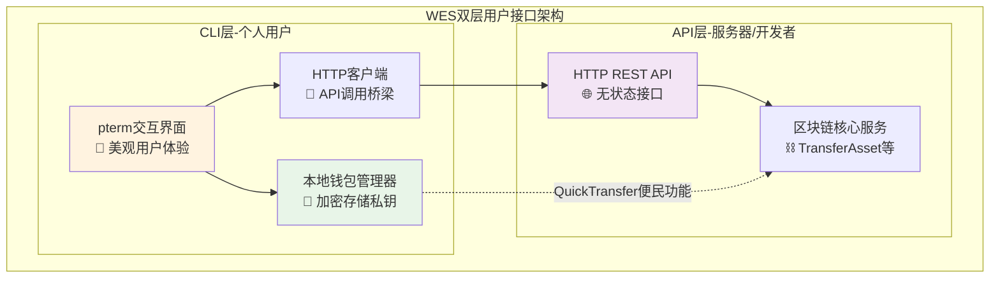
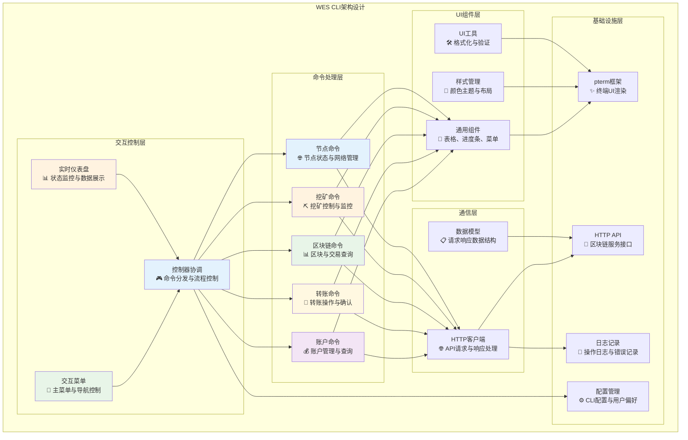
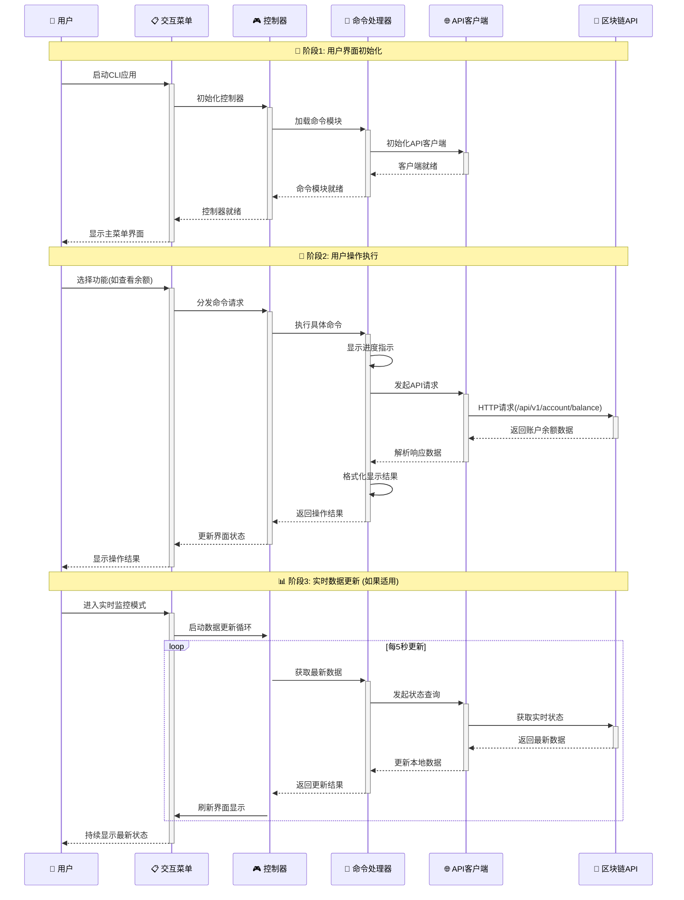
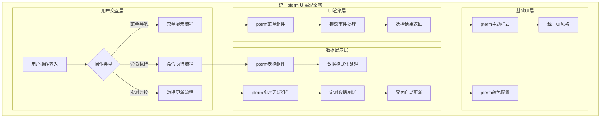
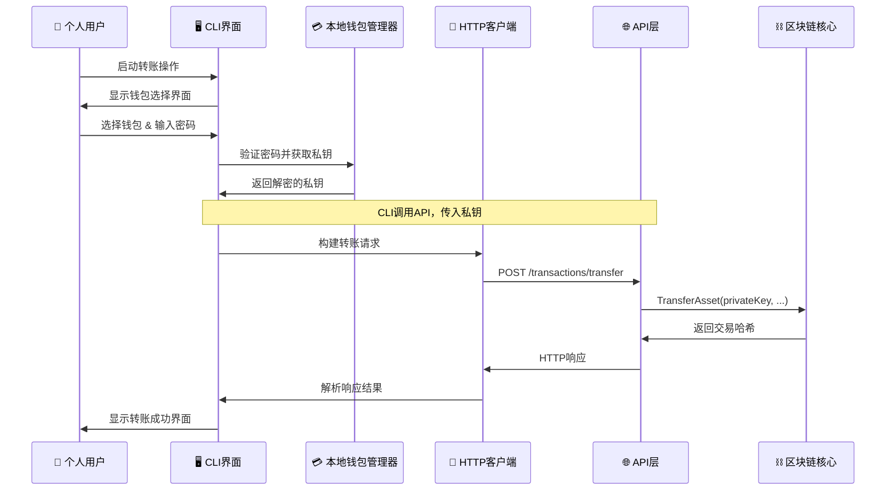
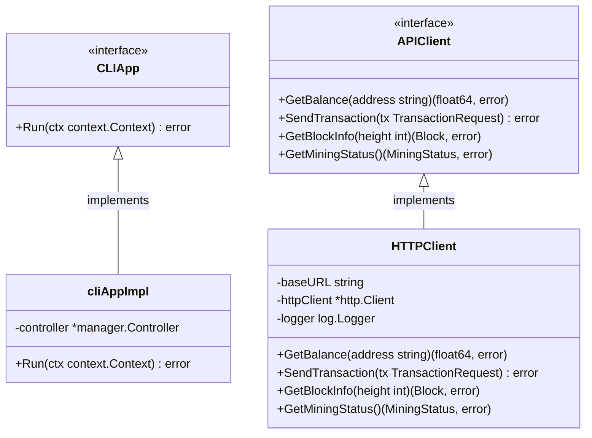

# WES命令行交互界面（internal/cli）

【模块定位】
　　本模块是WES系统中**面向本地用户**的交互式命令行界面，作为WES双层用户接口架构的重要组成部分，专注于为个人用户、开发测试、本地操作提供美观直观的区块链操作体验。通过本地钱包管理和API复用设计，在确保用户私钥安全的同时，避免重复实现业务逻辑，实现了用户体验与开发效率的双重优化。

【架构定位】


**设计理念**：
- **面向本地用户**：专为个人用户和开发测试场景设计
- **本地钱包能力**：安全管理用户私钥，提供密码保护
- **API复用策略**：通过HTTP客户端调用现有API，避免重复实现业务逻辑
- **用户体验优先**：基于pterm提供现代化、美观的终端交互界面

【设计原则】
- **用户体验优先**：基于pterm框架提供美观、直观的交互式界面体验
- **模块化设计**：通过分层架构实现命令处理、交互控制和UI渲染的解耦
- **API复用**：充分复用现有HTTP API，避免重复实现业务逻辑
- **安全性保障**：实现敏感信息保护、操作确认和错误恢复机制
- **可扩展性**：支持新功能模块的灵活集成和界面定制

【核心职责】
1. **交互式界面管理**：提供主菜单、仪表盘等交互式用户界面
2. **命令处理协调**：统一管理账户、转账、挖矿、区块链查询等功能命令
3. **UI组件封装**：封装表格、进度条、菜单等可复用UI组件
4. **API客户端集成**：通过HTTP客户端复用现有区块链API服务
5. **用户体验优化**：实现实时数据更新、操作反馈和错误提示
6. **安全操作控制**：提供操作确认、敏感信息保护等安全机制

【实现架构】

　　采用**分层协作式**的五层实现架构，确保用户界面与业务逻辑的清晰分离和高内聚低耦合。



**架构层次说明：**

1. **交互控制层**：用户界面的核心控制组件
   - 主菜单导航和用户选择处理
   - 实时仪表盘数据展示和更新
   - 命令分发和执行流程协调

2. **命令处理层**：具体业务功能的命令实现
   - 账户管理、转账操作、区块链查询
   - 挖矿控制、节点管理等核心功能
   - 统一的命令接口和错误处理

3. **UI组件层**：可复用的用户界面组件
   - 表格、进度条、菜单等通用组件
   - 统一的样式管理和主题控制
   - UI工具函数和格式化处理

4. **通信层**：与区块链服务的通信桥梁
   - HTTP客户端封装和请求处理
   - 数据模型定义和序列化处理

5. **基础设施层**：底层依赖和支撑服务
   - pterm终端UI框架集成
   - 区块链HTTP API接口调用
   - 日志记录和配置管理

---

## 🎯 **核心业务流程**

【流程概述】

　　此章节展现CLI模块中用户操作的完整流程，体现交互界面、命令处理和API调用的协调配合，确保用户操作的流畅性和数据的实时性。

### **📊 用户交互业务流程图**



### **🔄 详细流程分析**

#### **阶段1: 用户界面初始化**

**📍 核心职责**: 完成CLI应用的启动和各组件的初始化

**🔄 详细步骤**:

1. **启动菜单系统** (`交互菜单`)
   ```go
   // CLI应用启动入口
   func (c *Controller) Run(ctx context.Context) error {
       return c.menu.ShowMainMenu(ctx)
   }
   ```
   - 初始化pterm UI框架和主题样式
   - 加载用户配置和界面偏好设置

2. **控制器初始化** (`控制器协调`)
   - 注入各命令处理器和UI组件依赖
   - 建立命令路由和错误处理机制

**📤 输出**: 用户看到美观的主菜单界面，系统准备接受用户操作

#### **阶段2: 用户操作执行**

**📍 核心职责**: 处理用户的具体操作请求并返回结果

**🔄 详细步骤**:

1. **命令分发**: 根据用户选择路由到对应的命令处理器
2. **API调用**: 通过HTTP客户端调用区块链服务接口
3. **结果渲染**: 使用pterm组件美观地展示操作结果

**📤 输出**: 用户获得操作反馈和数据展示

#### **阶段3: 实时数据更新**

**📍 核心职责**: 在监控模式下持续更新界面数据

**🔄 详细步骤**:

1. **更新循环**: 定时查询最新的区块链状态数据
2. **界面刷新**: 使用pterm的实时更新能力刷新显示

**📤 输出**: 用户看到实时更新的系统状态和数据

### **🔗 关键组件交互详情**

#### **1. 交互菜单** (`交互控制层`)
```go
// 主菜单显示和用户选择处理
func (m *Menu) ShowMainMenu(ctx context.Context) error
func (m *Menu) HandleUserSelection(selection int) error
```
- **实时状态显示**: 在菜单顶部显示节点状态、余额等关键信息
- **菜单导航**: 支持键盘导航和鼠标选择
- **用户体验**: 提供操作提示和快捷键支持

#### **2. 命令处理器** (`命令处理层`)
```go
// 统一的命令接口
type CommandHandler interface {
    Execute(ctx context.Context, args []string) error
    GetDescription() string
}
```
- **参数验证**: 对用户输入进行合法性检查
- **进度显示**: 长时间操作显示进度条和状态提示
- **错误处理**: 友好的错误信息展示和恢复建议

### **⚡ 性能特征**

- **界面响应**: ~50-100ms (本地UI渲染)
- **API调用**: ~200-500ms (网络请求延迟)  
- **数据格式化**: ~10-50ms (数据处理和渲染)
- **内存占用**: 15-30MB (包含pterm和UI状态)
- **并发支持**: 支持异步API调用和UI更新

### **📋 设计原则总结**

基于以上流程分析，本模块的核心业务流程体现了以下设计思想：

#### **1. 用户体验优先** 🎨
- **直观操作**: 清晰的菜单结构和操作流程
- **实时反馈**: 及时的操作反馈和进度指示
- **美观界面**: 基于pterm的现代化终端UI

#### **2. 架构分层清晰** 🏗️  
- **职责分离**: 界面、控制、命令、通信各层职责明确
- **松耦合**: 通过接口和依赖注入实现组件解耦
- **可测试**: 每层都可独立测试和模拟

#### **3. 安全性保障** 🔒
- **操作确认**: 重要操作需要用户二次确认
- **敏感信息保护**: 私钥等敏感数据的安全处理
- **错误恢复**: 完善的错误处理和恢复机制

　　CLI模块通过分层架构和流程化设计，为用户提供了安全、美观、高效的区块链操作界面，在确保功能完整性的同时，最大化提升用户的操作体验。

---

## 📁 **模块组织结构**

【内部模块架构】

```
internal/cli/
├── 🎯 client/                     # API客户端通信层
│   ├── client.go                  # HTTP客户端实现
│   ├── models.go                  # API数据模型定义
│   └── README.md                  # 客户端模块文档
├── 🎮 commands/                   # 命令处理层
│   ├── account.go                 # 账户管理命令实现
│   ├── transfer.go                # 转账操作命令实现
│   ├── blockchain.go              # 区块链查询命令实现
│   ├── mining.go                  # 挖矿控制命令实现
│   ├── node.go                    # 节点管理命令实现
│   └── README.md                  # 命令模块文档
├── 📋 interactive/                # 交互控制层
│   ├── menu.go                    # 主菜单界面控制
│   ├── dashboard.go               # 实时仪表盘实现
│   └── README.md                  # 交互模块文档
├── 🎮 manager/                    # 协调管理层
│   ├── controller.go              # 主控制器实现
│   └── README.md                  # 管理模块文档
├── 🧱 ui/                         # UI组件层
│   ├── components.go              # 通用UI组件库
│   └── README.md                  # UI组件文档
├── 🔧 module.go                   # fx依赖注入配置
└── 📖 README.md                   # 本文档
```

### **🎯 子模块职责分工**

| **子模块** | **核心职责** | **对外接口** | **内部组件** | **复杂度** |
|-----------|-------------|-------------|-------------|-----------|
| `client/` | HTTP API通信封装 | APIClient接口 | HTTP客户端、数据模型 | 中等 |
| `commands/` | 业务命令处理实现 | CommandHandler接口 | 5个功能命令处理器 | 高 |
| `interactive/` | 用户交互界面控制 | Menu、Dashboard接口 | 菜单控制、仪表盘显示 | 中等 |
| `manager/` | 整体协调控制 | Controller接口 | 主控制器 | 中等 |
| `ui/` | UI组件库封装 | UIComponents接口 | pterm组件封装 | 低 |

---

## 🔄 **统一pterm UI实现**

【实现策略】

　　所有子模块均严格遵循**pterm UI框架**架构模式，确保界面一致性和用户体验统一。



**关键实现要点：**

1. **组件标准化**：
   - 所有UI组件基于pterm框架实现
   - 统一的颜色主题和样式配置
   - 标准化的用户交互模式

2. **数据展示一致性**：
   - 表格展示使用统一格式和样式
   - 进度条和状态指示器样式一致
   - 错误提示和成功反馈界面统一

3. **交互体验优化**：
   - 键盘导航和快捷键支持
   - 实时数据更新和界面刷新
   - 友好的操作提示和帮助信息

---

## 🧭 顶部TopBar设计规范（统一标准）

【目标】

　　在CLI所有页面的顶部统一显示一行“TopBar”状态栏，避免欢迎横幅、表格化状态等重复内容叠加，确保界面简洁一致，信息密度适中。

【渲染规则】

- 仅一行显示，置顶，随页面刷新而更新
- 由 `status.StatusManager.RenderStatusBar()` 生成
- 内容顺序与示例：
  - `WES <版本>` | `节点:<NodeID>` | `区块:<高度>` | `连接:<Peer数>` | `挖矿:<运行中/已停止>`
- 颜色与分隔符由 `RenderStatusBar` 控制，业务侧不得自行拼装

【调用约定】

- 主循环与子页面入口统一调用：
  - 初始化/主循环：`SimpleLayout.ShowStatusOnly()`
  - 首屏：`SimpleLayout.ShowMainInterface()`（仅显示TopBar，不再显示欢迎横幅与状态表）
- 任何业务页面进入时需先清屏，再打印TopBar，再渲染本页内容

【禁止项】

- 不得在主界面或菜单循环中打印“大字横幅/ASCII Banner/欢迎引导框/状态表格”等
- 不得在页面顶部重复渲染二级标题、分割线等，保持一行TopBar即可

【示例】

```
━━━ WES 测试网 | 节点: 12D3KooWLP5...Kqgmgov | 区块: 125 | 连接: 8 | 挖矿: 已停止 ━━━
```

【实现位置】

- 统一渲染：`internal/cli/status/status_manager.go` → `RenderStatusBar`
- 顶部调用：`internal/cli/ui/simple_layout.go` → `ShowMainInterface` / `ShowStatusOnly`
- 交互循环：`internal/cli/interactive/menu.go` 在循环中调用 `ShowStatusOnly`

【一致性要求】

- 文档与实现保持一致；如修改TopBar字段，请同步更新本节说明

---

## 🏗️ **依赖注入架构**

【fx框架集成】

　　全面采用fx依赖注入框架，实现组件间的松耦合和生命周期自动管理。

```go
// 示例：CLI模块依赖注入配置
package cli

import (
    "go.uber.org/fx"
    "github.com/weisyn/v1/pkg/interfaces/infrastructure/log"
)

// CLIApp CLI应用接口，供外部应用层使用
type CLIApp interface {
    Run(ctx context.Context) error
}

// Module 创建并配置CLI模块
func Module() fx.Option {
    return fx.Module("cli",
        // 通信层（API客户端）
        fx.Provide(client.NewClient),
        
        // UI组件层
        fx.Provide(ui.NewComponents),
        
        // 命令处理层
        fx.Provide(commands.NewAccountCommands),
        fx.Provide(commands.NewTransferCommands),
        fx.Provide(commands.NewBlockchainCommands),
        fx.Provide(commands.NewMiningCommands),
        fx.Provide(commands.NewNodeCommands),
        
        // 交互式界面（用户界面层）
        fx.Provide(interactive.NewMenu),
        fx.Provide(interactive.NewDashboard),
        
        // 主控制器（协调层）
        fx.Provide(
            fx.Annotate(
                newCLIAppImpl,
                fx.As(new(CLIApp)),
            ),
        ),
    )
}
```

**依赖管理特点：**
- **自动生命周期**：组件启动和停止由fx自动管理
- **接口导向**：通过CLIApp接口而非具体类型进行依赖
- **层次清晰**：明确的依赖方向，避免循环依赖
- **测试友好**：支持依赖注入的单元测试

---

## 📊 **性能与监控**

【性能指标】

| **操作类型** | **目标延迟** | **吞吐量目标** | **UI响应率** | **监控方式** |
|-------------|-------------|---------------|-------------|------------|
| 菜单导航 | < 50ms | > 100 ops/s | > 99% | 实时监控 |
| 余额查询 | < 500ms | > 50 req/s | > 95% | API监控 |
| 转账操作 | < 2s | > 20 req/s | > 95% | 关键路径监控 |
| 实时更新 | < 100ms | 持续更新 | N/A | 异步监控 |
| 数据展示 | < 200ms | > 30 renders/s | > 99% | 实时监控 |

**性能优化策略：**
- **UI异步渲染**：避免阻塞用户界面的长时间操作
- **数据缓存机制**：减少重复API调用的网络延迟
- **增量更新**：实时数据只更新变化部分，减少渲染开销
- **并发控制**：合理控制并发API请求数量，避免系统过载

---

## 🤝 **CLI层与API层协作关系**

### **双层架构的协作模式**

CLI层作为WES双层用户接口架构的重要组成部分，与API层形成清晰的职责分工和高效的协作关系：



### **🎯 设计哲学对比**

| **层次** | **设计哲学** | **关键职责** | **目标用户** |
|---------|-------------|-------------|-------------|
| **API层** | "你有私钥，我帮你执行交易" | 专注区块链业务逻辑执行 | 服务器、企业应用、第三方集成 |
| **CLI层** | "我帮你管理私钥，然后调用API" | 专注用户体验和私钥安全管理 | 个人用户、开发测试、本地操作 |

### **🔧 CLI层的技术优势**

#### **1. 私钥安全管理**
- **本地加密存储**：用户私钥使用密码加密后存储在本地
- **多钱包支持**：支持创建、导入、管理多个钱包
- **密码保护**：每次操作都需要验证用户密码
- **安全删除**：支持安全删除钱包和私钥

#### **2. API复用策略**
```go
// CLI通过HTTP客户端复用API接口
func (t *TransferCommands) InteractiveTransfer(ctx context.Context) error {
    // 1. 从本地钱包获取私钥（CLI层职责）
    walletID := t.selectWallet()
    password := t.inputPassword()
    privateKey := t.wallet.GetPrivateKey(walletID, password)
    
    // 2. 调用API执行转账（复用API层）
    req := &client.TransferRequest{
        SenderPrivateKey: privateKey,  // 来自本地钱包
        ToAddress:       toAddress,
        Amount:          amount,
    }
    result, err := t.apiClient.Transfer(ctx, req)
    
    // 3. 显示结果（CLI层职责）
    t.ui.ShowResult(result)
    return err
}
```

#### **3. 用户体验优化**
- **交互式界面**：基于pterm的现代化终端UI
- **实时反馈**：操作进度条和状态提示
- **错误友好**：用户友好的错误信息和恢复建议
- **多种模式**：交互模式、单命令模式、后台模式

### **📋 典型使用场景**

#### **场景1：个人用户钱包管理**
```bash
# 创建新钱包
$ ./bin/node --cli
> 选择操作: 钱包管理
> 选择操作: 创建钱包
> 钱包名称: MyPersonalWallet
> 设置密码: ********
> 确认密码: ********
✅ 钱包创建成功！地址: Cf1Kes6snEUeykiJJgrAtKPNPrAzPdPmSn

# 查看余额
$ ./bin/node --cli balance
> 选择钱包: MyPersonalWallet
> 输入密码: ********
💰 当前余额: 1,234.56 WES
```

#### **场景2：开发测试环境**
```bash
# 快速测试转账功能
$ ./bin/node --cli transfer
> 选择发送钱包: TestWallet
> 输入密码: ********
> 接收地址: DfA8Bks2QnEUeykiJJgrAtKPNPrAzPdPmT  
> 转账金额: 100.0
> 确认转账? [Y/n]: Y
✅ 转账成功！交易哈希: a1b2c3d4e5f6789012345678901234567890abcdef

# 单命令模式，脚本友好
$ ./bin/node --cli balance > balance.txt
$ cat balance.txt
当前余额: 1,234.56 WES
```

#### **场景3：本地运营管理**
```bash
# 查看节点状态
$ ./bin/node --cli status
📊 节点运行状态:
  - 运行时间: 24小时32分钟
  - 连接节点: 15个
  - 同步状态: 已同步到最新区块
  - 挖矿状态: 运行中

# 管理多个钱包
$ ./bin/node --cli
> 钱包列表:
  1. PersonalWallet (1,234.56 WES)
  2. BusinessWallet (45,678.90 WES)  
  3. TestWallet (0.01 WES)
> 选择钱包进行操作...
```

### **🔄 与钱包管理器的集成**

CLI层通过集成 `internal/core/infrastructure/wallet` 钱包管理器，提供完整的本地钱包功能：

```go
// CLI层集成钱包管理器
type TransferCommands struct {
    walletManager walletintf.WalletManager  // 钱包管理器
    apiClient     *client.Client            // API客户端
    ui            *ui.Components             // UI组件
}

// 使用钱包管理器的便民功能
func (t *TransferCommands) QuickTransfer(ctx context.Context) error {
    walletID := t.selectWallet()
    password := t.inputPassword() 
    
    // 直接使用钱包管理器的QuickTransfer功能
    // 内部会调用API层的TransferAsset接口
    txHash, err := t.walletManager.QuickTransfer(ctx,
        walletID, password,
        toAddress, amount, tokenID, memo)
        
    t.ui.ShowTransactionResult(txHash, err)
    return err
}
```

### **⛏️ 挖矿功能完整流程**

CLI层实现了完整的区块链挖矿流程，确保用户能够安全、高效地参与网络共识：

#### **核心设计原则**
- **用户无感知同步**：用户只需"启动挖矿"，系统自动处理同步检查
- **安全地址管理**：多重方案确保挖矿地址正确设置
- **完整错误处理**：每种异常情况都有友好的处理方案

#### **6步完整挖矿流程**

```go
// 挖矿命令完整实现
type MiningCommands struct {
    minerService   consensusintf.MinerService   // 挖矿服务
    chainService   blockchainintf.ChainService  // 同步检查
    walletManager  wallet.WalletManager         // 地址管理
    // ...其他依赖
}

func (m *MiningCommands) StartMining(ctx context.Context) error {
    // 第1步：服务可用性检查
    if m.minerService == nil {
        return errors.New("挖矿服务尚未集成")
    }
    
    // 第2步：当前状态检查
    if isRunning, _, _ := m.minerService.GetMiningStatus(ctx); isRunning {
        return errors.New("挖矿已在运行中")
    }
    
    // 第3步：区块链同步检查（用户无感知）
    if !m.ensureSyncCompleted(ctx) {
        return errors.New("同步检查失败")
    }
    
    // 第4步：智能地址管理
    minerAddress, err := m.getMinerAddressInteractive(ctx)
    if err != nil {
        return fmt.Errorf("地址获取失败: %v", err)
    }
    
    // 第5步：挖矿确认
    // 显示确认信息...
    
    // 第6步：启动挖矿
    return m.minerService.StartMining(ctx, minerAddress)
}
```

#### **同步检查机制**（关键功能）

```go
// 确保区块链同步完成（挖矿前置条件）
func (m *MiningCommands) ensureSyncCompleted(ctx context.Context) bool {
    chainInfo, err := m.chainService.GetChainInfo(ctx)
    if err != nil {
        return false
    }
    
    // 检查最后区块时间，判断是否需要同步
    lastBlockTime := time.Unix(chainInfo.LastBlockTime, 0)
    timeSinceLastBlock := time.Since(lastBlockTime)
    
    if timeSinceLastBlock > 30*time.Minute {
        // 用户看到：🔄 正在请求同步以确保挖矿效率...
        // 系统自动处理同步，无需用户干预
        return m.performAutoSync(ctx)
    }
    
    // ✅ 区块链已是最新状态，可以开始挖矿
    return true
}
```

#### **智能地址管理**（多重方案）

```go
// 地址获取优先级策略
func (m *MiningCommands) getMinerAddressInteractive(ctx context.Context) ([]byte, error) {
    // 1. 钱包管理器可用 → 从钱包列表选择
    if m.walletManager != nil {
        if wallets, err := m.walletManager.ListWallets(ctx); err == nil && len(wallets) > 0 {
            return m.selectFromWallets(wallets)
        }
    }
    
    // 2. 钱包管理器不可用 → 手动输入地址
    return m.handleManualAddressInput()
}

// 多钱包场景的地址选择
func (m *MiningCommands) selectFromWallets(wallets []*wallet.WalletInfo) ([]byte, error) {
    if len(wallets) == 1 {
        // 单钱包：直接使用
        return []byte(wallets[0].Address), nil
    }
    
    // 多钱包：用户选择
    options := make([]string, len(wallets))
    for i, wallet := range wallets {
        shortAddr := fmt.Sprintf("%s...%s", wallet.Address[:8], wallet.Address[len(wallet.Address)-8:])
        options[i] = fmt.Sprintf("%s (%s)", wallet.Name, shortAddr)
    }
    
    selectedIndex, err := m.ui.ShowMenu("选择挖矿地址", options)
    return []byte(wallets[selectedIndex].Address), err
}
```

#### **用户交互场景示例**

**场景1：理想情况（有钱包，已同步）**
```bash
$ ./bin/node --cli mining start
⛏️ 启动共识参与
✅ 检查服务状态
✅ 检查同步状态 - 已是最新
✅ 使用钱包地址: CUQ3g6P5...ZRv2BR
🎯 启动共识参与确认
✅ 共识参与已成功启动！
```

**场景2：需要同步**
```bash
$ ./bin/node --cli mining start
⛏️ 启动共识参与
✅ 检查服务状态
⚠️ 检测到可能需要同步
🔄 正在请求同步以确保挖矿效率...
✅ 同步检查完成
✅ 使用钱包地址: CUQ3g6P5...ZRv2BR
✅ 共识参与已成功启动！
```

**场景3：无钱包情况**
```bash
$ ./bin/node --cli mining start
⛏️ 启动共识参与
⚠️ 未找到可用钱包
💡 解决方案选择:
  1. 现在创建新钱包
  2. 手动输入地址
  3. 取消挖矿
> 选择操作: 1
请通过「💰 账户管理」菜单创建钱包，然后返回此处开始挖矿
```

#### **错误处理与恢复**

| **错误类型** | **处理方案** | **用户体验** |
|-------------|-------------|-------------|
| 服务未注入 | 友好提示 + 功能暂不可用说明 | 清楚了解状态 |
| 同步失败 | 警告用户 + 提供继续/取消选择 | 风险评估后决定 |
| 无钱包 | 详细创建钱包引导 + 手动输入备选 | 多重解决方案 |
| 挖矿启动失败 | 详细错误信息 + 重试建议 | 明确下一步操作 |

### **🚀 启动模式适配**

CLI层支持多种启动模式，灵活适应不同使用场景：

| **启动模式** | **命令示例** | **适用场景** | **特点** |
|-------------|-------------|-------------|----------|
| **交互模式** | `./bin/node` | 个人日常使用 | 完整UI界面 + API服务 |
| **单命令模式** | `./bin/node --cli balance` | 脚本自动化 | 执行单个命令后退出 |
| **后台模式** | `./bin/node --daemon` | 服务器部署 | 仅API服务，无CLI |

## 🔗 **与公共接口的映射关系**

【接口实现映射】



**实现要点：**
- **接口契约**：严格遵循公共接口的方法签名和语义
- **错误处理**：标准化的错误返回和用户友好的错误提示
- **日志记录**：完善的操作日志和性能指标记录
- **测试覆盖**：每个接口方法都有对应的单元测试和集成测试

---

## 🚀 **后续扩展规划**

【模块演进方向】

1. **多语言支持**
   - 实现中英文界面切换功能
   - 支持用户自定义语言包
   - 提供本地化配置管理

2. **主题定制系统**
   - 多种颜色主题方案
   - 用户自定义UI样式
   - 暗色模式支持

3. **插件扩展机制**
   - 第三方命令插件支持
   - 自定义UI组件扩展
   - 插件管理和版本控制

4. **脚本自动化**
   - 批处理命令执行
   - 配置文件驱动的批量操作
   - 定时任务调度支持

---

## 📋 **开发指南**

【子模块开发规范】

1. **新建命令模块步骤**：
   - 在`commands/`中实现CommandHandler接口
   - 创建对应的API客户端调用逻辑
   - 实现用户友好的UI展示
   - 添加完整的单元测试和错误处理
   - 更新fx依赖注入配置

2. **代码质量要求**：
   - 遵循Go语言最佳实践和项目编码规范
   - 100%的接口方法测试覆盖率
   - 完善的错误处理和用户提示
   - 清晰的代码注释和接口文档

3. **性能要求**：
   - UI操作响应时间< 100ms
   - API调用合理使用缓存机制
   - 内存使用控制在50MB以内
   - 支持并发安全的数据访问

【参考文档】
- [WES架构设计文档](../../docs/architecture/README.md)
- [pterm框架文档](https://github.com/pterm/pterm)
- [fx依赖注入指南](https://uber-go.github.io/fx/)

---

> 📝 **文档说明**：本README基于WES v0.0.1统一文档规范设计，详细描述了CLI模块的架构设计、业务流程和实现要点。

> 🔄 **维护指南**：本文档应随着CLI功能的迭代及时更新，确保文档与代码实现的一致性。建议在每次重大功能变更后更新相应章节。
