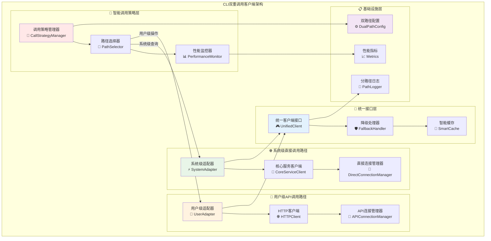
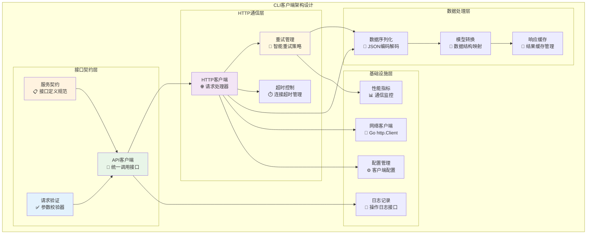
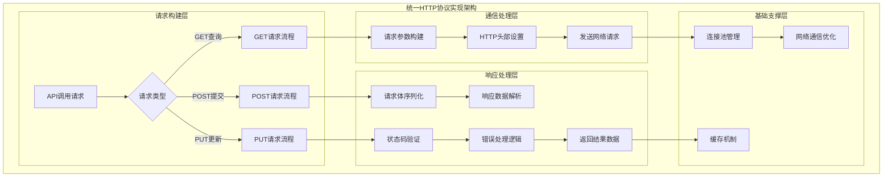
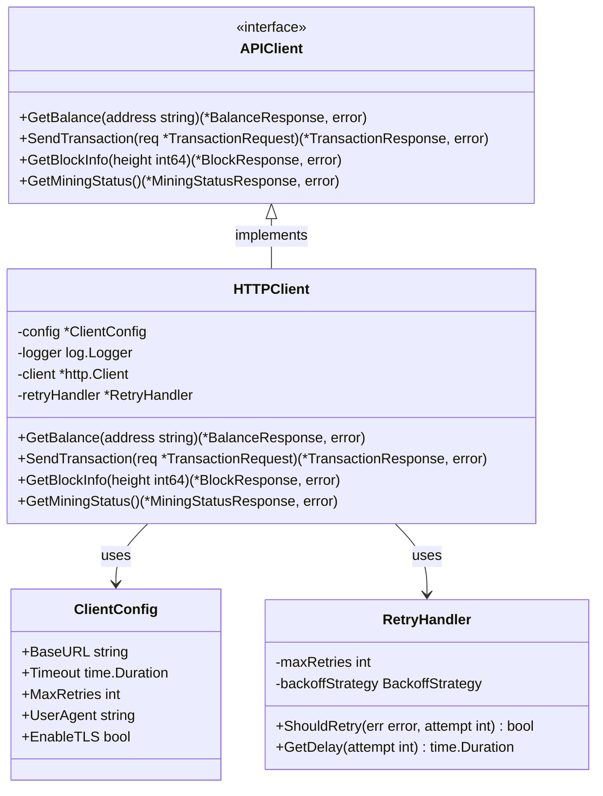

# CLI双重调用客户端（internal/cli/client）

【模块定位】
　　本模块是WES系统中CLI用户界面层的**双重通信桥梁**实现，负责封装API调用和直接核心服务调用两种通信模式。通过智能调用策略和双路径访问机制，为**双层功能架构**提供高效的数据访问能力：系统级功能优先使用直接核心服务调用（高性能），用户级功能根据需要选择API调用或直接调用，确保通信效率的最优化和数据传输的准确性。

【设计原则】
- **双路径调用**：智能选择API调用或直接核心服务调用，优化不同场景的性能
- **系统级优先**：系统级查询优先使用直接核心服务调用，获得最佳性能
- **用户级灵活**：用户级操作根据复杂度选择最适合的调用方式
- **接口统一**：提供标准化的调用接口，屏蔽双重调用的实现差异
- **智能降级**：当直接调用不可用时，自动降级到API调用方式
- **错误容忍**：实现完善的错误处理、重试机制和多路径降级策略
- **性能优化**：通过连接池、缓存和异步处理优化双路径通信性能
- **日志完整**：详细记录双重调用过程，区分调用路径和性能指标

【核心职责】
1. **双重调用路径管理**：智能管理API调用和直接核心服务调用两种通信路径
2. **系统级直接调用优化**：为系统级查询提供高性能的直接核心服务调用
3. **用户级混合调用策略**：为用户级操作提供API调用和直接调用的最优选择
4. **HTTP协议封装**：统一管理所有区块链API的HTTP请求和响应处理
5. **数据模型转换**：定义CLI专用的请求响应数据结构和序列化逻辑
6. **连接生命周期管理**：管理HTTP连接池、直接调用连接和资源释放
7. **智能降级与容错**：提供多路径的错误处理、智能重试和降级机制
8. **双路径性能监控**：监控API调用和直接调用的性能差异，提供优化建议
9. **安全通信保障**：确保HTTPS通信安全、API认证和直接调用的安全机制

【实现架构】

　　采用**双路径智能调用**的五层实现架构，确保系统级和用户级功能的最优通信路径选择和高可靠性。

## 🔀 **双重调用模式架构概览**





**架构层次说明：**

1. **接口契约层**：标准化的API调用接口定义
   - 统一的客户端调用接口和服务契约
   - 请求参数验证和数据完整性检查
   - 接口版本管理和兼容性保障

2. **HTTP通信层**：网络通信的核心实现
   - HTTP请求构建、发送和响应处理
   - 智能重试策略和失败恢复机制
   - 连接超时、读写超时的精确控制

3. **数据处理层**：数据序列化和转换处理
   - JSON数据的编码解码和格式验证
   - CLI数据模型与API数据结构的映射转换
   - 响应数据缓存和性能优化

4. **基础设施层**：底层依赖和支撑服务
   - Go标准库HTTP客户端的封装使用
   - 完整的操作日志记录和错误跟踪
   - 灵活的配置管理和性能监控

---

## 📁 **模块组织结构**

【内部模块架构】

```
internal/cli/client/
├── 🔗 client.go                   # HTTP客户端核心实现
├── 📋 models.go                   # API数据模型定义
└── 📖 README.md                   # 本文档
```

### **🎯 子模块职责分工**

| **子模块** | **核心职责** | **对外接口** | **内部组件** | **复杂度** |
|-----------|-------------|-------------|-------------|-----------|
| `client.go` | HTTP通信协议实现 | APIClient接口 | HTTP客户端、重试管理、配置处理 | 中等 |
| `models.go` | 数据模型管理 | 请求响应结构体 | 数据转换、序列化处理 | 低 |

---

## 🔄 **统一HTTP协议实现**

【实现策略】

　　所有API调用均严格遵循**RESTful HTTP**协议模式，确保通信标准化和接口一致性。



**关键实现要点：**

1. **协议标准化**：
   - 严格遵循RESTful API设计规范
   - 统一的HTTP状态码和错误响应格式
   - 标准化的请求头和认证机制

2. **通信可靠性**：
   - 智能重试策略和指数退避算法
   - 连接超时和读写超时精确控制
   - 网络异常检测和自动恢复机制

3. **性能优化**：
   - HTTP连接池复用减少连接开销
   - 响应数据缓存提升重复查询性能
   - 异步请求处理支持并发调用

---

## 🏗️ **依赖注入架构**

【fx框架集成】

　　全面采用fx依赖注入框架，实现客户端组件的松耦合和生命周期自动管理。

```go
// 示例：客户端模块依赖注入配置
package client

import (
    "go.uber.org/fx"
    "github.com/weisyn/v1/pkg/interfaces/infrastructure/log"
)

// APIClient HTTP API客户端接口
type APIClient interface {
    GetBalance(address string) (*BalanceResponse, error)
    SendTransaction(req *TransactionRequest) (*TransactionResponse, error)
    GetBlockInfo(height int64) (*BlockResponse, error)
    GetMiningStatus() (*MiningStatusResponse, error)
}

// NewClient 创建HTTP客户端实例
func NewClient(
    config *ClientConfig,
    logger log.Logger,
) APIClient {
    return &HTTPClient{
        config: config,
        logger: logger,
        client: &http.Client{
            Timeout: config.Timeout,
        },
    }
}
```

**依赖管理特点：**
- **自动生命周期**：客户端创建和销毁由fx自动管理
- **接口导向**：通过APIClient接口而非具体类型进行依赖
- **配置注入**：客户端配置通过依赖注入方式提供
- **测试友好**：支持依赖注入的单元测试和Mock替换

---

## 📊 **性能与监控**

【性能指标】

| **操作类型** | **目标延迟** | **吞吐量目标** | **成功率目标** | **监控方式** |
|-------------|-------------|---------------|----------------|------------|
| 余额查询 | < 500ms | > 100 req/s | > 99% | 实时监控 |
| 转账提交 | < 2s | > 50 req/s | > 98% | 关键路径监控 |
| 区块查询 | < 800ms | > 80 req/s | > 99% | 批量统计 |
| 状态查询 | < 300ms | > 200 req/s | > 99.5% | 实时监控 |
| 节点管理 | < 600ms | > 60 req/s | > 97% | 异步监控 |

**性能优化策略：**
- **连接池管理**：维护合理大小的HTTP连接池，减少连接建立开销
- **智能重试**：基于响应时间和错误类型的自适应重试策略
- **响应缓存**：对查询类接口实现智能缓存，减少重复网络请求
- **并发控制**：合理控制并发请求数量，避免服务端过载

---

## 🔗 **与公共接口的映射关系**

【接口实现映射】



**实现要点：**
- **接口契约**：严格遵循APIClient接口的方法签名和错误处理语义
- **错误处理**：标准化的HTTP错误映射和用户友好的错误信息
- **日志记录**：完整的请求响应日志记录，包括性能指标和错误跟踪
- **测试覆盖**：每个接口方法都有对应的单元测试和集成测试

---

## 🚀 **后续扩展规划**

【模块演进方向】

1. **协议升级支持**
   - HTTP/2和gRPC协议支持
   - WebSocket长连接实时通信
   - GraphQL查询接口集成

2. **安全性增强**
   - mTLS双向认证机制
   - API密钥管理和轮换
   - 请求签名验证支持

3. **性能优化**
   - 请求合并和批处理优化
   - 智能负载均衡和故障转移
   - 响应数据压缩和传输优化

4. **监控告警**
   - 详细的性能指标收集
   - 自动化监控告警机制
   - API调用链路追踪支持

---

## 📋 **开发指南**

【客户端开发规范】

1. **新增API接口步骤**：
   - 在APIClient接口中定义方法签名
   - 在models.go中添加请求响应数据结构
   - 在HTTPClient中实现具体的HTTP调用逻辑
   - 添加完整的单元测试和错误处理
   - 更新接口文档和使用示例

2. **代码质量要求**：
   - 遵循Go语言最佳实践和项目编码规范
   - 100%的接口方法测试覆盖率
   - 完善的错误处理和超时控制机制
   - 清晰的代码注释和接口文档

3. **性能要求**：
   - API调用响应时间符合性能指标要求
   - 合理使用HTTP连接池和缓存机制
   - 内存使用控制在合理范围内
   - 支持并发安全的多线程调用

【参考文档】
- [WES API接口文档](../../../docs/api/README.md)
- [Go HTTP客户端最佳实践](https://golang.org/pkg/net/http/)
- [fx依赖注入指南](https://uber-go.github.io/fx/)

---

> 📝 **模板说明**：本README基于WES v0.0.1统一文档规范设计，详细描述了CLI客户端模块的架构设计、接口实现和性能要点。

> 🔄 **维护指南**：本文档应随着API接口的变更及时更新，确保文档与代码实现的一致性。建议在每次接口变更后更新相应章节。
