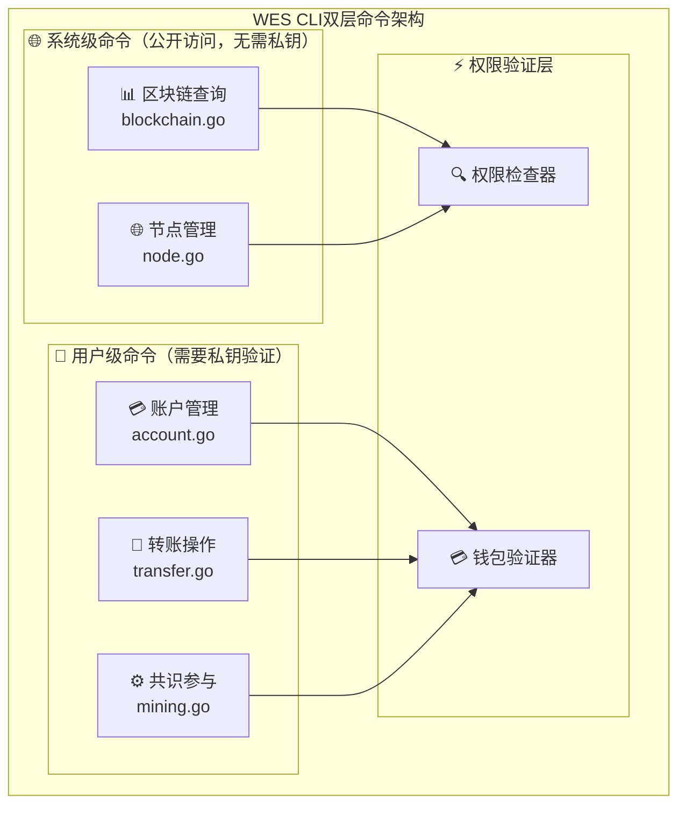
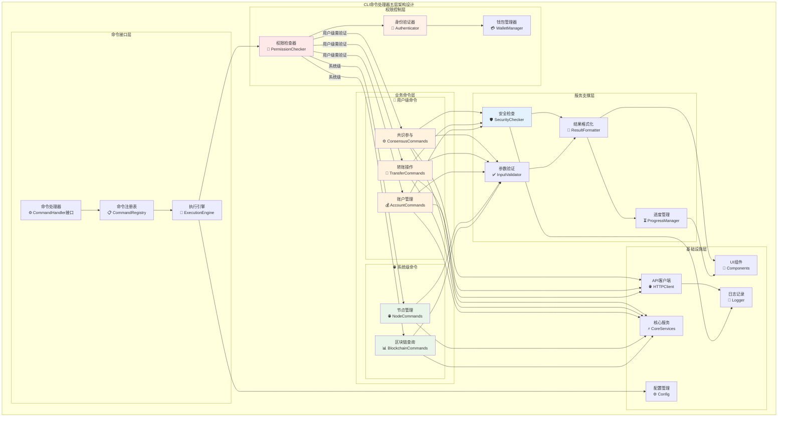
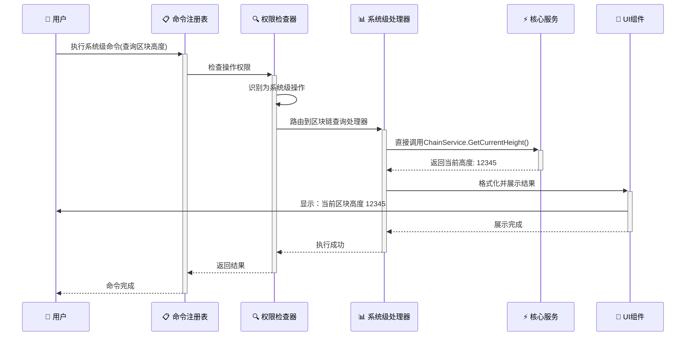

# CLI命令处理器（internal/cli/commands）

【模块定位】
　　本模块是WES系统中CLI用户界面层的核心业务处理实现，负责执行用户发起的所有区块链操作命令。通过**双层功能架构**的设计和统一的命令处理接口，提供完整的系统级查询（公开访问）和用户级操作（需要私钥）能力，支撑不同权限层次的CLI业务需求，确保命令执行的安全性、准确性和用户操作的便捷性。

【设计原则】
- **双层架构**：严格区分系统级（公开访问）和用户级（私钥保护）功能边界
- **权限清晰**：明确标识需要身份验证的操作，保障用户资产安全
- **接口统一**：提供标准化的命令处理接口，确保执行流程的一致性
- **功能分类**：按权限层次和业务领域分类组织命令，便于维护和扩展
- **参数验证**：严格的用户输入验证和参数安全检查机制
- **错误友好**：完善的错误处理和用户友好的提示信息
- **UI集成**：深度集成pterm组件，提供美观的执行结果展示

【核心职责】
1. **双层命令架构管理**：区分和管理系统级（公开）和用户级（私钥保护）命令
2. **权限验证控制**：确保用户级操作的身份验证和私钥安全访问
3. **业务逻辑实现**：实现账户管理、转账操作、区块链查询、共识参与、节点管理等核心功能
4. **参数验证处理**：对用户输入进行严格验证和安全性检查，特别是敏感操作
5. **服务调用协调**：协调HTTP客户端和直接核心服务调用，优化性能和用户体验
6. **结果展示渲染**：使用UI组件美观地展示命令执行结果和权限状态提示
7. **安全错误处理**：提供完善的错误处理和用户操作指导，特别关注安全相关错误

【实现架构】

　　采用**双层权限+分类处理**的五层实现架构，确保命令执行的安全性、标准化和业务逻辑的模块化。

## 🔐 **双层功能架构概览**



## 🏗️ **五层实现架构**



**架构层次说明：**

1. **权限控制层**：🔐 用户身份验证和权限管理的核心安全层
   - 权限检查器识别系统级和用户级操作边界
   - 身份验证器验证用户身份和钱包访问权限
   - 钱包管理器安全管理私钥访问和签名操作

2. **命令接口层**：⚙️ 标准化的命令处理接口定义和调度
   - 统一的命令处理器接口规范和生命周期管理
   - 命令注册表管理所有可用命令和权限映射
   - 执行引擎负责命令的安全调度和权限验证

3. **业务命令层**：📊 按权限层次分类的具体业务功能实现
   - **🌐 系统级命令**：无需私钥的公开查询功能（区块链查询、节点管理）
   - **🔐 用户级命令**：需要私钥验证的个人操作（账户管理、转账操作、共识参与）
   - 每个命令处理器严格遵循权限边界和安全规范

4. **服务支撑层**：✅ 命令执行的安全验证和公共服务组件
   - 参数验证器确保输入数据的合法性和格式正确性
   - 安全检查器验证敏感操作的安全条件和风险评估
   - 结果格式化器提供统一的输出格式和权限状态显示
   - 进度管理器处理长时间运行操作的状态跟踪

5. **基础设施层**：🌐 底层服务访问和支撑基础设施
   - API客户端提供HTTP方式的区块链服务访问
   - 核心服务提供直接调用区块链核心组件的高性能通道
   - UI组件库支持美观的结果展示和权限状态提示
   - 日志记录和配置管理支持安全审计和运维监控

## 📝 **核心接口**

```go
// CommandHandler 统一的命令处理器接口
type CommandHandler interface {
    // Execute 执行命令
    Execute(ctx context.Context, args []string) error
    
    // GetDescription 获取命令描述
    GetDescription() string
    
    // GetUsage 获取使用说明
    GetUsage() string
    
    // ValidateArgs 验证参数
    ValidateArgs(args []string) error
}

// CommandRegistry 命令注册表
type CommandRegistry interface {
    // Register 注册命令处理器
    Register(name string, handler CommandHandler) error
    
    // Get 获取命令处理器
    Get(name string) (CommandHandler, bool)
    
    // List 列出所有命令
    List() map[string]CommandHandler
}
```

---

## 🎮 **双层命令分类实现**

### **🌐 系统级命令（公开访问，无需私钥）**

#### **1. 区块链查询命令 (BlockchainCommands)**

```go
type BlockchainCommands struct {
    chainService   blockchain.ChainService    // 直接调用核心服务
    client         client.APIClient           // HTTP客户端备选
    ui             ui.Components
    logger         log.Logger
}

// 支持的系统级查询命令
func (b *BlockchainCommands) GetCurrentHeight() (uint64, error)
func (b *BlockchainCommands) GetChainInfo() (*types.ChainInfo, error)
func (b *BlockchainCommands) GetBestBlockHash() ([]byte, error)
func (b *BlockchainCommands) ShowLatestBlocks(count int) error
func (b *BlockchainCommands) GetBlockInfo(height uint64) error
```

**命令特征**：
- ✅ **无需身份验证**：任何用户都可以执行
- 📊 **只读操作**：不涉及资产变动或敏感信息
- ⚡ **高性能**：直接调用ChainService获取实时数据
- 🌐 **公开信息**：展示区块链公共状态和统计数据

#### **2. 节点管理命令 (NodeCommands)**

```go
type NodeCommands struct {
    nodeService    node.Service              // 节点状态服务
    networkService network.NetworkService    // 网络服务
    client         client.APIClient          // HTTP客户端备选
    ui             ui.Components
    logger         log.Logger
}

// 支持的节点管理命令
func (n *NodeCommands) GetNodeStatus() (*NodeStatus, error)
func (n *NodeCommands) ListPeers() ([]*PeerInfo, error)
func (n *NodeCommands) GetNetworkInfo() (*NetworkInfo, error)
func (n *NodeCommands) ShowSyncStatus() error
```

**命令特征**：
- 🌐 **网络状态查询**：P2P连接、同步状态、节点拓扑
- 📈 **实时监控**：节点健康状态和网络连接质量
- 🔍 **诊断工具**：网络连接诊断和性能分析

---

### **🔐 用户级命令（需要私钥验证）**

#### **1. 账户管理命令 (AccountCommands)**

```go
type AccountCommands struct {
    accountService account.AccountService     // 直接调用核心服务
    walletManager  wallet.WalletManager      // 钱包管理服务
    client         client.APIClient          // HTTP客户端备选
    ui             ui.Components
    logger         log.Logger
}

// 支持的用户级账户命令（需要钱包验证）
func (a *AccountCommands) ShowBalance(address string) error          // 🔐 需要选择钱包
func (a *AccountCommands) ListWallets() error                        // 💳 列出用户钱包
func (a *AccountCommands) CreateWallet() error                       // 🆕 创建新钱包
func (a *AccountCommands) ImportWallet(privateKey string) error      // 📥 导入钱包
func (a *AccountCommands) ExportWalletInfo(walletID string) error    // 📤 导出钱包信息
```

**命令特征**：
- 🔐 **私钥保护**：所有操作都需要钱包密码验证
- 💰 **资产查询**：查询特定地址的余额和交易历史
- 🔑 **钱包管理**：创建、导入、管理个人钱包
- 🛡️ **安全优先**：私钥加密存储，不明文暴露

#### **2. 转账操作命令 (TransferCommands)**

```go
type TransferCommands struct {
    transactionService transaction.TransactionService  // 直接调用核心服务
    walletManager      wallet.WalletManager           // 钱包管理服务
    client             client.APIClient               // HTTP客户端备选
    ui                 ui.Components
    logger             log.Logger
}

// 支持的转账命令（需要私钥签名）
func (t *TransferCommands) InteractiveTransfer() error                    // 🔐 交互式转账
func (t *TransferCommands) SimpleTransfer(from, to string, amount float64) error // 💸 单笔转账
func (t *TransferCommands) BatchTransfer(csvFile string) error            // 📦 批量转账
func (t *TransferCommands) TimeLockTransfer() error                       // ⏰ 时间锁转账
func (t *TransferCommands) ShowTransferHistory() error                    // 📊 转账记录
func (t *TransferCommands) CheckTransactionStatus(txHash string) error    // 🔍 交易状态查询
```

**命令特征**：
- ✍️ **数字签名**：所有转账都需要私钥签名验证身份
- 💸 **资产转移**：涉及真实资产转移，不可逆操作
- 🔐 **密码保护**：每次转账都需要钱包密码确认
- 📋 **多种方式**：支持单笔、批量、时间锁等转账方式
- ⚠️ **安全提示**：转账前进行风险提示和确认

#### **3. 共识参与命令 (ConsensusCommands)**

```go
type ConsensusCommands struct {
    minerService      miner.MinerService           // 共识服务
    walletManager     wallet.WalletManager         // 钱包管理服务
    client            client.APIClient             // HTTP客户端备选
    ui                ui.Components
    logger            log.Logger
}

// 支持的共识参与命令（需要矿工钱包）
func (c *ConsensusCommands) StartConsensus(minerAddress string, threads int) error  // 🚀 启动共识节点
func (c *ConsensusCommands) StopConsensus() error                                   // ⏹️ 停止共识节点
func (c *ConsensusCommands) ShowConsensusStatus() error                             // 📊 共识状态查询
func (c *ConsensusCommands) ShowConsensusConfig() error                             // ⚙️ 共识配置管理
func (c *ConsensusCommands) ShowConsensusRewards() error                            // 💎 共识收益统计
```

**命令特征**：
- 🏗️ **网络维护**：参与区块链网络的共识机制和区块生产
- 💰 **获得收益**：通过共识参与获得区块奖励和交易费收益
- 🔐 **矿工地址**：需要配置专用的矿工钱包地址接收收益
- ⚙️ **资源配置**：可配置计算线程数和共识参数优化性能
- 📈 **收益监控**：实时监控共识收益和网络贡献统计

---

## ⚡ **双层架构执行流程**

### **🌐 系统级命令执行流程（无需私钥验证）**



### **🔐 用户级命令执行流程（需要私钥验证）**

```mermaid
sequenceDiagram
    participant User as 👤 用户
    participant Registry as 📋 命令注册表
    participant Permission as 🔍 权限检查器
    participant Auth as 🔑 身份验证器
    participant Wallet as 💳 钱包管理器
    participant Handler as 🔐 用户级处理器
    participant CoreService as ⚡ 核心服务
    participant Security as 🛡️ 安全检查器
    participant UI as 🎨 UI组件

    User->>+Registry: 执行用户级命令(转账)
    Registry->>+Permission: 检查操作权限
    Permission->>Permission: 识别为用户级操作，需要验证
    Permission->>+Auth: 启动身份验证
    
    Auth->>+Wallet: 检查用户钱包状态
    alt 用户无钱包
        Wallet-->>Auth: 无可用钱包
        Auth->>UI: 提示创建或导入钱包
        UI->>User: 显示钱包创建指导
        User->>Wallet: 创建新钱包
        Wallet-->>Auth: 钱包创建完成
    end
    
    Auth->>User: 请求钱包密码验证
    User->>Auth: 输入钱包密码
    Auth->>+Wallet: 验证密码并获取私钥访问权限
    Wallet-->>-Auth: 验证成功，私钥访问权限已授权
    Auth-->>-Permission: 身份验证完成
    
    Permission->>+Handler: 路由到转账处理器
    Handler->>User: 收集转账参数(接收地址、金额等)
    User->>Handler: 提供转账详细信息
    
    Handler->>+Security: 验证转账安全性
    Security->>Security: 检查地址格式、余额充足性、风险评估
    alt 安全检查通过
        Security-->>-Handler: 安全验证通过
        Handler->>User: 显示转账确认信息
        User->>Handler: 确认执行转账
        
        Handler->>+Wallet: 使用私钥签名交易
        Wallet-->>-Handler: 返回已签名交易
        Handler->>+CoreService: 调用TransactionService广播交易
        CoreService-->>-Handler: 返回交易哈希
        
        Handler->>+UI: 展示转账成功结果
        UI->>User: 显示：转账成功，交易哈希：0x...
        UI-->>-Handler: 展示完成
        Handler-->>-Permission: 执行成功
    else 安全检查失败
        Security-->>-Handler: 安全风险警告
        Handler->>UI: 显示风险提示和建议
        Handler-->>-Permission: 执行取消
    end
    
    Permission-->>-Registry: 返回结果
    Registry-->>-User: 命令完成
```

## 🎨 **UI集成示例**

### **进度显示**

```go
func (t *TransferCommands) SimpleTransfer(from, to string, amount float64) error {
    // 显示进度条
    progress := t.ui.NewProgressBar("转账处理中...", 3)
    
    progress.Update(1, "验证参数...")
    if err := t.validateTransferParams(from, to, amount); err != nil {
        return err
    }
    
    progress.Update(2, "提交交易...")
    resp, err := t.client.SendTransaction(&TransactionRequest{
        From: from, To: to, Amount: amount,
    })
    if err != nil {
        return err
    }
    
    progress.Update(3, "完成")
    progress.Close()
    
    // 展示结果
    t.ui.ShowSuccess("转账成功", map[string]string{
        "交易哈希": resp.TxHash,
        "状态": resp.Status,
    })
    
    return nil
}
```

### **表格展示**

```go
func (b *BlockchainCommands) ShowLatestBlocks(count int) error {
    blocks, err := b.client.GetLatestBlocks(count)
    if err != nil {
        return err
    }
    
    // 构建表格数据
    tableData := [][]string{
        {"高度", "哈希", "时间", "交易数", "大小"},
    }
    
    for _, block := range blocks {
        tableData = append(tableData, []string{
            fmt.Sprintf("%d", block.Height),
            block.Hash[:16] + "...",
            block.Timestamp.Format("15:04:05"),
            fmt.Sprintf("%d", block.TxCount),
            fmt.Sprintf("%.1fKB", float64(block.Size)/1024),
        })
    }
    
    return b.ui.ShowTable("最新区块", tableData)
}
```

## 📊 **双层架构性能指标**

### **🌐 系统级命令性能**
| **命令类型** | **平均执行时间** | **成功率** | **用户体验** | **权限验证** |
|-------------|----------------|-----------|-------------|-------------|
| 区块链查询 | < 200ms | > 99.5% | 优秀 | 无需验证 |
| 节点状态 | < 100ms | > 99.8% | 优秀 | 无需验证 |
| 网络信息 | < 150ms | > 99.2% | 优秀 | 无需验证 |

### **🔐 用户级命令性能**
| **命令类型** | **平均执行时间** | **成功率** | **用户体验** | **安全要求** |
|-------------|----------------|-----------|-------------|-------------|
| 钱包管理 | < 500ms | > 99% | 良好 | 密码验证 |
| 余额查询 | < 800ms | > 98% | 良好 | 钱包选择 |
| 转账操作 | < 3s | > 95% | 良好 | 私钥签名 |
| 共识参与 | < 1s | > 97% | 良好 | 矿工地址验证 |

## 🔧 **开发指南**

### **新增命令步骤**

1. **定义命令结构**：
   ```go
   type NewCommands struct {
       client client.APIClient
       ui     ui.Components
       logger log.Logger
   }
   ```

2. **实现CommandHandler接口**：
   ```go
   func (n *NewCommands) Execute(ctx context.Context, args []string) error
   func (n *NewCommands) GetDescription() string
   func (n *NewCommands) GetUsage() string
   func (n *NewCommands) ValidateArgs(args []string) error
   ```

3. **注册到fx模块**：
   ```go
   fx.Provide(commands.NewNewCommands)
   ```

### **双层架构最佳实践**

#### **🌐 系统级命令最佳实践**
- **快速响应**：优化查询性能，目标响应时间 < 200ms
- **缓存优化**：合理使用缓存减少重复的核心服务调用
- **并发友好**：支持多用户同时查询，无状态设计
- **错误透明**：提供清晰的查询失败原因和建议

#### **🔐 用户级命令最佳实践**
- **权限验证**：每个用户级操作都必须验证钱包权限
- **私钥保护**：私钥使用后立即清理，避免内存泄露
- **安全确认**：敏感操作（如转账）需要用户二次确认
- **风险提示**：在执行高风险操作前进行安全教育
- **操作审计**：记录所有涉及私钥和资产的操作日志

#### **🔗 通用最佳实践**
- **参数验证**：所有用户输入都需要严格验证和格式化
- **错误处理**：提供友好的错误提示和恢复建议
- **进度反馈**：长时间操作显示进度条和状态更新
- **结果展示**：使用表格、列表等美观的展示方式
- **日志记录**：记录关键操作和错误信息，区分系统级和用户级日志

---

> 📝 **说明**：本模块是CLI功能的核心实现，每个命令处理器都严格遵循统一的接口规范和错误处理标准。

> 🔄 **维护**：随着区块链功能的扩展，及时添加新的命令处理器，并保持接口的一致性和用户体验的统一。
