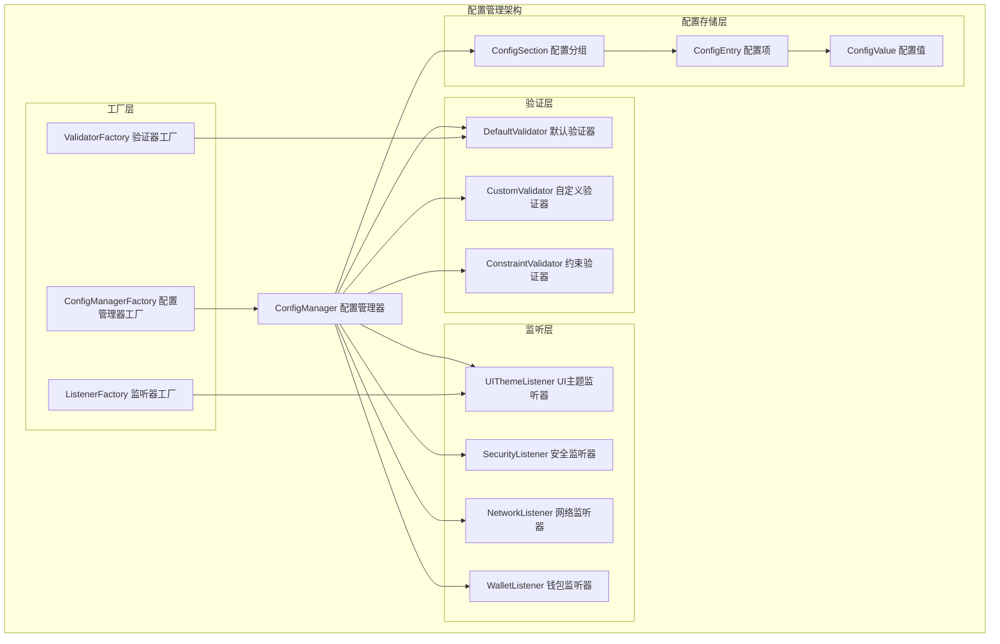

# CLI配置管理模块 (Config)

## 模块概述

`config`模块是WES CLI的配置管理核心，实现了分层配置架构、动态配置验证、实时配置监听和智能默认值管理。作为双层功能架构的基础支撑，为所有CLI组件提供灵活、可靠的配置服务。

## 设计原理

### 核心理念
- **分层配置管理**: 支持全局、用户、本地、会话四个配置层级
- **动态配置验证**: 实时验证配置值的合法性和完整性
- **智能监听机制**: 配置变更时自动触发相关组件更新
- **类型安全保障**: 提供强类型配置访问和验证

### 架构优势
- **灵活性**: 支持多种配置格式和存储方式
- **可扩展性**: 插件化验证器和监听器架构
- **安全性**: 敏感配置加密存储和访问控制
- **用户友好**: 智能默认值和配置向导

## 核心职责

### 1. 分层配置管理
```go
// 配置层级优先级：会话 > 本地 > 用户 > 全局
type ConfigScope string
const (
    SessionScope ConfigScope = "session"  // 会话配置（内存）
    LocalScope   ConfigScope = "local"    // 本地配置（项目）
    UserScope    ConfigScope = "user"     // 用户配置（家目录）
    GlobalScope  ConfigScope = "global"   // 全局配置（系统）
)
```

### 2. 动态配置验证
- **类型验证**: 确保配置值符合预期类型
- **范围验证**: 检查数值配置的合理范围
- **枚举验证**: 限制配置值在允许列表内
- **格式验证**: 验证特殊格式（URL、邮箱等）

### 3. 实时配置监听
- **UI主题监听器**: 主题变更时更新界面样式
- **安全配置监听器**: 安全设置变更时调整安全策略
- **网络配置监听器**: 网络配置变更时更新连接参数
- **钱包配置监听器**: 钱包设置变更时调整钱包行为

### 4. 智能默认值管理
- **分类默认配置**: 按功能模块组织默认配置
- **环境适配**: 根据运行环境调整默认值
- **用户画像**: 基于用户行为优化默认配置

## 组件架构



## 配置分类

### 1. UI界面配置
```yaml
ui:
  theme: "default"              # 界面主题
  language: "zh-CN"             # 界面语言
  show_hints: true              # 显示提示
  animation_enabled: true       # 启用动画
  page_size: 20                 # 分页大小
```

### 2. 网络通信配置
```yaml
network:
  api_url: "http://localhost:8080"  # API服务地址
  timeout: 30                       # 请求超时（秒）
  max_retries: 3                   # 最大重试次数
  enable_tls: false                # 启用TLS加密
```

### 3. 安全保护配置
```yaml
security:
  require_confirmation: true     # 需要操作确认
  session_timeout: 1800         # 会话超时（秒）
  mask_sensitive_data: true     # 遮罩敏感数据
  audit_logging: true           # 审计日志
```

### 4. 系统运行配置
```yaml
system:
  log_level: "info"             # 日志级别
  auto_save: true               # 自动保存
  backup_enabled: true          # 启用备份
  cleanup_interval: 3600        # 清理间隔（秒）
```

### 5. 钱包管理配置
```yaml
wallet:
  auto_lock_timeout: 600        # 自动锁定超时（秒）
  backup_on_create: true        # 创建时备份
  encryption_enabled: true      # 启用加密
```

## 核心接口

### ConfigManager接口
```go
type ConfigManager interface {
    // 基本操作
    Get(key string) (interface{}, error)
    Set(key string, value interface{}) error
    Delete(key string) error
    
    // 类型化访问
    GetString(key string) (string, error)
    GetInt(key string) (int, error)
    GetBool(key string) (bool, error)
    
    // 配置文件操作
    Load(filePath string) error
    Save(filePath string) error
    
    // 验证和监听
    RegisterValidator(validator ConfigValidator) error
    RegisterListener(listener ConfigListener) error
}
```

### ConfigValidator接口
```go
type ConfigValidator interface {
    Validate(key string, value interface{}) error
    GetConstraints(key string) map[string]interface{}
}
```

### ConfigListener接口
```go
type ConfigListener interface {
    OnConfigChanged(event ConfigChangeEvent) error
}
```

## 使用示例

### 1. 基本配置操作
```go
// 创建配置管理器
cm := NewConfigManagerWithDefaults(logger, uiComponents)

// 初始化
ctx := context.Background()
cm.Initialize(ctx)

// 设置配置
cm.Set("ui.theme", "dark")
cm.SetBool("security.require_confirmation", true)

// 获取配置
theme, _ := cm.GetString("ui.theme")
timeout, _ := cm.GetInt("network.timeout")
```

### 2. 自定义验证器
```go
type CustomValidator struct{}

func (v *CustomValidator) Validate(key string, value interface{}) error {
    if key == "custom.port" {
        if port, ok := value.(int); ok {
            if port < 1024 || port > 65535 {
                return fmt.Errorf("端口范围必须在1024-65535之间")
            }
        }
    }
    return nil
}

// 注册验证器
cm.RegisterValidator(&CustomValidator{})
```

### 3. 自定义监听器
```go
type CustomListener struct{}

func (l *CustomListener) OnConfigChanged(event ConfigChangeEvent) error {
    fmt.Printf("配置变更: %s = %v\n", event.Key, event.NewValue)
    return nil
}

// 注册监听器
cm.RegisterListener(&CustomListener{})
```

## 配置文件管理

### 配置文件位置
```
~/.weisyn_cli/config/
├── global.json    # 全局配置
├── user.json      # 用户配置
├── local.json     # 本地配置
└── backups/       # 配置备份
```

### 配置文件格式
```json
{
  "ui": {
    "theme": "default",
    "language": "zh-CN",
    "show_hints": true
  },
  "network": {
    "api_url": "http://localhost:8080",
    "timeout": 30
  },
  "security": {
    "require_confirmation": true,
    "session_timeout": 1800
  }
}
```

## 验证约束

### 约束类型
```go
constraints := map[string]interface{}{
    "type":       "string",                    // 类型约束
    "required":   true,                        // 必填约束
    "min":        float64(1),                  // 最小值约束
    "max":        float64(100),                // 最大值约束
    "enum":       []interface{}{"a", "b"},     // 枚举约束
    "pattern":    "email",                     // 格式约束
    "min_length": 3,                           // 最小长度约束
    "max_length": 50,                          // 最大长度约束
}
```

### 内置验证器
- **类型验证**: 支持string、int、float、bool、slice、map
- **范围验证**: 数值范围检查
- **枚举验证**: 固定选项验证
- **格式验证**: email、url、ipv4等格式
- **长度验证**: 字符串和数组长度限制

## 监听器机制

### 配置变更事件
```go
type ConfigChangeEvent struct {
    Key       string      // 配置键
    OldValue  interface{} // 旧值
    NewValue  interface{} // 新值
    Scope     ConfigScope // 作用范围
    Timestamp time.Time   // 时间戳
    Source    string      // 变更源
}
```

### 内置监听器
- **UIThemeListener**: 处理UI主题变更
- **SecurityListener**: 处理安全配置变更
- **NetworkListener**: 处理网络配置变更
- **WalletListener**: 处理钱包配置变更
- **AuditListener**: 记录所有配置变更

## 性能优化

### 1. 分层缓存策略
- 会话配置存储在内存中，访问最快
- 本地配置缓存到内存，定期同步
- 用户和全局配置懒加载

### 2. 配置读写分离
- 读操作优先从缓存获取
- 写操作异步持久化到文件
- 批量写入减少IO次数

### 3. 验证器优化
- 预编译正则表达式
- 缓存验证结果
- 并行验证多个配置项

## 扩展指南

### 1. 添加新配置项
1. 在`initializeDefaults`中定义默认值
2. 在`DefaultValidator`中添加约束条件
3. 创建对应的配置监听器
4. 更新配置文档

### 2. 自定义验证器
1. 实现`ConfigValidator`接口
2. 在工厂函数中注册验证器
3. 编写单元测试验证逻辑

### 3. 自定义监听器
1. 实现`ConfigListener`接口
2. 在工厂函数中注册监听器
3. 处理特定配置变更事件

## 安全考虑

### 1. 敏感配置保护
- 敏感配置值加密存储
- 访问权限控制
- 审计日志记录

### 2. 配置完整性
- 配置文件签名验证
- 配置变更检测
- 异常配置恢复

### 3. 权限管理
- 不同用户的配置隔离
- 管理员配置保护
- 配置导入导出控制

## 故障处理

### 1. 配置文件损坏
- 自动备份恢复
- 默认配置重建
- 错误配置清理

### 2. 验证失败
- 详细错误信息
- 配置修复建议
- 回退到安全值

### 3. 监听器异常
- 监听器异常隔离
- 错误监听器移除
- 系统稳定性保障

## 最佳实践

### 1. 配置设计
- 使用分层次的配置键名
- 提供合理的默认值
- 文档化所有配置项

### 2. 验证设计
- 尽早验证配置值
- 提供友好的错误信息
- 支持配置值修复

### 3. 监听器设计
- 避免监听器中的重操作
- 处理监听器异常
- 支持监听器的启用/禁用

本模块通过完整的配置管理架构，为WES CLI提供了灵活、安全、高效的配置服务，确保系统的可配置性和用户体验的一致性。
