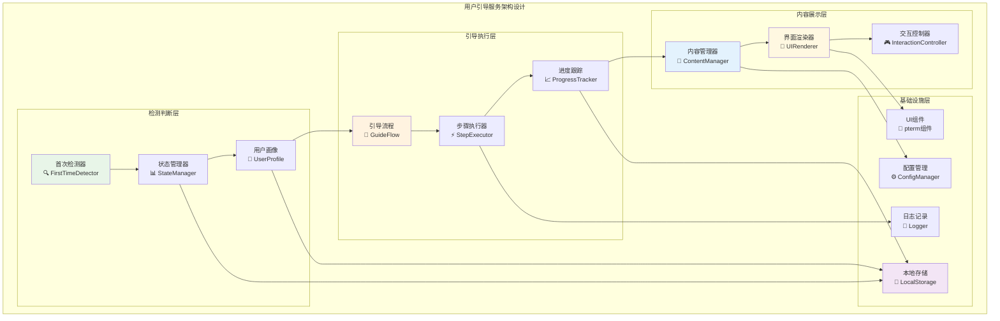
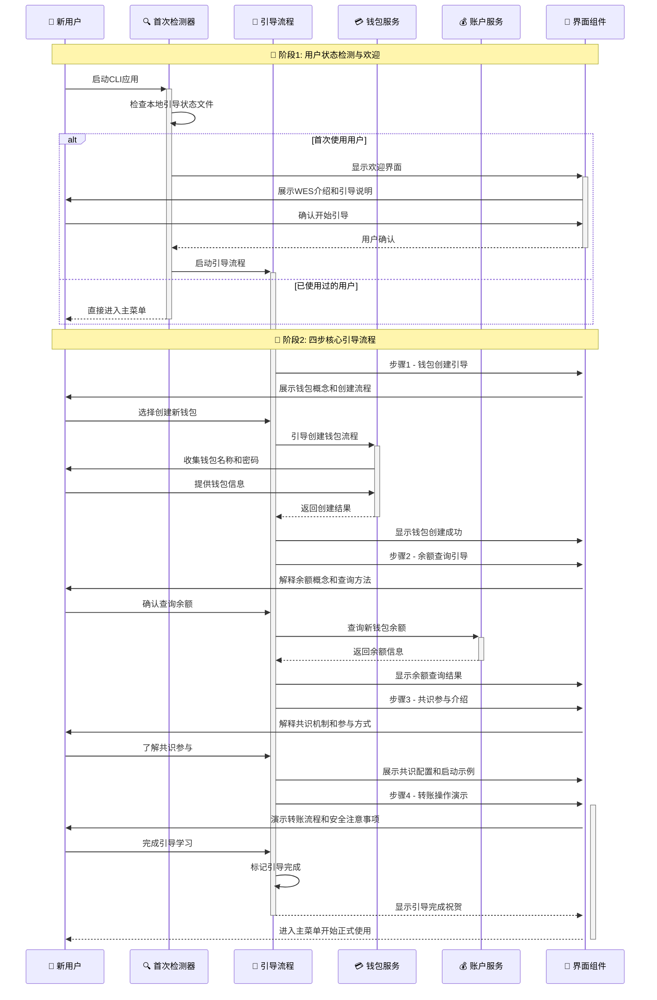
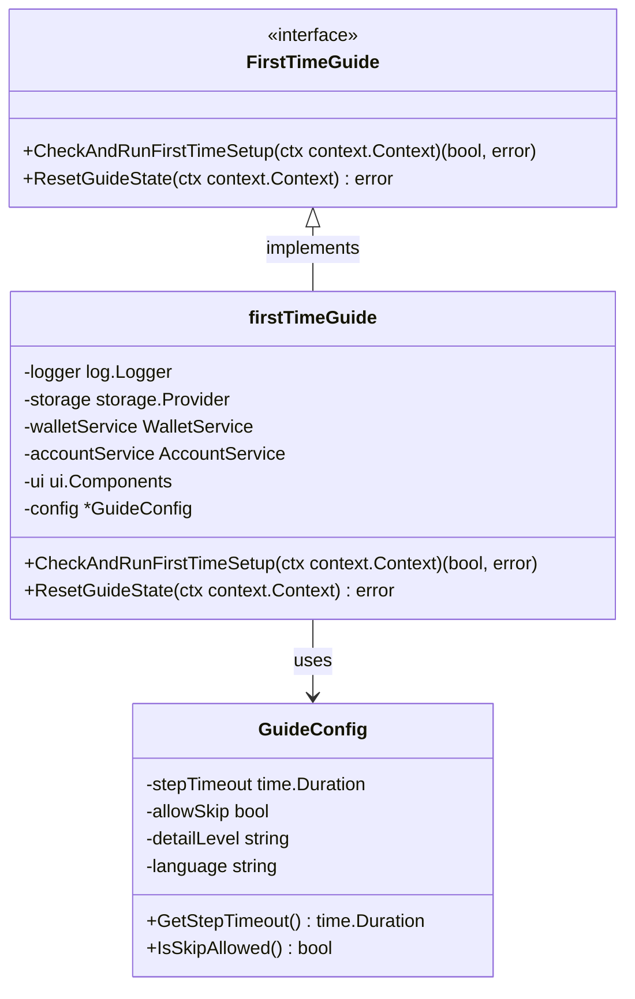

# 用户引导服务模块（internal/cli/guides）

【模块定位】
　　本模块是WES系统中CLI用户界面层的新用户引导实现，负责为首次使用用户提供完整的入门指导和设置流程。通过智能检测机制和分步引导系统，提供个性化的用户体验，支撑用户从区块链新手到熟练操作者的学习路径，确保用户能够安全、正确地掌握WES的核心功能。

【设计原则】
- **零门槛引导**：假设用户完全不懂区块链，从最基础的概念开始引导
- **分步渐进**：将复杂的区块链操作分解为易理解的步骤序列
- **安全优先**：在引导过程中强调安全操作和风险提示
- **体验友好**：使用直观的界面设计和友好的语言表达
- **智能检测**：自动识别用户状态，提供个性化的引导内容

【核心职责】
1. **首次用户检测**：智能判断用户是否为首次使用，触发相应引导流程
2. **分步引导实施**：执行4步核心引导流程，涵盖钱包、余额、共识、转账
3. **概念教育普及**：解释区块链基础概念，降低用户理解门槛
4. **安全意识培养**：在引导中培养用户的安全操作意识和习惯
5. **操作技能训练**：通过实际操作让用户掌握核心功能使用方法
6. **进度状态管理**：跟踪引导进度，支持中断续传和重复学习

【实现架构】

　　采用**智能引导**的三层实现架构，确保引导流程的自适应性和用户体验的个性化。



**架构层次说明：**

1. **检测判断层**：智能识别用户状态和引导需求
   - 首次检测器判断用户是否需要引导
   - 状态管理器维护用户引导进度和状态
   - 用户画像分析用户特征和个性化需求

2. **引导执行层**：执行具体的引导流程和步骤
   - 引导流程控制整体引导逻辑和步骤序列
   - 步骤执行器负责单个引导步骤的实施
   - 进度跟踪器记录和管理引导进度状态

3. **内容展示层**：管理引导内容的展示和用户交互
   - 内容管理器提供引导内容和教学材料
   - 界面渲染器负责美观的引导界面显示
   - 交互控制器处理用户输入和操作响应

---

## 🎯 **核心引导流程**

【流程概述】

　　此章节展现首次用户引导的完整流程，体现从用户检测到成功掌握核心功能的端到端引导能力。

### **📊 首次用户引导流程图**



### **🔄 详细流程分析**

#### **阶段1: 用户状态检测与欢迎**

**📍 核心职责**: 智能识别首次用户并展示友好的欢迎界面

**🔄 详细步骤**:

1. **首次检测逻辑** (`FirstTimeDetector`)
   ```go
   // 检测逻辑关键代码示例
   func (d *FirstTimeDetector) CheckFirstTime(ctx context.Context) (bool, error) {
       // 检查本地状态文件是否存在
       exists := d.storage.FileExists(FirstTimeStateFile)
       return !exists, nil
   }
   ```
   - 检查本地引导状态文件 `~/.weisyn/cli/first_time_completed`
   - 识别用户使用历史和引导进度状态
   - 支持引导状态重置和重新引导功能

2. **欢迎界面展示** (`UIRenderer`)
   - 显示WES品牌标识和版本信息
   - 展示引导流程概览和预期时间
   - 提供引导跳过选项（不推荐新用户）

**📤 输出**: 确定用户类型和引导启动决策

#### **阶段2: 四步核心引导流程**

**📍 核心职责**: 系统性地引导用户掌握WES核心功能

**🔄 详细步骤**:

1. **步骤1: 钱包创建引导**
   - 📝 **概念教育**: 解释钱包、私钥、地址的概念和关系
   - 🔧 **实际操作**: 引导创建第一个钱包
   - 🛡️ **安全教育**: 强调私钥安全和密码重要性
   - ✅ **成果验证**: 确认钱包创建成功并保存

2. **步骤2: 余额查询引导**  
   - 📝 **概念教育**: 解释余额、代币、交易历史概念
   - 🔧 **实际操作**: 查询新创建钱包的余额状态
   - 📊 **结果解读**: 解释余额显示信息和含义
   - 💡 **获取资金**: 指导如何获得测试代币或真实资产

3. **步骤3: 共识参与介绍**
   - 📝 **概念教育**: 解释区块链共识机制和参与价值
   - ⚙️ **配置展示**: 演示共识节点配置和启动流程
   - 📈 **收益说明**: 说明共识参与的收益和风险
   - 🔧 **实际体验**: 可选择启动共识节点体验

4. **步骤4: 转账操作演示**
   - 📝 **概念教育**: 解释转账、交易费、确认时间概念
   - 🔧 **操作演示**: 展示转账流程的每个步骤
   - ⚠️ **安全警示**: 强调转账不可逆和地址准确性重要性
   - 📋 **最佳实践**: 传授安全转账的最佳操作方法

**📤 输出**: 用户成功掌握WES四大核心功能

### **🔗 关键组件交互详情**

#### **1. 首次检测器** (`FirstTimeDetector`)
```go
// 核心检测接口
type FirstTimeDetector interface {
    CheckFirstTime(ctx context.Context) (bool, error)
    MarkCompleted(ctx context.Context) error
    ResetGuideState(ctx context.Context) error
}
```
- **智能检测**: 基于本地状态文件的首次使用检测
- **状态持久化**: 引导完成状态的本地存储和管理
- **重置支持**: 支持引导状态重置，便于重新体验

#### **2. 引导流程控制器** (`GuideFlow`)
```go
// 引导流程配置
type GuideConfig struct {
    StepTimeout   time.Duration `json:"step_timeout"`
    AllowSkip     bool         `json:"allow_skip"`
    DetailLevel   string       `json:"detail_level"` // "basic", "detailed", "expert"
    Language      string       `json:"language"`
}
```
- **流程控制**: 管理4步引导的顺序执行和状态转换
- **个性化配置**: 支持不同详细程度和语言的引导内容
- **中断续传**: 支持引导中断后的状态恢复和续传

### **⚡ 性能特征**

- **检测响应**: ~50-100ms（本地文件检测）
- **界面渲染**: ~200-300ms（复杂引导界面）  
- **引导完成**: ~5-15分钟（取决于用户操作速度）
- **内存占用**: 2-5MB（引导内容和界面缓存）
- **存储占用**: 100KB-500KB（引导状态和配置）

### **📋 设计原则总结**

基于以上引导流程分析，本模块的核心引导流程体现了以下设计思想：

#### **1. 渐进式学习** 🎓
- **分层递进**: 从概念理解到实际操作，逐层深入
- **实践验证**: 每步学习后都有实际操作验证理解
- **知识巩固**: 通过实际使用强化概念记忆

#### **2. 用户中心设计** 👤  
- **零门槛**: 不假设用户有任何区块链背景知识
- **友好语言**: 使用通俗易懂的语言避免技术术语
- **操作反馈**: 每个操作都有明确的成功/失败反馈

#### **3. 安全意识培养** 🛡️
- **风险教育**: 在每个有风险的操作前进行安全教育
- **最佳实践**: 传授行业认可的安全操作方法
- **预防为主**: 通过教育预防用户犯常见错误

　　用户引导服务通过系统化、个性化的引导流程，成功地将区块链新手转化为能够独立操作WES系统的用户，为WES生态的用户增长奠定了坚实的基础。

---

## 📁 **模块组织结构**

【内部模块架构】

```
internal/cli/guides/
├── 🎯 first_time.go                # 首次用户引导核心实现
└── 📖 README.md                    # 本文档
```

### **🎯 子模块职责分工**

| **子模块** | **核心职责** | **对外接口** | **内部组件** | **复杂度** |
|-----------|-------------|-------------|-------------|-----------|
| `first_time.go` | 首次用户引导流程实现 | CheckAndRunFirstTimeSetup | 检测器、流程控制、UI渲染 | 中等 |

---

## 🔄 **统一引导模式实现**

【实现策略】

　　所有引导逻辑均严格遵循**分步渐进**引导模式，确保用户学习过程的系统性和有效性。

```mermaid
flowchart TD
    subgraph "统一引导模式实现架构"
        subgraph "引导启动层"
            A[CLI启动] --> B{首次使用检测}
            B -->|是首次| C[显示欢迎界面]
            B -->|非首次| D[直接进入主菜单]
            C --> E[用户确认开始引导]
        end
        
        subgraph "步骤1-钱包创建"
            E --> F[钱包概念介绍]
            F --> G[创建钱包演示]
            G --> H[用户实际创建钱包]
            H --> I[创建成功验证]
        end
        
        subgraph "步骤2-余额查询"
            I --> J[余额概念介绍]
            J --> K[查询操作演示]
            K --> L[用户实际查询余额]
            L --> M[查询结果解读]
        end
        
        subgraph "步骤3-共识参与"
            M --> N[共识机制介绍]
            N --> O[共识配置演示]
            O --> P[共识收益说明]
            P --> Q[可选启动共识]
        end
        
        subgraph "步骤4-转账操作"
            Q --> R[转账概念介绍]
            R --> S[转账流程演示]
            S --> T[安全注意事项]
            T --> U[引导完成标记]
        end
        
        U --> D
    end
```



**关键实现要点：**

1. **检测机制智能化**：
   - 基于本地状态文件的可靠检测
   - 支持引导状态重置和自定义配置
   - 兼容多用户和多环境使用场景

2. **内容展示个性化**：
   - 根据用户特征调整引导详细程度
   - 支持多语言和多主题的引导界面
   - 提供跳过选项和自定义引导路径

3. **交互体验优化**：
   - 美观的界面设计和动画效果
   - 清晰的进度提示和状态反馈
   - 友好的错误处理和操作指导

---

## 🏗️ **依赖注入架构**

【fx框架集成】

　　全面采用fx依赖注入框架，实现引导组件的松耦合和生命周期自动管理。

```go
// 示例：引导模块依赖注入配置
package guides

import (
    "go.uber.org/fx"
    "github.com/weisyn/v1/pkg/interfaces/infrastructure/log"
    "github.com/weisyn/v1/pkg/interfaces/infrastructure/storage"
)

// FirstTimeGuide 首次用户引导接口
type FirstTimeGuide interface {
    CheckAndRunFirstTimeSetup(ctx context.Context) (bool, error)
    ResetGuideState(ctx context.Context) error
}

// NewFirstTimeGuide 创建首次引导实例
func NewFirstTimeGuide(
    logger log.Logger,
    storage storage.Provider,
    walletService WalletService,
    accountService AccountService,
    ui ui.Components,
) FirstTimeGuide {
    return &firstTimeGuide{
        logger:         logger,
        storage:        storage,
        walletService:  walletService,
        accountService: accountService,
        ui:            ui,
        config:        DefaultGuideConfig,
    }
}
```

**依赖管理特点：**
- **轻量依赖**: 只依赖必需的基础设施服务
- **服务集成**: 与钱包、账户等服务无缝集成
- **配置驱动**: 通过配置文件定制引导行为
- **测试友好**: 支持Mock依赖的单元测试

---

## 📊 **性能与监控**

【性能指标】

| **操作类型** | **目标延迟** | **吞吐量目标** | **成功率目标** | **监控方式** |
|-------------|-------------|---------------|----------------|------------|
| 首次检测 | < 100ms | > 500 ops/s | > 99.9% | 实时监控 |
| 界面渲染 | < 300ms | > 50 renders/s | > 99% | 实时监控 |
| 步骤切换 | < 200ms | > 100 switches/s | > 99.5% | 实时监控 |
| 状态保存 | < 50ms | > 200 saves/s | > 99.8% | 批量统计 |
| 引导完成 | 5-15分钟 | N/A | > 85% | 长期跟踪 |

**性能优化策略：**
- **内容缓存**: 预加载引导内容减少渲染延迟
- **异步处理**: 状态保存等操作异步执行
- **智能预取**: 预测用户下一步操作预加载资源
- **资源复用**: 复用UI组件和数据对象

---

## 🔗 **与公共接口的映射关系**

【接口实现映射】



**实现要点：**
- **接口简洁**: 只暴露必要的引导控制方法
- **状态隔离**: 引导状态与应用状态独立管理
- **错误透明**: 完整的错误信息传递和处理
- **日志完善**: 详细的引导过程日志和用户行为记录

---

## 🚀 **后续扩展规划**

【模块演进方向】

1. **智能化引导**
   - 基于用户行为的个性化引导路径
   - AI驱动的引导内容推荐和优化
   - 自适应的引导节奏和难度调整

2. **多媒体支持**
   - 视频教程和动画演示集成
   - 语音指导和交互语音助手
   - 图形化的概念解释和操作指南

3. **社区化学习**
   - 新手问答社区和导师系统
   - 用户引导经验分享平台
   - gamification元素激励学习完成

4. **高级引导模式**
   - 开发者模式和高级用户快速通道
   - 企业部署的批量用户引导
   - 多语言和本地化支持扩展

---

## 📋 **开发指南**

【引导功能开发规范】

1. **新增引导步骤**：
   - 在引导流程中定义新的步骤和内容
   - 实现步骤的教学内容和交互逻辑
   - 添加步骤完成验证和状态管理
   - 编写完整的步骤测试和用户测试

2. **代码质量要求**：
   - 遵循Go语言最佳实践和用户体验设计原则
   - 100%的关键路径测试覆盖
   - 友好的错误处理和恢复机制
   - 清晰的引导内容和操作说明

3. **用户体验要求**：
   - 引导步骤逻辑清晰，操作简单直观
   - 界面美观，信息展示清晰易懂
   - 错误提示友好，提供解决方案
   - 支持不同技术背景用户的个性化需求

【参考文档】
- [WES CLI交互设计指南](../interactive/README.md)
- [用户体验设计最佳实践](../ui/README.md)
- [WES架构设计文档](../../README.md)

---

> 📝 **模板说明**：本README基于WES v0.0.1统一文档规范设计，详细描述了用户引导服务模块的设计思想、实现架构和引导流程。

> 🔄 **维护指南**：本文档应随着引导功能的演进及时更新，确保文档与代码实现的一致性。建议在每次引导流程调整后更新相应章节。
