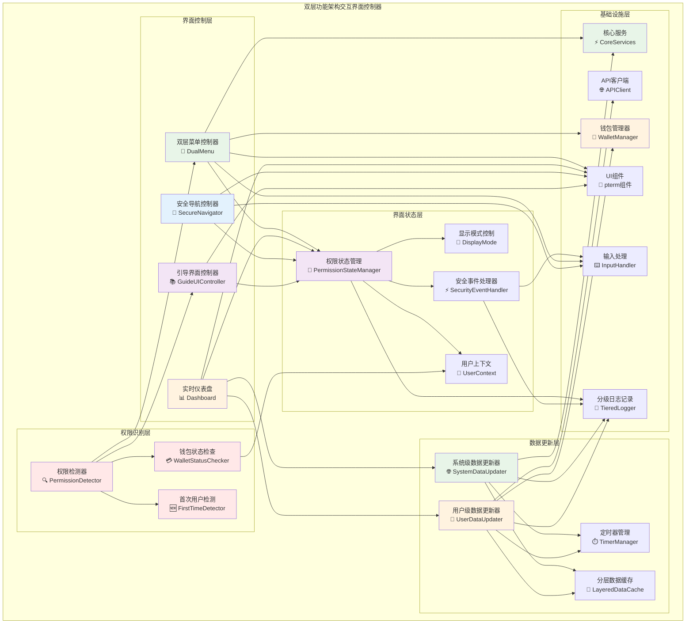
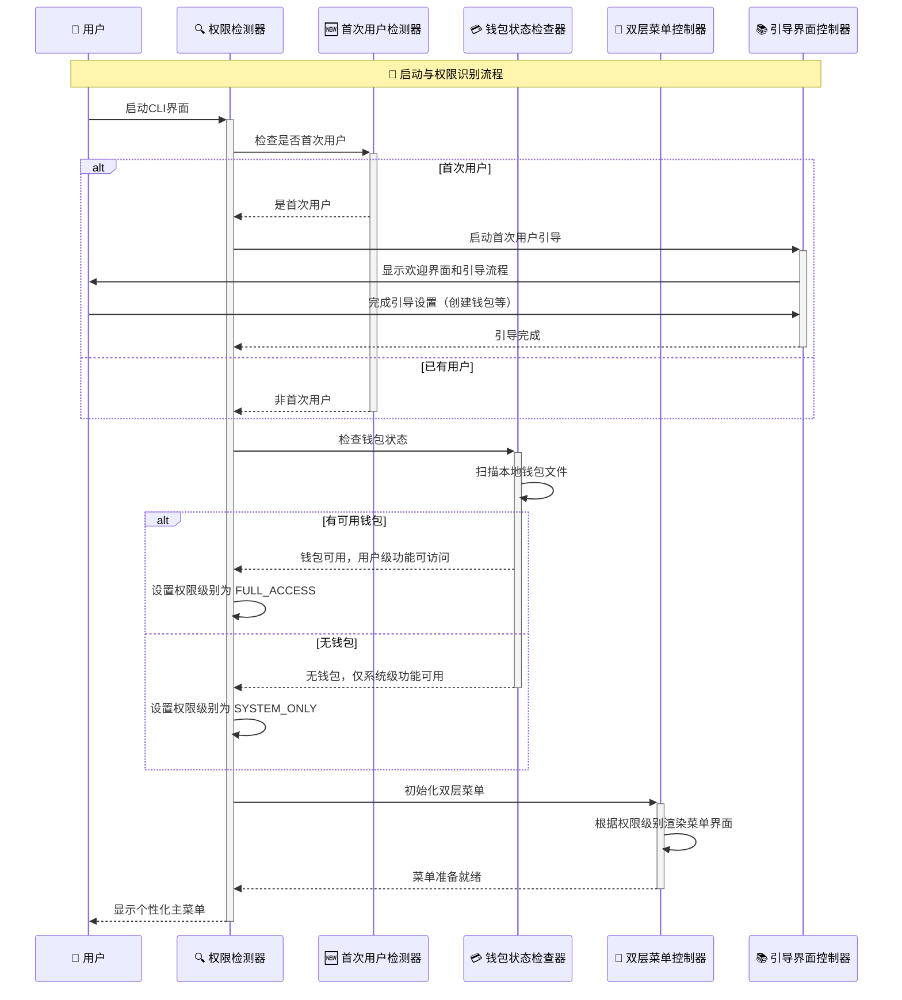
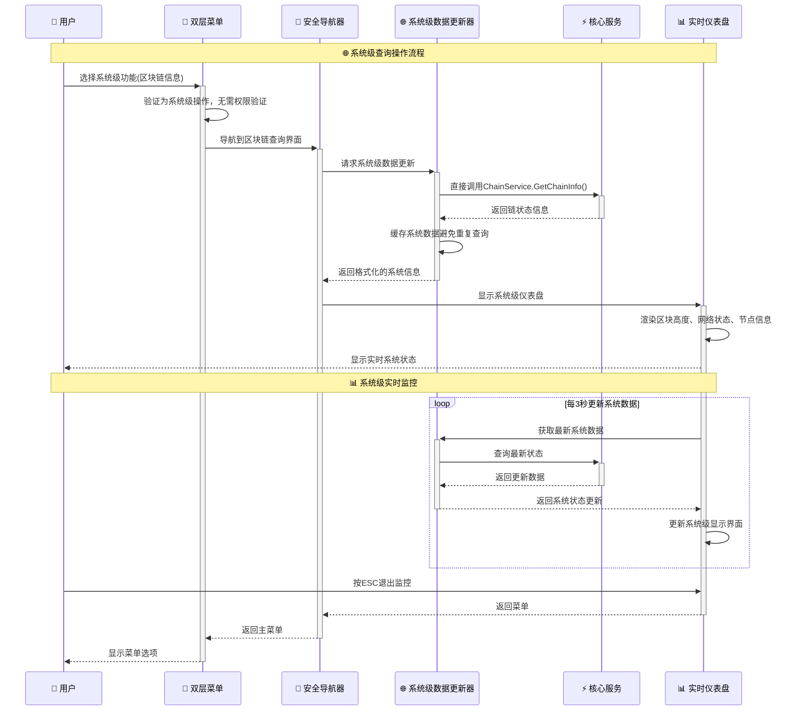
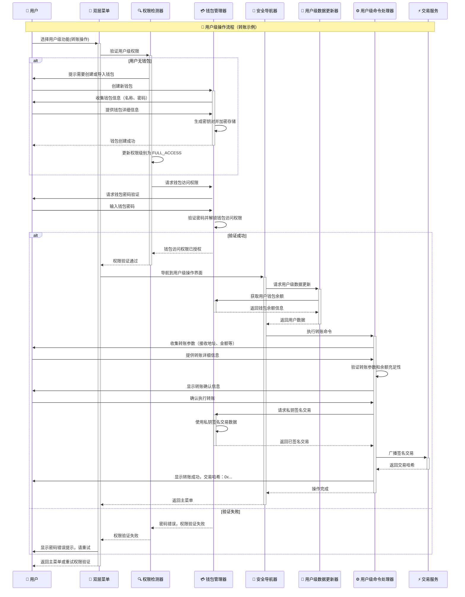

# CLI交互界面控制器（internal/cli/interactive）

## 📋 **模块概述**

　　本模块是CLI交互界面的用户界面控制层，负责实现美观直观的**双层功能架构**交互式用户界面。通过智能权限识别、主菜单系统和实时仪表盘，为不同权限层次的用户提供流畅的操作体验，包括系统级查询导航、用户级操作引导、状态监控、实时数据展示等核心交互功能。

## 🎯 **核心职责**

- **双层菜单管理**：区分并展示系统级（公开）和用户级（私钥保护）功能菜单
- **权限状态识别**：智能检测用户钱包状态，动态调整菜单可用性
- **实时仪表盘**：显示节点状态、余额、共识参与信息等关键实时数据
- **安全交互控制**：处理键盘输入、菜单导航和安全界面切换
- **界面状态管理**：管理不同权限层次的界面模式和状态转换
- **视觉效果渲染**：基于pterm实现美观的终端UI效果和权限状态提示
- **新用户引导集成**：与首次用户引导系统无缝集成，提供个性化体验

## 🏗️ **组件架构**



## 📝 **双层功能架构核心接口**

```go
// DualMenu 双层功能菜单界面控制器接口
type DualMenu interface {
    // ShowMainMenu 显示带权限识别的主菜单界面
    ShowMainMenu(ctx context.Context) error
    
    // HandleUserSelection 处理用户选择（带权限验证）
    HandleUserSelection(ctx context.Context, selection int) error
    
    // RefreshMenu 刷新菜单显示（更新权限状态）
    RefreshMenu(ctx context.Context) error
    
    // SetPermissionLevel 设置当前用户权限级别
    SetPermissionLevel(level PermissionLevel) error
    
    // ShowSystemLevelMenu 显示系统级功能菜单
    ShowSystemLevelMenu(ctx context.Context) error
    
    // ShowUserLevelMenu 显示用户级功能菜单（需要钱包验证）
    ShowUserLevelMenu(ctx context.Context) error
}

// PermissionDetector 权限检测器接口
type PermissionDetector interface {
    // DetectPermissionLevel 检测当前用户权限级别
    DetectPermissionLevel(ctx context.Context) (PermissionLevel, error)
    
    // CheckWalletAvailability 检查钱包可用性
    CheckWalletAvailability(ctx context.Context) (bool, error)
    
    // IsFirstTimeUser 检查是否为首次用户
    IsFirstTimeUser(ctx context.Context) (bool, error)
}

// Dashboard 实时仪表盘接口（支持分层数据）
type Dashboard interface {
    // Start 启动分层数据仪表盘显示
    Start(ctx context.Context) error
    
    // Stop 停止仪表盘
    Stop() error
    
    // UpdateSystemData 更新系统级数据显示
    UpdateSystemData(data *SystemDashboardData) error
    
    // UpdateUserData 更新用户级数据显示（需要钱包权限）
    UpdateUserData(ctx context.Context, data *UserDashboardData) error
    
    // SetRefreshInterval 设置不同数据层的刷新间隔
    SetRefreshInterval(systemInterval, userInterval time.Duration) error
}
```

## 🎨 **界面设计**

### **主菜单界面**

```go
// 主菜单布局示例
func (m *Menu) renderMainMenu() string {
    return `
╭─────────────────── WES 节点控制台 ──────────────────╮
│                                                     │
│  🌐 节点状态: ` + m.nodeStatus + `    📊 区块高度: ` + m.blockHeight + `         │  
│  ⛏️ 挖矿状态: ` + m.miningStatus + `      💰 钱包余额: ` + m.balance + ` WES │
│  🔗 连接节点: ` + m.peerCount + `         📈 哈希率: ` + m.hashRate + ` MH/s       │
│                                                     │
├─────────────────── 功能菜单 ────────────────────────┤
│                                                     │
│  💰 账户管理     📊 区块链信息     ⛏️ 挖矿控制      │
│  🔄 转账操作     📄 交易查询      🌐 节点管理       │
│  📈 实时监控     ⚙️ 系统设置      🚪 退出          │
│                                                     │
╰─────────────────────────────────────────────────────╯`
}
```

### **实时仪表盘**

```go
// 仪表盘数据结构
type DashboardData struct {
    NodeStatus    NodeStatus    `json:"node_status"`
    BlockInfo     BlockInfo     `json:"block_info"`
    MiningStatus  MiningStatus  `json:"mining_status"`
    NetworkInfo   NetworkInfo   `json:"network_info"`
    AccountInfo   AccountInfo   `json:"account_info"`
    Timestamp     time.Time     `json:"timestamp"`
}

// 仪表盘渲染
func (d *Dashboard) renderDashboard(data *DashboardData) error {
    // 清屏并显示标题
    d.ui.Clear()
    d.ui.ShowTitle("WES 实时监控仪表盘")
    
    // 创建实时更新的面板
    panels := []pterm.Panel{
        {Data: d.renderNodePanel(data.NodeStatus)},
        {Data: d.renderBlockPanel(data.BlockInfo)},
        {Data: d.renderMiningPanel(data.MiningStatus)},
        {Data: d.renderNetworkPanel(data.NetworkInfo)},
    }
    
    return d.ui.ShowPanels(panels)
}
```

---

## ⚡ **双层功能架构交互流程**

### **🔍 权限检测与菜单初始化流程**



### **🌐 系统级功能交互流程**



### **🔐 用户级功能交互流程（含权限验证）**



## 🎮 **用户交互功能**

### **键盘导航**

```go
// 键盘事件处理
func (m *Menu) handleKeyboardInput() error {
    for {
        key := m.input.ReadKey()
        
        switch key {
        case keyboard.ArrowUp:
            m.moveCursorUp()
        case keyboard.ArrowDown:
            m.moveCursorDown()
        case keyboard.Enter:
            return m.executeSelection()
        case keyboard.Escape:
            return m.showExitConfirm()
        case 'q', 'Q':
            return m.quit()
        case 'h', 'H':
            m.showHelp()
        case 'r', 'R':
            m.refresh()
        }
    }
}
```

### **实时数据更新**

```go
// 仪表盘数据更新
func (d *Dashboard) startDataUpdate(ctx context.Context) error {
    ticker := time.NewTicker(d.refreshInterval)
    defer ticker.Stop()
    
    for {
        select {
        case <-ticker.C:
            // 获取最新数据
            data, err := d.fetchDashboardData()
            if err != nil {
                d.logger.Errorf("获取仪表盘数据失败: %v", err)
                continue
            }
            
            // 更新界面显示
            if err := d.updateDisplay(data); err != nil {
                d.logger.Errorf("更新界面显示失败: %v", err)
            }
            
        case <-ctx.Done():
            return ctx.Err()
        }
    }
}
```

## 🎨 **视觉效果**

### **动态效果**

```go
// 加载动画
func (m *Menu) showLoadingAnimation(message string) {
    spinner := m.ui.NewSpinner(message)
    spinner.Start()
    defer spinner.Stop()
    
    // 模拟加载过程
    time.Sleep(2 * time.Second)
}

// 渐变色彩
func (d *Dashboard) applyColorGradient(value float64, min, max float64) string {
    ratio := (value - min) / (max - min)
    
    switch {
    case ratio < 0.3:
        return pterm.FgRed.Sprint(fmt.Sprintf("%.2f", value))
    case ratio < 0.7:
        return pterm.FgYellow.Sprint(fmt.Sprintf("%.2f", value))
    default:
        return pterm.FgGreen.Sprint(fmt.Sprintf("%.2f", value))
    }
}
```

### **状态指示器**

```go
// 状态图标映射
func (m *Menu) getStatusIcon(status string) string {
    statusIcons := map[string]string{
        "running":    "🟢",
        "stopped":    "🔴", 
        "connecting": "🟡",
        "syncing":    "🔄",
        "error":      "❌",
    }
    
    if icon, exists := statusIcons[status]; exists {
        return icon
    }
    return "⚪"
}
```

## 📊 **性能优化**

| **优化策略** | **实现方案** | **性能提升** |
|-------------|-------------|-------------|
| 界面缓存 | 缓存静态界面元素 | ~40% 渲染时间减少 |
| 增量更新 | 只更新变化的数据部分 | ~60% CPU使用减少 |
| 异步渲染 | 后台数据获取 | ~80% 响应性提升 |
| 智能刷新 | 根据数据变化频率调整刷新间隔 | ~50% 网络请求减少 |

## 🔧 **配置示例**

```go
// 交互界面配置
type InteractiveConfig struct {
    RefreshInterval    time.Duration `json:"refresh_interval"`
    MaxHistoryLines    int          `json:"max_history_lines"`
    EnableColors       bool         `json:"enable_colors"`
    ShowTimestamps     bool         `json:"show_timestamps"`
    AutoRefresh        bool         `json:"auto_refresh"`
    KeyboardShortcuts  map[string]string `json:"keyboard_shortcuts"`
}

// 默认配置
var DefaultConfig = &InteractiveConfig{
    RefreshInterval:   5 * time.Second,
    MaxHistoryLines:   1000,
    EnableColors:      true,
    ShowTimestamps:    true,
    AutoRefresh:       true,
    KeyboardShortcuts: map[string]string{
        "quit":    "q",
        "help":    "h",
        "refresh": "r",
        "back":    "esc",
    },
}
```

## 🚨 **错误处理**

- **界面渲染失败**：降级到简单文本模式
- **数据获取超时**：显示缓存数据和警告提示
- **用户输入错误**：友好的错误提示和操作建议
- **网络连接问题**：离线模式和重连提示

---

> 📝 **说明**：本模块专注于提供优秀的用户交互体验，所有界面元素都经过精心设计，确保操作的直观性和视觉效果的美观性。

> 🔄 **维护**：随着用户反馈和使用习惯的变化，持续优化界面设计和交互流程，提升用户满意度。
