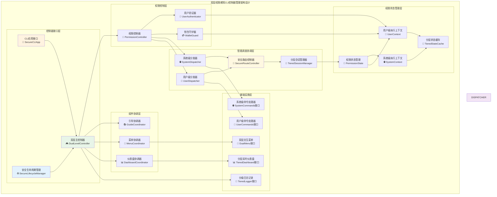
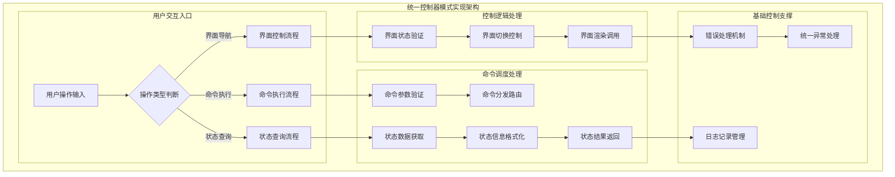

# CLI控制器管理（internal/cli/manager）

【模块定位】
　　本模块是WES系统中CLI交互界面层的核心协调中枢，负责整合**双层功能架构**下的命令处理、界面控制和业务逻辑的统一调度。通过智能权限调度控制器模式和fx依赖注入机制，提供CLI应用的全生命周期管理能力，支撑系统级（公开访问）和用户级（私钥保护）功能的安全协调，确保操作流程的流畅性、安全性和系统响应的及时性。

【设计原则】
- **双层权限协调**：统一管理系统级（无需私钥）和用户级（需要私钥）功能的调度
- **安全优先控制**：确保用户级操作的权限验证和私钥保护机制
- **统一协调**：作为CLI模块的单一控制入口，统筹所有用户操作和系统响应
- **责任分离**：将权限控制逻辑与具体业务实现分离，保持架构清晰
- **安全流程管控**：精确控制不同权限级别的操作流程和状态转换
- **分级异常处理**：提供完整的错误处理，区分系统级和用户级错误
- **扩展友好**：支持新功能模块的灵活接入，严格维护权限边界

【核心职责】
1. **双层应用生命周期管理**：控制CLI应用启动时的权限检测、功能初始化和安全关闭
2. **智能权限调度协调**：根据用户钱包状态智能调度系统级和用户级命令执行
3. **安全界面状态控制**：协调双层菜单、权限提示、安全导航等界面模块切换
4. **分层用户会话管理**：维护系统级和用户级操作的不同会话状态和安全上下文
5. **分级错误处理中枢**：集中处理系统级和用户级的异常，提供针对性恢复方案
6. **权限感知性能监控**：监控CLI应用性能指标，区分系统级和用户级操作的资源使用
7. **首次用户引导协调**：与引导系统集成，管理新用户的完整入门体验流程

【实现架构】

　　采用**双层权限感知中央控制器**的六层协调架构，确保CLI应用控制逻辑的集中化、权限验证的安全性和系统响应的高效性。



**架构层次说明：**

1. **控制器接口层**：CLI应用的核心控制接口
   - 主控制器负责整体应用逻辑的协调和管理
   - CLIApp接口实现为外部应用层提供统一入口
   - 生命周期管理器控制应用各阶段的状态转换

2. **调度协调层**：用户操作和命令执行的调度中枢
   - 命令分发器根据用户选择路由到相应处理器
   - 路由控制器管理界面跳转和状态切换
   - 会话管理器维护用户操作的上下文信息

3. **状态管理层**：应用状态和执行上下文的管理
   - 应用状态维护CLI应用的当前运行状态
   - 执行上下文保存命令执行过程中的临时数据
   - 状态缓存提供状态数据的快速访问能力

4. **基础设施层**：依赖的外部接口和服务组件
   - 交互菜单、仪表盘提供用户界面功能
   - 命令处理器执行具体的业务操作
   - 日志记录器提供操作日志和错误跟踪

---

## 📁 **模块组织结构**

【内部模块架构】

```
internal/cli/manager/
├── 🎮 controller.go               # 主控制器核心实现
└── 📖 README.md                   # 本文档
```

### **🎯 子模块职责分工**

| **子模块** | **核心职责** | **对外接口** | **内部组件** | **复杂度** |
|-----------|-------------|-------------|-------------|-----------|
| `controller.go` | 控制器核心逻辑实现 | Controller接口 | 命令分发、状态管理、会话控制 | 高 |

---

## 🔄 **统一控制器模式实现**

【实现策略】

　　所有控制逻辑均严格遵循**单一控制器**模式，确保CLI应用控制流程的统一性和可预测性。



**关键实现要点：**

1. **控制流程统一**：
   - 所有用户操作都通过主控制器进行统一调度
   - 标准化的命令执行流程和错误处理机制
   - 一致的状态管理和上下文维护策略

2. **责任边界清晰**：
   - 控制器专注于调度协调，不处理具体业务逻辑
   - 命令处理器专注于业务实现，不关心控制流程
   - 界面组件专注于展示渲染，不涉及业务控制

3. **扩展机制灵活**：
   - 支持新命令处理器的动态注册和集成
   - 界面模块可独立扩展而不影响控制逻辑
   - 提供标准化的扩展接口和集成规范

---

## 🏗️ **依赖注入架构**

【fx框架集成】

　　全面采用fx依赖注入框架，实现控制器组件的松耦合和依赖关系的自动管理。

```go
// 示例：控制器模块依赖注入配置
package manager

import (
    "context"
    "go.uber.org/fx"
    "github.com/weisyn/v1/internal/cli/commands"
    "github.com/weisyn/v1/internal/cli/interactive"
    "github.com/weisyn/v1/pkg/interfaces/infrastructure/log"
)

// Controller CLI主控制器接口
type Controller interface {
    Run(ctx context.Context) error
    ExecuteCommand(ctx context.Context, command string) error
    GetStatus() (*ControllerStatus, error)
    Stop() error
}

// NewController 创建控制器实例
func NewController(
    logger log.Logger,
    menu *interactive.Menu,
    dashboard *interactive.Dashboard,
    accountCommands *commands.AccountCommands,
    transferCommands *commands.TransferCommands,
    blockchainCommands *commands.BlockchainCommands,
    miningCommands *commands.MiningCommands,
    nodeCommands *commands.NodeCommands,
) Controller {
    return &controller{
        logger:             logger,
        menu:              menu,
        dashboard:         dashboard,
        accountCommands:   accountCommands,
        transferCommands:  transferCommands,
        blockchainCommands: blockchainCommands,
        miningCommands:    miningCommands,
        nodeCommands:      nodeCommands,
        state:             newAppState(),
    }
}
```

**依赖管理特点：**
- **自动生命周期**：控制器及其依赖组件由fx自动管理创建和销毁
- **接口导向**：通过接口类型进行依赖注入，而非具体实现类型
- **组件解耦**：各功能模块通过依赖注入实现松耦合集成
- **测试友好**：支持依赖注入的单元测试和Mock组件替换

---

## 📊 **性能与监控**

【性能指标】

| **操作类型** | **目标延迟** | **吞吐量目标** | **成功率目标** | **监控方式** |
|-------------|-------------|---------------|----------------|------------|
| 界面切换 | < 100ms | > 50 ops/s | > 99.5% | 实时监控 |
| 命令分发 | < 50ms | > 100 ops/s | > 99.8% | 实时监控 |
| 状态查询 | < 200ms | > 80 ops/s | > 99% | 批量统计 |
| 错误处理 | < 300ms | > 30 ops/s | > 95% | 关键路径监控 |
| 会话管理 | < 150ms | > 60 ops/s | > 98% | 异步监控 |

**性能优化策略：**
- **缓存机制**：缓存频繁访问的状态数据和配置信息，减少重复计算
- **异步处理**：长时间操作采用异步处理，避免阻塞用户界面
- **资源池化**：复用临时对象和数据结构，减少内存分配开销
- **智能调度**：根据操作优先级和资源使用情况智能调度命令执行

---

## 🔗 **与公共接口的映射关系**

【接口实现映射】

```mermaid
classDiagram
    class Controller {
        <<interface>>
        +Run(ctx context.Context) error
        +ExecuteCommand(ctx context.Context, command string) error
        +GetStatus() (*ControllerStatus, error)
        +Stop() error
    }
    
    class controller {
        -logger log.Logger
        -menu *interactive.Menu
        -dashboard *interactive.Dashboard
        -commands map[string]CommandHandler
        -state *AppState
        +Run(ctx context.Context) error
        +ExecuteCommand(ctx context.Context, command string) error
        +GetStatus() (*ControllerStatus, error)
        +Stop() error
    }
    
    class AppState {
        -currentMode DisplayMode
        -isRunning bool
        -lastActivity time.Time
        -userContext *UserContext
        +SetMode(mode DisplayMode) error
        +IsRunning() bool
        +UpdateActivity() error
    }
    
    class UserContext {
        -sessionID string
        -currentUser string
        -preferences map[string]interface{}
        +GetPreference(key string) interface{}
        +SetPreference(key, value string) error
    }
    
    Controller <|-- controller : implements
    controller --> AppState : uses
    AppState --> UserContext : uses
```

**实现要点：**
- **接口契约**：严格遵循Controller接口的方法签名和错误处理规范
- **状态管理**：完善的应用状态跟踪和用户上下文维护机制
- **错误处理**：标准化的错误分类处理和用户友好的错误提示
- **日志记录**：详细的控制器操作日志和性能指标收集

---

## 🚀 **后续扩展规划**

【模块演进方向】

1. **智能化控制**
   - 基于用户行为的智能推荐功能
   - 自适应界面布局和操作流程优化
   - 机器学习驱动的用户体验个性化

2. **分布式控制**
   - 多节点CLI应用的协调控制支持
   - 分布式状态同步和一致性保障
   - 集群模式下的负载均衡控制

3. **高级监控**
   - 实时性能监控和预警机制
   - 用户行为分析和操作模式识别
   - 自动化故障诊断和恢复建议

4. **扩展集成**
   - 第三方插件的动态加载和管理
   - API驱动的远程控制和管理接口
   - 跨平台控制器适配和兼容性支持

---

## 📋 **开发指南**

【控制器开发规范】

1. **新增控制逻辑步骤**：
   - 在Controller接口中定义控制方法
   - 在controller结构体中实现具体控制逻辑
   - 添加相应的状态管理和错误处理机制
   - 编写完整的单元测试和集成测试
   - 更新控制器文档和使用说明

2. **代码质量要求**：
   - 遵循Go语言最佳实践和项目编码规范
   - 100%的控制器方法测试覆盖率
   - 完善的异常处理和状态恢复机制
   - 清晰的代码注释和设计文档

3. **性能要求**：
   - 控制器操作响应时间符合性能指标要求
   - 合理的内存使用和状态管理策略
   - 支持并发安全的多线程操作
   - 高效的命令分发和状态更新机制

【参考文档】
- [WES CLI架构设计文档](../README.md)
- [Go并发编程最佳实践](https://golang.org/doc/effective_go.html)
- [fx依赖注入指南](https://uber-go.github.io/fx/)

---

> 📝 **模板说明**：本README基于WES v0.0.1统一文档规范设计，详细描述了CLI控制器管理模块的架构设计、控制逻辑和实现要点。

> 🔄 **维护指南**：本文档应随着控制器功能的演进及时更新，确保文档与代码实现的一致性。建议在每次重大功能变更后更新相应章节。
