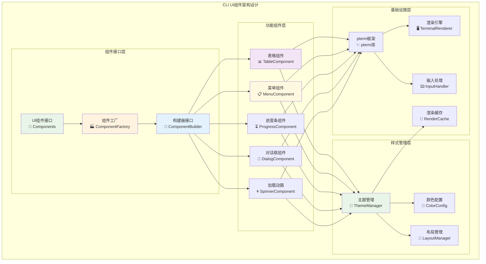
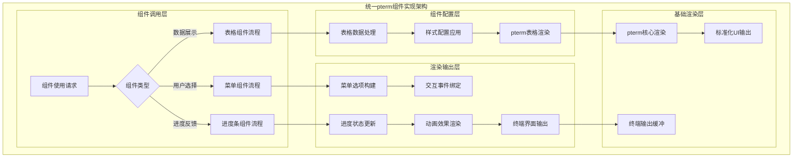
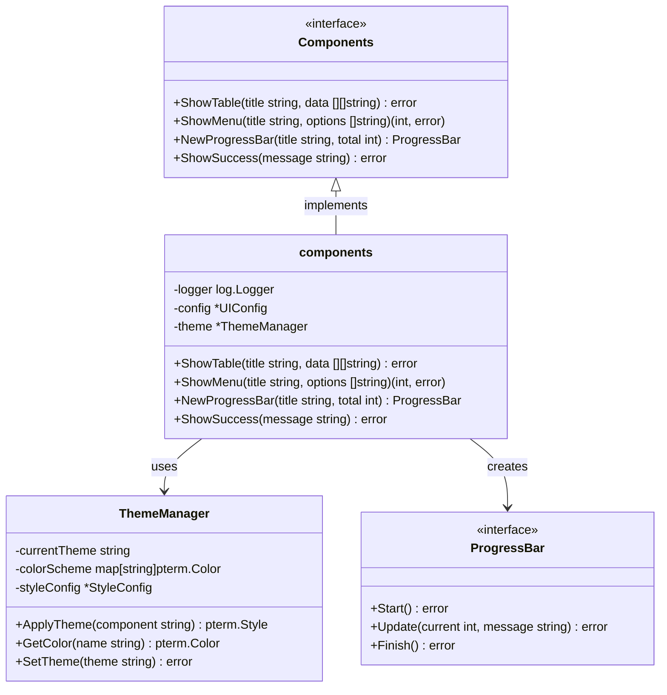

# CLI用户界面组件（internal/cli/ui）

【模块定位】
　　本模块是WES系统中CLI交互界面层的用户界面组件库，负责提供基于pterm框架的标准化UI组件封装。通过统一的组件接口和一致的视觉风格，为CLI各功能模块提供美观、易用的界面元素，支撑整个CLI应用的用户体验需求，确保界面展示的专业性和交互操作的直观性。

【设计原则】
- **组件标准化**：提供统一规范的UI组件接口，确保界面风格的一致性
- **高度复用**：设计通用性强的组件，支持多场景下的灵活复用
- **主题一致**：统一的颜色方案、字体样式和布局规范
- **性能优化**：高效的渲染机制和资源使用优化策略
- **易于扩展**：支持新组件的快速开发和现有组件的功能扩展

【核心职责】
1. **基础组件封装**：封装表格、列表、进度条等常用UI组件
2. **交互组件提供**：提供菜单选择、输入框、确认对话框等交互元素
3. **视觉效果渲染**：实现加载动画、状态指示器、彩色文本等视觉效果
4. **布局管理支持**：提供面板、分栏、对齐等布局管理功能
5. **主题样式管理**：统一管理颜色主题、字体样式和视觉规范
6. **响应式适配**：支持不同终端尺寸下的界面自适应显示

【实现架构】

　　采用**组件工厂**的三层封装架构，确保UI组件的标准化和视觉效果的统一性。



**架构层次说明：**

1. **组件接口层**：标准化的UI组件调用接口
   - 统一的组件调用接口和参数规范
   - 组件工厂负责创建和配置组件实例
   - 构建器模式支持组件的灵活配置

2. **功能组件层**：具体的UI功能组件实现
   - 表格、菜单、进度条等常用界面组件
   - 对话框、加载动画等交互反馈组件
   - 每个组件都有完整的配置和定制能力

3. **样式管理层**：视觉风格和主题的统一管理
   - 主题管理器控制整体视觉风格
   - 颜色配置提供一致的色彩方案
   - 布局管理器处理组件排列和对齐

4. **基础设施层**：底层渲染和支撑服务
   - pterm框架提供终端UI渲染能力
   - 渲染引擎处理具体的屏幕输出
   - 输入处理和渲染缓存优化性能

---

## 📁 **模块组织结构**

【内部模块架构】

```
internal/cli/ui/
├── 🧱 components.go               # UI组件核心实现
└── 📖 README.md                   # 本文档
```

### **🎯 子模块职责分工**

| **子模块** | **核心职责** | **对外接口** | **内部组件** | **复杂度** |
|-----------|-------------|-------------|-------------|-----------|
| `components.go` | UI组件库实现 | Components接口 | 表格、菜单、进度条、对话框、样式管理 | 中等 |

---

## 🔄 **统一pterm组件实现**

【实现策略】

　　所有UI组件均严格遵循**pterm封装**标准，确保界面渲染的一致性和组件使用的标准化。



**关键实现要点：**

1. **组件标准化**：
   - 所有UI组件基于pterm框架统一封装
   - 标准化的组件配置接口和参数格式
   - 一致的错误处理和异常恢复机制

2. **视觉风格统一**：
   - 统一的颜色主题和字体样式配置
   - 一致的布局规范和间距设置
   - 标准化的图标和符号使用规范

3. **交互体验优化**：
   - 流畅的动画效果和过渡效果
   - 响应式的用户输入处理机制
   - 友好的操作提示和帮助信息

---

## 🏗️ **依赖注入架构**

【fx框架集成】

　　全面采用fx依赖注入框架，实现UI组件的松耦合和配置的集中化管理。

```go
// 示例：UI组件模块依赖注入配置
package ui

import (
    "go.uber.org/fx"
    "github.com/pterm/pterm"
    "github.com/weisyn/v1/pkg/interfaces/infrastructure/log"
)

// Components UI组件库接口
type Components interface {
    // 数据展示组件
    ShowTable(title string, data [][]string) error
    ShowList(title string, items []string) error
    
    // 交互选择组件  
    ShowMenu(title string, options []string) (int, error)
    ShowDialog(title, message string) (bool, error)
    
    // 进度反馈组件
    NewProgressBar(title string, total int) ProgressBar
    ShowSpinner(message string) Spinner
    
    // 状态显示组件
    ShowSuccess(message string) error
    ShowError(message string) error
    ShowWarning(message string) error
}

// NewComponents 创建UI组件库实例
func NewComponents(
    logger log.Logger,
    config *UIConfig,
) Components {
    return &components{
        logger: logger,
        config: config,
        theme:  newThemeManager(config.Theme),
    }
}

// UIConfig UI组件配置
type UIConfig struct {
    Theme       string            `json:"theme"`
    Colors      map[string]string `json:"colors"`
    EnableMouse bool             `json:"enable_mouse"`
    Animation   bool             `json:"animation"`
}
```

**依赖管理特点：**
- **自动生命周期**：UI组件及其配置由fx自动管理
- **配置驱动**：组件样式和行为通过配置文件统一管理
- **主题切换**：支持运行时主题切换和样式更新
- **测试友好**：支持Mock组件和无头模式测试

---

## 📊 **性能与监控**

【性能指标】

| **组件类型** | **目标延迟** | **吞吐量目标** | **渲染效率** | **监控方式** |
|-------------|-------------|---------------|-------------|------------|
| 表格渲染 | < 100ms | > 50 renders/s | > 95% | 实时监控 |
| 菜单交互 | < 50ms | > 100 ops/s | > 98% | 实时监控 |
| 进度条更新 | < 30ms | > 200 updates/s | > 99% | 批量统计 |
| 对话框显示 | < 80ms | > 60 shows/s | > 97% | 关键路径监控 |
| 动画效果 | < 20ms | > 300 frames/s | > 96% | 异步监控 |

**性能优化策略：**
- **渲染缓存**：缓存静态界面元素，避免重复渲染计算
- **增量更新**：只更新变化的界面部分，减少全屏刷新
- **异步渲染**：长时间渲染操作采用异步处理，避免界面阻塞
- **资源池化**：复用渲染对象和数据结构，减少内存分配

---

## 🔗 **与公共接口的映射关系**

【接口实现映射】



**实现要点：**
- **接口契约**：严格遵循Components接口的方法签名和行为规范
- **主题管理**：完善的主题切换和样式配置管理机制
- **错误处理**：标准化的渲染错误处理和降级显示策略
- **测试覆盖**：每个组件都有对应的单元测试和视觉测试

---

## 🚀 **后续扩展规划**

【模块演进方向】

1. **高级组件**
   - 图表和可视化组件支持
   - 复杂表单和输入组件
   - 多媒体内容展示组件

2. **交互增强**
   - 鼠标支持和触摸交互
   - 键盘快捷键和手势识别
   - 多窗口和标签页管理

3. **主题系统**
   - 动态主题切换和用户定制
   - 暗色模式和高对比度支持
   - 自适应主题和智能配色

4. **性能优化**
   - GPU加速渲染支持
   - 虚拟滚动和懒加载
   - 智能缓存和预渲染机制

---

## 📋 **开发指南**

【UI组件开发规范】

1. **新增组件步骤**：
   - 在Components接口中定义组件方法
   - 实现组件的pterm封装和配置逻辑
   - 添加主题支持和样式配置
   - 编写完整的单元测试和使用示例
   - 更新组件文档和设计规范

2. **代码质量要求**：
   - 遵循Go语言最佳实践和项目编码规范
   - 100%的组件方法测试覆盖率
   - 完善的错误处理和降级显示机制
   - 清晰的代码注释和使用文档

3. **性能要求**：
   - 组件渲染响应时间符合性能指标要求
   - 合理的内存使用和渲染缓存策略
   - 支持大量数据的高效显示和滚动
   - 流畅的动画效果和用户交互

【参考文档】
- [pterm框架文档](https://github.com/pterm/pterm)
- [终端UI设计规范](https://github.com/charmbracelet/bubbletea)
- [WES UI设计指南](../../../docs/design/ui-guidelines.md)

---

> 📝 **模板说明**：本README基于WES v0.0.1统一文档规范设计，详细描述了CLI UI组件模块的架构设计、组件实现和视觉规范。

> 🔄 **维护指南**：本文档应随着UI组件的迭代及时更新，确保文档与组件实现的一致性。建议在每次重大界面变更后更新相应章节。
