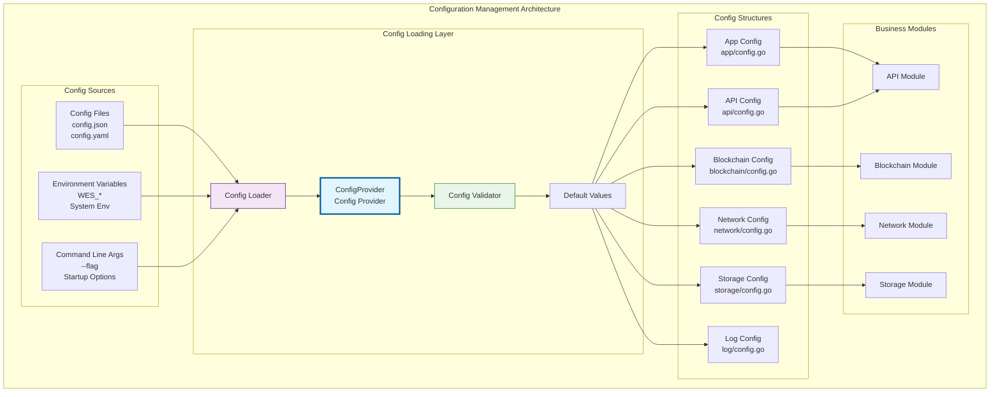

# 配置管理系统（internal/config）

【模块定位】
　　本模块作为WES区块链系统的配置管理中心，负责统一的配置加载、验证、分发和热更新。通过依赖注入模式为各个模块提供类型安全的配置访问，支持多种配置源的灵活组合，确保系统配置的一致性和可维护性。

【设计原则】
- 统一抽象：为所有模块提供一致的配置访问接口
- 多源融合：支持文件、环境变量、命令行等多种配置源
- 类型安全：强类型配置结构，编译时类型检查
- 按模块分层：每个功能模块独立的配置命名空间
- 依赖注入友好：与fx框架深度集成，支持配置的自动装配

【核心职责】
1. **配置结构定义**：为各模块定义类型安全的配置结构
2. **多源配置加载**：支持文件、环境变量、命令行等配置源
3. **配置验证和默认值**：确保配置的完整性和合法性
4. **配置分发服务**：通过依赖注入为各模块提供配置
5. **热更新支持**：支持运行时配置的动态更新
6. **配置监控和日志**：配置变更的监控和审计日志

【配置架构】

## 配置管理架构设计



## 配置模块说明

### 核心配置文件

#### module.go - fx模块定义
**功能**：配置系统的依赖注入模块定义
**提供**：
- `ConfigProvider` - 统一的配置提供者接口
- 各模块配置的fx.Provide注册
- 配置生命周期管理

#### provider.go - 配置提供者
**功能**：实现pkg/interfaces/config.Provider接口
**职责**：
- 多源配置的加载和合并
- 配置验证和默认值应用
- 配置的统一访问接口

### 模块配置定义

| 配置模块 | 文件路径 | 核心配置项 | 主要用途 |
|---------|----------|-----------|----------|
| **应用配置** | `app/config.go` | AppName, Version, Environment | 应用基础信息和运行环境 |
| **API配置** | `api/config.go` | HTTP端口, gRPC端口, CORS设置 | API服务的网络配置 |
| **区块链配置** | `blockchain/config.go` | 创世区块, 共识参数, 验证设置 | 区块链核心参数 |
| **共识配置** | `consensus/config.go` | 挖矿参数, 难度调整, 奖励设置 | PoW共识机制配置 |
| **事件配置** | `event/config.go` | 事件总线, 订阅管理, 持久化 | 事件系统配置 |
| **日志配置** | `log/config.go` | 日志级别, 输出格式, 轮转设置 | 日志系统配置 |
| **网络配置** | `network/config.go` | P2P参数, 节点发现, 连接限制 | 网络通信配置 |
| **节点配置** | `node/config.go` | 节点ID, 监听地址, 对等节点 | 节点基础配置 |
| **存储配置** | `storage/config.go` | 数据目录, 数据库选项, 缓存 | 存储引擎配置 |
| **同步配置** | `sync/config.go` | 同步策略, 批量大小, 超时设置 | 数据同步配置 |
| **交易池配置** | `txpool/config.go` | 池大小, 费用阈值, 过期时间 | 交易内存池配置 |

## 使用示例

### 基本配置加载
```go
// 在模块中使用配置
type MyService struct {
    config *api.Config
}

func NewMyService(cfg *api.Config) *MyService {
    return &MyService{config: cfg}
}

func (s *MyService) Start() {
    log.Printf("HTTP服务启动在端口: %d", s.config.HTTPPort)
}
```

### fx依赖注入集成
```go
// 模块定义
func Module() fx.Option {
    return fx.Module("mymodule",
        fx.Provide(
            // 注入配置依赖
            NewMyService,
        ),
    )
}

// 构造函数自动获取配置
func NewMyService(
    apiConfig *api.Config,
    logConfig *log.Config,
) *MyService {
    return &MyService{
        apiConfig: apiConfig,
        logConfig: logConfig,
    }
}
```

### 配置文件示例
```json
{
    "app": {
        "app_name": "WES-Node",
        "version": "0.0.1",
        "environment": "production"
    },
    "api": {
        "http_port": 8080,
        "grpc_port": 9090,
        "enable_cors": true,
        "cors_origins": ["*"]
    },
    "blockchain": {
        "genesis_file": "./genesis.json",
        "chain_id": "weisyn-mainnet",
        "block_time": 10
    },
    "storage": {
        "data_dir": "./data",
        "storage_type": "badger",
        "badger_opts": {
            "sync_writes": true,
            "compression": true
        }
    },
    "log": {
        "level": "info",
        "format": "json",
        "output": "stdout"
    }
}
```

### 环境变量配置
```bash
# 通过环境变量覆盖配置
export WES_CONFIG_PATH="/custom/config.json"
export WES_API_HTTP_PORT=8081
export WES_LOG_LEVEL=debug
export WES_STORAGE_DATA_DIR="/var/lib/weisyn"
```

## 配置优先级

配置值按以下优先级顺序应用（高优先级覆盖低优先级）：
1. **命令行参数** - 最高优先级
2. **环境变量** - 中等优先级  
3. **配置文件** - 中等优先级
4. **默认值** - 最低优先级

## 配置验证

### 必填字段验证
```go
type Config struct {
    APIPort    int    `json:"api_port" validate:"required,min=1024,max=65535"`
    DataDir    string `json:"data_dir" validate:"required"`
    LogLevel   string `json:"log_level" validate:"oneof=debug info warn error"`
}
```

### 自定义验证逻辑
```go
func (c *Config) Validate() error {
    if c.APIPort < 1024 {
        return errors.New("API端口不能小于1024")
    }
    
    if !filepath.IsAbs(c.DataDir) {
        return errors.New("数据目录必须是绝对路径")
    }
    
    return nil
}
```

## 配置热更新

### 文件监听
```go
// 启用配置文件监听
func (p *ConfigProvider) EnableFileWatcher() {
    watcher, err := fsnotify.NewWatcher()
    if err != nil {
        log.Errorf("无法创建文件监听器: %v", err)
        return
    }
    
    go p.watchConfigFile(watcher)
}
```

### 配置变更处理
```go
// 配置变更回调
type ConfigChangeHandler func(oldConfig, newConfig interface{})

func (p *ConfigProvider) OnConfigChange(handler ConfigChangeHandler) {
    p.changeHandlers = append(p.changeHandlers, handler)
}
```

## 故障排查

### 常见配置问题
- **配置文件格式错误**：检查JSON/YAML语法
- **必填字段缺失**：确认所有required字段都有值
- **类型不匹配**：确保配置值类型与结构体字段匹配
- **权限问题**：确认配置文件和数据目录的访问权限

### 调试模式
```go
// 启用配置调试日志
os.Setenv("WES_CONFIG_DEBUG", "true")

// 输出配置加载过程
func (p *ConfigProvider) debugLoadConfig() {
    log.Debugf("正在加载配置文件: %s", p.configPath)
    log.Debugf("环境变量前缀: %s", p.envPrefix)
    log.Debugf("默认值应用: %+v", p.defaults)
}
```

---

## 🔗 相关文档

- **应用启动**：`internal/app/README.md` - 应用启动和配置集成
- **公共接口**：`pkg/interfaces/config/README.md` - 配置接口定义
- **配置示例**：`configs/README.md` - 配置文件示例和说明