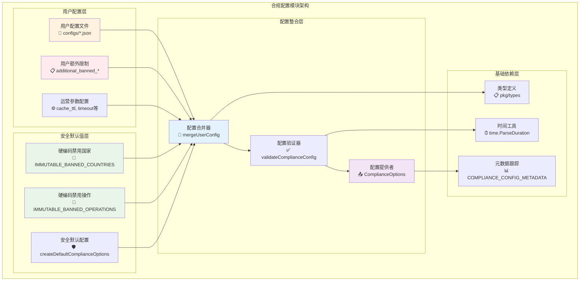
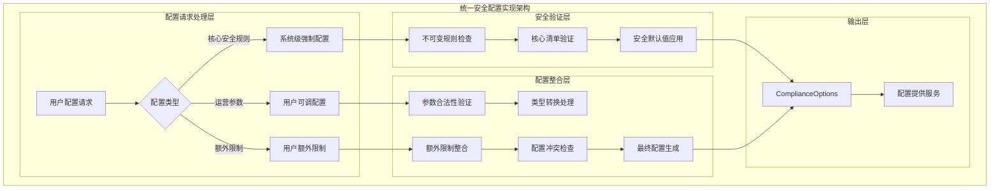
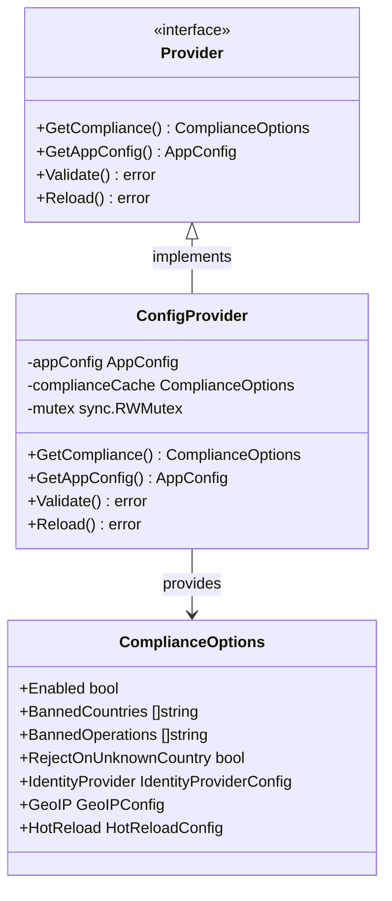

# 合规配置模块（internal/config/compliance）

【模块定位】
　　本模块是WES系统中监管合规功能的配置管理层，负责提供安全可靠的合规策略配置服务。通过硬编码核心规则与用户可选配置相结合的安全架构设计，提供不可绕过的合规控制能力，支撑内存池、共识层等业务模块的合规检查需求，确保系统符合国际制裁法规和反洗钱要求。

【设计原则】
- **安全优先**：关键合规规则硬编码在系统中，用户配置无法绕过核心限制
- **分层防护**：采用系统级强制配置+用户额外限制的多层安全架构  
- **合规可追溯**：完整的配置版本管理和审计轨迹记录
- **运营灵活**：运营参数支持配置调整，平衡安全性和可操作性
- **热更新支持**：支持配置热重载，满足紧急合规需求响应

【核心职责】
1. **系统级限制管控**：管理不可绕过的禁用国家和操作清单
2. **用户配置整合**：安全地整合用户提供的额外合规限制
3. **外部服务配置**：管理身份验证和地理位置服务的连接配置
4. **缓存策略配置**：优化合规检查性能的缓存参数管理
5. **热重载配置管理**：支持运行时配置更新的安全机制
6. **合规元数据维护**：跟踪配置版本、更新历史和法规依据

【实现架构】

　　采用**三层安全配置**的分层实现架构，确保合规规则的强制执行和配置管理的安全可控。



**架构层次说明：**

1. **用户配置层**：外部用户可控制的配置参数
   - 支持用户添加更严格的限制条件
   - 允许调整运营参数优化性能
   - 提供灵活的功能开关控制

2. **安全默认值层**：系统级强制安全配置
   - 硬编码的核心合规规则，用户无法修改
   - 基于国际制裁清单的权威禁用列表
   - 安全优先的默认配置策略

3. **配置整合层**：安全的配置合并与验证
   - 智能合并用户配置和系统默认值
   - 严格验证配置参数的合法性和安全性
   - 生成最终的合规配置选项

---

## 🚫 **硬编码安全规则清单**

【不可绕过的系统级限制】

　　本节列出所有硬编码在系统中的关键安全规则，这些规则基于国际制裁清单和监管要求，用户配置无法绕过或修改。

### **📍 禁用国家清单 (IMMUTABLE_BANNED_COUNTRIES)**

**基于联合国安理会全面制裁：**
- 🇰🇵 **KP (朝鲜)** - 联合国全面制裁，禁止所有金融服务
- 🇮🇷 **IR (伊朗)** - 核计划相关制裁，金融交易严格受限  
- 🇸🇾 **SY (叙利亚)** - 人道主义危机相关制裁

**基于美国OFAC重点制裁：**
- 🇺🇸 **US (美国)** - 未注册数字资产服务商面临严格监管
- 🇨🇺 **CU (古巴)** - 美国长期经济制裁
- 🇻🇪 **VE (委内瑞拉)** - 政府及相关实体制裁
- 🇲🇲 **MM (缅甸)** - 军政府相关制裁

**基于FATF高风险司法管辖区：**
- 🇦🇫 **AF (阿富汗)** - 政治不稳定，监管机制缺失
- 🇱🇧 **LB (黎巴嫩)** - 金融系统危机，洗钱风险极高
- 🇾🇪 **YE (也门)** - 战争状态，监管执行真空
- 🇱🇾 **LY (利比亚)** - 政治分裂，监管执行力薄弱

**基于数字资产监管严格地区：**
- 🇨🇳 **CN (中国)** - 数字货币交易全面禁止
- 🇧🇩 **BD (孟加拉国)** - 加密货币交易被认定为非法
- 🇳🇵 **NP (尼泊尔)** - 加密货币使用被禁止

**其他高风险地区：**
- 🇸🇴 **SO (索马里)** - 持续的政治不稳定和监管缺失
- 🇸🇩 **SD (苏丹)** - 国际制裁和政治动荡
- 🇪🇷 **ER (厄立特里亚)** - 专制政权，国际制裁

**总计：16个国家/地区**

### **⚠️ 禁用操作清单 (IMMUTABLE_BANNED_OPERATIONS)**

**基础资金转移类：**
- `transfer` - 普通转账操作

**支付合约类：**
- `contract.payments.send` - 单笔合约支付
- `contract.payments.batch` - 批量合约支付  
- `contract.payments.scheduled` - 定时支付
- `contract.payments.recurring` - 循环支付

**治理参与类：**
- `contract.governance.voting` - 治理投票
- `contract.governance.proposal` - 治理提案
- `contract.governance.execute` - 治理执行

**隐私增强类（高风险）：**
- `contract.mixer.*` - 混币相关操作
- `contract.privacy.*` - 隐私保护操作
- `contract.tumbler.*` - 翻滚器操作
- `contract.anonymity.*` - 匿名化操作

**系统管理类（超高风险）：**
- `contract.admin.*` - 管理权限操作
- `contract.upgrade.*` - 合约升级操作
- `contract.emergency.*` - 应急操作

**跨链和桥接类：**
- `contract.bridge.*` - 跨链桥接操作
- `contract.crosschain.*` - 跨链操作
- `contract.atomic.*` - 原子交换操作

**借贷和DeFi类：**
- `contract.lending.flash` - 闪电贷操作
- `contract.derivatives.*` - 衍生品交易
- `contract.leveraged.*` - 杠杆交易
- `contract.liquidation.*` - 强制清算

**总计：22个操作类型**

### **📋 配置元数据信息**

| **属性** | **值** | **说明** |
|---------|--------|----------|
| 配置版本 | v1.0.0 | 当前合规配置版本 |
| 最后更新 | 2024-01-15 | 上次更新日期 |
| 制裁清单源 | UN/OFAC/FATF-2024-Q1 | 制裁清单数据来源 |
| 更新负责人 | WES Compliance Team | 配置维护团队 |
| 下次审查 | 2024-04-15 | 计划的下次审查日期 |

---

## 📁 **模块组织结构**

【合规配置模块架构】

```
internal/config/compliance/
├── 🔧 config.go                    # 配置结构定义和用户配置整合
├── 🛡️ defaults.go                  # 硬编码安全默认值和不可绕过规则
├── 📖 README.md                    # 本文档
```

### **🎯 文件职责分工**

| **文件** | **核心职责** | **关键组件** | **安全级别** | **复杂度** |
|---------|-------------|-------------|-------------|-----------|
| `config.go` | 配置整合与验证 | ComplianceOptions, mergeUserConfig | 中等 | 中等 |
| `defaults.go` | 安全规则定义 | IMMUTABLE_*清单, 元数据管理 | 最高 | 低 |

---

## 🔄 **统一安全配置实现**

【实现策略】

　　所有配置组件均严格遵循**不可绕过安全规则**架构模式，确保合规限制的强制执行和配置安全的可控管理。



**关键实现要点：**

1. **不可绕过的安全机制**：
   - 系统级禁用清单硬编码在代码中
   - 用户配置只能添加更严格的限制
   - 核心安全规则优先级最高

2. **配置整合安全策略**：
   - 严格的参数类型验证和转换
   - 配置冲突检测和安全处理
   - 完整的配置审计轨迹记录

3. **性能与安全平衡**：
   - 合理的缓存策略默认值
   - 可调的超时参数配置
   - 热重载的安全控制机制

---

## 🏗️ **依赖注入架构**

【fx框架集成】

　　全面采用fx依赖注入框架，实现配置服务的自动装配和生命周期管理。

```go
// 示例：合规配置模块fx集成
package config

import (
    "go.uber.org/fx"
    "github.com/weisyn/v1/internal/config/compliance"
    "github.com/weisyn/v1/pkg/interfaces/config"
)

func Module() fx.Option {
    return fx.Module("config",
        fx.Provide(
            // 配置提供者服务
            ProvideConfigServices,
            
            // 合规配置提供者
            func(provider config.Provider) *compliance.ComplianceOptions {
                return provider.GetCompliance()
            },
        ),
    )
}
```

**依赖管理特点：**
- **配置安全隔离**：合规配置独立管理，避免被其他配置影响
- **类型安全注入**：通过强类型接口进行依赖注入
- **生命周期自动管理**：配置服务的启动和更新由fx管理
- **测试友好设计**：支持配置模拟和单元测试

---

## 📊 **性能与监控**

【性能指标】

| **操作类型** | **目标延迟** | **吞吐量目标** | **缓存命中率** | **监控方式** |
|-------------|-------------|---------------|----------------|------------|
| 配置加载 | < 10ms | > 1000 次/秒 | N/A | 启动时监控 |
| 配置验证 | < 5ms | > 5000 次/秒 | N/A | 实时监控 |
| 参数整合 | < 3ms | > 10000 次/秒 | N/A | 批量统计 |
| 热重载检查 | < 20ms | > 100 次/分钟 | N/A | 定时监控 |
| 元数据查询 | < 1ms | > 50000 次/秒 | > 95% | 实时监控 |

**性能优化策略：**
- **配置缓存机制**：配置对象创建后缓存复用，避免重复解析
- **延迟初始化**：非关键配置项按需加载，提升启动速度
- **批量验证优化**：多个配置项批量验证，减少验证开销
- **热重载限频**：配置变更检查频率限制，避免过度资源消耗

---

## 🔗 **与公共接口的映射关系**

【接口实现映射】



**实现要点：**
- **接口契约严格遵循**：完全实现Provider接口的所有方法
- **线程安全保证**：使用读写锁保护配置数据的并发访问
- **配置缓存优化**：合规配置对象缓存，避免重复创建开销
- **错误处理标准化**：统一的错误返回格式和异常处理机制

---

## 🚀 **后续扩展规划**

【模块演进方向】

1. **动态合规规则引擎**
   - 支持基于外部制裁清单API的自动更新
   - 实现合规规则的条件表达式解析
   - 添加合规规则的A/B测试能力

2. **高级配置管理**
   - 支持多环境配置的自动切换
   - 实现配置变更的影响分析
   - 添加配置回滚和版本管理功能

3. **智能合规分析**
   - 基于历史数据的合规风险预测
   - 实现合规效果的量化分析
   - 添加合规策略的优化建议功能

4. **企业级安全增强**
   - 支持HSM硬件安全模块集成
   - 实现配置访问的审计日志
   - 添加配置敏感数据的加密存储

---

## 📋 **开发指南**

【配置开发规范】

1. **新增配置项步骤**：
   - 在pkg/types/config.go中定义用户友好的配置结构
   - 在defaults.go中添加对应的默认值
   - 在config.go中实现配置整合逻辑
   - 添加完整的配置验证和单元测试
   - 更新README文档说明新配置项

2. **安全要求**：
   - 核心安全配置必须硬编码，不得依赖外部配置
   - 所有用户配置必须经过严格验证
   - 配置变更必须有完整的审计记录
   - 敏感配置项需要适当的访问控制

3. **性能要求**：
   - 配置加载延迟必须控制在目标范围内
   - 避免配置操作中的内存泄漏和资源浪费
   - 合理使用缓存机制提升访问性能
   - 配置热重载不得影响业务处理性能

【参考文档】
- [WES配置管理规范](../../README.md)
- [Go语言配置最佳实践](https://go.dev/doc/effective_go)
- [WES架构设计文档](../../../docs/architecture/README.md)

---

> 📝 **模块说明**：本合规配置模块基于WES v0.0.1统一配置架构设计，严格遵循安全优先原则，确保合规策略的不可绕过性和配置管理的安全可控性。

> 🔄 **维护指南**：本文档应随着国际制裁清单更新和监管要求变化及时更新，建议每季度审查一次配置规则的时效性和准确性。