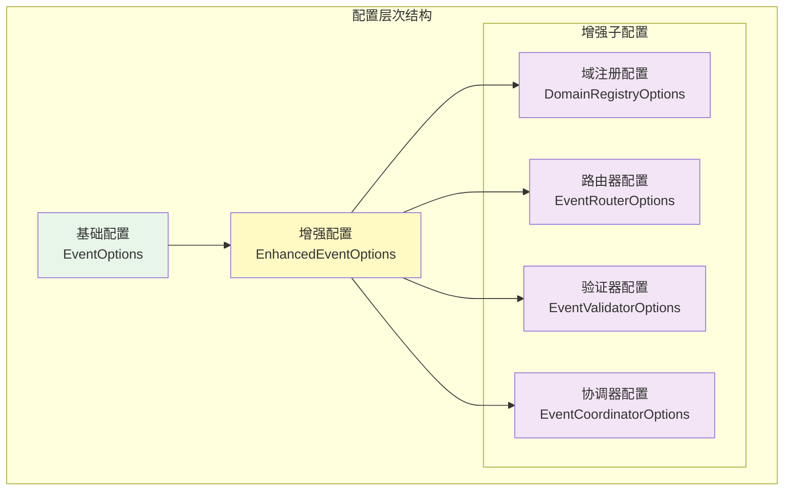
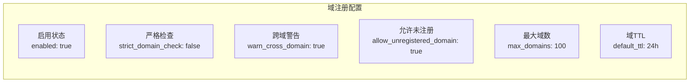
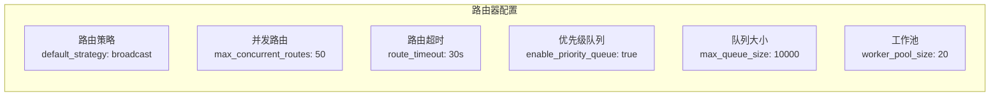
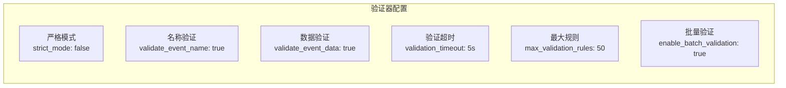
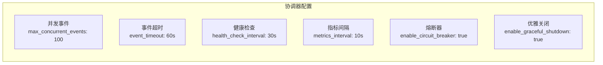

# 事件系统配置管理 (Event System Configuration)

## 【模块定位】

　　**事件系统配置模块**负责管理WES区块链系统事件基础设施的所有配置参数。本模块提供完整的配置选项，涵盖基础事件功能和增强功能，确保事件系统能够根据不同环境和需求进行灵活配置。

## 【设计原则】

### 向后兼容
- 保持现有基础配置结构不变
- 增强配置作为可选扩展
- 渐进式功能升级

### 配置分层


## 【配置结构】

### 基础事件配置 (EventOptions)

| 配置项 | 类型 | 默认值 | 说明 |
|--------|------|--------|------|
| `enabled` | bool | true | 是否启用事件系统 |
| `buffer_size` | int | 1000 | 事件缓冲区大小 |
| `max_workers` | int | 10 | 最大工作者数量 |
| `max_subscribers` | int | 1000 | 最大订阅者数量 |

### 增强功能配置 (EnhancedEventOptions)

| 配置项 | 类型 | 默认值 | 说明 |
|--------|------|--------|------|
| `enabled` | bool | true | 是否启用增强功能 |
| `domain_registry` | DomainRegistryOptions | 见下表 | 域注册中心配置 |
| `event_router` | EventRouterOptions | 见下表 | 事件路由器配置 |
| `event_validator` | EventValidatorOptions | 见下表 | 事件验证器配置 |
| `event_coordinator` | EventCoordinatorOptions | 见下表 | 事件协调器配置 |

## 【子配置详解】

### 域注册中心配置 (DomainRegistryOptions)



| 配置项 | 类型 | 默认值 | 说明 |
|--------|------|--------|------|
| `enabled` | bool | true | 是否启用域注册中心 |
| `strict_domain_check` | bool | false | 严格域检查（开发环境建议false） |
| `warn_cross_domain` | bool | true | 跨域事件警告 |
| `allow_unregistered_domain` | bool | true | 允许未注册域（向后兼容） |
| `max_domains` | int | 100 | 最大域数量限制 |
| `default_ttl` | Duration | 24h | 域默认生存时间 |

### 事件路由器配置 (EventRouterOptions)



| 配置项 | 类型 | 默认值 | 说明 |
|--------|------|--------|------|
| `enabled` | bool | true | 是否启用智能路由 |
| `default_strategy` | string | "broadcast" | 默认路由策略 |
| `max_concurrent_routes` | int | 50 | 最大并发路由数 |
| `route_timeout` | Duration | 30s | 路由超时时间 |
| `enable_priority_queue` | bool | true | 启用优先级队列 |
| `max_queue_size` | int | 10000 | 最大队列大小 |
| `worker_pool_size` | int | 20 | 工作池大小 |
| `enable_metrics` | bool | true | 启用指标收集 |

### 事件验证器配置 (EventValidatorOptions)



| 配置项 | 类型 | 默认值 | 说明 |
|--------|------|--------|------|
| `enabled` | bool | true | 是否启用事件验证 |
| `strict_mode` | bool | false | 严格验证模式 |
| `validate_event_name` | bool | true | 验证事件名称 |
| `validate_event_data` | bool | true | 验证事件数据 |
| `validation_timeout` | Duration | 5s | 验证超时时间 |
| `max_validation_rules` | int | 50 | 最大验证规则数 |
| `enable_batch_validation` | bool | true | 启用批量验证 |
| `cache_validation_results` | bool | true | 缓存验证结果 |

### 事件协调器配置 (EventCoordinatorOptions)



| 配置项 | 类型 | 默认值 | 说明 |
|--------|------|--------|------|
| `enabled` | bool | true | 是否启用事件协调器 |
| `max_concurrent_events` | int | 100 | 最大并发事件数 |
| `event_timeout` | Duration | 60s | 事件处理超时 |
| `health_check_interval` | Duration | 30s | 健康检查间隔 |
| `metrics_interval` | Duration | 10s | 指标收集间隔 |
| `enable_circuit_breaker` | bool | true | 启用熔断器 |
| `circuit_breaker_threshold` | int | 10 | 熔断器阈值 |
| `enable_graceful_shutdown` | bool | true | 启用优雅关闭 |
| `graceful_shutdown_timeout` | Duration | 30s | 优雅关闭超时 |

## 【使用指南】

### 基础使用

```go
// 创建默认配置
config := event.New(nil)

// 检查基础配置
if config.IsEnabled() {
    bufferSize := config.GetBufferSize()
    maxWorkers := config.GetMaxWorkers()
}

// 检查增强功能
if config.IsEnhancedEnabled() {
    // 使用增强功能
    if config.IsDomainRegistryEnabled() {
        // 域注册功能可用
    }
}
```

### 配置访问

```go
// 获取完整配置
options := config.GetOptions()

// 获取增强配置
enhanced := config.GetEnhancedOptions()

// 获取特定子配置
domainConfig := config.GetDomainRegistryOptions()
routerConfig := config.GetEventRouterOptions()
validatorConfig := config.GetEventValidatorOptions()
coordinatorConfig := config.GetEventCoordinatorOptions()
```

## 【环境配置】

### 开发环境 (Development)

```json
{
  "enabled": true,
  "enhanced": {
    "enabled": true,
    "domain_registry": {
      "strict_domain_check": false,
      "allow_unregistered_domain": true
    },
    "event_validator": {
      "strict_mode": false
    }
  }
}
```

**特点**：宽松验证，开发友好，详细日志

### 测试环境 (Testing)

```json
{
  "enabled": true,
  "enhanced": {
    "enabled": true,
    "domain_registry": {
      "strict_domain_check": true,
      "allow_unregistered_domain": false
    },
    "event_validator": {
      "strict_mode": false
    }
  }
}
```

**特点**：中等严格，接近生产环境

### 生产环境 (Production)

```json
{
  "enabled": true,
  "buffer_size": 5000,
  "max_workers": 20,
  "enhanced": {
    "enabled": true,
    "domain_registry": {
      "strict_domain_check": true,
      "allow_unregistered_domain": false
    },
    "event_validator": {
      "strict_mode": true
    },
    "event_router": {
      "max_concurrent_routes": 100,
      "worker_pool_size": 50
    },
    "event_coordinator": {
      "max_concurrent_events": 500,
      "enable_circuit_breaker": true
    }
  }
}
```

**特点**：严格验证，高性能，高可靠性

## 【性能调优】

### 高吞吐量场景

```json
{
  "buffer_size": 10000,
  "max_workers": 50,
  "enhanced": {
    "event_router": {
      "max_concurrent_routes": 200,
      "max_queue_size": 50000,
      "worker_pool_size": 100
    },
    "event_validator": {
      "enable_batch_validation": true,
      "cache_validation_results": true
    },
    "event_coordinator": {
      "max_concurrent_events": 1000
    }
  }
}
```

### 低延迟场景

```json
{
  "buffer_size": 100,
  "max_workers": 5,
  "enhanced": {
    "event_router": {
      "route_timeout": "10s"
    },
    "event_validator": {
      "validation_timeout": "1s",
      "cache_validation_results": true
    },
    "event_coordinator": {
      "event_timeout": "30s"
    }
  }
}
```

## 【功能开关】

### 最小模式 (仅基础功能)

```json
{
  "enabled": true,
  "enhanced": {
    "enabled": false
  }
}
```

### 选择性启用

```json
{
  "enhanced": {
    "enabled": true,
    "domain_registry": {"enabled": false},
    "event_router": {"enabled": true},
    "event_validator": {"enabled": true},
    "event_coordinator": {"enabled": false}
  }
}
```

## 【配置验证】

### 运行时检查

```go
func validateConfig(config *event.Config) error {
    if !config.IsEnabled() {
        return errors.New("event system must be enabled")
    }
    
    if config.GetBufferSize() <= 0 {
        return errors.New("buffer size must be positive")
    }
    
    if config.IsEnhancedEnabled() {
        if routerOpts := config.GetEventRouterOptions(); routerOpts != nil {
            if routerOpts.MaxConcurrentRoutes <= 0 {
                return errors.New("max concurrent routes must be positive")
            }
        }
    }
    
    return nil
}
```

## 【最佳实践】

### DO - 推荐做法

- ✅ 根据环境选择合适的配置
- ✅ 在生产环境启用严格验证
- ✅ 根据负载调整并发参数
- ✅ 启用监控和指标收集
- ✅ 配置适当的超时时间

### DON'T - 避免做法

- ❌ 在生产环境使用开发配置
- ❌ 忽略缓冲区大小设置
- ❌ 禁用错误恢复机制
- ❌ 设置过小的超时时间
- ❌ 忽略配置验证

## 【故障排查】

### 配置相关问题

| 问题 | 原因 | 解决方案 |
|------|------|---------|
| 事件丢失 | 缓冲区太小 | 增加buffer_size |
| 处理延迟 | 工作者不足 | 增加max_workers |
| 验证失败 | 规则过严 | 调整strict_mode |
| 路由超时 | 超时时间短 | 增加route_timeout |

## 【监控指标】

### 配置相关指标

- 缓冲区使用率
- 工作者利用率  
- 验证通过率
- 路由成功率
- 协调器健康状态

## 【版本兼容性】

| 版本 | 基础配置 | 增强配置 | 兼容性 |
|------|---------|---------|--------|
| v1.0 | ✅ | ❌ | 完全兼容 |
| v1.1 | ✅ | ✅ | 向下兼容 |
| v2.0 | ✅ | ✅ | 配置迁移 |

## 【配置迁移】

### 从v1.0升级

```go
// v1.0 配置
oldConfig := &EventOptions{
    Enabled: true,
    BufferSize: 1000,
}

// v1.1 配置 (自动添加增强配置)
newConfig := event.New(oldConfig)
```

## 【附录】

### 配置文件示例

参见 `example.json` 文件，包含完整的配置示例和不同场景的推荐配置。

### 相关文档

- `internal/core/infrastructure/event` - 事件系统实现
- `pkg/interfaces/infrastructure/event` - 事件接口定义
- `docs/architecture/EVENT_SYSTEM_DESIGN.md` - 系统设计文档
