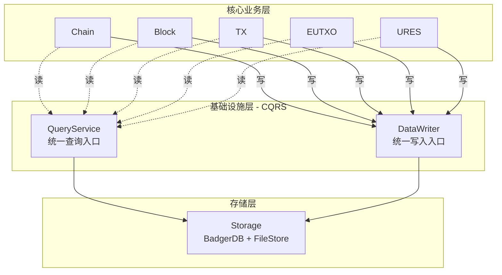

# WES 核心模块文档索引

本目录包含 WES 区块链系统的核心实现模块。

---

## 📁 核心模块

### 已实现模块

| 模块 | 路径 | 状态 | 核心功能 | 优化任务 | 评分 |
|------|------|------|---------|---------|------|
| **chain** | `internal/core/chain/` | ✅ 核心完成 | ✅ 100% | 🔵 1个 | ⭐⭐⭐⭐☆ |
| **block** | `internal/core/block/` | ✅ 核心完成 | ✅ 100% | 🔵 8个 | ⭐⭐⭐⭐☆ |
| **eutxo** | `internal/core/eutxo/` | ✅ 核心完成 | ✅ 100% | 🔵 10个 | ⭐⭐⭐⭐☆ |
| **ures** | `internal/core/ures/` | ✅ 完全实现 | ✅ 100% | ✅ 0个 | ⭐⭐⭐⭐⭐ |
| **query** | `internal/core/query/` | ✅ 完全实现 | ✅ 100% | 🔵 6个 | ⭐⭐⭐⭐⭐ |

**总代码量**：~10,020 行  
**核心功能完成度**：100% ✅  
**优化任务**：~30个（P3优先级，不影响核心功能）

---

## 📚 文档导航

### 📊 当前状态
- **[STATUS_SUMMARY.md](./STATUS_SUMMARY.md)** - 模块状态总结（核心功能已完成）
- **[PENDING_TASKS.md](./PENDING_TASKS.md)** - 待处理任务详细清单（~30个优化任务）
- **[COMPLIANCE_AUDIT_REPORT.md](./COMPLIANCE_AUDIT_REPORT.md)** - 合规性审计报告

### 📖 历史参考
- **[MODULE_PRIORITY_ASSESSMENT.md](./MODULE_PRIORITY_ASSESSMENT.md)** - 模块优先级评估（历史参考）

---

## 🎯 当前状态（2025-11-01）

### ✅ 已完成
- ✅ **P0 全部完成**（15/15）：区块哈希计算、EUTXO快照功能、链重组
- ✅ **P1 全部完成**（8/8）：共识验证、状态根计算、索引管理、链切换等
- ✅ **合规性**：100% 符合代码组织、接口设计、存储架构规范
- ✅ **代码质量**：所有核心模块编译通过，无 linter 错误

### 🔵 优化阶段
- **剩余任务**：~30 个优化完善任务（P3 优先级）
- **主要类别**：事件发布、查询优化、验证增强、配置优化
- **详细清单**：参见 [PENDING_TASKS.md](./PENDING_TASKS.md)

### 📊 完成度
- **核心功能**：100% ✅
- **优化完善**：38% 🔵

---

## 🏗️ 架构概览

### 核心业务层垂直依赖链

WES 核心业务层采用**严格的垂直依赖链**设计，确保依赖关系清晰、避免循环依赖：

```
垂直依赖链（单向依赖，自底向上）：
┌──────────────┐
│  Chain       │ ← ⑦ 最高层（链管理）
└──────┬───────┘
       ↓ 依赖
┌──────────────┐
│  Block       │ ← ⑥ 区块管理
└──────┬───────┘
       ↓ 依赖
┌──────────────┐
│  TX          │ ← ⑤ 交易处理
└──────┬───────┘
       ↓ 依赖
┌──────────────┐
│  EUTXO       │ ← ④ 状态管理
└──────┬───────┘
       ↓ 依赖
┌──────────────┐
│  URES        │ ← ③ 资源管理
└──────┬───────┘
       ↓ 依赖
┌──────────────┐
│  ISPC        │ ← ② 执行协调
└──────┬───────┘
       ↓ 依赖
┌──────────────┐
│  Engines     │ ← ① 最底层（执行引擎）
└──────────────┘
```

**关键架构原则**：
- ✅ **单向依赖**：只能依赖下层，不能反向依赖
- ✅ **高层依赖低层**：Chain 依赖 Block，Block 依赖 TX，TX 依赖 EUTXO...
- ❌ **禁止反向依赖**：Block 不能依赖 Chain，EUTXO 不能依赖 TX
- ✅ **每层职责单一**：易于理解和维护

### CQRS 读写分离架构

**Persistence 模块实现 CQRS 架构**，避免业务层循环依赖：



**关键原则**：
- ✅ **被业务层调用**：业务层通过 QueryService 读取，通过 DataWriter 写入
- ❌ **不调用业务层**：persistence 只操作存储（Storage），不依赖业务组件
- ✅ **CQRS 架构**：QueryService（只读）+ DataWriter（只写）
- ✅ **统一入口**：所有读通过 QueryService，所有写通过 DataWriter

> 📖 **详细架构分析**：参见 [ARCHITECTURE_DEPENDENCY_ANALYSIS.md](./ARCHITECTURE_DEPENDENCY_ANALYSIS.md)

### 目录结构

```
internal/core/
├── chain/              # 链状态管理
│   ├── writer/         # 链状态写入（高度、哈希、同步状态）
│   ├── fork/           # 分叉检测和处理
│   │   ├── detector.go # 🔴 P0: 哈希计算缺失
│   │   ├── handler.go  # 🔴 P0: 哈希计算缺失
│   │   └── weight.go
│   └── integration/    # 事件集成
│
├── block/              # 区块处理
│   ├── builder/        # 区块构建
│   ├── processor/      # 区块执行
│   ├── validator/      # 区块验证
│   │   └── consensus.go # 🟡 P1: 共识验证未实现
│   ├── shared/         # 共享工具（哈希、Merkle）
│   └── integration/    # 事件集成
│       └── event/publish_helpers.go # 🔴 P0: 哈希计算缺失
│
├── eutxo/              # EUTXO 状态管理
│   ├── writer/         # UTXO 写入
│   ├── query/          # UTXO 查询
│   ├── snapshot/       # 🔴 P0: 快照功能不完整
│   │   ├── create.go   # 12处TODO
│   │   ├── restore.go  # 需完整实现
│   │   └── manage.go
│   └── shared/         # 共享工具
│
├── ures/               # ✅ 统一资源管理（完全实现）
│   ├── writer/         # 资源写入
│   ├── cas/            # 内容寻址存储
│   └── integration/    # 事件集成
│
└── query/              # ✅ 统一查询服务（完全实现）
    ├── aggregator/     # 查询聚合器
    ├── chain/          # 链状态查询
    ├── block/          # 区块查询
    ├── tx/             # 交易查询
    ├── eutxo/          # UTXO 查询
    ├── resource/       # 资源查询
    └── account/        # 账户查询
```

---

## 🔥 优先级路线图

### Week 1: P0 关键功能修复
**目标**：分叉检测和快照功能完全可用

```
Day 1-2: 区块哈希计算（P0-1 至 P0-3）
├─ chain/fork/detector.go     ✅ 3处修改
├─ chain/fork/handler.go       ✅ 1处修改
└─ block/integration/event/... ✅ 3处修改

Day 3-5: EUTXO 快照功能（P0-4 至 P0-15）
├─ 快照创建（序列化、压缩、存储）
├─ 快照恢复（加载、验证、应用）
└─ 元数据管理
```

### Week 2: P1 功能完整性
**目标**：状态根准确、链管理完善

```
状态根计算（P1-2）           - 4小时
快照管理和索引（P1-3/4/5）   - 1天
链功能完善（P1-6/7/8）       - 半天
```

### Week 3: 共识和增强
**目标**：共识验证实现、功能增强

```
共识验证（P1-1）- 3-5天（根据算法选择）
P2 功能增强 - 选择性实现
```

---

## 🧪 测试策略

### 单元测试（目标覆盖率 > 80%）
```bash
# 分叉模块
go test ./internal/core/chain/fork/... -v -cover

# 快照模块
go test ./internal/core/eutxo/snapshot/... -v -cover

# 区块验证
go test ./internal/core/block/validator/... -v -cover
```

### 集成测试
```bash
# 完整的链重组测试
go test ./internal/core/chain/... -tags=integration -v

# 快照一致性测试
go test ./internal/core/eutxo/... -tags=integration -v
```

### 性能测试
- 快照创建：< 5秒/万UTXO
- 快照恢复：< 10秒
- 分叉检测：< 100ms

---

## 🔗 相关规范文档

### 系统设计
- **代码组织规范**：`docs/system/standards/principles/code-organization.md`
- **编码标准**：`docs/system/standards/principles/coding-standards.md`
- **存储架构**：`docs/system/designs/storage/data-architecture.md`
- **公共接口设计**：`docs/system/designs/interfaces/public-interface-design.md`

### Proto定义
- **区块**：`pb/blockchain/block/block.proto`
- **交易**：`pb/blockchain/block/transaction/transaction.proto`
- **UTXO**：`pb/blockchain/utxo/utxo.proto`
- **资源**：`pb/blockchain/block/transaction/resource/resource.proto`

---

## 📞 获取帮助

### 遇到问题？
1. 先查阅 **[快速开始指南](../../docs/tutorials/quickstart.md)** 的"常见问题"部分
2. 查看 **[TODO_TRACKING.md](./TODO_TRACKING.md)** 的详细修复方案
3. 参考已实现的 **ures** 和 **query** 模块代码

### 提交修复
```bash
# 标准提交格式
git commit -m "fix: P0-X - <简短描述>"

# 示例
git commit -m "fix: P0-1 - 实现chain/fork/detector.go的区块哈希计算"
```

---

## 📈 进度追踪

**当前进度**：0/27 TODO (0%)

**下一步行动**：
1. 阅读 [快速开始指南](../../docs/tutorials/quickstart.md)
2. 开始 P0-1（chain/fork/detector.go 区块哈希）
3. 按照 [TODO_TRACKING.md](./TODO_TRACKING.md) 顺序推进

---

**最后更新**：2025-11-01  
**维护者**：开发团队  
**状态**：🟡 部分完成，P0修复中

