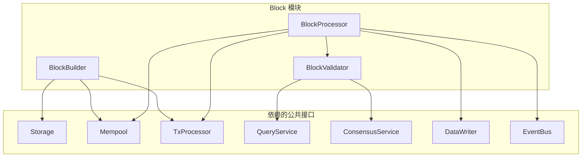

# Block 模块（internal/core/block）

---

## 📍 **模块定位**

Block 模块是区块链核心模块之一，负责区块的完整生命周期管理：
- ✅ **区块构建**（BlockBuilder）：创建挖矿候选区块
- ✅ **区块验证**（BlockValidator）：验证区块有效性
- ✅ **区块处理**（BlockProcessor）：处理验证通过的区块

**解决什么问题**：
- 为矿工提供候选区块
- 确保接收到的区块符合协议规则
- 将验证通过的区块持久化并更新状态

**不解决什么问题**（边界）：
- 不负责链状态管理（由 Chain 模块负责）
- 不负责交易创建和验证（由 TX 模块负责）
- 不负责UTXO状态管理（由 EUTXO 模块负责）

---

## 🏗️ **模块架构**

### 三层架构

```
公共接口层 (pkg/interfaces/block)
    ├── BlockBuilder
    ├── BlockValidator
    └── BlockProcessor
        ↓ 继承（嵌入）
内部接口层 (internal/core/block/interfaces)
    ├── InternalBlockBuilder
    ├── InternalBlockValidator
    └── InternalBlockProcessor
        ↓ 实现
实现层 (internal/core/block)
    ├── builder/Service        ← BlockBuilder 实现
    ├── validator/Service       ← BlockValidator 实现
    └── processor/Service       ← BlockProcessor 实现
```

### 架构依赖关系

#### 在依赖链中的位置

Block 模块位于**核心业务层垂直依赖链的第⑥层**：

```
┌──────────────┐
│  Chain       │ ← ⑦ 最高层（链管理）
└──────┬───────┘
       ↓ 依赖
┌──────────────┐
│  Block       │ ← ⑥ 区块管理 ← 本模块
└──────┬───────┘
       ↓ 依赖
┌──────────────┐
│  TX          │ ← ⑤ 交易处理
└──────┬───────┘
       ↓ 依赖
┌──────────────┐
│  EUTXO       │ ← ④ 状态管理
└──────────────┘
```

#### 允许的依赖

✅ **允许依赖的下层模块**：
- `tx.*` - 交易处理层（⑤）
- `persistence.QueryService` - 统一查询服务（读操作）
- `persistence.DataWriter` - 统一写入服务（写操作）

✅ **允许依赖的基础设施**：
- `storage.*` - 存储接口
- `event.*` - 事件总线
- `log.*` - 日志服务
- `crypto.*` - 密码学服务

#### 禁止的依赖

❌ **禁止依赖的上层模块**：
- `chain.*` - 链管理层（⑦，上层）- 会造成循环依赖

❌ **禁止依赖的间接下层模块**：
- `eutxo.*` - 状态管理层（④）- 应通过 TX 层访问
- `ures.*` - 资源管理层（③）- 应通过 TX 层访问

**关键原则**：
- ✅ Block 调用 TX，不直接调用 EUTXO
- ✅ 读操作通过 `persistence.QueryService`
- ✅ 写操作通过 `persistence.DataWriter`
- ❌ 禁止依赖 `eutxo.UTXOWriter` 用于持久化（应由 `persistence.DataWriter` 处理）
- ⚠️ 如果需要在业务逻辑中使用 `eutxo.UTXOWriter`（如引用计数管理），这是允许的

> 📖 **详细架构分析**：参见 [../ARCHITECTURE_DEPENDENCY_ANALYSIS.md](../ARCHITECTURE_DEPENDENCY_ANALYSIS.md)

### 依赖关系图



---

## 📦 **核心服务**

### 1. BlockBuilder 服务

**职责**：创建挖矿候选区块

**核心方法**：
- `CreateMiningCandidate(ctx)` - 创建候选区块
- `GetCandidateBlock(ctx, blockHash)` - 获取缓存的候选区块
- `GetBuilderMetrics(ctx)` - 获取构建性能指标

**实现文件**：
- `builder/service.go` - 服务主文件
- `builder/candidate.go` - 候选区块构建逻辑
- `shared/hash.go` - 区块哈希计算（使用crypto接口）
- `shared/merkle.go` - Merkle树计算（使用crypto接口）

**依赖**：
- Storage: 读取链状态
- Mempool: 获取待打包交易
- TxProcessor: 处理交易（可选）
- **Hasher (crypto.Hasher)**: 哈希计算（避免重复造轮子）✅

### 2. BlockValidator 服务

**职责**：验证区块有效性

**核心方法**：
- `ValidateBlock(ctx, block)` - 验证区块
- `ValidateStructure(ctx, block)` - 验证结构（内部方法）
- `ValidateConsensus(ctx, block)` - 验证共识（内部方法）
- `GetValidatorMetrics(ctx)` - 获取验证性能指标

**验证流程**：
```
1. 基础验证（nil检查、空区块检查）
2. 结构验证（区块头、区块体、字段完整性）
3. 共识验证（POW、难度、时间戳）
4. 交易验证（交易数量、Merkle根、交易有效性）
5. 链连接性验证（父区块、高度连续性）
```

**实现文件**：
- `validator/service.go` - 服务主文件
- `validator/structure.go` - 结构验证实现
- `validator/consensus.go` - 共识验证实现

**依赖**：
- QueryService: 查询链状态
- ConsensusService: 验证共识规则（可选）

### 3. BlockProcessor 服务

**职责**：处理验证通过的区块

**核心方法**：
- `ProcessBlock(ctx, block)` - 处理区块
- `GetProcessorMetrics(ctx)` - 获取处理性能指标
- `SetValidator(validator)` - 设置验证器（延迟注入）

**处理流程**：
```
1. 并发控制检查
2. 验证区块（调用Validator）
3. 通过DataWriter.WriteBlock统一写入区块（S2-S5）
   - 存储区块数据
   - 更新交易索引
   - 处理UTXO变更
   - 更新链状态
4. 验证所有交易执行结果（executeTransactions，S1）
   - StateOutput: 验证ZK证明和执行结果哈希
   - ResourceOutput: 验证资源生命周期
   - AssetOutput: 最终确认交易有效性
   - 引用型输入: 验证引用UTXO的有效性
5. 处理引用计数（processReferenceCounts）
6. 更新状态根（updateStateRoot）
7. 清理交易池
8. 发布BlockProcessed事件
9. 记录指标
```

**实现文件**：
- `processor/service.go` - 服务主文件
- `processor/execute.go` - 区块执行逻辑
- `processor/transaction.go` - 交易处理实现

**依赖**：
- DataWriter: 统一写入服务（持久化区块、处理UTXO变更）
- UTXOWriter: 更新UTXO状态（引用计数、状态根）
- Mempool: 清理交易池
- EventBus: 发布事件（可选）
- Validator: 验证区块（延迟注入）

### 交易执行的双重含义

在WES架构中，"交易执行"有两个不同的含义：

**智能合约执行（TX层）**：
- 时机：交易构建时
- 位置：TX层 → ISPC层
- 职责：执行WASM合约或ONNX模型，生成ZK证明，构建StateOutput
- 结果：交易包含StateOutput（含ZK证明）

**交易验证（BLOCK层）**：
- 时机：区块处理时
- 位置：BLOCK层 → Processor
- 职责：验证StateOutput中的ZK证明，验证执行结果的一致性
- 结果：状态变更应用到区块链

**关键原则**：
- ✅ **执行即构造**：执行过程就是构建交易的过程（TX层）
- ✅ **验证即应用**：验证证明后应用状态变更（BLOCK层）
- ✅ **单次执行，多点验证**：只有执行节点执行合约，验证节点只验证证明

### 交易类型处理逻辑

根据WES的两种输入、三种输出架构，`executeTransactions` 需要根据交易类型分类处理：

**两种输入类型**：
- **AssetInput（消费型）**：`is_reference_only=false`，UTXO被消费
- **ResourceInput（引用型）**：`is_reference_only=true`，UTXO被引用但不消费

**三种输出类型**：
- **AssetOutput**：价值载体（代币转账、找零等）
- **ResourceOutput**：能力载体（合约部署、资源上传等）
- **StateOutput**：证据载体（执行结果、ZK证明等）

**分类处理规则**：

1. **StateOutput（ISPC执行的合约调用）**：
   - ✅ 验证ZK证明（必须）
   - ✅ 验证执行结果哈希的一致性

2. **ResourceOutput（资源交易）**：
   - ✅ 验证资源生命周期（版本号、过期时间等）

3. **AssetOutput（普通资产交易）**：
   - ✅ 最终确认交易有效性（已在提交时验证）

4. **引用型输入**：
   - ✅ 验证引用UTXO的有效性（引用计数管理已在`processReferenceCounts`中处理）

**职责分离**：
- UTXO变更 → DataWriter处理（S2-S5）
- 引用计数管理 → `processReferenceCounts`处理
- 交易验证 → `executeTransactions`处理（S1）

---

## 🔗 **fx 依赖注入**

### 使用示例

```go
import (
    "go.uber.org/fx"
    "github.com/weisyn/v1/internal/core/block"
    blockif "github.com/weisyn/v1/pkg/interfaces/block"
)

app := fx.New(
    // 依赖模块
    storage.Module(),
    mempool.Module(),
    tx.Module(),
    persistence.Module,
    consensus.Module(),
    eutxo.Module(),
    event.Module(),
    log.Module(),
    
    // Block 模块
    block.Module(),
    
    // 使用 Block 服务
    fx.Invoke(func(
        builder blockif.BlockBuilder,
        validator blockif.BlockValidator,
        processor blockif.BlockProcessor,
    ) {
        // 创建候选区块
        candidateHash, err := builder.CreateMiningCandidate(ctx)
        
        // 验证区块
        valid, err := validator.ValidateBlock(ctx, block)
        
        // 处理区块
        err = processor.ProcessBlock(ctx, block)
    }),
)
```

### 命名导出

Block 模块提供以下命名导出（供其他模块引用）：
- `name:"block_builder"` - BlockBuilder 服务
- `name:"block_validator"` - BlockValidator 服务
- `name:"block_processor"` - BlockProcessor 服务

---

## 📊 **性能指标**

### BuilderMetrics
- 统计指标：CandidatesCreated, CacheHits, CacheMisses
- 时间指标：LastCandidateTime, AvgCreationTime, MaxCreationTime
- 缓存指标：CacheSize, MaxCacheSize
- 状态指标：IsHealthy, ErrorMessage

### ValidatorMetrics
- 统计指标：BlocksValidated, ValidationsPassed, ValidationsFailed
- 失败分类：StructureErrors, ConsensusErrors, TransactionErrors
- 时间指标：LastValidateTime, AvgValidateTime, MaxValidateTime
- 状态指标：IsHealthy, ErrorMessage

### ProcessorMetrics
- 统计指标：BlocksProcessed, TransactionsExecuted, SuccessCount, FailureCount
- 时间指标：LastProcessTime, AvgProcessTime, MaxProcessTime
- 数据指标：LastBlockHeight, LastBlockHash
- 状态指标：IsProcessing, IsHealthy, ErrorMessage

---

## 🎯 **事件驱动**

### 出站事件（Block 模块发布）

| 事件类型 | 事件常量 | 发布时机 | 订阅者 |
|---------|---------|---------|--------|
| 区块处理完成 | `EventTypeBlockProcessed` | ProcessBlock 成功后 | Chain 模块 |
| 分叉检测 | `EventTypeForkDetected` | 检测到分叉时 | Chain/Fork 模块 |

### 入站事件（Block 模块订阅，可选）

| 事件类型 | 事件常量 | 来源 | 处理器 |
|---------|---------|------|--------|
| 共识结果广播 | `EventTypeConsensusResultBroadcast` | Consensus | 待实现 |
| 交易池变化 | `EventTypeMempoolSizeChanged` | Mempool | 待实现 |

---

## 🔧 **架构修复历史**

### 关键修复（P0/P1）

**区块存储方式修复（P0）**：
- **问题**：区块数据存储在 BadgerDB 中，不符合设计规范
- **修复**：改为文件系统存储（`blocks/{segment}/{height}.bin`），BadgerDB 仅存储索引
- **影响**：提升性能，符合存储架构设计

**临时存储机制（P1）**：
- **问题**：同步过程中乱序区块直接处理，可能导致内存压力
- **修复**：实现临时存储机制，支持乱序区块的连续性检测和批量处理
- **位置**：`internal/core/chain/sync/temp_storage.go`

**新区块接收智能路由（P1）**：
- **问题**：只接受 `currentHeight + 1` 的区块，缺少高度跳跃和分叉处理
- **修复**：实现智能路由，支持高度跳跃、分叉检测、重复检测
- **位置**：`internal/core/consensus/aggregator/network_handler/manager.go`

**资源 UTXO 引用计数（P1）**：
- **问题**：引用型输入未正确调用 `ReferenceUTXO()`
- **修复**：在 BlockProcessor 中正确处理引用计数管理
- **位置**：`internal/core/block/processor/execute.go`

### BlockProcessor 架构调整

**引用计数管理**：
- 在 `executeBlock` 中，调用 `dataWriter.WriteBlock` 之后，添加 `processReferenceCounts` 方法
- 扫描区块中的所有交易，识别引用型输入（`is_reference_only=true`）
- 通过 `eutxo.UTXOWriter.ReferenceUTXO` 增加引用计数

**状态根更新**：
- 在 UTXO 变更后，通过 `persistence.UTXOQuery.GetCurrentStateRoot` 计算状态根
- 通过 `eutxo.UTXOWriter.UpdateStateRoot` 更新状态根

> 📖 **详细修复记录**：修复内容已整合到代码实现中，详见各服务实现文件。

---

## 📚 **参考文档**

- [公共接口 README](../../../pkg/interfaces/block/README.md) - 公共接口定义
- [内部接口 README](./interfaces/README.md) - 内部接口定义

---

## 📝 **实施状态**

| 组件 | 状态 | 备注 |
|-----|------|------|
| BlockBuilder 服务 | ✅ 完成 | 使用crypto接口，真实哈希和Merkle计算 |
| BlockValidator 服务 | ✅ 完成 | 多层验证，共识集成 |
| BlockProcessor 服务 | ✅ 完成 | 事件发布集成完整 |
| 共享工具 (shared/) | ✅ 完成 | hash.go, merkle.go |
| fx 依赖注入 | ✅ 完成 | 完整配置，包含crypto注入 |
| 事件集成 | ✅ 完成 | 发布帮助函数，自动发布事件 |
| 内部接口 | ✅ 完成 | 3个内部接口 |
| 文档 | ✅ 完成 | 完整文档体系 |
| 单元测试 | ⏳ 待实施 | 高优先级 |
| 集成测试 | ⏳ 待实施 | 中优先级 |

---

## 🔄 **下一步工作**

### 高优先级
1. **完善实现细节**：完成TODO标记的方法实现
2. **编写单元测试**：覆盖核心逻辑
3. **集成测试**：验证模块间协作

### 中优先级
4. **性能优化**：缓存策略、并发优化
5. **错误处理增强**：更详细的错误信息
6. **监控和指标**：完善性能监控

### 低优先级
7. **文档完善**：使用示例、故障排查
8. **事件订阅**：实现入站事件处理

---

**状态**：✅ Block 模块核心功能已实施完成

**版本**：1.0.0

**维护者**：WES Block 开发组
