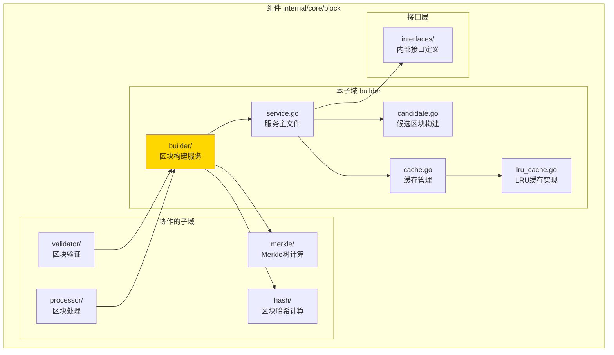
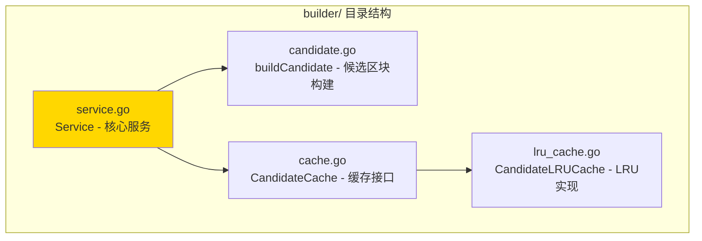

# builder - 区块构建子域

---

## 📌 版本信息

- **版本**：1.0
- **状态**：stable
- **最后更新**：2025-11-XX
- **最后审核**：2025-11-XX
- **所有者**：Block 开发组
- **适用范围**：区块构建服务实现

---

## 🎯 子域定位

**路径**：`internal/core/block/builder/`

**所属组件**：`block`

**核心职责**：创建挖矿候选区块，为矿工提供可挖矿的区块模板

**在组件中的角色**：
- 区块构建的核心逻辑实现
- 候选区块缓存管理
- 构建性能指标收集

---

## 🏗️ 架构设计

### 在组件中的位置

> **说明**：展示此子域在 Block 组件内部的位置和协作关系



**位置说明**：

| 关系类型 | 目标 | 关系说明 |
|---------|------|---------|
| **协作** | merkle/ | 使用 Merkle 树计算交易根 |
| **协作** | hash/ | 使用区块哈希服务计算区块哈希 |
| **依赖** | interfaces/ | 实现 InternalBlockBuilder 接口 |
| **被依赖** | validator/ | 可能需要验证构建的区块 |
| **被依赖** | processor/ | 构建的区块会被处理 |

---

### 内部组织

> **说明**：展示此子域内部的文件组织和类型关系



---

## 📁 目录结构

```
internal/core/block/builder/
├── README.md                    # 本文档
├── service.go                   # Service - 核心服务实现
├── candidate.go                 # buildCandidate - 候选区块构建逻辑
├── cache.go                     # CandidateCache - 缓存接口定义
└── lru_cache.go                 # CandidateLRUCache - LRU缓存实现
```

---

## 🔧 核心实现

### 实现文件：`service.go`

**核心类型**：`Service`

**职责**：实现 BlockBuilder 接口，提供区块构建服务

**关键字段**：

```go
type Service struct {
    // 依赖注入
    storage        storage.BadgerStore          // 存储服务（读取链状态）
    mempool        mempool.TxPool               // 交易池（获取待打包交易）
    txProcessor    tx.TxProcessor               // 交易处理器（验证和处理交易）
    hasher         merkle.Hasher                 // 哈希服务（Merkle树计算）
    blockHashClient core.BlockHashServiceClient // 区块哈希服务客户端
    utxoQuery      persistence.UTXOQuery        // UTXO查询服务（获取状态根）
    blockQuery     persistence.BlockQuery        // 区块查询服务（获取难度）
    feeManager     tx.FeeManager                 // 费用管理器（构建Coinbase）
    logger         log.Logger                    // 日志记录器
    
    // 候选区块缓存
    cache          *CandidateLRUCache            // LRU缓存
    
    // 指标收集
    metrics        *interfaces.BuilderMetrics    // 构建指标
    metricsMu      sync.Mutex                    // 指标锁
    
    // 状态管理
    isHealthy      bool                          // 健康状态
    lastError      error                         // 最后错误
}
```

**关键方法**：

| 方法名 | 职责 | 可见性 | 备注 |
|-------|------|-------|-----|
| `NewService()` | 构造函数 | Public | 用于依赖注入 |
| `CreateMiningCandidate()` | 创建挖矿候选区块 | Public | 实现接口方法 |
| `GetCandidateBlock()` | 获取缓存的候选区块 | Public | 实现接口方法 |
| `GetBuilderMetrics()` | 获取构建性能指标 | Public | 实现接口方法 |
| `buildCandidate()` | 构建候选区块 | Private | 内部构建逻辑 |
| `buildCoinbaseTransaction()` | 构建Coinbase交易 | Private | 构建激励交易 |
| `buildBlockHeader()` | 构建区块头 | Private | 构建区块头逻辑 |

---

### 辅助文件

**candidate.go** - 候选区块构建逻辑：
- `buildCandidate()` - 完整的候选区块构建流程
- `buildCoinbaseTransaction()` - 构建Coinbase交易（零增发，仅聚合手续费）
- `buildBlockHeader()` - 构建区块头（包含Merkle根、状态根等）

**cache.go** - 缓存接口定义：
- `CandidateCache` - 候选区块缓存接口
- `Candidate` - 候选区块缓存项

**lru_cache.go** - LRU缓存实现：
- `CandidateLRUCache` - LRU缓存实现
- 支持并发安全的缓存操作

---

## 🔗 协作关系

### 依赖的接口

| 接口 | 来源 | 用途 |
|-----|------|-----|
| `InternalBlockBuilder` | `internal/core/block/interfaces/` | 实现区块构建接口 |
| `storage.BadgerStore` | `pkg/interfaces/infrastructure/storage/` | 读取链状态 |
| `mempool.TxPool` | `pkg/interfaces/mempool/` | 获取待打包交易 |
| `tx.TxProcessor` | `pkg/interfaces/tx/` | 验证和处理交易 |
| `persistence.UTXOQuery` | `pkg/interfaces/persistence/` | 获取UTXO状态根 |
| `persistence.BlockQuery` | `pkg/interfaces/persistence/` | 获取区块难度 |
| `tx.FeeManager` | `pkg/interfaces/tx/` | 构建Coinbase交易 |

---

### 被依赖关系

**被以下子域使用**：
- `processor/` - 可能直接构建区块进行处理
- `validator/` - 验证构建的区块有效性

**示例**：

```go
// 在其他子域中使用
import "github.com/weisyn/v1/internal/core/block/builder"

func SomeFunction(builder interfaces.InternalBlockBuilder) {
    candidateHash, err := builder.CreateMiningCandidate(ctx)
    if err != nil {
        return err
    }
    
    candidate, err := builder.GetCandidateBlock(ctx, candidateHash)
    // ...
}
```

---

## 🧪 测试

### 测试覆盖

| 测试类型 | 文件 | 覆盖率目标 | 当前状态 |
|---------|------|-----------|---------|
| 单元测试 | `builder_test.go` | ≥ 80% | ⏳ 待实施 |
| 集成测试 | `../integration/` | 核心场景 | ⏳ 待实施 |

---

### 测试示例

```go
func TestService_CreateMiningCandidate(t *testing.T) {
    // Arrange
    mockStorage := newMockStorage()
    mockMempool := newMockMempool()
    mockHasher := newMockHasher()
    service := builder.NewService(mockStorage, mockMempool, nil, mockHasher, ...)
    
    // Act
    candidateHash, err := service.CreateMiningCandidate(ctx)
    
    // Assert
    assert.NoError(t, err)
    assert.NotNil(t, candidateHash)
}
```

---

## 📊 关键设计决策

### 决策 1：候选区块缓存策略

**问题**：如何减少重复构建候选区块的开销？

**方案**：使用 LRU 缓存存储候选区块，基于区块哈希作为键

**理由**：
- 相同交易集合会生成相同的候选区块
- LRU 策略保证最常用的候选区块在缓存中
- 支持并发访问，线程安全

**权衡**：
- ✅ 优点：显著减少重复构建开销，提升性能
- ⚠️ 缺点：需要管理缓存大小，可能占用内存

---

### 决策 2：Coinbase 交易构建

**问题**：如何构建 Coinbase 交易？

**方案**：零增发机制，仅聚合交易手续费，无区块奖励

**理由**：
- 符合 WES 零增发的经济模型
- 矿工通过交易手续费获得激励
- 使用 FeeManager 统一管理手续费计算

**权衡**：
- ✅ 优点：符合经济模型，手续费统一管理
- ⚠️ 缺点：如果交易手续费不足，矿工激励可能不足

---

### 决策 3：区块哈希计算

**问题**：如何计算区块哈希？

**方案**：使用 gRPC BlockHashService 服务，通过 blockHashClient 调用

**理由**：
- 统一哈希计算逻辑，避免重复实现
- 支持跨语言一致性
- 可以独立优化哈希计算性能

**权衡**：
- ✅ 优点：统一接口，易于维护
- ⚠️ 缺点：增加网络调用开销（如果是远程服务）

---

## 📚 相关文档

- [组件总览](../README.md)
- [内部接口](../interfaces/README.md)
- [公共接口](../../../../pkg/interfaces/block/README.md)
- [接口与实现的组织架构](../../../../docs/system/standards/principles/code-organization.md)

---

## 📝 变更历史

| 版本 | 日期 | 变更内容 | 作者 |
|-----|------|---------|------|
| 1.0 | 2025-11-XX | 初始版本 | Block 开发组 |

---

## 🚧 待办事项

- [ ] 完善单元测试覆盖
- [ ] 优化缓存策略性能
- [ ] 支持动态调整缓存大小
- [ ] 添加构建超时控制

