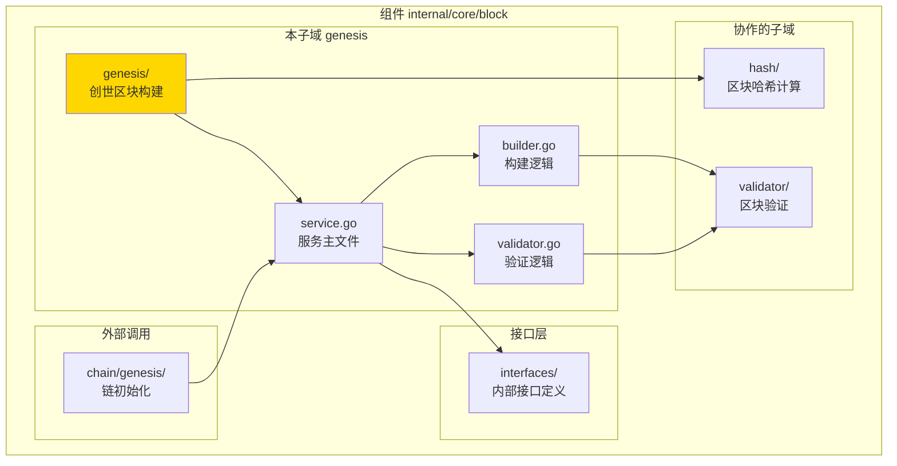
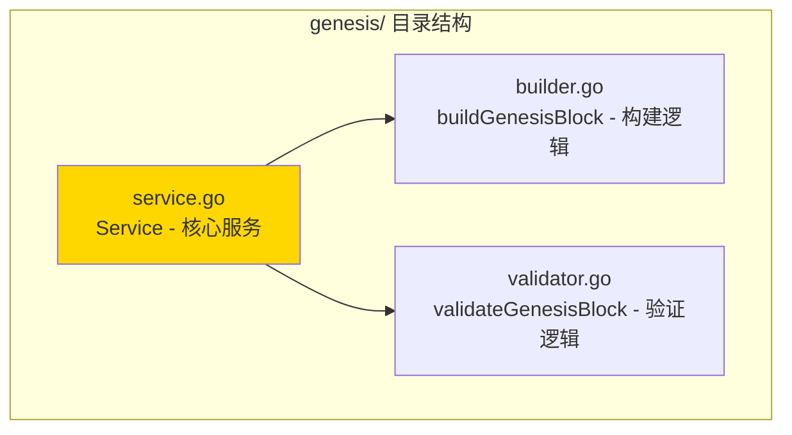

# genesis - 创世区块构建子域

---

## 📌 版本信息

- **版本**：1.0
- **状态**：stable
- **最后更新**：2025-11-XX
- **最后审核**：2025-11-XX
- **所有者**：Block 开发组
- **适用范围**：创世区块构建和验证服务实现

---

## 🎯 子域定位

**路径**：`internal/core/block/genesis/`

**所属组件**：`block`

**核心职责**：构建和验证创世区块，为区块链初始化提供第一块区块

**在组件中的角色**：
- 创世区块构建的核心逻辑实现
- 创世区块验证逻辑
- 链初始化支持

---

## 🏗️ 架构设计

### 在组件中的位置

> **说明**：展示此子域在 Block 组件内部的位置和协作关系



**位置说明**：

| 关系类型 | 目标 | 关系说明 |
|---------|------|---------|
| **协作** | hash/ | 使用区块哈希服务计算创世区块哈希 |
| **协作** | validator/ | 复用区块验证逻辑验证创世区块 |
| **依赖** | interfaces/ | 实现 InternalGenesisBlockBuilder 接口 |
| **被依赖** | chain/genesis/ | 链初始化时调用构建创世区块 |

---

### 内部组织

> **说明**：展示此子域内部的文件组织和类型关系



---

## 📁 目录结构

```
internal/core/block/genesis/
├── README.md                    # 本文档
├── service.go                   # Service - 核心服务实现
├── builder.go                   # buildGenesisBlock - 创世区块构建逻辑
└── validator.go                 # validateGenesisBlock - 创世区块验证逻辑
```

---

## 🔧 核心实现

### 实现文件：`service.go`

**核心类型**：`Service`

**职责**：实现 GenesisBlockBuilder 接口，提供创世区块构建和验证服务

**关键字段**：

```go
type Service struct {
    // 依赖注入
    txHashClient transaction.TransactionHashServiceClient // 交易哈希服务客户端
    hashManager  crypto.HashManager                         // 哈希管理器
    utxoQuery    persistence.UTXOQuery                     // UTXO查询服务
    logger       log.Logger                                 // 日志记录器
}
```

**关键方法**：

| 方法名 | 职责 | 可见性 | 备注 |
|-------|------|-------|-----|
| `NewService()` | 构造函数 | Public | 用于依赖注入 |
| `BuildGenesisBlock()` | 构建创世区块 | Public | 实现接口方法 |
| `ValidateGenesisBlock()` | 验证创世区块 | Public | 实现接口方法 |
| `buildGenesisBlock()` | 构建创世区块 | Private | 内部构建逻辑 |
| `validateGenesisBlock()` | 验证创世区块 | Private | 内部验证逻辑 |

---

### 辅助文件

**builder.go** - 创世区块构建逻辑：
- `buildGenesisBlock()` - 完整的创世区块构建流程
- 处理创世交易列表
- 设置特殊的创世区块头（高度为0，无父区块）

**validator.go** - 创世区块验证逻辑：
- `validateGenesisBlock()` - 验证创世区块的有效性
- 验证区块高度为0
- 验证父区块哈希为空
- 验证区块结构完整性

---

## 🔗 协作关系

### 依赖的接口

| 接口 | 来源 | 用途 |
|-----|------|-----|
| `InternalGenesisBlockBuilder` | `internal/core/block/interfaces/` | 实现创世区块构建接口 |
| `crypto.HashManager` | `pkg/interfaces/infrastructure/crypto/` | 哈希计算 |
| `persistence.UTXOQuery` | `pkg/interfaces/persistence/` | 查询UTXO状态 |
| `transaction.TransactionHashServiceClient` | `pb/blockchain/block/transaction/` | 计算交易哈希 |

---

### 被依赖关系

**被以下模块使用**：
- `chain/genesis/` - 链初始化时调用构建创世区块

**示例**：

```go
// 在 chain/genesis 中使用
import "github.com/weisyn/v1/internal/core/block/genesis"

func InitializeChain(genesisBuilder blockif.GenesisBlockBuilder) error {
    genesisBlock, err := genesisBuilder.BuildGenesisBlock(ctx, config)
    if err != nil {
        return err
    }
    
    err = genesisBuilder.ValidateGenesisBlock(ctx, genesisBlock)
    // ...
}
```

---

## 🧪 测试

### 测试覆盖

| 测试类型 | 文件 | 覆盖率目标 | 当前状态 |
|---------|------|-----------|---------|
| 单元测试 | `genesis_test.go` | ≥ 80% | ⏳ 待实施 |
| 集成测试 | `../integration/` | 核心场景 | ⏳ 待实施 |

---

### 测试示例

```go
func TestService_BuildGenesisBlock(t *testing.T) {
    // Arrange
    mockTxHashClient := newMockTxHashClient()
    mockHasher := newMockHasher()
    mockUTXOQuery := newMockUTXOQuery()
    service := genesis.NewService(mockTxHashClient, mockHasher, mockUTXOQuery, logger)
    
    // Act
    genesisBlock, err := service.BuildGenesisBlock(ctx, config)
    
    // Assert
    assert.NoError(t, err)
    assert.NotNil(t, genesisBlock)
    assert.Equal(t, uint64(0), genesisBlock.Header.Height)
}
```

---

## 📊 关键设计决策

### 决策 1：创世区块特殊处理

**问题**：创世区块与普通区块有何不同？

**方案**：创世区块高度为0，父区块哈希为空，不遵循普通区块的验证规则

**理由**：
- 创世区块是链的起点，没有父区块
- 需要特殊的构建和验证逻辑
- 分离创世区块逻辑，便于维护

**权衡**：
- ✅ 优点：逻辑清晰，易于理解和维护
- ⚠️ 缺点：需要维护两套逻辑（创世和普通）

---

### 决策 2：委托模式实现

**问题**：如何组织构建和验证逻辑？

**方案**：Service 作为门面，委托给 builder.go 和 validator.go 实现具体逻辑

**理由**：
- 职责分离：构建和验证逻辑独立
- 易于测试：可以单独测试构建和验证逻辑
- 代码组织清晰：文件职责明确

**权衡**：
- ✅ 优点：代码组织清晰，易于维护
- ⚠️ 缺点：文件数量增加

---

## 📚 相关文档

- [组件总览](../README.md)
- [内部接口](../interfaces/README.md)
- [公共接口](../../../../pkg/interfaces/block/README.md)
- [接口与实现的组织架构](../../../../docs/system/standards/principles/code-organization.md)

---

## 📝 变更历史

| 版本 | 日期 | 变更内容 | 作者 |
|-----|------|---------|------|
| 1.0 | 2025-11-XX | 初始版本 | Block 开发组 |

---

## 🚧 待办事项

- [ ] 完善单元测试覆盖
- [ ] 支持自定义创世区块配置
- [ ] 添加创世区块模板验证

