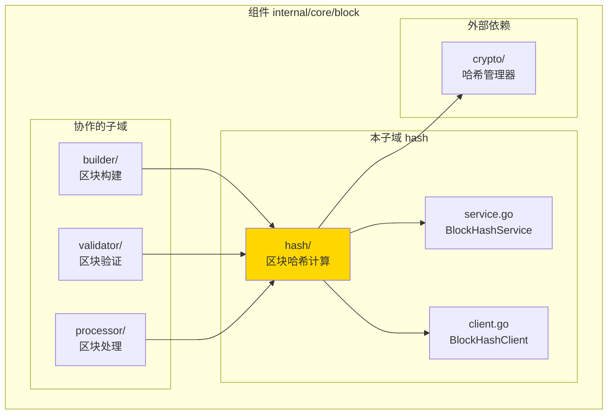
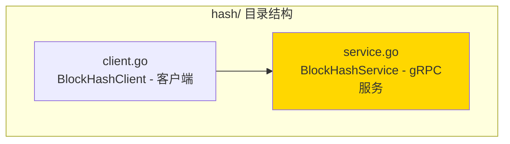

# hash - 区块哈希计算子域

---

## 📌 版本信息

- **版本**：1.0
- **状态**：stable
- **最后更新**：2025-11-XX
- **最后审核**：2025-11-XX
- **所有者**：Block 开发组
- **适用范围**：区块哈希计算服务实现

---

## 🎯 子域定位

**路径**：`internal/core/block/hash/`

**所属组件**：`block`

**核心职责**：提供确定性的区块哈希计算服务，实现 gRPC BlockHashService 接口

**在组件中的角色**：
- 区块哈希计算的核心服务
- gRPC 服务实现
- 确保跨平台哈希计算一致性

---

## 🏗️ 架构设计

### 在组件中的位置

> **说明**：展示此子域在 Block 组件内部的位置和协作关系



**位置说明**：

| 关系类型 | 目标 | 关系说明 |
|---------|------|---------|
| **被依赖** | builder/ | 构建区块时计算区块哈希 |
| **被依赖** | validator/ | 验证区块时计算并比较哈希 |
| **被依赖** | processor/ | 处理区块时计算区块哈希 |
| **依赖** | crypto/ | 使用 HashManager 进行哈希计算 |

---

### 内部组织

> **说明**：展示此子域内部的文件组织和类型关系



---

## 📁 目录结构

```
internal/core/block/hash/
├── README.md                    # 本文档
├── service.go                   # BlockHashService - gRPC服务实现
└── client.go                    # BlockHashClient - 客户端实现（如需要）
```

---

## 🔧 核心实现

### 实现文件：`service.go`

**核心类型**：`BlockHashService`

**职责**：实现 gRPC BlockHashService 接口，提供区块哈希计算服务

**关键字段**：

```go
type BlockHashService struct {
    core.UnimplementedBlockHashServiceServer
    hashManager crypto.HashManager  // 哈希管理器
    logger      log.Logger           // 日志记录器
}
```

**关键方法**：

| 方法名 | 职责 | 可见性 | 备注 |
|-------|------|-------|-----|
| `NewBlockHashService()` | 构造函数 | Public | 用于依赖注入 |
| `ComputeBlockHash()` | 计算区块哈希 | Public | 实现 gRPC 接口方法 |
| `computeHash()` | 内部哈希计算 | Private | 实际的哈希计算逻辑 |

---

### 辅助文件

**client.go** - 客户端实现（如需要）：
- `BlockHashClient` - 区块哈希服务客户端
- 提供便捷的客户端接口

---

## 🔗 协作关系

### 依赖的接口

| 接口 | 来源 | 用途 |
|-----|------|-----|
| `core.BlockHashServiceServer` | `pb/blockchain/block/` | 实现 gRPC 服务接口 |
| `crypto.HashManager` | `pkg/interfaces/infrastructure/crypto/` | 哈希计算 |

---

### 被依赖关系

**被以下子域使用**：
- `builder/` - 构建区块时计算区块哈希
- `validator/` - 验证区块时计算并比较哈希
- `processor/` - 处理区块时计算区块哈希

**示例**：

```go
// 在其他子域中使用
import "github.com/weisyn/v1/internal/core/block/hash"

func BuildBlock(builder interfaces.InternalBlockBuilder, hashClient core.BlockHashServiceClient) {
    block := buildBlock(...)
    
    req := &core.ComputeBlockHashRequest{Block: block}
    resp, err := hashClient.ComputeBlockHash(ctx, req)
    // ...
}
```

---

## 🧪 测试

### 测试覆盖

| 测试类型 | 文件 | 覆盖率目标 | 当前状态 |
|---------|------|-----------|---------|
| 单元测试 | `hash_test.go` | ≥ 80% | ⏳ 待实施 |
| 集成测试 | `../integration/` | 核心场景 | ⏳ 待实施 |

---

### 测试示例

```go
func TestBlockHashService_ComputeBlockHash(t *testing.T) {
    // Arrange
    mockHasher := newMockHasher()
    service := hash.NewBlockHashService(mockHasher, logger)
    
    block := createTestBlock()
    req := &core.ComputeBlockHashRequest{Block: block}
    
    // Act
    resp, err := service.ComputeBlockHash(ctx, req)
    
    // Assert
    assert.NoError(t, err)
    assert.NotNil(t, resp.Hash)
    assert.True(t, resp.IsValid)
}
```

---

## 📊 关键设计决策

### 决策 1：gRPC 服务实现

**问题**：为什么使用 gRPC 服务而不是直接函数调用？

**方案**：实现 gRPC BlockHashService 接口，支持跨语言调用和独立部署

**理由**：
- 统一哈希计算接口，支持跨语言一致性
- 可以独立优化哈希计算性能
- 支持远程调用，便于分布式部署

**权衡**：
- ✅ 优点：统一接口，易于维护和扩展
- ⚠️ 缺点：增加网络调用开销（如果是远程服务）

---

### 决策 2：确定性哈希计算

**问题**：如何确保哈希计算的确定性？

**方案**：序列化区块头进行哈希计算，确保相同输入产生相同输出

**理由**：
- 区块哈希必须具有确定性
- 序列化确保字节级一致性
- 支持跨平台一致性

**权衡**：
- ✅ 优点：确保确定性，支持跨平台
- ⚠️ 缺点：序列化开销

---

## 📚 相关文档

- [组件总览](../README.md)
- [内部接口](../interfaces/README.md)
- [公共接口](../../../../pkg/interfaces/block/README.md)
- [接口与实现的组织架构](../../../../docs/system/standards/principles/code-organization.md)

---

## 📝 变更历史

| 版本 | 日期 | 变更内容 | 作者 |
|-----|------|---------|------|
| 1.0 | 2025-11-XX | 初始版本 | Block 开发组 |

---

## 🚧 待办事项

- [ ] 完善单元测试覆盖
- [ ] 添加性能监控和指标
- [ ] 支持批量哈希计算

