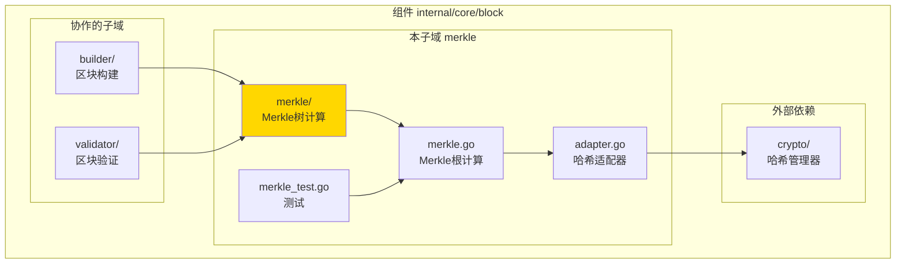
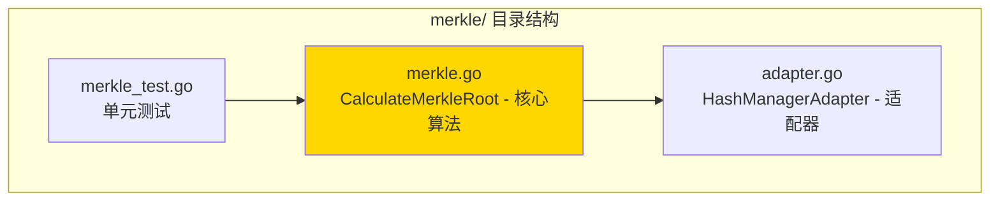

# merkle - Merkle树计算子域

---

## 📌 版本信息

- **版本**：1.0
- **状态**：stable
- **最后更新**：2025-11-XX
- **最后审核**：2025-11-XX
- **所有者**：Block 开发组
- **适用范围**：Merkle树计算和验证功能实现

---

## 🎯 子域定位

**路径**：`internal/core/block/merkle/`

**所属组件**：`block`

**核心职责**：提供标准Merkle树计算和验证功能，用于区块交易根计算

**在组件中的角色**：
- Merkle树计算的核心实现
- 区块交易根计算
- 交易完整性验证支持

---

## 🏗️ 架构设计

### 在组件中的位置

> **说明**：展示此子域在 Block 组件内部的位置和协作关系



**位置说明**：

| 关系类型 | 目标 | 关系说明 |
|---------|------|---------|
| **被依赖** | builder/ | 构建区块时计算交易Merkle根 |
| **被依赖** | validator/ | 验证区块时验证Merkle根 |
| **依赖** | crypto/ | 使用 HashManager 进行哈希计算（通过适配器） |

---

### 内部组织

> **说明**：展示此子域内部的文件组织和类型关系



---

## 📁 目录结构

```
internal/core/block/merkle/
├── README.md                    # 本文档
├── merkle.go                    # CalculateMerkleRoot - Merkle根计算核心算法
├── adapter.go                   # HashManagerAdapter - 哈希适配器
└── merkle_test.go               # 单元测试
```

---

## 🔧 核心实现

### 实现文件：`merkle.go`

**核心函数**：`CalculateMerkleRoot`

**职责**：计算交易列表的Merkle根

**算法**：
1. 计算所有交易的哈希作为叶子节点
2. 两两配对，计算父节点哈希
3. 重复步骤2，直到只剩一个根节点
4. 如果节点数为奇数，复制最后一个节点

**关键函数**：

| 函数名 | 职责 | 可见性 | 备注 |
|-------|------|-------|-----|
| `CalculateMerkleRoot()` | 计算Merkle根 | Public | 核心算法实现 |
| `calculateMerkleRoot()` | 内部递归计算 | Private | 递归实现 |

---

### 辅助文件

**adapter.go** - 哈希适配器：
- `Hasher` - 简化的哈希接口
- `HashManagerAdapter` - HashManager 适配器实现
- 用于统一不同的哈希实现

---

## 🔗 协作关系

### 依赖的接口

| 接口 | 来源 | 用途 |
|-----|------|-----|
| `Hasher` | `internal/core/block/merkle/` | 简化的哈希接口（适配器模式） |
| `crypto.HashManager` | `pkg/interfaces/infrastructure/crypto/` | 实际哈希计算（通过适配器） |

---

### 被依赖关系

**被以下子域使用**：
- `builder/` - 构建区块时计算交易Merkle根
- `validator/` - 验证区块时验证Merkle根

**示例**：

```go
// 在其他子域中使用
import "github.com/weisyn/v1/internal/core/block/merkle"

func BuildBlockHeader(txs []*transaction.Transaction, hasher merkle.Hasher) {
    merkleRoot, err := merkle.CalculateMerkleRoot(hasher, txs)
    if err != nil {
        return err
    }
    
    header.MerkleRoot = merkleRoot
    // ...
}
```

---

## 🧪 测试

### 测试覆盖

| 测试类型 | 文件 | 覆盖率目标 | 当前状态 |
|---------|------|-----------|---------|
| 单元测试 | `merkle_test.go` | ≥ 80% | ✅ 已实施 |
| 集成测试 | `../integration/` | 核心场景 | ⏳ 待实施 |

---

### 测试示例

```go
func TestCalculateMerkleRoot(t *testing.T) {
    // Arrange
    hasher := merkle.NewHashManagerAdapter(hashManager)
    txs := createTestTransactions(3)
    
    // Act
    root, err := merkle.CalculateMerkleRoot(hasher, txs)
    
    // Assert
    assert.NoError(t, err)
    assert.NotNil(t, root)
    assert.Len(t, root, 32) // SHA-256 = 32字节
}
```

---

## 📊 关键设计决策

### 决策 1：标准Merkle树实现

**问题**：如何实现Merkle树？

**方案**：标准Merkle树实现，两两配对计算父节点，奇数节点复制

**理由**：
- 符合比特币等主流区块链的实现
- 简单可靠，易于理解和验证
- 支持任意数量的交易

**权衡**：
- ✅ 优点：标准实现，易于理解和验证
- ⚠️ 缺点：奇数节点复制可能导致树不平衡

---

### 决策 2：适配器模式

**问题**：如何统一不同的哈希实现？

**方案**：使用适配器模式，定义简化的 Hasher 接口，适配 HashManager

**理由**：
- 降低对具体哈希实现的依赖
- 简化接口，易于测试
- 支持不同的哈希实现

**权衡**：
- ✅ 优点：解耦，易于测试和维护
- ⚠️ 缺点：增加一层抽象

---

## 📚 相关文档

- [组件总览](../README.md)
- [内部接口](../interfaces/README.md)
- [公共接口](../../../../pkg/interfaces/block/README.md)
- [接口与实现的组织架构](../../../../docs/system/standards/principles/code-organization.md)

---

## 📝 变更历史

| 版本 | 日期 | 变更内容 | 作者 |
|-----|------|---------|------|
| 1.0 | 2025-11-XX | 初始版本 | Block 开发组 |

---

## 🚧 待办事项

- [ ] 优化大交易列表的性能
- [ ] 支持Merkle证明生成和验证
- [ ] 添加性能基准测试

