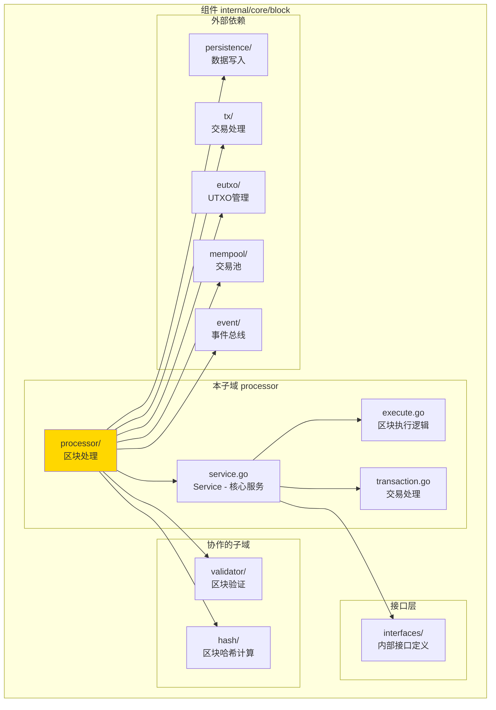
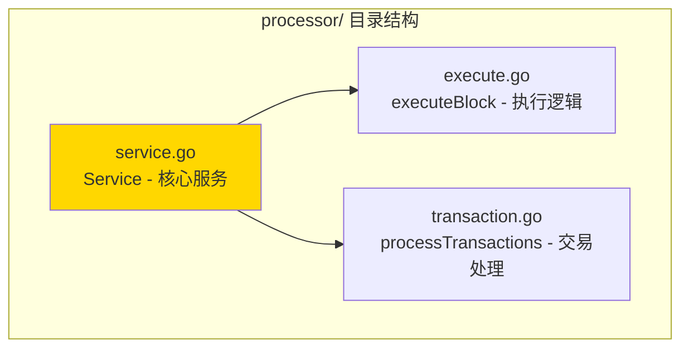

# processor - 区块处理子域

---

## 📌 版本信息

- **版本**：1.0
- **状态**：stable
- **最后更新**：2025-11-XX
- **最后审核**：2025-11-XX
- **所有者**：Block 开发组
- **适用范围**：区块处理服务实现

---

## 🎯 子域定位

**路径**：`internal/core/block/processor/`

**所属组件**：`block`

**核心职责**：处理验证通过的区块，执行交易、更新状态、清理交易池

**在组件中的角色**：
- 区块处理的核心逻辑实现
- 区块执行流程协调
- 状态更新和事件发布

---

## 🏗️ 架构设计

### 在组件中的位置

> **说明**：展示此子域在 Block 组件内部的位置和协作关系



**位置说明**：

| 关系类型 | 目标 | 关系说明 |
|---------|------|---------|
| **协作** | validator/ | 处理前验证区块有效性（延迟注入） |
| **协作** | hash/ | 计算区块哈希 |
| **依赖** | interfaces/ | 实现 InternalBlockProcessor 接口 |
| **依赖** | persistence/ | 通过 DataWriter 持久化区块 |
| **依赖** | tx/ | 通过 TxProcessor 执行交易 |
| **依赖** | eutxo/ | 通过 UTXOWriter 更新UTXO状态 |
| **依赖** | mempool/ | 清理已处理的交易 |
| **依赖** | event/ | 发布区块处理完成事件 |

---

### 内部组织

> **说明**：展示此子域内部的文件组织和类型关系



---

## 📁 目录结构

```
internal/core/block/processor/
├── README.md                    # 本文档
├── service.go                   # Service - 核心服务实现
├── execute.go                   # executeBlock - 区块执行逻辑
└── transaction.go               # processTransactions - 交易处理实现
```

---

## 🔧 核心实现

### 实现文件：`service.go`

**核心类型**：`Service`

**职责**：实现 BlockProcessor 接口，提供区块处理服务

**关键字段**：

```go
type Service struct {
    // 依赖注入
    dataWriter    persistence.DataWriter           // 统一数据写入服务
    txProcessor   tx.TxProcessor                   // 交易处理器
    utxoWriter    eutxo.UTXOWriter                 // UTXO写入服务
    utxoQuery     persistence.UTXOQuery             // UTXO查询服务
    mempool       mempool.TxPool                   // 交易池
    hashManager   crypto.HashManager                // 哈希管理器
    blockHashClient core.BlockHashServiceClient    // 区块哈希服务客户端
    txHashClient    transaction.TransactionHashServiceClient // 交易哈希服务客户端
    eventBus      event.EventBus                    // 事件总线（可选）
    logger        log.Logger                        // 日志记录器
    
    // 延迟注入
    validator     interfaces.InternalBlockValidator // 区块验证器（延迟注入）
    
    // 并发控制
    processingMu  sync.Mutex                        // 处理互斥锁
    isProcessing  bool                              // 是否正在处理
    
    // 指标收集
    metrics       *interfaces.ProcessorMetrics      // 处理指标
    metricsMu     sync.Mutex                        // 指标锁
    
    // 状态管理
    isHealthy     bool                              // 健康状态
    lastError     error                             // 最后错误
}
```

**关键方法**：

| 方法名 | 职责 | 可见性 | 备注 |
|-------|------|-------|-----|
| `NewService()` | 构造函数 | Public | 用于依赖注入 |
| `ProcessBlock()` | 处理区块 | Public | 实现接口方法 |
| `GetProcessorMetrics()` | 获取处理性能指标 | Public | 实现接口方法 |
| `SetValidator()` | 设置验证器 | Public | 延迟注入验证器 |
| `executeBlock()` | 执行区块 | Private | 内部执行逻辑 |
| `executeTransactions()` | 验证交易执行结果 | Private | 根据交易类型分类验证 |

---

### 辅助文件

**execute.go** - 区块执行逻辑：
- `executeBlock()` - 完整的区块执行流程
- 协调各个组件的调用
- 管理事务和错误处理

**transaction.go** - 交易验证实现：
- `executeTransactions()` - 验证区块中的所有交易执行结果
- 根据交易类型分类验证：
  - StateOutput: 验证ZK证明和执行结果哈希
  - ResourceOutput: 验证资源生命周期
  - AssetOutput: 最终确认交易有效性
  - 引用型输入: 验证引用UTXO的有效性
- 注意：不重新执行智能合约（合约已在TX层执行）

### 交易类型处理逻辑

**executeTransactions 的完整职责**：

根据WES的两种输入、三种输出架构，`executeTransactions` 需要根据交易类型分类处理：

**两种输入类型**：
- **AssetInput（消费型）**：`is_reference_only=false`，UTXO被消费
- **ResourceInput（引用型）**：`is_reference_only=true`，UTXO被引用但不消费

**三种输出类型**：
- **AssetOutput**：价值载体（代币转账、找零等）
- **ResourceOutput**：能力载体（合约部署、资源上传等）
- **StateOutput**：证据载体（执行结果、ZK证明等）

**分类处理规则**：

1. **StateOutput（ISPC执行的合约调用）**：
   - ✅ 验证ZK证明（必须）
   - ✅ 验证执行结果哈希的一致性

2. **ResourceOutput（资源交易）**：
   - ✅ 验证资源生命周期（版本号、过期时间等）

3. **AssetOutput（普通资产交易）**：
   - ✅ 最终确认交易有效性（已在提交时验证）

4. **引用型输入**：
   - ✅ 验证引用UTXO的有效性（引用计数管理已在`processReferenceCounts`中处理）

**职责分离**：
- UTXO变更 → DataWriter处理（已在`storeBlock`中完成）
- 引用计数管理 → `processReferenceCounts`处理
- 交易验证 → `executeTransactions`处理

**交易执行的双重含义**：

在WES架构中，"交易执行"有两个不同的含义：

1. **智能合约执行（TX层）**：
   - 时机：交易构建时
   - 位置：TX层 → ISPC层
   - 职责：执行WASM合约或ONNX模型，生成ZK证明，构建StateOutput
   - 结果：交易包含StateOutput（含ZK证明）

2. **交易验证（BLOCK层）**：
   - 时机：区块处理时
   - 位置：BLOCK层 → Processor
   - 职责：验证StateOutput中的ZK证明，验证执行结果的一致性
   - 结果：状态变更应用到区块链

**关键原则**：
- ✅ **执行即构造**：执行过程就是构建交易的过程（TX层）
- ✅ **验证即应用**：验证证明后应用状态变更（BLOCK层）
- ✅ **单次执行，多点验证**：只有执行节点执行合约，验证节点只验证证明

---

## 🔗 协作关系

### 依赖的接口

| 接口 | 来源 | 用途 |
|-----|------|-----|
| `InternalBlockProcessor` | `internal/core/block/interfaces/` | 实现区块处理接口 |
| `persistence.DataWriter` | `pkg/interfaces/persistence/` | 统一数据写入入口 |
| `tx.TxProcessor` | `pkg/interfaces/tx/` | 执行交易 |
| `eutxo.UTXOWriter` | `pkg/interfaces/eutxo/` | 更新UTXO状态 |
| `persistence.UTXOQuery` | `pkg/interfaces/persistence/` | 查询UTXO状态 |
| `mempool.TxPool` | `pkg/interfaces/mempool/` | 清理交易池 |
| `event.EventBus` | `pkg/interfaces/infrastructure/event/` | 发布事件 |

---

### 被依赖关系

**被以下模块使用**：
- `consensus/` - 共识模块在处理完区块后调用
- `sync/` - 同步模块在接收到新区块后调用

**示例**：

```go
// 在其他模块中使用
import "github.com/weisyn/v1/pkg/interfaces/block"

func OnNewBlock(processor blockif.BlockProcessor, block *core.Block) error {
    err := processor.ProcessBlock(ctx, block)
    if err != nil {
        return err
    }
    // ...
}
```

---

## 🧪 测试

### 测试覆盖

| 测试类型 | 文件 | 覆盖率目标 | 当前状态 |
|---------|------|-----------|---------|
| 单元测试 | `processor_test.go` | ≥ 80% | ⏳ 待实施 |
| 集成测试 | `../integration/` | 核心场景 | ⏳ 待实施 |

---

### 测试示例

```go
func TestService_ProcessBlock(t *testing.T) {
    // Arrange
    mockDataWriter := newMockDataWriter()
    mockTxProcessor := newMockTxProcessor()
    mockUTXOWriter := newMockUTXOWriter()
    service := processor.NewService(mockDataWriter, mockTxProcessor, mockUTXOWriter, ...)
    
    block := createTestBlock()
    
    // Act
    err := service.ProcessBlock(ctx, block)
    
    // Assert
    assert.NoError(t, err)
}
```

---

## 📊 关键设计决策

### 决策 1：原子性处理策略

**问题**：如何确保区块处理对外语义上的“原子性”（要么验证通过并落盘，要么不落盘）？

**方案**：
- 在调用 DataWriter 写入前，先完成所有区块级和交易级业务验证（包括 ZK / 资源生命周期 / 引用UTXO 等）；
- 所有持久化写操作（区块数据、索引、UTXO、链状态）统一通过 DataWriter 的单一事务完成，要么全部成功，要么全部回滚。

**理由**：
- 确保只有通过完整验证的区块才会被落盘；
- 持久化层内部保持 ACID 语义，防止部分写入；
- 清晰分层：验证在 BlockProcessor，存储原子性由 DataWriter 负责。

**权衡**：
- ✅ 优点：对调用方而言，`ProcessBlock` 语义清晰——验证失败不会污染链状态；
- ⚠️ 缺点：验证在写入前完成，整体处理时延受验证复杂度影响。

---

### 决策 1.1：ZK 证明与引用 UTXO 验证的严格性

**问题**：ZK 证明 (`zkProofService`) 和引用 UTXO (`utxoQuery`) 依赖缺失时，是否允许“打日志 + 放行”的降级行为？

**方案**：
- 当前实现中，这两类验证都被视为 **必需的安全校验**；
- 若 `zkProofService` 或 `utxoQuery` 未注入，`verifyStateOutput` / `verifyReferenceUTXO` 将返回错误，导致 `ProcessBlock` 失败；
- 不再在生产路径中采用“依赖缺失 → Warn → 跳过验证”的软检查模式。

**理由**：
- ZK 证明是隐私与正确性保障的关键环节，跳过验证会导致“有证明字段但从不验证”的危险状态；
- 引用 UTXO 关系决定资源引用的安全性和可回收性，跳过存在性验证会破坏资源生命周期约束；
- 对于链上安全关键逻辑，应优先选择“安全失败”而非“静默放行”。

**权衡**：
- ✅ 优点：避免在生产链上因为依赖误配置而默默失去关键安全校验；
- ⚠️ 缺点：在开发/单机场景下，需要显式注入 Mock 的 `zkProofService` / `utxoQuery`，否则区块处理会失败。

---

### 决策 2：并发控制

**问题**：如何防止并发处理导致的冲突？

**方案**：使用互斥锁，同一时间只处理一个区块

**理由**：
- 防止状态冲突
- 简化错误处理
- 保证处理顺序

**权衡**：
- ✅ 优点：简单可靠，避免并发问题
- ⚠️ 缺点：串行处理可能影响吞吐量

---

### 决策 3：延迟注入验证器

**问题**：如何避免 Processor 和 Validator 的循环依赖？

**方案**：Validator 通过 SetValidator() 方法延迟注入

**理由**：
- 避免循环依赖
- 保持依赖注入的灵活性
- 符合 fx 框架的延迟注入模式

**权衡**：
- ✅ 优点：解决循环依赖问题
- ⚠️ 缺点：需要在模块初始化时手动注入

---

## 📚 相关文档

- [组件总览](../README.md)
- [内部接口](../interfaces/README.md)
- [公共接口](../../../../pkg/interfaces/block/README.md)
- [接口与实现的组织架构](../../../../docs/system/standards/principles/code-organization.md)

---

## 📝 变更历史

| 版本 | 日期 | 变更内容 | 作者 |
|-----|------|---------|------|
| 1.0 | 2025-11-XX | 初始版本 | Block 开发组 |

---

## 🚧 待办事项

- [ ] 完善单元测试覆盖
- [ ] 优化并发处理性能
- [ ] 添加处理超时控制
- [ ] 支持批量处理优化

